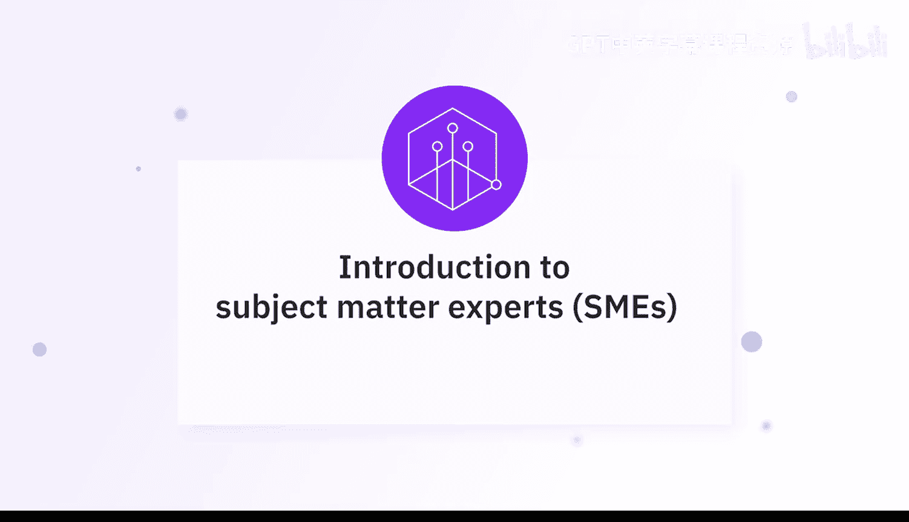
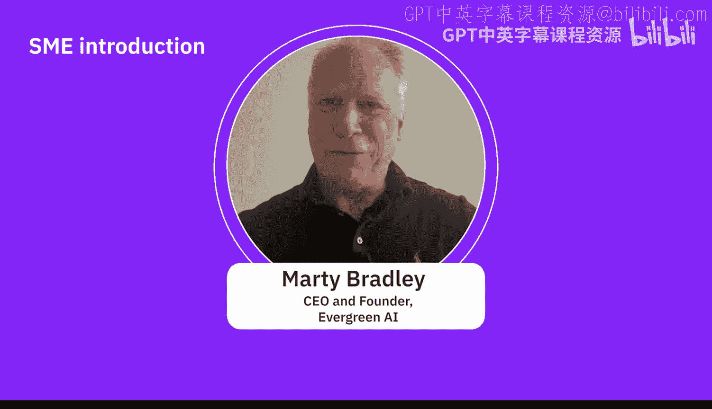
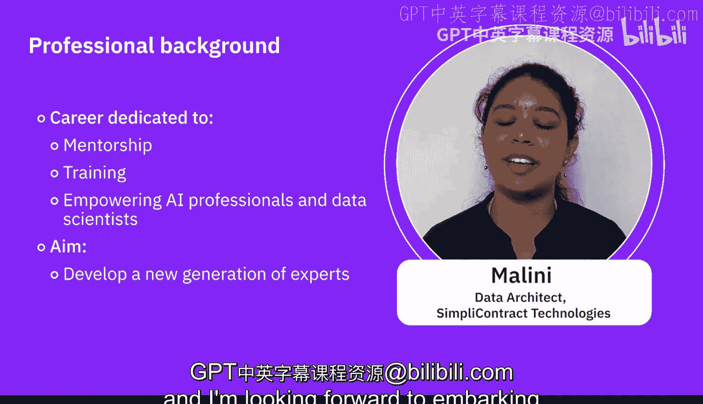
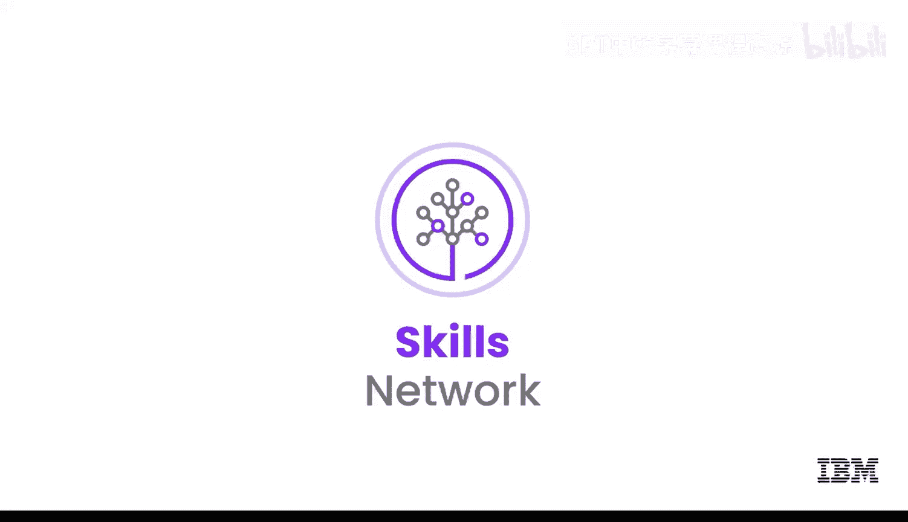

生成式AI基础：04：专家观点：领域专家介绍 👨‍💼👩‍💼

在本节课中，我们将认识几位生成式人工智能领域的专家，了解他们的背景、职责以及他们如何看待这一技术。

---

欢迎来到本视频，在这里我们将与专家们见面。

让我们听听专家们的自我介绍，包括他们的姓名、职位以及他们工作的组织。

大家好，我叫阿比·戈内贾，我是人工智能领域的主题专家，也是IID的一名人工智能研究员。

大家好，我叫塞皮达·萨扎尔，我是IBM K工程团队的一名AI工程师。我很高兴能在这里与大家探讨生成式AI。

我叫布拉德利·斯坦菲尔德，我是IBM的一名高级软件架构师。

大家好，我是梅尔，在人工智能和数据工程领域拥有超过12年的经验。我目前担任Simply Contract Technologies的数据架构师。

嗨，我是马蒂·布莱利，我是Evergreen AI的首席执行官兼创始人。

接下来，让我们看看专家们如何介绍他们的背景，包括多年的经验和资历。

关于我的背景，我在加拿大滑铁卢大学获得了人工智能领域的博士学位，在此之前，我正在攻读机器人学硕士学位。

完成学业后，我开始在这一领域工作，从事大数据分析。之后移居美国，我仍然在同一领域工作。最近，随着大语言模型和生成式AI的新趋势，我一直在努力为我们的客户在不同的用例中实施和应用这项技术。

我在IBM工作了十多年，大部分时间在教育领域的Skills Network工作。

我们在Evergreen AI从事多项与AI相关的工作，但我们专注于生成式AI。我们提供生成式AI培训、生成式AI战略咨询，帮助您理解生成式AI在组织中的定位。我们还有一个小的开发部门，可以帮助进行一些集成工作。但我为我们的一些培训项目感到自豪，这些课程为组织中的每个人提供AI基础、面向领导者和高管的AI培训，展示如何利用现有工具更好地完成工作。这适用于那些希望了解如何在当前工作流程中使用AI以提高效率、实现十倍改进的人们。

我曾在银行、金融、电子商务、制造和制药行业工作过。每个行业都有其独特的挑战，这些经历丰富了我对数据和人工智能实际应用的专业知识和视角。

除了处理数据和算法，我还将职业生涯的相当一部分投入到了指导和培训有抱负的AI专业人士及数据科学家。我致力于培养新一代的专家，以应对我们数字世界不断演变的挑战。我很高兴能与大家合作、学习并做出有意义的贡献。感谢大家的欢迎，我期待与大家一起踏上这段激动人心的旅程。

😊

是的。

---

本节课中，我们一起认识了多位生成式AI领域的专家，了解了他们多元化的背景和丰富的行业经验。从学术研究到企业应用，从战略咨询到技术实施，这些专家代表了推动生成式AI发展的核心力量。他们的分享为我们理解这项技术的实际应用和未来潜力提供了宝贵的视角。