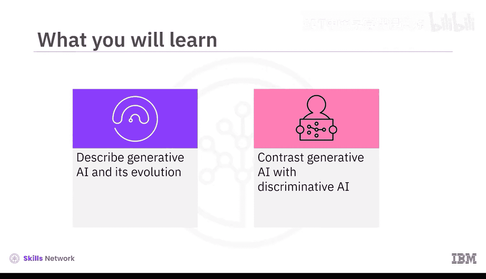
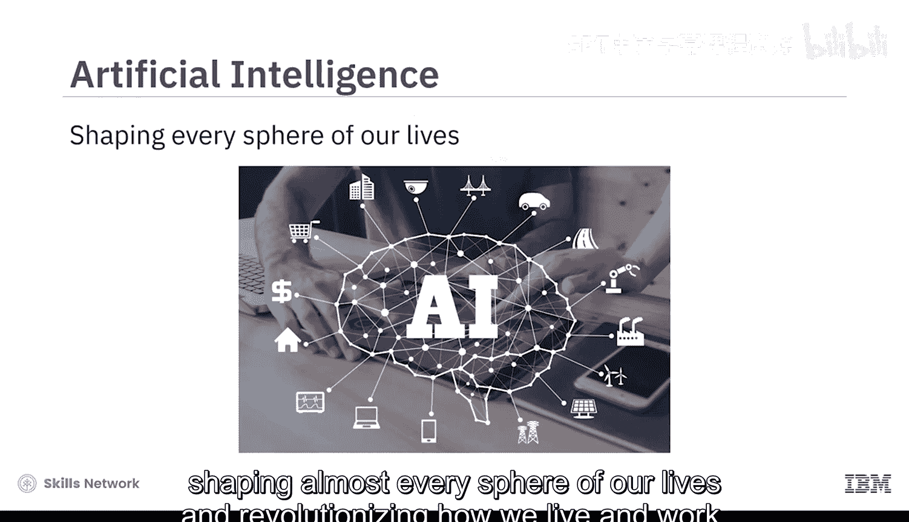
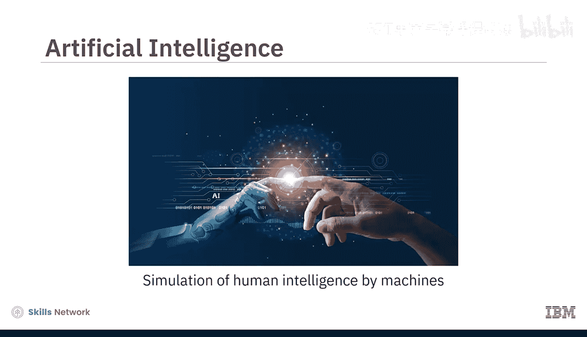
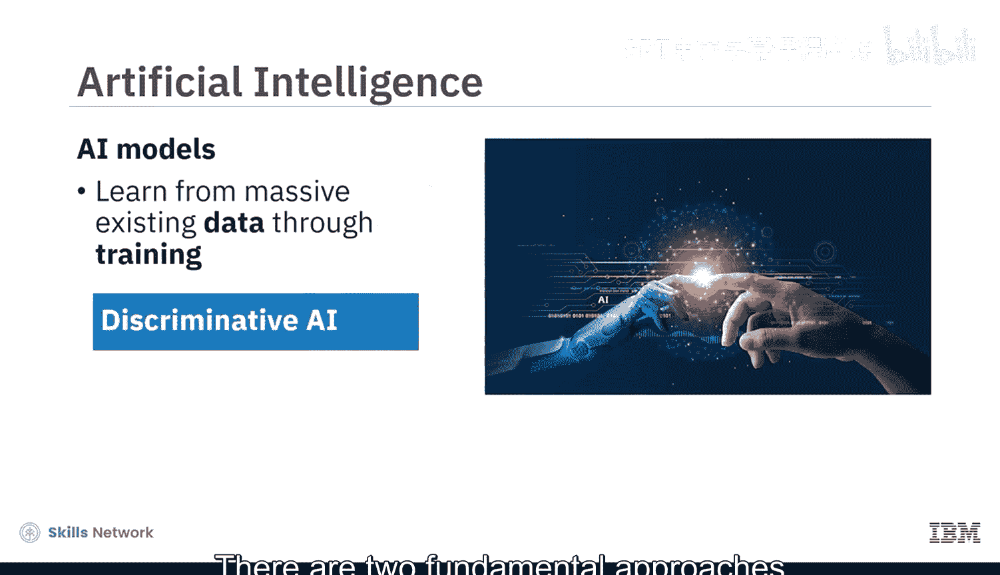
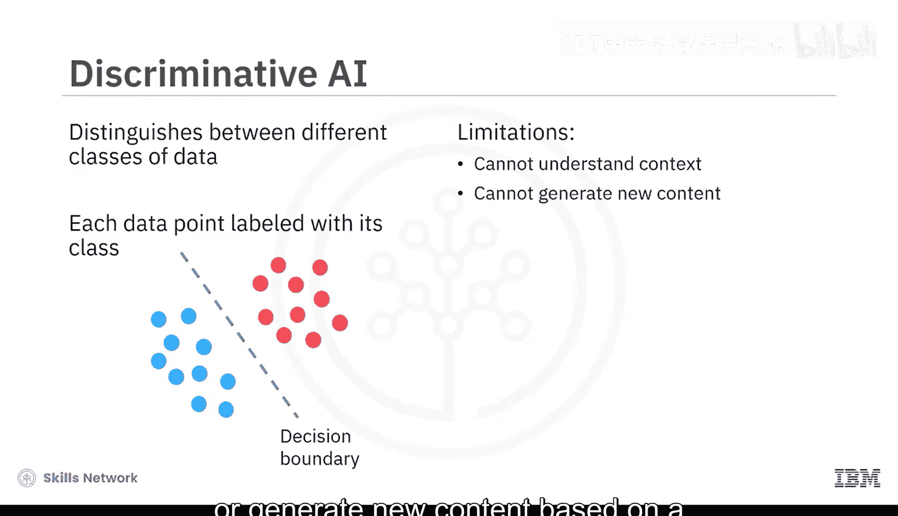
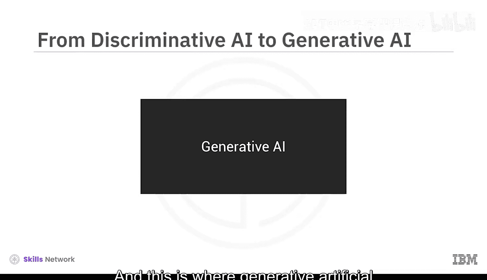
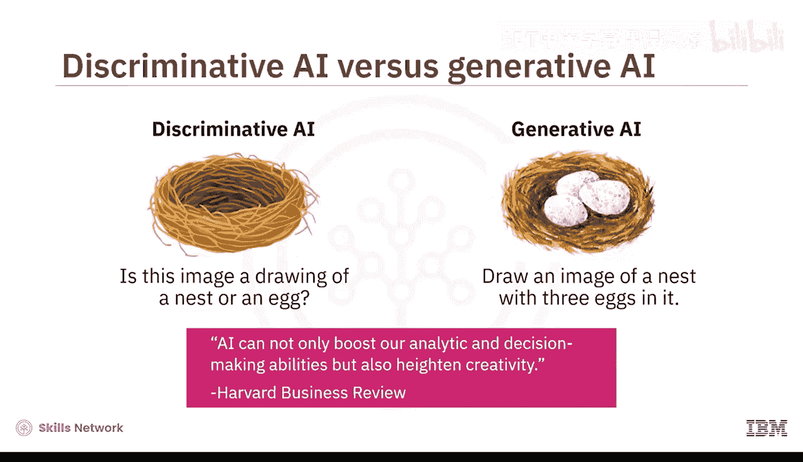
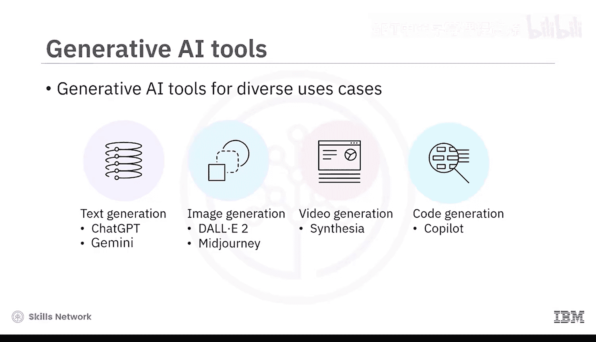
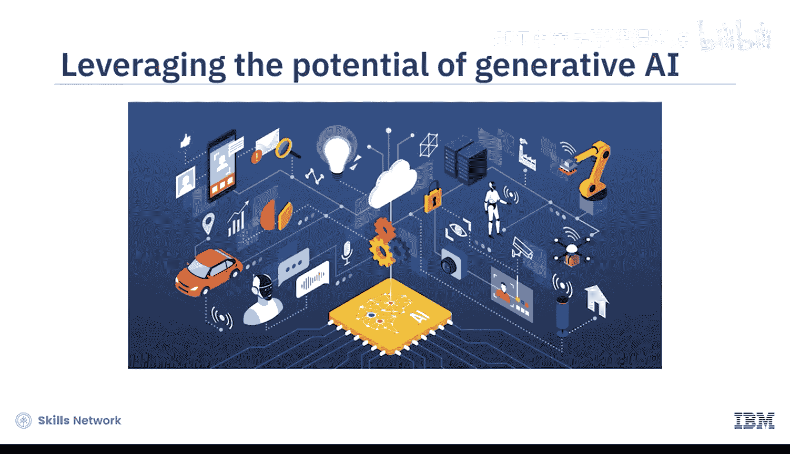
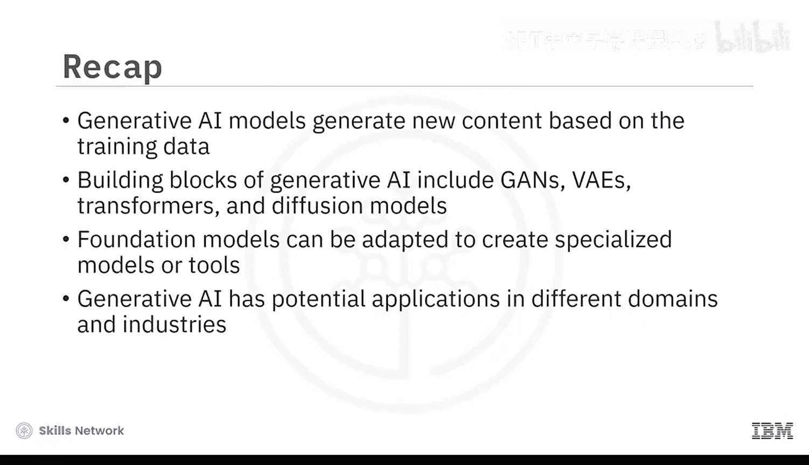

# 005：生成式AI导论 🧠

在本节课中，我们将要学习生成式人工智能的基本概念。我们将了解什么是生成式AI，它如何演变而来，以及它与判别式AI有何不同。

---

人工智能，或称AI，已经存在多年，它塑造了我们生活的几乎每个领域，并彻底改变了我们的生活和工作方式。

AI的核心可以被定义为机器对人类智能的模拟。AI模型从海量的现有数据中学习。这个从数据中学习的过程被称为**训练**。

---

## 判别式AI与生成式AI

AI有两种基本方法：判别式AI和生成式AI。

上一节我们介绍了AI的基本概念，本节中我们来看看这两种不同的AI方法。

判别式AI是一种学习区分不同数据类别的方法。一个判别式AI模型会被给予一组训练数据，其中每个数据点都标有其类别。然后，该模型通过找到新数据点落在决策边界的哪一侧来预测其类别。判别式AI模型使用高级算法来区分、分类、识别模式，并根据训练数据得出结论。

以下是判别式AI模型工作原理的一个例子：
*   电子邮件垃圾邮件过滤器可以区分垃圾邮件和非垃圾邮件。

判别式AI模型最适合应用于分类任务；然而，它们无法理解上下文，也无法基于对训练数据的上下文理解来生成新内容。

---

## 生成式AI的引入

而这就是生成式人工智能，或称生成式AI，发挥作用的地方。

生成式AI模型学习基于训练数据生成新内容。它们能够捕捉训练数据的底层分布，并生成新颖的数据实例。

生成式AI从一个**提示**开始。这可以是文本、图像、视频或模型可以处理的任何其他输入。作为输出，模型会生成新的内容，包括文本、图像、音频、视频、代码和数据。生成式AI可以以与提示相同的形式产生输出，例如**文本到文本**；也可以以与提示不同的形式产生输出，例如**文本到图像**或**图像到视频**。

这里有一个简单的例子来理解判别式（或传统）AI与生成式AI之间的区别：
*   判别式AI最适合回答诸如“这张图片画的是鸟巢还是鸟？”这类问题。
*   生成式AI则会响应诸如“画一张有三个蛋在里面的鸟巢图片”这样的提示。

判别式AI模仿我们的分析和预测能力，而生成式AI则更进一步，模仿我们的创造能力。正如《哈佛商业评论》的评论所暗示的：“AI不仅可以提升我们的分析和决策能力，还可以增强创造力。”

生成式模型可以利用它们所学到的知识，基于这些信息创造出全新的内容。

---

## 生成式AI的技术基础

判别式模型和生成式模型都是使用深度学习技术创建的。深度学习涉及训练人工神经网络从海量数据中学习。

人工神经网络是由称为神经元的较小计算单元组成的集合，其建模方式类似于人脑处理信息的方式。

生成式AI的创造能力来自于生成式AI模型，例如：
*   **生成对抗网络**
*   **变分自编码器**
*   **Transformer模型**
*   **扩散模型**

这些模型可以被视为生成式AI的构建模块。

---

## 生成式AI的演变

生成式AI并非一个新概念。它的根源可以追溯到机器学习的起源。在20世纪50年代末，当科学家提出机器学习时，他们探索了使用算法来创建新数据。在20世纪90年代，神经网络的兴起进一步推动了生成式AI的发展。在21世纪10年代初，深度学习在大型数据集可用性和增强计算能力的支持下，进一步推动了生成式AI的发展。

2014年，随着Ian Goodfellow及其同事引入GANs，生成式AI发生了转变。GANs以及其他模型，如VAEs和Transformers，为生成式AI的增长以及基础模型和工具的开发奠定了基础。

**基础模型**是具有广泛能力的AI模型，可以进行调整以创建更专业的模型或针对特定用例的工具。

一类特定的基础模型称为**大语言模型**，它们经过训练以理解人类语言，并且可以处理和生成文本。

2018年，OpenAI推出了一种基于Transformer的LLM，称为生成式预训练Transformer。多年来，不同的LLM，如GPT系列中的GPT-3和GPT-4、Google的Pathways语言模型以及Meta的大语言模型Meta AI，都显著增强了生成式AI生成连贯且相关文本的能力。在其他用例的模型方面也有类似的发展，例如用于图像生成的Stable Diffusion和DALL-E模型。

各种生成模型的发展导致了针对不同用例的生成式AI工具市场的增长。例如：
*   用于文本生成的ChatGPT和Jasper。
*   用于图像生成的DALL-E 2和Midjourney。
*   用于视频生成的Synthesia。
*   用于代码生成的GitHub Copilot和AlphaCode。

---

## 生成式AI的应用与影响

快速涌现的模型和工具为跨领域的生成式AI应用创造了广阔的范围。引用麦肯锡关于生成式AI经济潜力的报告：“生成式AI有潜力改变工作的结构，通过自动化个人部分活动来增强个体工作者的能力。”报告还预测，生成式AI对生产力的影响可能为全球经济增加数万亿美元的价值。

---

## 总结

本节课中我们一起学习了生成式AI的核心知识。我们了解到，生成式AI模型可以根据其训练的数据生成新内容。此外，我们还了解到生成式AI的创造能力建立在诸如GANs、VAEs、Transformers和扩散模型等模型之上。基础模型可以被调整以创建针对特定用例的专业模型或工具。最后，我们认识到生成式AI模型和工具在不同领域和行业中具有广泛的应用前景。