生成式AI基础：01：生成式AI的核心能力 🚀

在本节课中，我们将学习生成式人工智能（Generative AI）的核心能力，并探索它们在现实世界中的应用。生成式AI能够根据给定的输入，创造出全新的、连贯的内容，其能力范围广泛，涵盖了文本、图像、音频、视频、代码、数据乃至虚拟世界的生成。

上一节我们介绍了生成式AI的概览，本节中我们将深入探讨其各项具体能力。

以下是生成式AI的七项核心能力：

1.  **文本生成**：生成清晰、流畅且符合语境的文本回复。
2.  **图像生成**：合成具有艺术性或高度逼真、与真实图像相似的图片。
3.  **音频生成**：进行音乐创作和合成音频。
4.  **视频生成**：基于文本描述甚至静态图像，生成动态的电影或短视频。
5.  **代码生成**：生成代码片段、函数或完整的程序。
6.  **数据生成与增强**：生成合成数据以创建或扩充数据集。
7.  **虚拟世界创建**：创造逼真且沉浸式的虚拟世界。

这些只是生成式AI能力的一部分。本质上，人类思维能够设想的任何潜在应用场景，都可能成为生成式AI的应用方向。

现在，让我们更深入地了解其中几项能力。

### 文本生成能力 📝

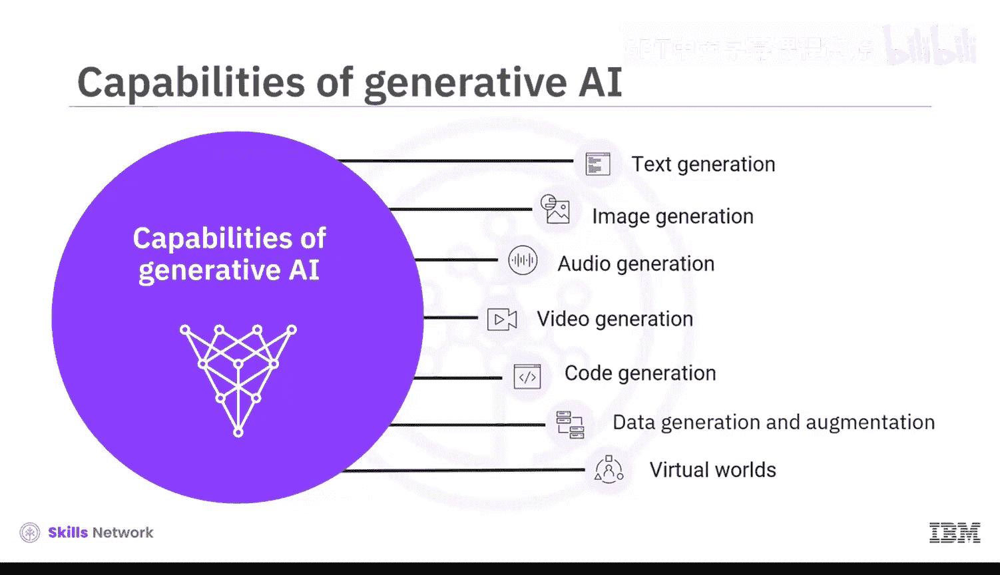

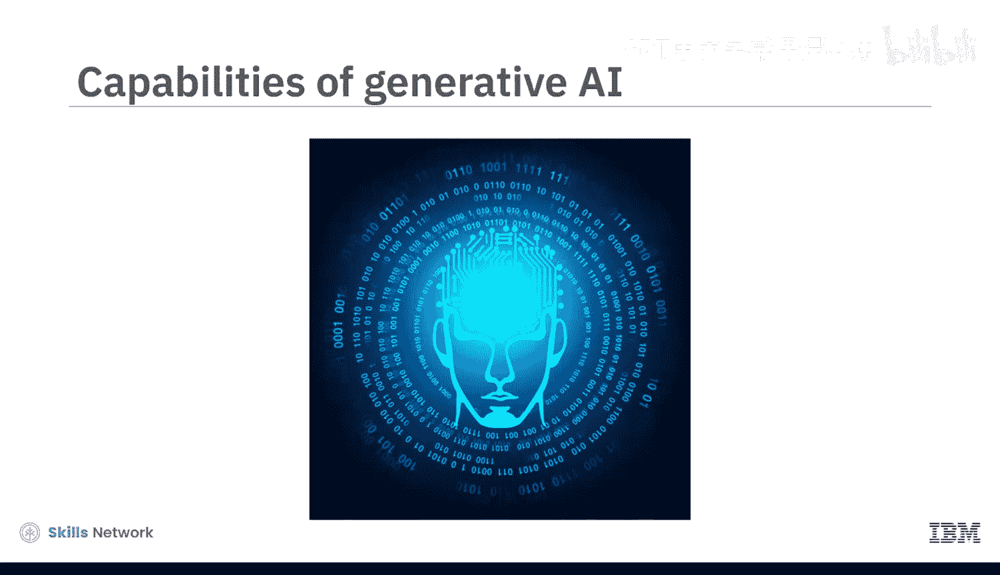

生成式AI文本生成能力的核心是先进的人工智能驱动的大型语言模型（Large Language Models, **LLMs**）。这些模型在大型数据集上进行训练，能够在各种语境下生成类人文本。它们学习数据中的模式和结构，以生成连贯且符合语境的回复。

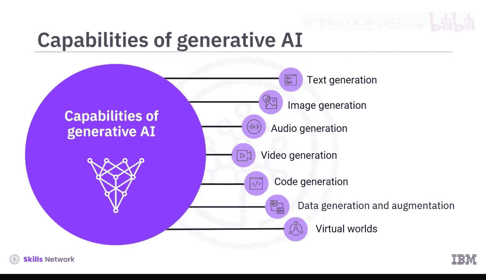

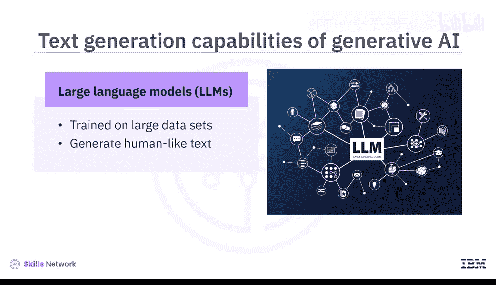

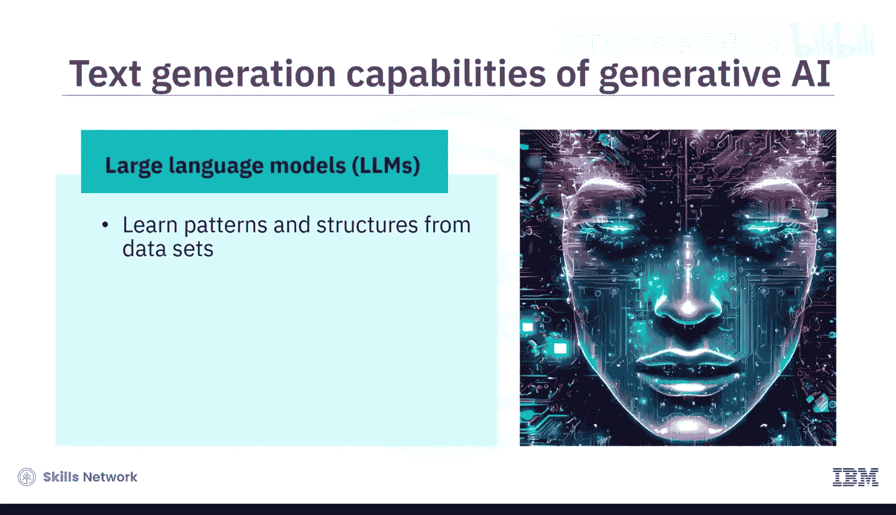

这些模型能够生成文本、进行对话、提供解释、总结等。一些流行的LLMs包括OpenAI的生成式预训练变换器（**GPT**）和Google的PaLM语言模型。这些模型可以执行多种语言相关任务，例如：

*   **文本补全**
*   **摘要**
*   **问答**
*   **翻译**
*   **代码生成**
*   **图文配对**

与聊天机器人和虚拟助手的对话交互就是由LLMs驱动的。

### 图像生成能力 🎨

生成式模型可以基于深度学习技术（如生成对抗网络 **GANs** 和变分自编码器 **VAEs**）生成高质量、逼真的图像。这些生成的图像展现出真实的纹理、自然的色彩和精细的细节，给人以真实相机拍摄的印象。

例如：
*   **StyleGAN** 可以生成高质量、高分辨率的虚构人脸、动物或自然景观的新图像。
*   **DeepArt** 可以从简单的草图创作出完整的艺术品。
*   **DALL-E** 可以根据用户的描述生成全新的图像。

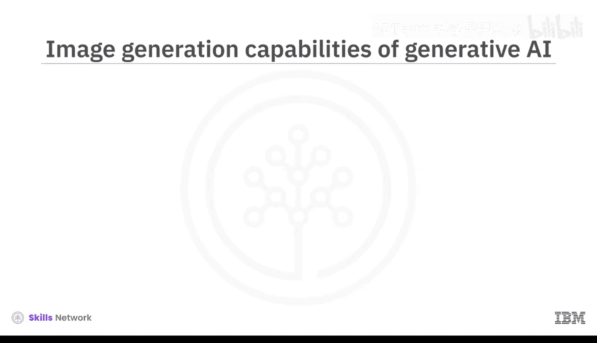

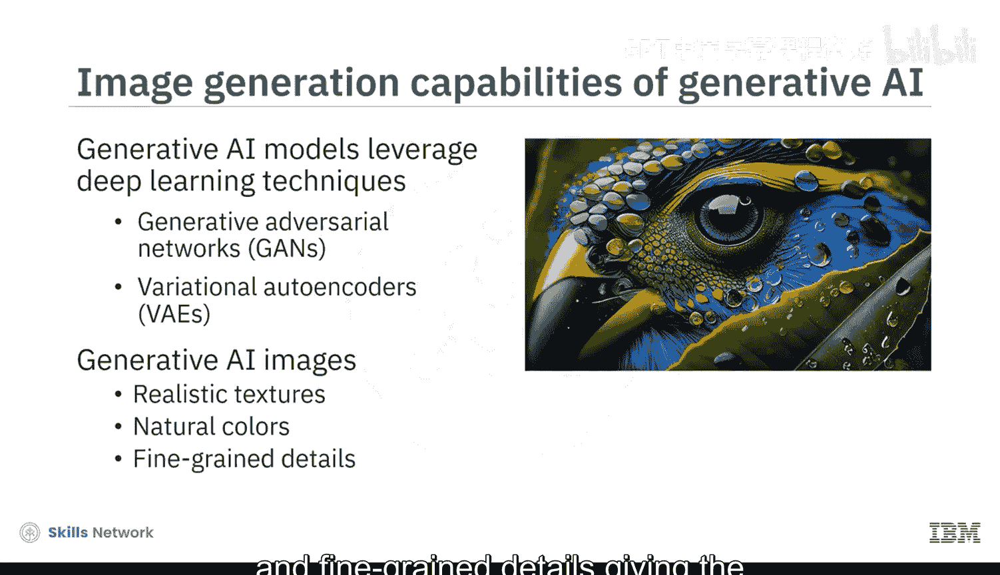

除了在艺术、设计、娱乐、游戏和研究领域的应用外，生成的图像还可以用于增强训练数据，并辅助医学成像和科学可视化。

### 音频生成能力 🔊

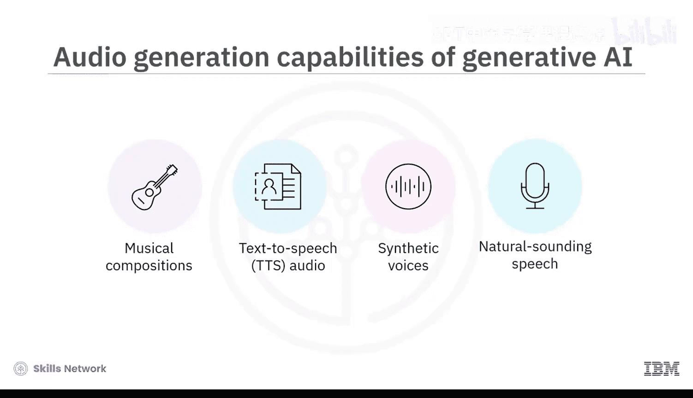

在音频生成方面，生成式模型可以：
*   生成新的音乐作品。
*   使用文本转语音（**TTS**）技术将文本转换为音频。
*   创建合成语音和自然听感的语音。

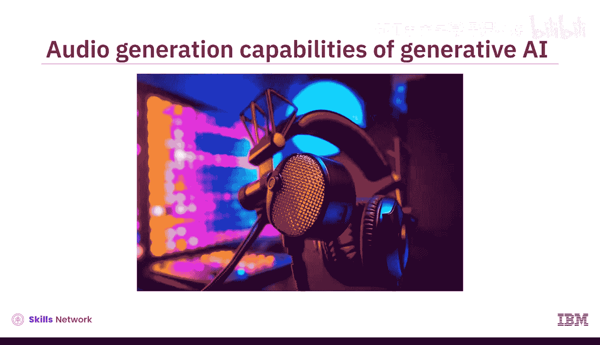

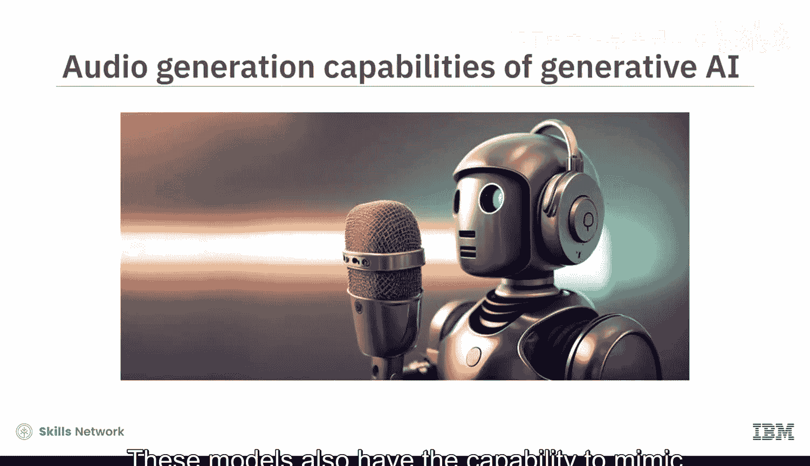

这些模型还能够转换、修改、清理语音，降低噪音并提升音频质量。它们还具备相当程度地模仿人声的能力。

例如：
*   **WaveGAN** 可以创建新的、逼真的原始音频波形，包括语音、音乐和自然声音。
*   OpenAI的 **MuseNet** 可以结合各种乐器、风格和流派来生成新颖的音乐作品。
*   Google的 **Tacotron 2** 和 **Mozilla TTS** 使用先进的TTS系统来创建合成语音，模仿人类的音调、音高、调制、发音、节奏和表达。

生成式模型生成的音频在媒体创意、娱乐、培训、教育、游戏、虚拟现实等多个领域有应用。

### 视频生成能力 🎬

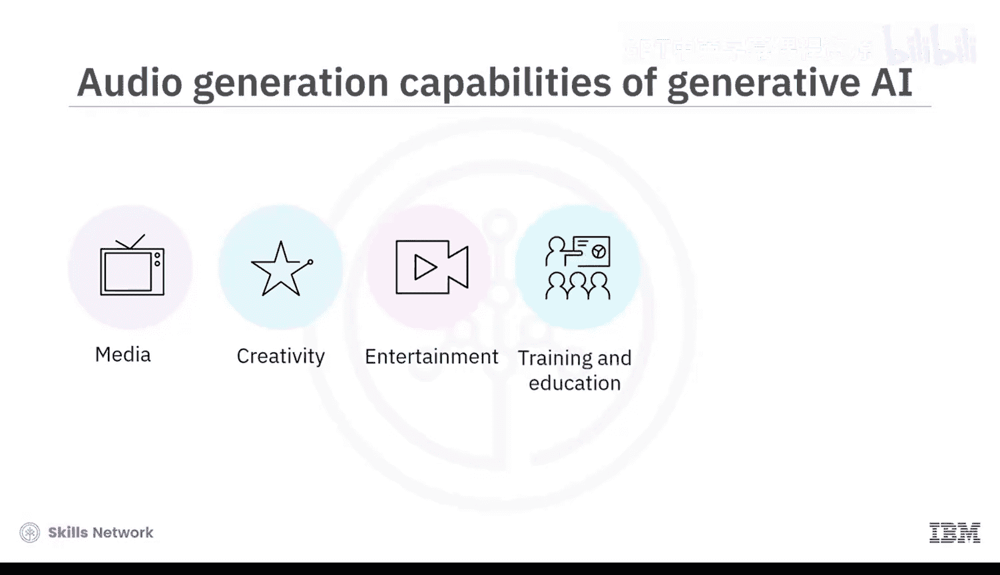

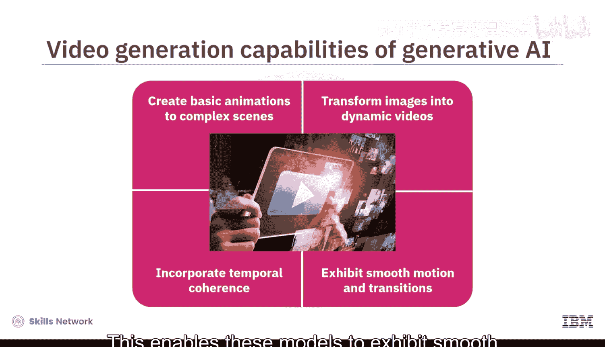

生成式AI模型可以创建动态、清晰的视频，范围从基本动画到复杂场景。这些模型通过结合时间连贯性和自然语言处理，将图像转化为动态视频。

**时间连贯性**指的是意义或语境随时间推移的一致性和连续性。这使得模型能够在视频中展现出流畅的运动和合理的过渡。

例如，流行的AI模型 **VideoGPT** 遵循用户提供的文本提示来生成新视频。用户可以指定所需内容来指导视频生成过程，包括补全、编辑、合成、预测和风格迁移。生成的视频可用于艺术、娱乐、教育、游戏、医学和研究等领域。

### 代码生成能力 💻

生成式模型可以根据所需功能，生成新的代码片段、函数或完整程序。这些模型在现有代码库上进行训练，能够：
*   补全或创建代码。
*   合成或重构代码。
*   识别并修复代码中的错误。
*   测试软件。
*   创建文档，包括注释、功能描述和使用示例。

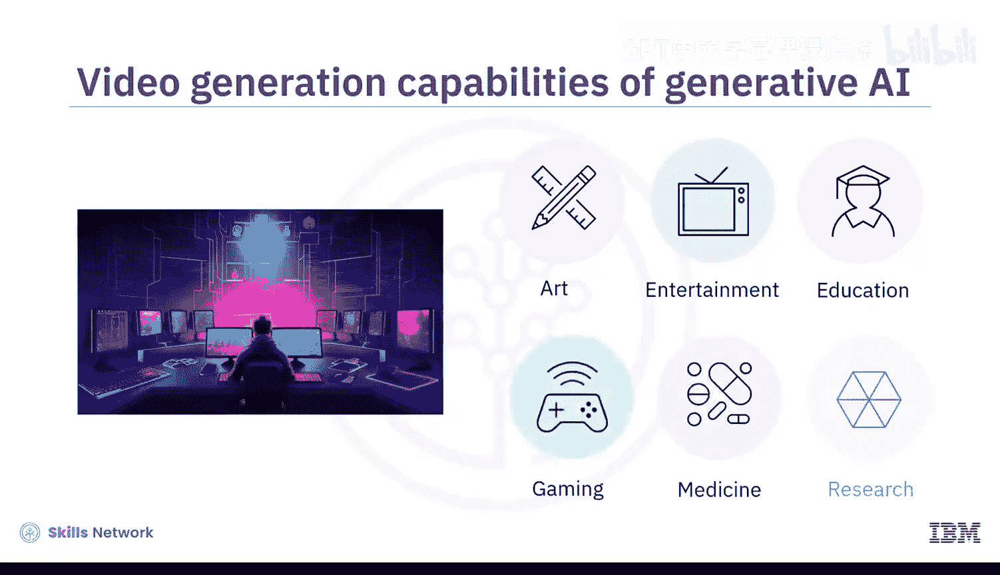

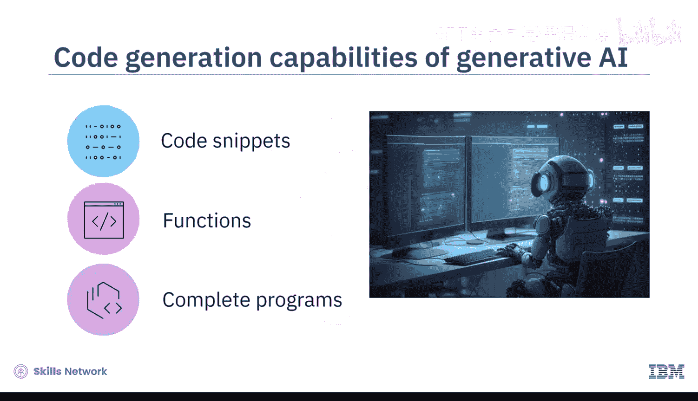

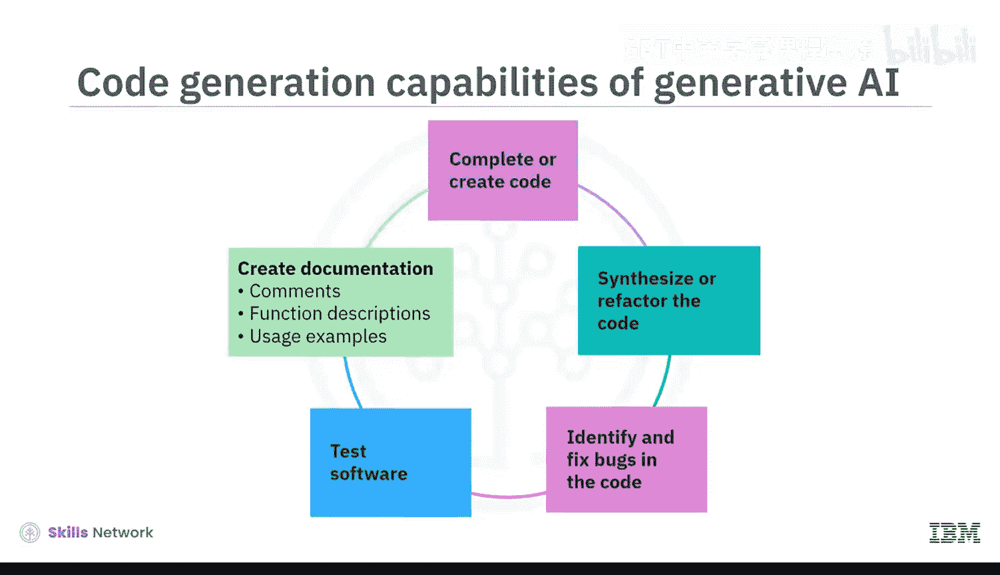

例如，**GitHub Copilot** 和 **IBM Watson Code Assistant** 是基于AI的编程助手，可以帮助自动补全代码、协助完成困难任务，并为给定的输入生成代码。

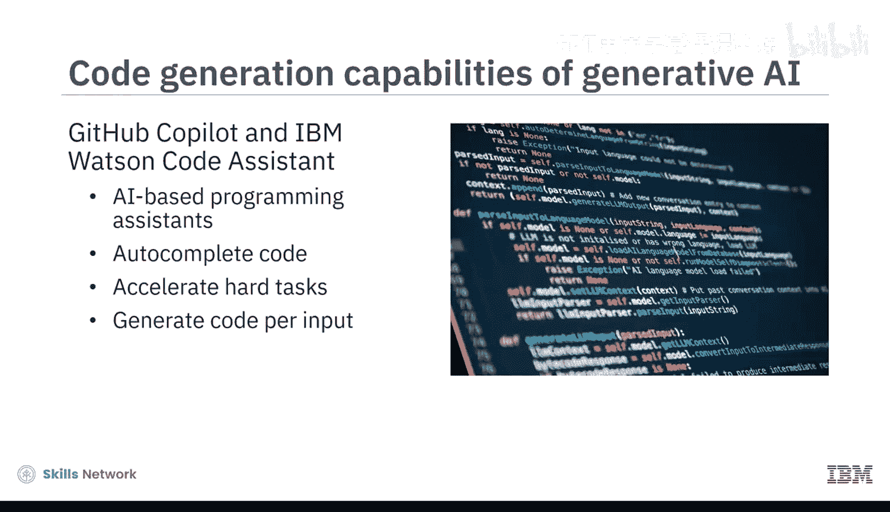

AI生成的代码可用于软件和Web开发、机器学习和自然语言处理、数据科学与分析、机器人技术与自动化、虚拟游戏和AR/VR环境开发以及音视频和语音处理。软件开发人员可以利用代码生成能力来编写、调试和测试代码。

### 数据生成与增强能力 📊

生成式模型可以生成新数据并增强现有数据集。生成合成数据集有助于增加数据的多样性和可变性，从而带来更稳健、更有效的性能。

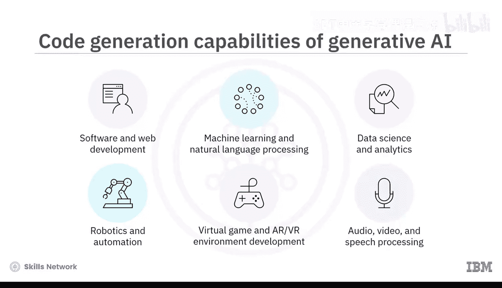

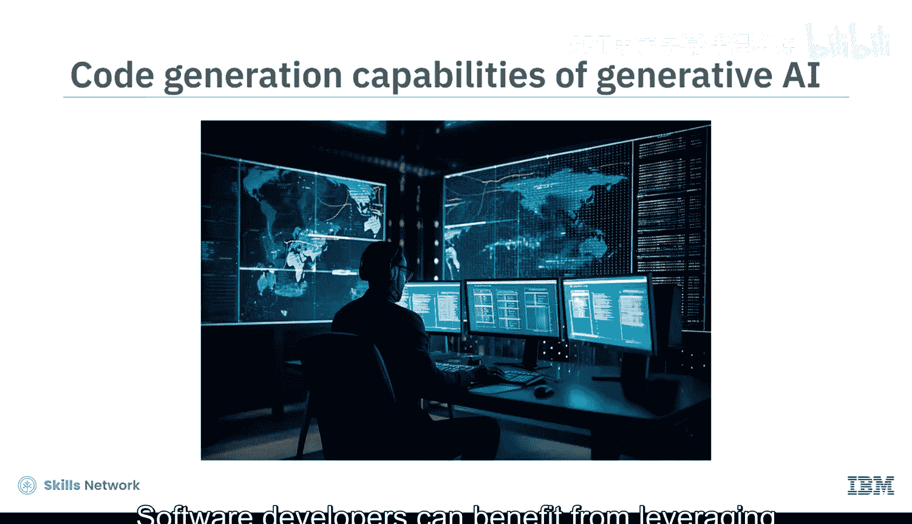

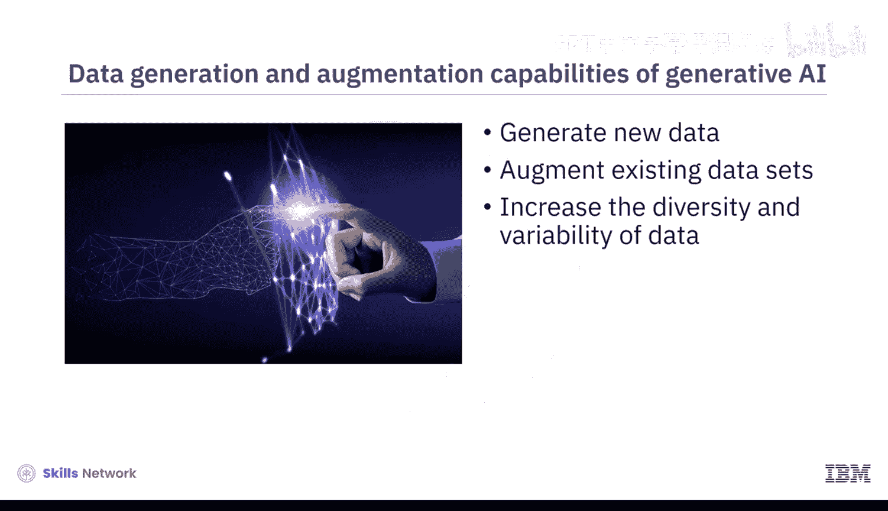

这些模型可以为图像、文本、语音、表格数据和统计分布、时间序列数据、金融数据等生成新样本并增强数据集。

生成式AI的数据生成与增强能力在医学、医疗保健、游戏、教育与培训、艺术与创意、自动驾驶汽车等众多领域有应用。

### 虚拟世界创建能力 🌐

生成式AI模型的另一项强大能力是创建高度逼真和复杂的虚拟世界。你可以创建模拟真实行为、表情、对话甚至决策的虚拟形象（**Avatar**）。你还可以创建具有逼真纹理、声音和遵循物理世界原理的物体的复杂虚拟环境。

元宇宙平台使用生成式模型为个体用户创造独特和个性化的体验。生成式AI还可以创建具有独特个性的虚拟身份，这些虚拟形象可以被赋予特定的个人特质，并反映在它们的行为和对话中。

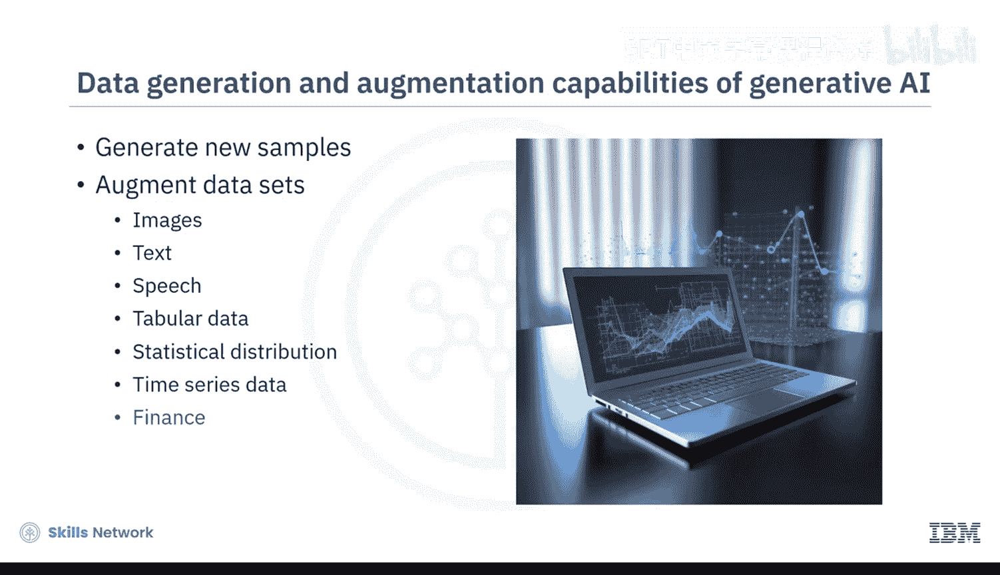

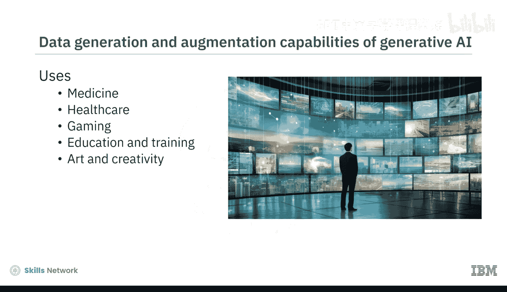

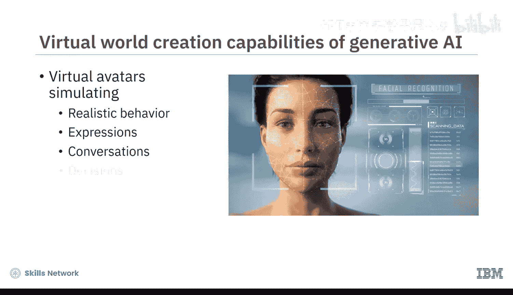

生成式AI的虚拟世界能力在游戏、娱乐、教育、增强与虚拟现实、元宇宙平台以及虚拟影响者和数字人格等领域有应用。

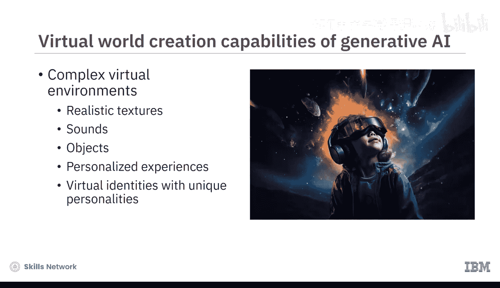

### 总结

在本节课中，我们一起学习了生成式AI模型的一些核心能力及其在现实世界中的应用。

*   生成式AI可以创建连贯且符合语境的文本内容。
*   它能生成逼真的高质量图像、合成语音、新音频和动态视频。
*   生成式AI模型能够生成和补全代码，并合成新数据以增强现有数据集。
*   生成式AI模型还能够创建高度逼真和复杂的虚拟世界，包括虚拟形象和数字人格。

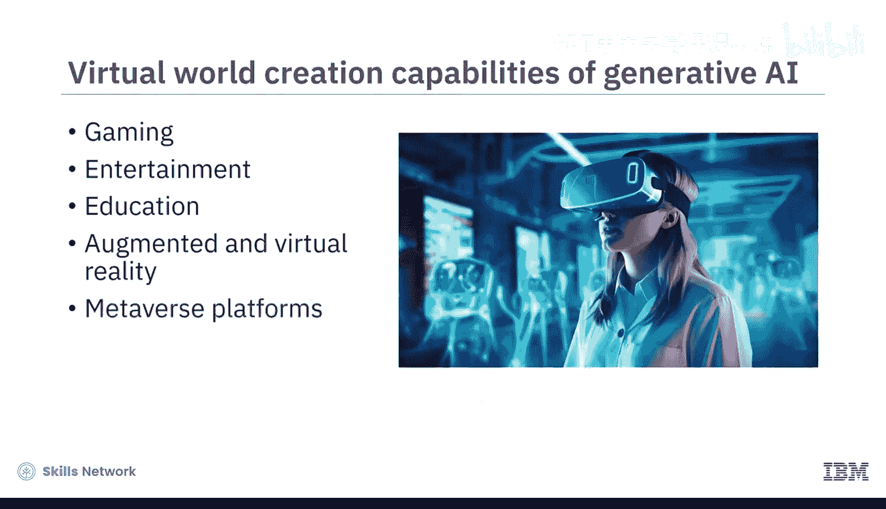

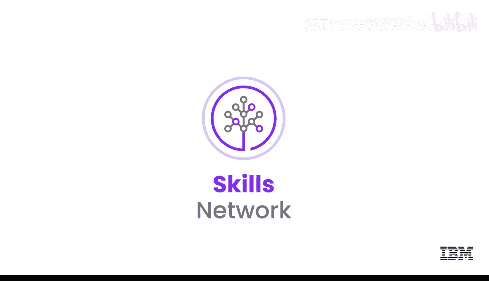

这些能力共同构成了生成式AI强大而多样的应用基础。