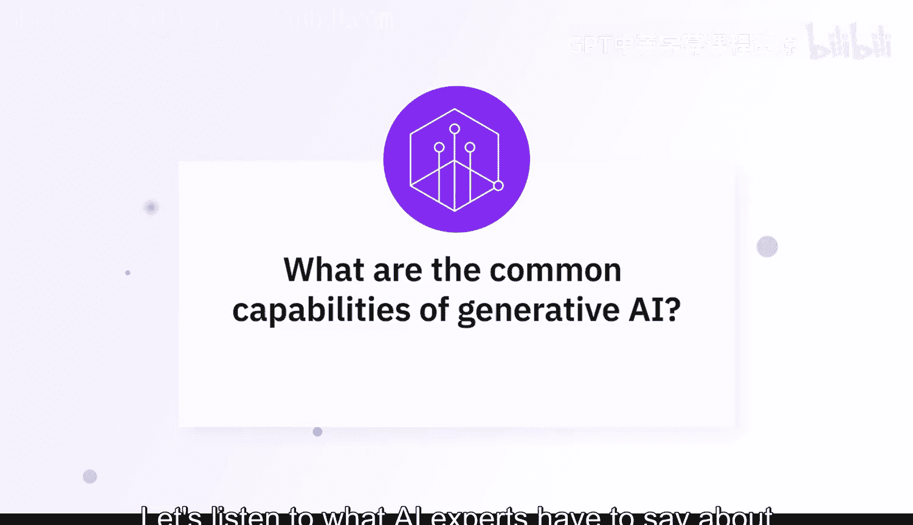
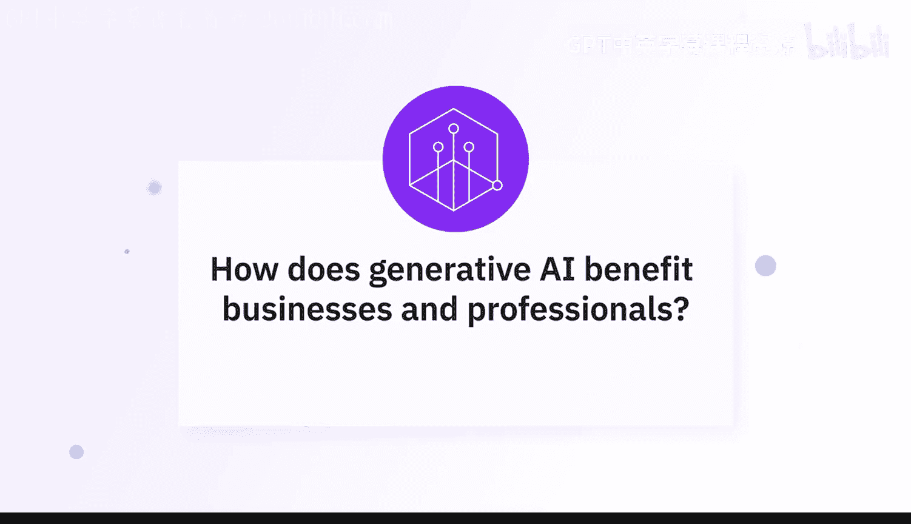
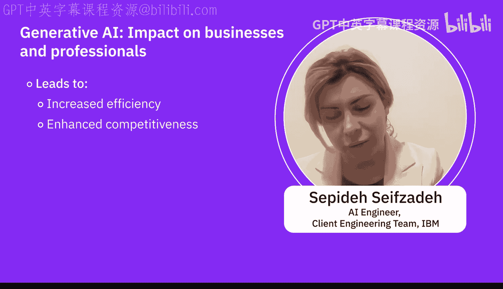

生成式AI基础：07：专家观点：生成式AI能力解析 🧠

在本节课中，我们将聆听AI专家解析生成式AI的常见能力，了解它如何为企业和专业人士带来变革。

---

生成式AI提供了多种能力，使企业和专业人士受益。它尤其擅长内容创作，例如生成文本、图像、音乐甚至视频，从而简化营销和创意流程。

基于大语言模型的一些常见用例包括**摘要**、**信息提取**、**内容生成**和**分类**。它也可以作为协同生成工具。

生成式人工智能的应用不仅限于生成原始数据，还包括生成模式、配置、设置等多种形式。具体到工业领域，合成数据能以多种方式帮助各行各业。

一个我们与客户合作时非常常见的用例是**RAG**（检索增强生成）。这是一个当前非常流行和常见的用例，因为客户拥有许多私有文档，他们不希望将这些文档暴露在公有云或公开环境中，但他们希望从这些文档中快速检索信息。

生成式AI不仅仅是一个花哨的概念，它是一个游戏规则改变者。想象一下，拥有一个能激发你的创造力、理解你的需求并为你节省时间的数字助手，这正是生成式AI所做的。因此，告别猜测，拥抱未来。生成式AI的到来是为了让一切变得更快、更好、更个性化。

---

上一节我们了解了生成式AI的核心能力，接下来我们看看这些能力具体如何使企业和专业人士受益。

生成式AI可以通过多种方式帮助我们。例如，在文本生成方面，GPT等模型可以帮助生成可用于营销材料的文本。在图像生成方面，GANs等技术可以创建非常接近真实图像和视频的内容。它还能帮助进行音乐和音频生成、数据合成与增强。

AI驱动的内容生成节省了时间，并通过自动化撰写报告、创建社交媒体帖子和设计图形等任务来降低成本。此外，生成式AI通过个性化推荐和交互式聊天机器人增强了客户体验，从而提升了参与度和满意度。在设计和产品开发领域，它通过快速生成多种设计变体，有助于快速原型设计和探索创新解决方案。

例如，在医疗保健行业，涉及合成数据生成和合成图像生成的操作可以保护患者隐私，即保护患有特定疾病的人的隐私。生成式AI也可用于金融分析中的欺诈检测。众所周知，它在制药行业被用于发现更多的药物模式。因此，这是一个应用范围非常广泛的结构，生成式AI正在不断提供巨大帮助。

它能绘制令人惊叹的图画，撰写引人入胜的故事，甚至像专家一样翻译语言。个性化推荐也不在话下，这个AI伙伴能准确找到你想要的东西，无论是电影、产品，甚至是职业道路。在医疗保健和航空等场景中，它能创建逼真的模拟用于培训，使学习变得安全高效。但这还不是全部，生成式AI自动化了任务，让你能腾出时间专注于更重要的事情。

因此，所有这些任务都有助于我们增强创造力、个性化体验并做出数据驱动的决策，最终提高效率、竞争力和客户满意度，这是我们的最终目标。

---

本节课中，我们一起学习了专家对生成式AI能力的解读。我们了解到，生成式AI的核心能力涵盖内容创作（文本、图像、音频、视频）、信息处理（摘要、提取、分类）以及通过RAG等技术进行私有知识检索。这些能力为商业和专业人士带来了节省时间、降低成本、增强创造力、提升个性化体验和驱动数据决策等多重益处，最终助力实现提高效率、竞争力与客户满意度的目标。