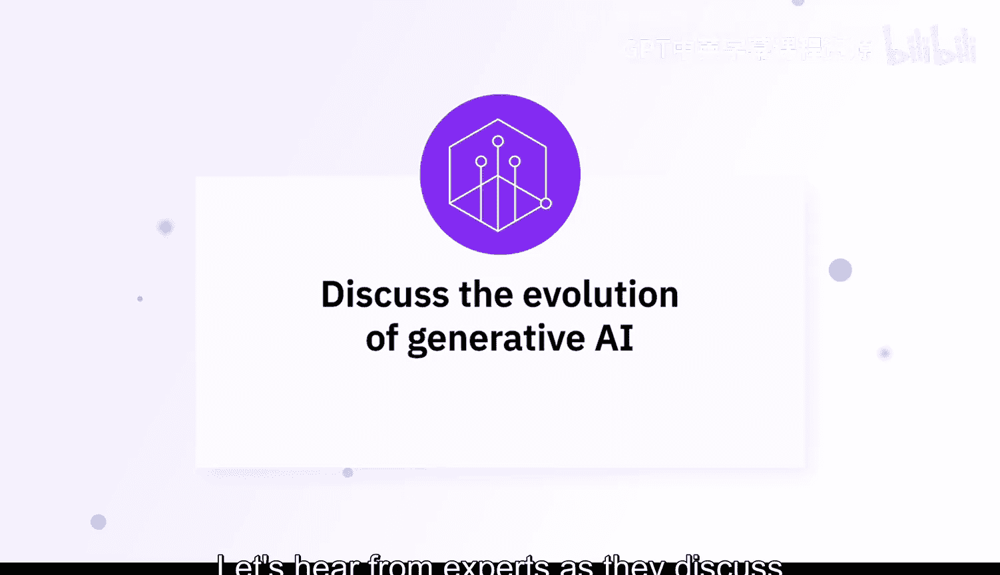
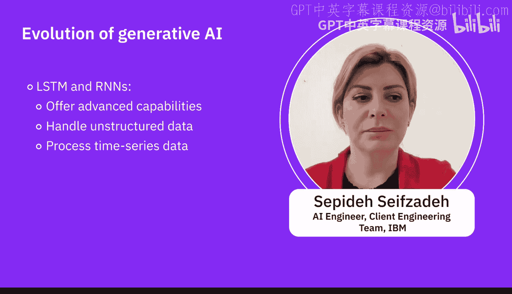
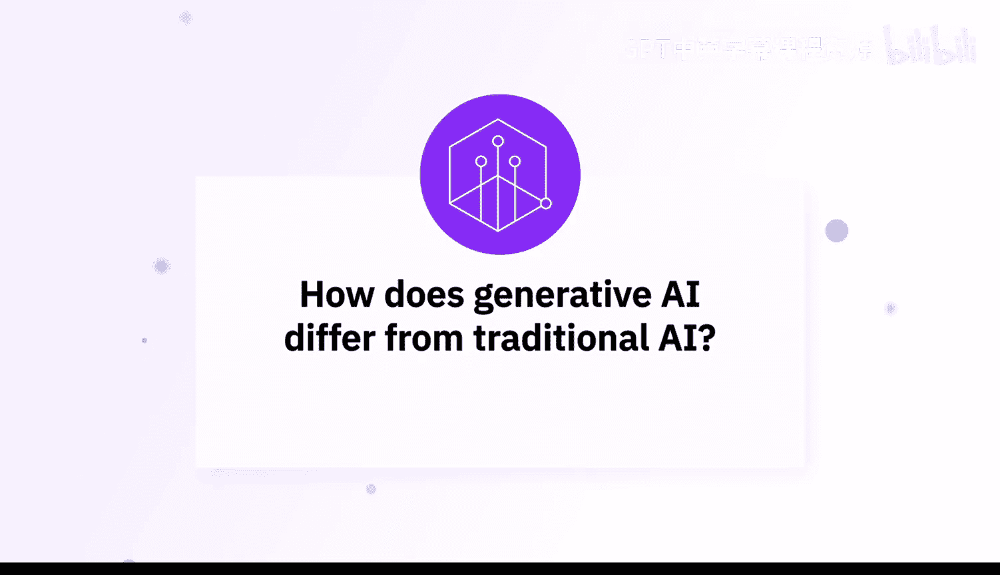
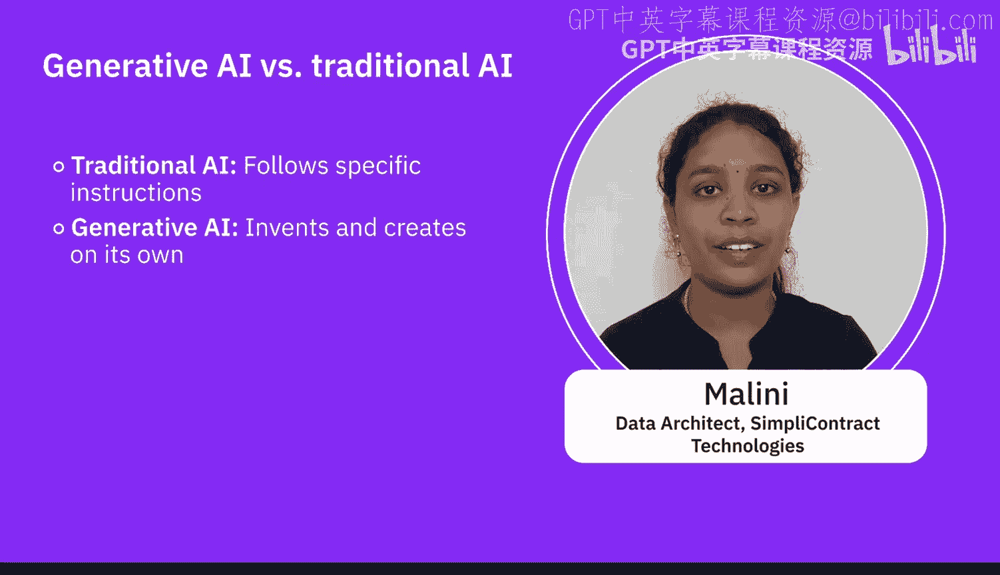

生成式AI基础：1.4：专家观点：探索生成式AI的演进历程 🚀

在本节中，我们将聆听专家们的见解，共同探讨生成式人工智能（Generative AI）的发展历程，并了解它与传统人工智能方法的区别。

---

生成式人工智能与人工智能共同演进，但近年来获得了更多关注。它已存在超过20年，但过去并不流行。随着生成对抗网络（GANs）和变分自编码器（VAEs）等技术的出现，生成式AI获得了巨大发展动力，几乎已成为行业的未来。

生成式AI的演进，以其创造新颖原创内容能力的显著进步为标志。早期的生成式AI模型在连贯性和质量上有所不足。但自从GPT-3，以及随后的GPT-4和DALL-E等模型出现后，它们能够生成高度复杂的文本和图像，从而增强了各领域的创造力和自动化水平。

---

### 演进历程概览

以下是生成式AI技术发展的几个关键阶段：

*   **基于规则的机制与传统模型**：系统仅在提供的上下文内工作，并遵循预设的规则。
*   **机器学习与统计模型**：这些模型能够从数据中发现模式。相较于基于规则的系统，它们通过半监督学习、监督学习或强化学习，能够更智能地处理任务。
*   **深度学习与神经网络**：它们能以更先进的方式在数据集中发现模式，并处理非结构化格式的数据。
*   **生成对抗网络（GANs）**：这开启了生成任务和创造新数据的新时代。
*   **长短期记忆网络（LSTM）与Transformer**：这些神经网络架构帮助我们更先进地处理某些用例，以及非结构化格式的数据和时间序列数据集。

上一节我们回顾了生成式AI的技术演进路径，接下来我们看看它与传统AI方法的核心区别。

---

### 与传统AI方法的区别

区分生成式AI与传统AI方法至关重要。传统AI侧重于分析和预测现有数据，例如分类、回归、推荐等任务。生成式AI则不同，特别是在生成对抗网络（GANs）和Transformer模型出现之后，它能够创造与训练数据相似的新数据。

过去五六十年，人工智能的发展是从基础水平走向应用和预测水平。生成式AI则更多地关注于利用人工智能技术生成人类质量的输出。

2017年，一篇名为《Attention is All You Need》的论文开启了生成任务的新纪元。如今，开源社区中已有许多类似GPT的模型。其核心理念是拥有一个经过预训练的大模型和庞大的数据集，可以轻松针对特定任务进行微调。

简单来说，传统AI执行指令，而生成式AI则能自主构思和创造，就像一位酷炫的AI发明家。

---

### 总结

在本节课中，我们一起学习了生成式AI的演进历程。我们从早期的规则系统，经过机器学习和深度学习阶段，一直探讨到以GANs和Transformer为代表的现代生成模型。同时，我们也明确了生成式AI与传统AI的核心区别：传统AI擅长分析和预测，而生成式AI的核心能力在于创造与创新。理解这一演进和区别，是掌握生成式AI基础的重要一步。