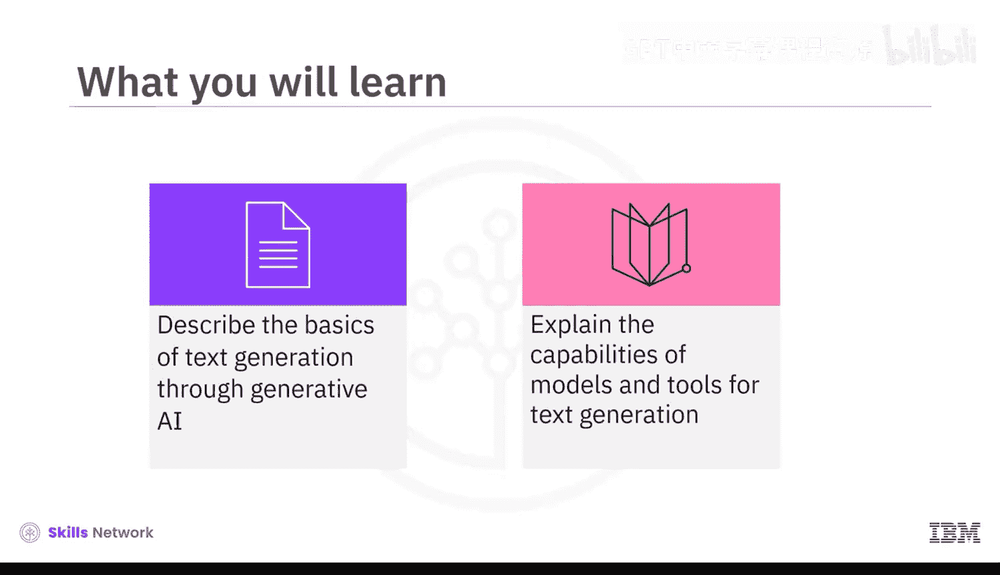
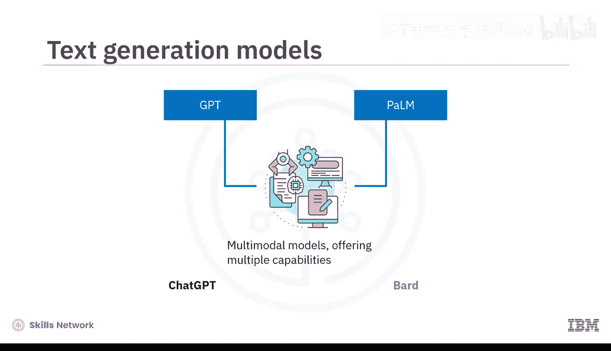
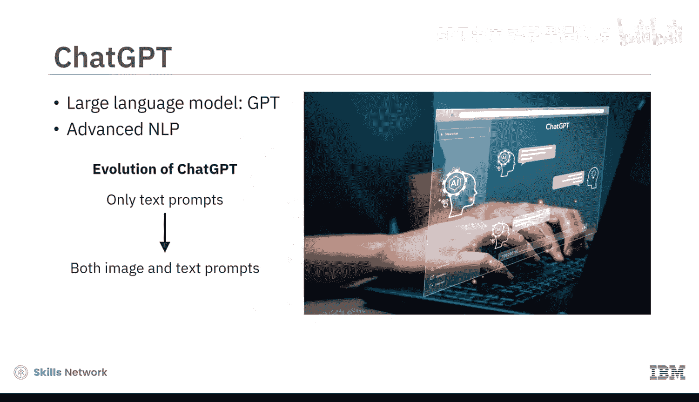

# 010：文本生成工具 🛠️

在本节课中，我们将学习生成式AI在文本生成领域的核心工具。我们将了解大型语言模型如何工作，并探索以ChatGPT和Bard为代表的主流文本生成工具及其应用。

## 概述

文本生成是生成式AI的核心能力之一。其基础是大型语言模型，它们通过学习海量文本数据中的模式和结构，能够理解上下文、语法和语义，从而生成连贯且符合语境的文本。本节我们将介绍这些模型的基本原理，并详细探讨几种流行的文本生成工具。

## 大型语言模型基础

上一节我们介绍了生成式AI的基本概念，本节中我们来看看文本生成的核心引擎——大型语言模型。

大型语言模型是生成式AI文本生成能力的核心。它们基于在训练期间学习到的模式和结构来工作。LLMs通过解读上下文、语法和语义，生成连贯且符合语境的文本。其核心原理是学习词语和短语之间的统计关系，这使得LLMs能够为任何给定语境调整并创造写作风格。

**公式表示其核心思想可简化为：**
`生成的文本 = 模型(输入提示 | 训练数据中的统计模式)`

许多文本生成模型都以LLMs为基础。其中两个著名的例子是生成式预训练变换模型和PaLM模型。这些模型已发展为多模态模型，提供多种能力。

## 主流文本生成工具

了解了基础模型后，我们通过两个流行工具来具体了解它们的能力：ChatGPT和Bard。

### ChatGPT：基于GPT的对话引擎

ChatGPT基于GPT系列大型语言模型，并采用了先进的自然语言处理技术。最初，ChatGPT仅接受文本提示作为输入来生成新内容。随着版本更新，现在它可以同时接受图像和文本输入。

ChatGPT为文本生成提供了多样化的能力，尤其擅长进行流畅且基于上下文的对话。

以下是ChatGPT的一些关键能力示例：

*   **上下文对话**：你可以开启一个对话来学习某个概念。例如，输入提示“我听说过生成式AI，想了解更多”。ChatGPT会根据上下文回复一些基本信息。接着，你可以通过提问“如何利用生成式AI来提高我的讲故事技巧？”来推进对话，ChatGPT会根据你提供的上下文和问题给出相应回答。
*   **创意任务协助**：它也能帮助你完成各种创意任务。例如，输入提示“帮我创建幻灯片来展示一个学习平台的功能”，ChatGPT会为具体的幻灯片提供标题、内容和视觉元素的建议。
*   **多语言支持**：虽然ChatGPT最精通英语，但它能理解并用多种其他语言回应。例如，提示它用法语和西班牙语写“你好”，它就能生成所需的输出。这使得它成为学习新语言或任何科目的有用工具。

### Google Bard：基于PaLM的搜索增强工具

另一个流行的文本生成工具是Google Bard。它基于谷歌的先进语言模型PaLM。

PaLM是变换器模型与谷歌Pathways AI平台的结合。Pathways AI基于“路径”架构，即负责特定任务的专门模块，例如自然语言处理或机器翻译。除了庞大的文本和代码训练数据集，它还能从互联网上的资源中提取信息来回应提示。

你可以尝试不同的提示来探索Bard的能力：

*   **信息总结**：尝试用提示获取某个主题的最新新闻摘要，例如“提供关于乌克兰战争的最新新闻摘要”。它会提供多个版本的草稿作为回应，你可以选择其中一个或重新生成。
*   **创意与问题解决**：尝试提示它为推广一个时尚品牌提供数字营销活动策略。它会为营销活动提供一步一步的方法。

## 工具的能力对比与扩展应用

与ChatGPT和Bard交互后，你会发现它们各有侧重。ChatGPT在生成动态回复和维持对话流方面更有效。而Bard由于能通过谷歌搜索和谷歌学术访问网络资源，在研究某个主题的最新新闻或信息时可能是更好的选择。

需要认识到，包括GPT和PaLM在内的生成式AI模型都在不断进化，因此它们的能力和特性可能会发生变化。

除了ChatGPT和Bard，还有其他文本生成工具：

*   **Jasper**：生成任何长度的高质量营销内容，并能贴合品牌声音。
*   **Writesonic**：为不同类型的文本提供特定模板，例如文章和博客、广告和营销内容。
*   **Copy.ai**：擅长为社交媒体、营销和产品描述创建内容。

还有一些工具专用于特定用例：

*   **摘要工具**：例如Resoomer，通过提取关键思想或概念来生成文本摘要。
*   **分类工具**：例如YouClassify，用于为文本片段分配一个或多个类别。
*   **情感分析工具**：生成能反映人类语言中所表达的基础情感的文本，例如Brand24。
*   **多语言翻译工具**：例如Language Weaver和Yandex.Translate。

## 隐私考量与开源替代方案

一个重要注意事项是，许多开源的生成式AI工具会收集并审查与其共享的数据以改进其系统。在与这些工具交互时，为避免共享任何机密或敏感信息，这是一个重要的考虑因素。

那么，我们是否有开源且保护隐私的替代方案？答案是肯定的。

*   **GPT4All**：可以安装在你的机器上，作为具有隐私意识的聊天机器人运行，无需互联网或图形处理单元。
*   **H2O AI 和 PrivateGPT**：这类聊天机器人旨在通过在没有互联网连接的情况下在本地机器上运行，利用LLMs的能力来保护用户隐私。

不仅如此，你还可以通过将这些工具链接到你组织的文档和数据库，来定制它们以供特定组织内部使用。

## 文本生成工具的优势总结

生成式AI文本生成工具提供了诸多好处：

*   **学习辅助**：它们提供循序渐进的解释，是良好的学习助手。
*   **提升效率**：能够快速生成不同形式的文本，为作者和创作者带来效率。
*   **激发创意**：这些工具增强了创造力并激发了新想法。
*   **虚拟助手**：通过实现引人入胜的交互式对话，它们可用作虚拟助手和聊天机器人。
*   **提高生产力**：通过自动化重复性写作任务，可以提高组织生产力。
*   **促进全球化沟通**：凭借多语言支持，它们能够为全球受众实现沟通和内容本地化。

## 总结

本节课中我们一起学习了文本生成工具的核心知识。我们了解到LLMs通过解读上下文、语法和语义来生成连贯且符合语境的文本。GPT和PaLM等LLMs是许多生成模型的基础。两个流行的生成工具是OpenAI的ChatGPT和谷歌的Bard。ChatGPT基于GPT，而Bard基于PaLM。两者都能生成不同类型的文本、翻译语言，并以交互和信息丰富的方式回答你的问题。我们还讨论了一些其他工具，包括Jasper、Copy.ai、Writesonic。开源的、保护隐私的文本生成器包括GPT4All、H2O AI和PrivateGPT。