# 011：图像生成工具 🎨

在本节课中，我们将学习生成式AI在图像生成领域的基本能力，并介绍几种常见的图像生成模型与工具的核心功能。

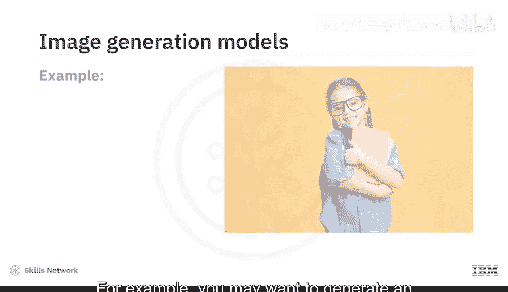

## 概述

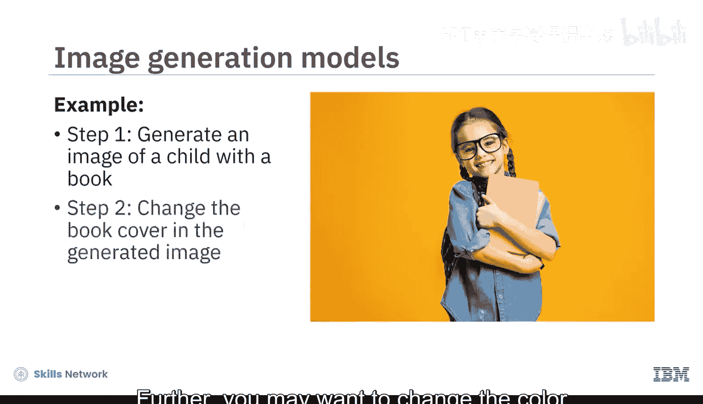

生成式AI图像生成模型能够创建全新的图像，并能对真实或生成的图像进行定制化修改，以获得期望的输出。例如，你可以生成一个“戴着帽子、帽子上有本书的小孩”的图像，随后还可以更改生成图像中书封面的颜色。

上一节我们介绍了生成式AI的基本概念，本节中我们来看看具体的图像生成工具及其能力。

## 图像生成的基本流程

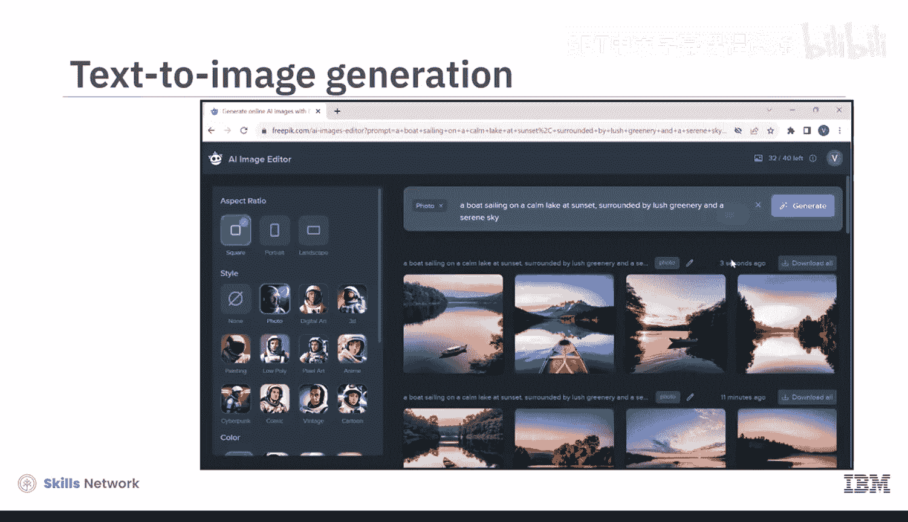

让我们使用一个免费的AI图像生成器（例如FreePik）来生成一张新图像。你需要输入一段描述你希望创建图像的文本提示。

例如，你可以输入以下提示词：“一艘船在日落时分的平静湖面上航行，周围是郁郁葱葱的绿植和宁静的天空。”

**提示词的质量决定了生成图像的准确性和质量。**

接下来，选择图像风格并生成图像。生成器会提供多张图像供你选择下载，你也可以通过修改提示词来生成其他图像。

## 图像生成模型的更多可能性

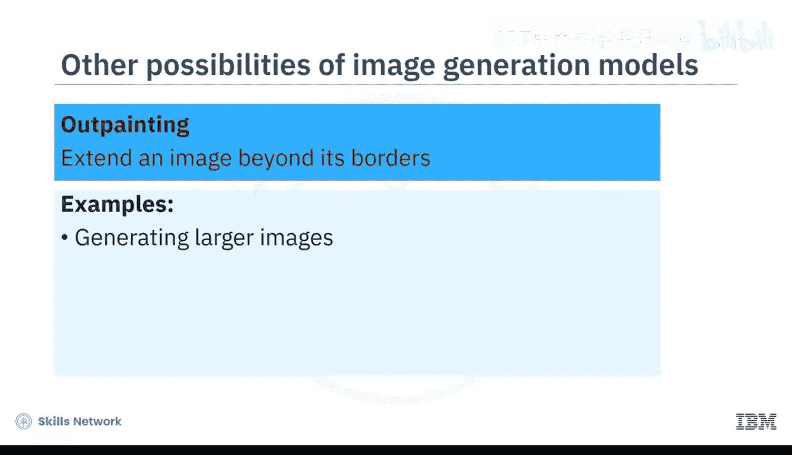

除了基础的文生图，图像生成模型还具备多种高级功能。

以下是几种关键的图像处理能力：

*   **图像到图像转换**：指将一个领域的图像转换到另一个领域，同时保留原始的内容和风格。
    *   例如：将草图转换为逼真图像、将卫星图像转换为地图、提升安防摄像头图像的分辨率、增强医学影像的细节。
*   **风格迁移与融合**：涉及从一张图像中提取风格，并将其应用到另一张图像上，从而创建混合或融合图像。
    *   例如：将一幅画作转换为照片风格。
*   **图像修复**：指重建图像中缺失或损坏的部分，使其变得完整。
    *   此功能可用于艺术修复、取证、在保持连续性和上下文的前提下移除图像中不需要的物体，以及将虚拟物体混合到现实场景中以实现增强现实。
*   **图像扩展**：指通过生成与原始图像相似的新部分来扩展原始图像。
    *   这可用于生成更大尺寸的图像、提高分辨率以及创建全景视图。

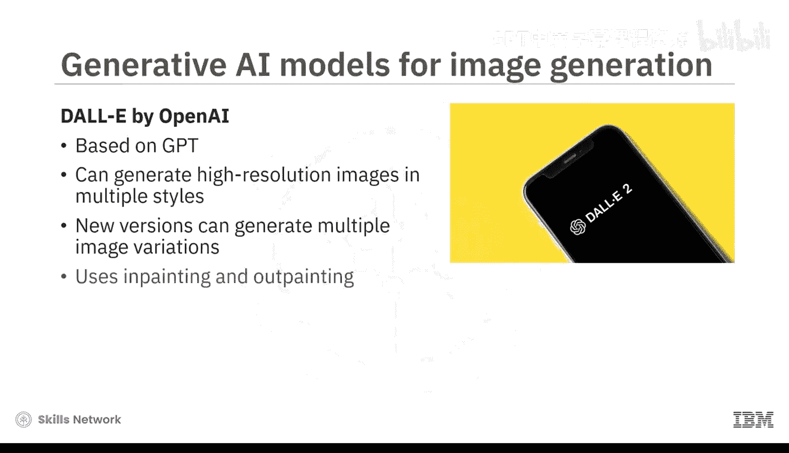

## 核心生成模型介绍

生成模型和工具的图像生成与修改能力，随着其底层模型的演进而不断发展。

以下是几个重要的图像生成模型：

*   **OpenAI的DALL-E**：基于在大型图像及其文本描述数据集上训练的GPT模型。DALL-E能够生成多种风格的高分辨率图像，包括逼真的照片和绘画。新版DALL-E还提供了生成多种图像变体，以及通过图像修复和扩展进行图像转换的能力。
*   **Stable Diffusion**：一个开源的文生图扩散模型。扩散模型是一种能创建高分辨率图像的生成模型。Stable Diffusion主要用于基于文本提示生成图像，但也可用于图生图转换、图像修复和扩展。
*   **NVIDIA的StyleGAN**：该模型将图像内容建模和图像风格建模分离开，从而能够精确控制风格，并操纵特定特征（如姿势或面部表情）。StyleGAN已演进到能生成具有更真实细节的更高分辨率图像。

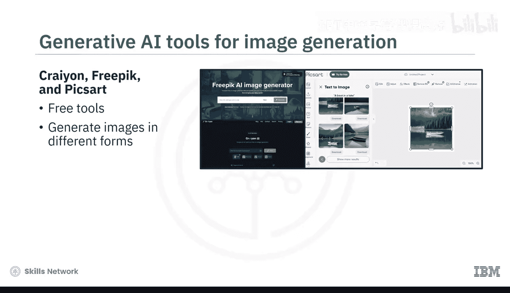

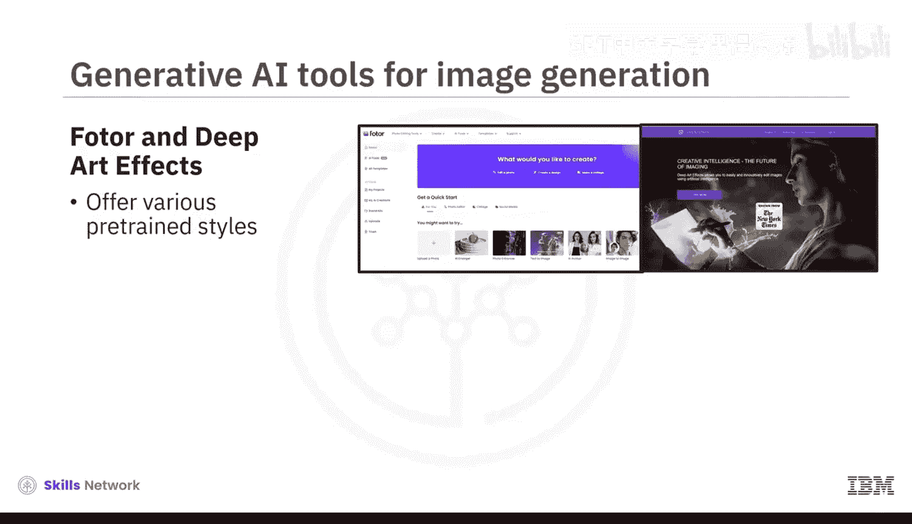

## 常用图像生成工具

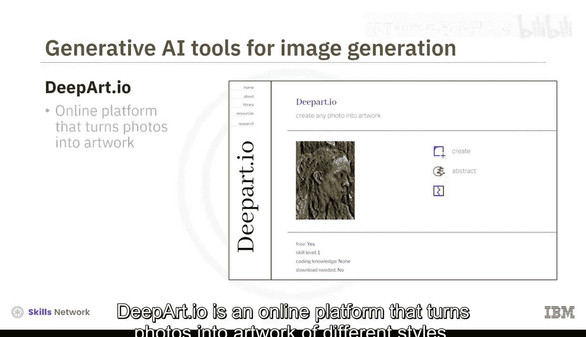

你可以使用一些免费工具来探索生成式AI的文生图能力，例如Crayon、FreePik和Pixlr。这些工具能以不同的形式和风格生成图像。

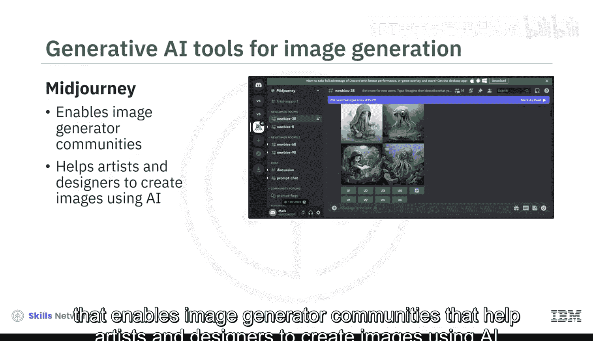

此外，还有一些提供更专业风格的工具：

*   **DeepArt.io**：一个在线平台，能将照片转化为不同风格的艺术作品。
*   **MidJourney**：一个平台，它培育了一个图像生成器社区，帮助艺术家和设计师使用AI创作图像，并探索彼此的作品。

许多生成式AI图像生成器还提供API接口，允许开发者将其功能集成到不同的软件程序和工具中。一些提供API的流行图像生成器包括DALL-E、MidJourney和Crayon。

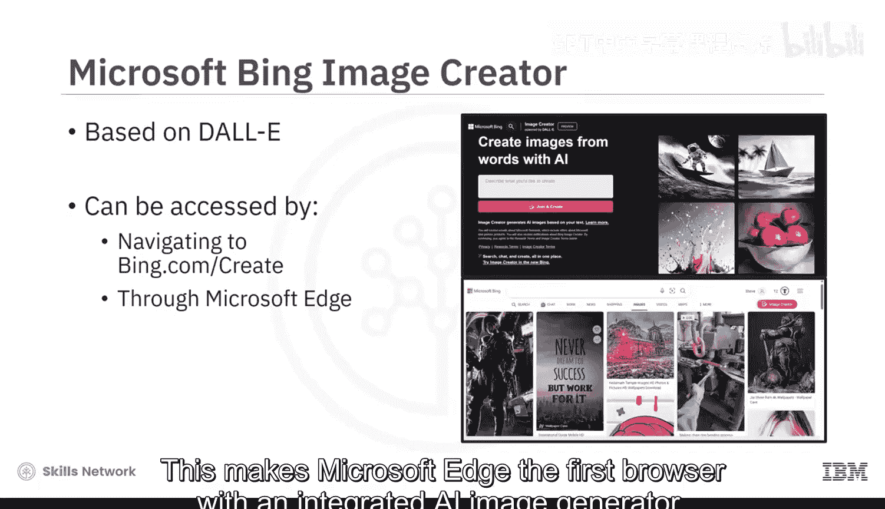

## 科技巨头的布局

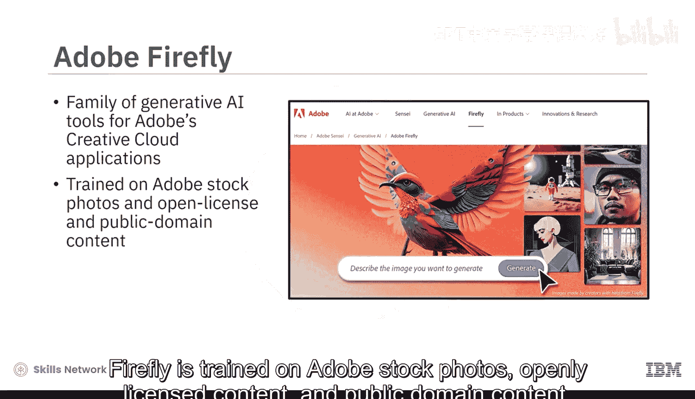

微软和Adobe等技术巨头也已涉足AI图像生成器领域。

*   **Microsoft Bing Image Creator**：基于DALL-E模型。你可以通过访问Bing.com/create或通过Microsoft Edge浏览器使用此工具。这使得Microsoft Edge成为首个集成AI图像生成器的浏览器。
*   **Adobe Firefly**：是一系列旨在与Adobe Creative Cloud应用程序（如Photoshop和Illustrator）集成的生成式AI工具。Firefly使用Adobe Stock图片、开放许可内容和公共领域内容进行训练。它能接受超过100种语言的文本提示，并包含多种工具，允许你操控颜色、色调、光照、构图，还提供生成式填充、文本效果、生成式重新着色、3D转图像和图像扩展等功能。

## 总结

本节课中我们一起学习了：
1.  基于生成式AI的模型和工具可以通过文本或图像提示生成新图像。
2.  它们还提供图生图转换、风格迁移、图像修复和图像扩展等能力。
3.  几个突出的图像生成模型包括DALL-E、Stable Diffusion和StyleGAN。
4.  市场上有多种图像生成工具，提供多样化的图像生成和转换功能。
5.  部分图像生成器可作为API被集成。
6.  Adobe Firefly是旨在与Adobe创意云应用程序集成的一系列生成式AI工具。

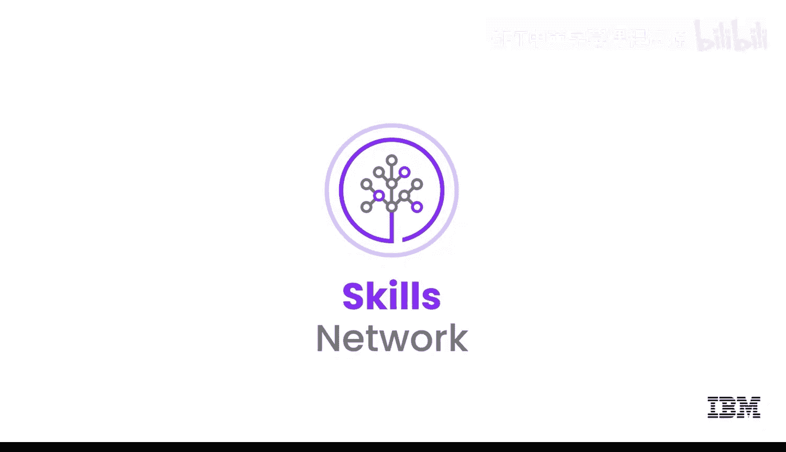

通过掌握这些工具和概念，你可以开始利用生成式AI的强大能力进行图像创作和编辑。