# 012：音视频生成工具 🎵🎬

在本节课中，我们将学习生成式AI在音频和视频创作领域的应用。我们将了解这些工具如何运作，它们具备哪些核心能力，以及如何利用它们来创造引人入胜的媒体内容和虚拟世界体验。

---

## 概述 📋

生成式AI正在彻底改变音频和视频内容的创作方式。市场研究预测，生成式AI音乐市场将从2022年的2.29亿美元，以28.6%的年复合增长率增长至2032年的26.6亿美元。这些工具能够帮助企业和个人，无论其经验水平如何，简化流程，将复杂的创意构想变为现实。

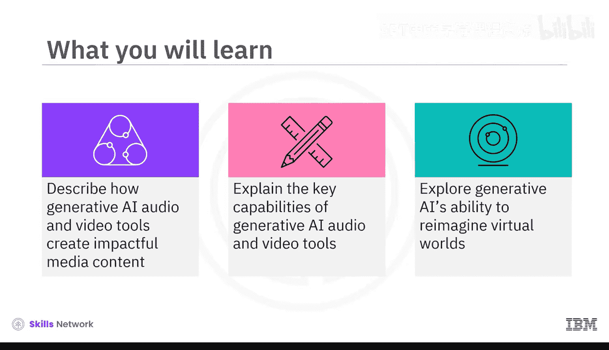

上一节我们介绍了生成式AI的基本概念，本节中我们来看看它在音视频生成领域的具体应用。

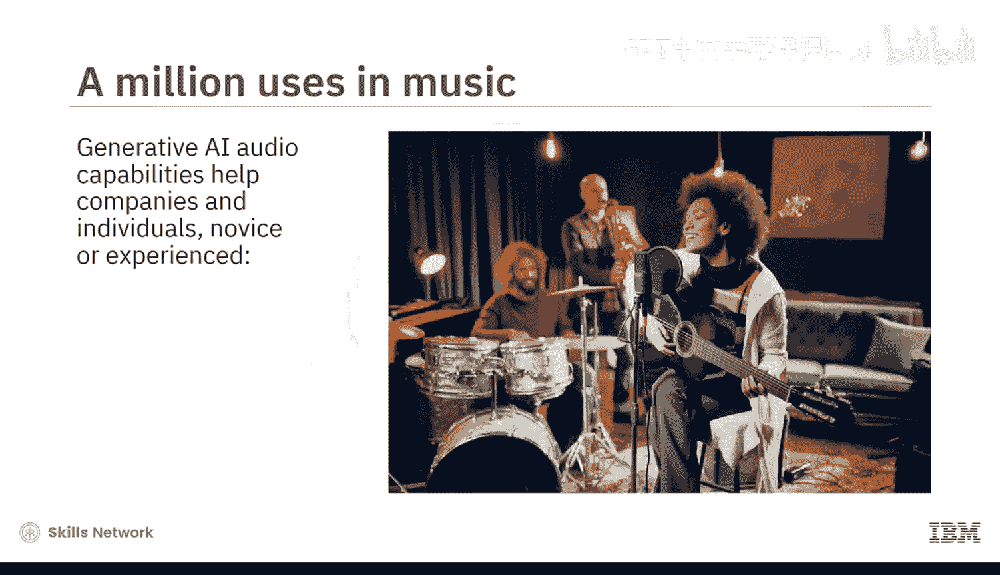

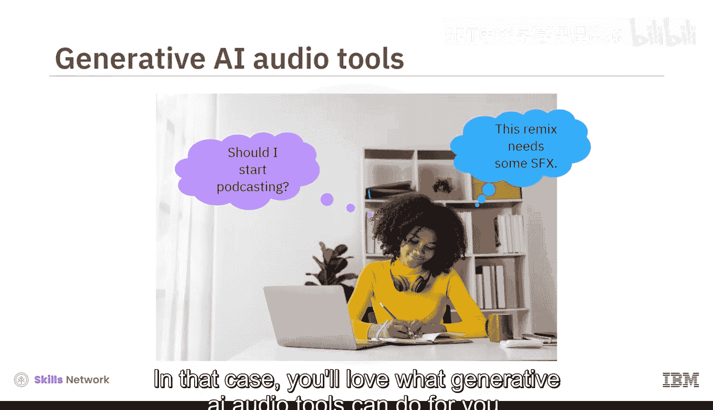

---

## 生成式AI音频工具 🎤

生成式AI音频工具主要分为三类：语音生成工具、音乐创作工具和音频质量增强工具。

### 语音生成工具

语音生成工具主要是**文本转语音**工具，它们能将文本转换为音频。虽然朗读技术并非全新，但生成式AI架构升级了其工作方式。

以下是其工作原理：
1.  **深度学习算法**在大量人类语音数据集上进行反复训练。
2.  算法能够分解并高效复制**发音、语速、情感和语调**等声音特征。
3.  最终，生成式AI TTS工具能创造出更准确、更自然的语音。

这些工具对有视觉障碍、语言障碍或其他阅读困难的人士尤其有帮助。它们也能让你更轻松地“听”文章或笔记，或者为你的演示文稿配上出色的旁白。

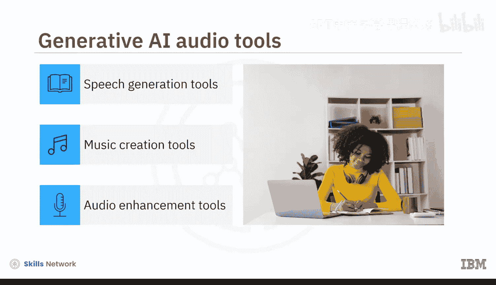

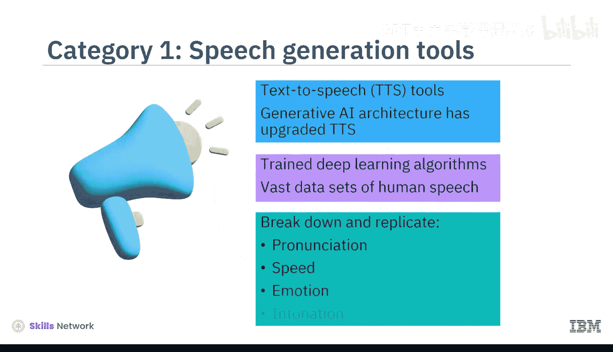

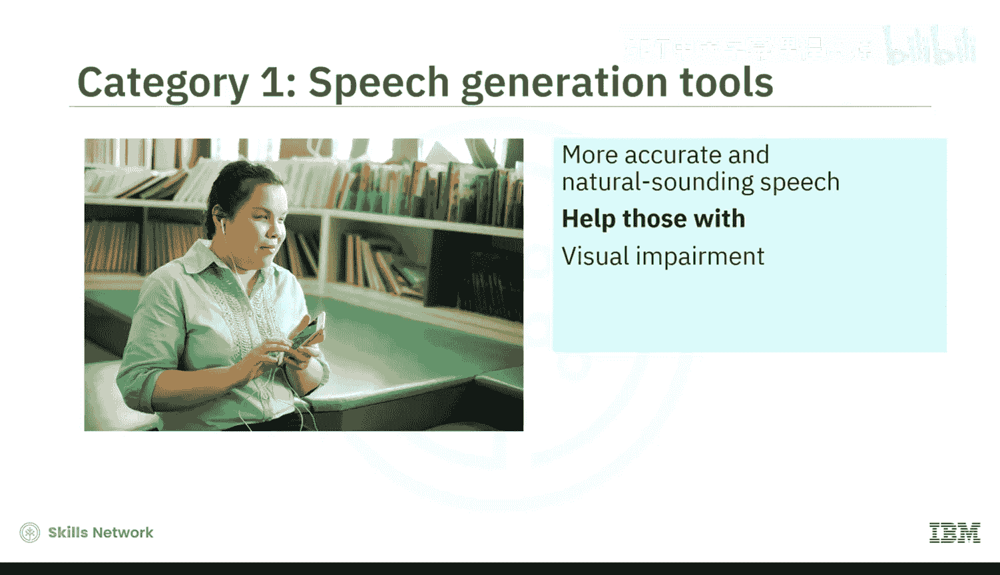

你可以使用以下工具：
*   LOVO
*   Synthesia
*   Murf AI
*   Listnr

这些工具提供了丰富的AI语音、语言和情感库，你甚至可以创建独特的声音或克隆自己的声音。部分工具还允许你编辑音轨、修正发音、调整语调和语速，以制作出专业水准的最终产品。

### 音乐创作工具

假设你想尝试创作音乐，生成式AI可以成为你的得力助手。例如，Meta的**AudioCraft**就是一个经过音效和20,000小时Meta自有或授权音乐训练的生成式AI工具。

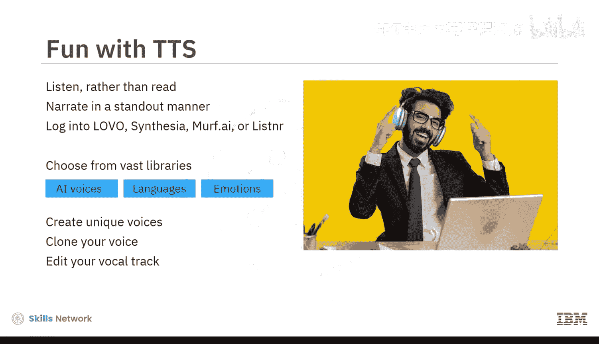

其他工具还包括：
*   Shutterstock的Amper Music
*   AIVA
*   Soundful
*   Google的Magenta
*   由G4驱动的Wave工具

以下是使用流程：
1.  从广泛的音乐库、不同流派、乐器风格和旋律中进行选择。
2.  输入一个**文本提示**。
3.  根据你的请求，工具可以创作简短的旋律或即兴重复段、建议或添加乐器、谱写新歌，或为你的视频创建配乐。

此外，生成式AI还能帮助你进行混音、母带处理，并将最终作品发布到流行的流媒体平台。

### 音频增强工具

这类工具经过预训练，能够识别特定声音，可以为你的音频添加有趣的效果，或去除不需要的噪音。

例如：
*   **Descript**：可以帮助去除背景噪音、增强低质量录音，并添加所需的音效。
*   **Krisp**：可以清理文件中的 unwanted noise。

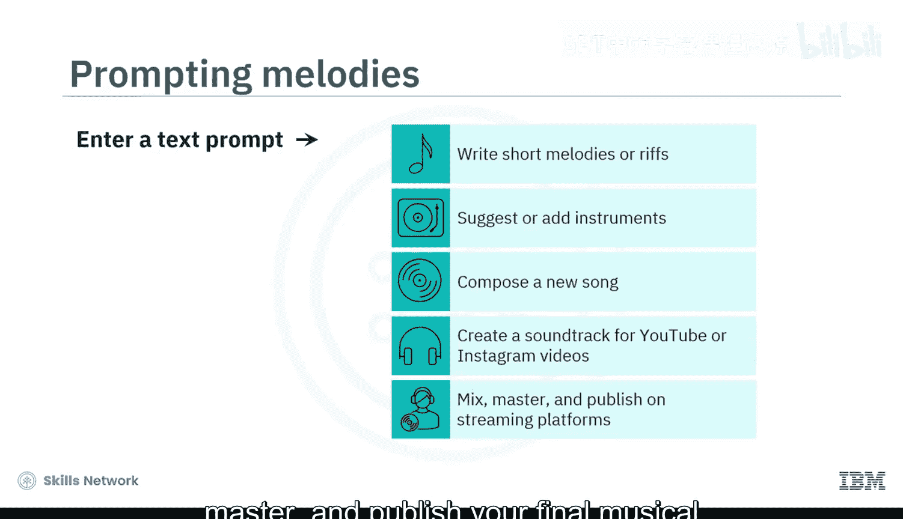

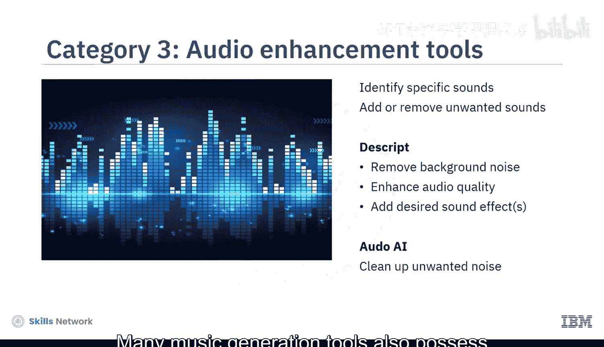

许多音乐生成工具也具备音频编辑和增强功能。

---

## 生成式AI视频工具 🎥

有些项目需要的不仅仅是出色的音效。2022年，Runway AI就利用生成式AI能力助力制作了奥斯卡获奖电影《瞬息全宇宙》。即使你不制作大片，也可以在日常生活中使用生成式AI视频工具。

假设你正在制作一个关于城市树木缺乏的纪录片，你可以：

1.  登录 **Runway的Gen-1工具**，将现有视频片段转换为不同的风格。
2.  或使用 **Runway的Gen-2工具**，通过文本、图像或视频输入来创建视频。

此外，你还可以使用 **Pika Labs视频工具包** 或 **Synthesia** 应用。这些工具允许你上传照片，如果没有照片，可以使用文本提示生成所需图像。你还可以用它们录制旁白、增强音频、转换视频文件格式并发布视频。Synthesia甚至允许你创建自定义虚拟形象，以增强品牌辨识度。

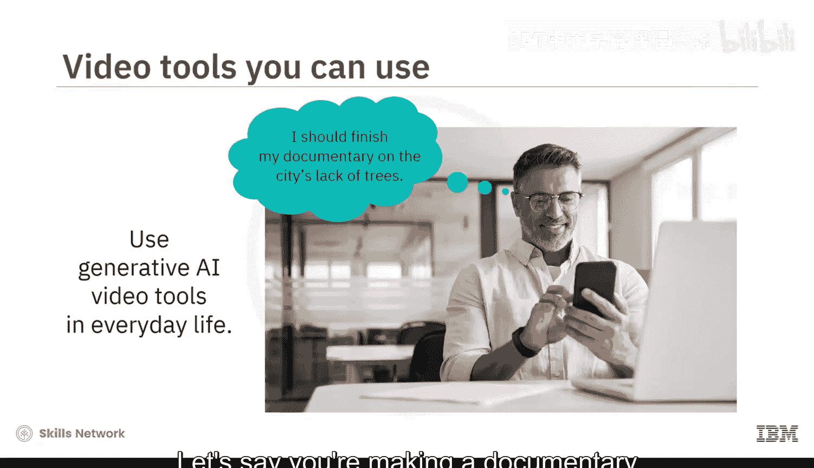

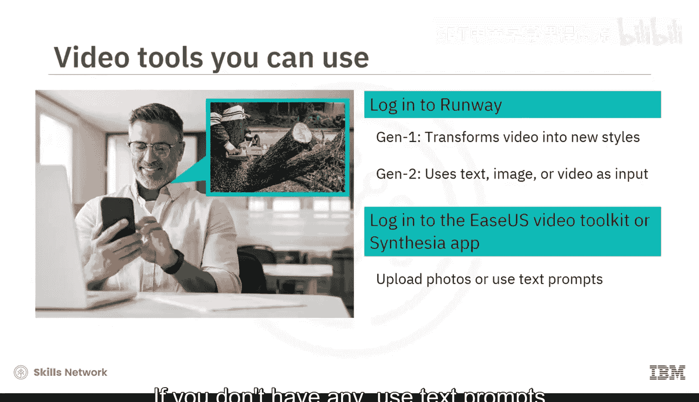

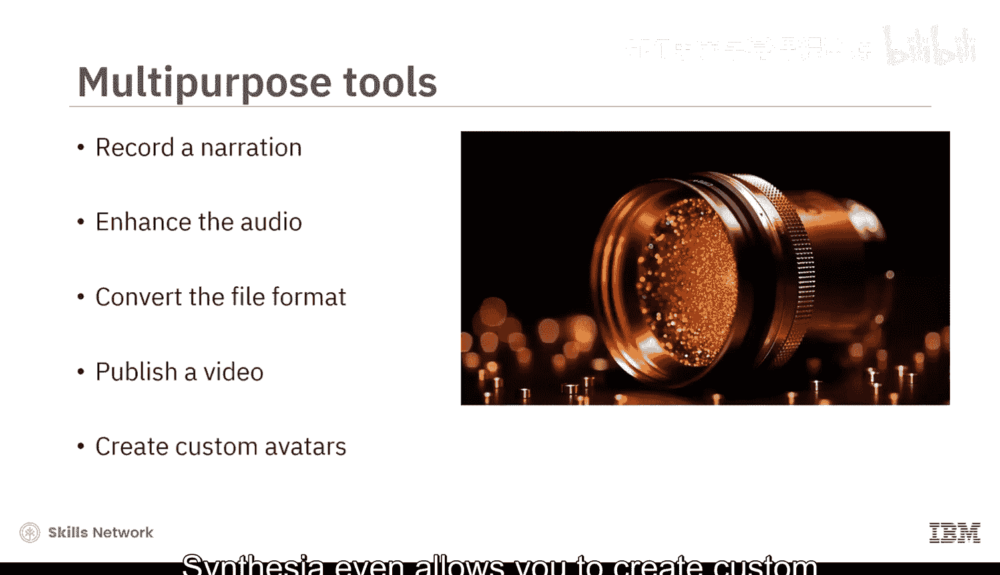

---

## 重塑虚拟世界 🌐

生成式AI可以增强你的虚拟世界体验。你可以创建具有混合特征和异域风情的独特、富有想象力的虚拟世界。生成模型还能实时响应，提高模拟的准确性。

元宇宙平台利用生成式AI来创造更个性化、更具吸引力的用户体验。游戏元宇宙允许你快速生成3D对象，甚至创建具有特定性格特征的虚拟形象，这些特征会体现在他们的表情、行为和决策中。

例如：
*   **The Sandbox**：一个用户可以在其中即时构建、拥有并向全球推广其游戏的元宇宙。
*   **Scenario AI**：帮助创建和连接定制化的移动游戏资产。

---

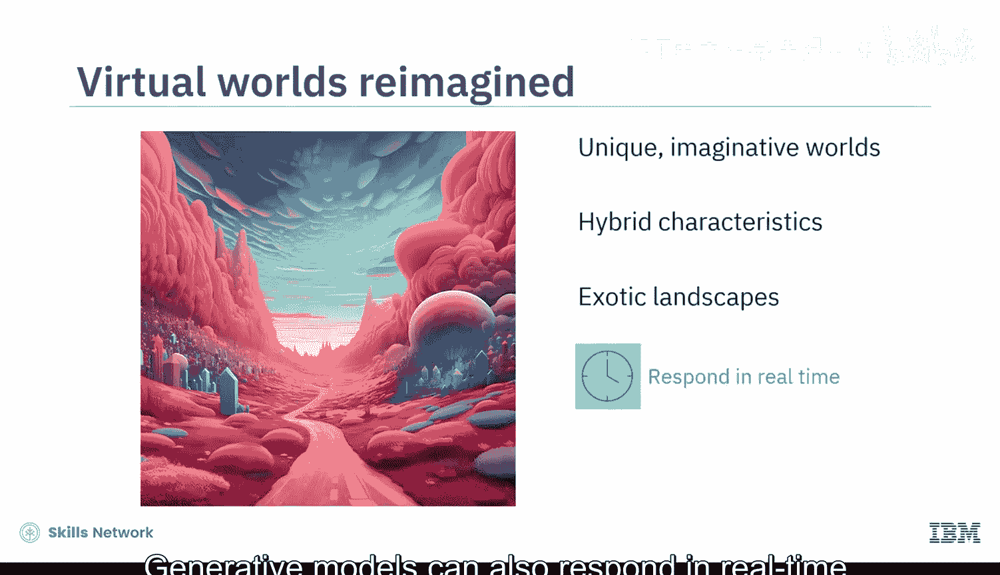

## 总结 🎯

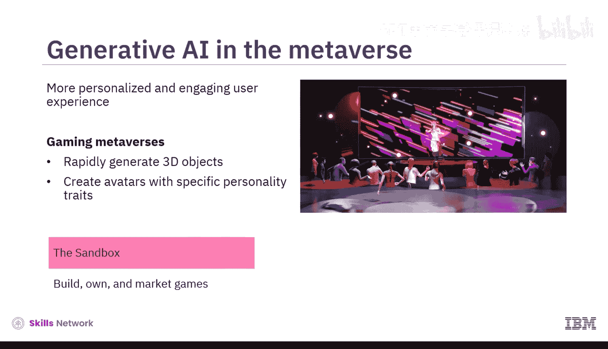

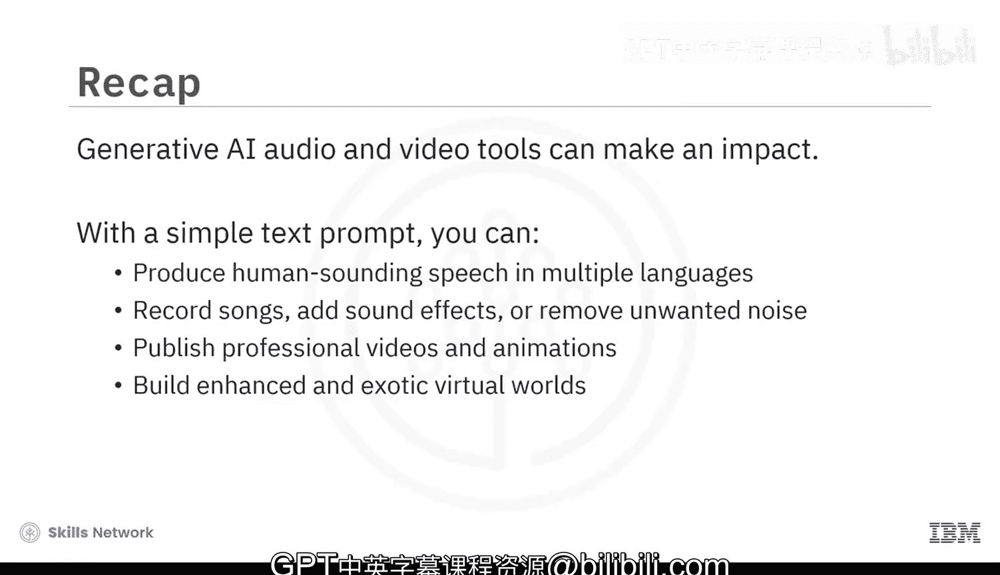

本节课中，我们一起学习了生成式AI音视频工具的强大能力。通过一个简单的文本提示，你就能生成多种语言的人声级语音、录制歌曲、添加音效或去除噪音、润色视频和动画，并构建增强版和充满异域风情的虚拟世界。这些工具正在降低创意门槛，让每个人都能成为媒体内容的创作者。