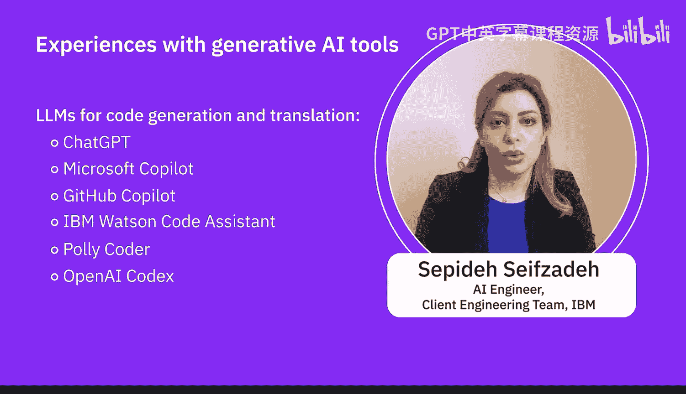

生成式AI基础：05：专家观点：生成式AI工具的有效利用 🧠

在本节课中，我们将聆听AI专家分享他们使用生成式AI工具（用于创建文本、图像和代码）的个人经验，并探讨使用这些工具的益处与挑战。


---

### 专家经验分享

首先，我们来听听专家们对不同类型生成式AI工具的实际使用体验。

一位专家表示，他广泛尝试了各类生成式AI，包括文本生成、代码生成、图像、视频、音乐和3D文件等。他明确指出，目前文本生成和代码生成工具在“首次尝试即获得理想结果”方面表现最佳。这不仅因为这些模型经过了更多优化，也因为外界有更多关于如何精心设计提示词（prompt）以获得优质输出的经验分享。

**核心概念**：精心设计的提示词是获得理想输出的关键。这通常涉及使用清晰、具体的指令，例如：
```
代码：请用Python编写一个函数，计算斐波那契数列的前N项。
```

---

### 工具选择与微调

上一节我们了解了专家的初步体验，本节中我们来看看如何为不同任务选择合适的工具。

不存在一个能处理所有生成式AI用例的大型语言模型。对于任何给定任务，都有多个大型语言模型可供考虑和使用。这些模型可能由开源社区提供，也可能由具备训练能力的组织发布。

此外，还存在**微调**的概念。这意味着你可以考虑使用一个大型语言模型，并针对你的特定数据或客户数据进行微调，而无需巨大的计算资源或海量数据。

**核心概念**：模型微调（Fine-tuning）的公式可以简化为：
`最终模型 = 预训练基础模型 + 特定领域数据微调`

以下是针对不同创作类型的流行工具选择：

**文本生成**：
*   GPT-3/ChatGPT 和 Google Bard 是非常流行的平台，它们也具备代码生成能力。
*   其他工具还包括 Jasper、Phrasee.IO 和 Microsoft Copilot。

**图像生成**：
*   图像生成领域主要分为三类：图像生成、视频生成和设计生成。
*   流行的图像生成模型包括 DALL-E 和 Stable Diffusion。
*   从平台角度看，Midjourney 是最受欢迎的平台之一。值得注意的是，DALL-E 可以与 ChatGPT 结合使用，ChatGPT 的高级版本也正在集成 DALL-E 的功能。

**代码生成**：
*   虽然 ChatGPT 和 Bard 也能生成代码，但 GitHub Copilot 在此方面表现更佳。
*   专门用于代码生成的模型还包括 IBM Watson Code Assistant、Polycoder 和 OpenAI Codex。

这些工具都是创建所需材料（特别是文本）的流行且足够好的选择。

---



### 使用工具的益处与挑战


在了解了各种工具后，本节我们将探讨使用生成式AI工具带来的好处以及需要面对的挑战。

使用这些工具的主要益处在于，它们能帮助你创建一个良好的**基线内容**，作为你进一步开发内容的基础。

然而，你不能完全依赖这些技术，因为生成的所有内容都存在局限性。当进入更小众的领域，如音乐或3D模型生成时，要获得理想结果通常更加困难。这些工具生成结果需要更长时间，并且目前阶段需要更多的尝试和纠错。

专家对未来持乐观态度，预计工具会变得更易用、更强大，并且更重要的是向**多模态**发展——即通过单一界面无缝处理所有不同类型的生成任务。他建议，即使你现在对某些类型不感兴趣，也不妨尝试所有工具，因为未来它们可能会变得非常有用。

**核心概念**：多模态AI指能够处理和生成多种类型数据（如文本、图像、音频）的模型。

---

### 总结


本节课中，我们一起学习了AI专家使用生成式AI工具的一手经验。我们了解到，文本和代码生成工具目前相对成熟，而图像、3D等领域的工具则需要更多技巧和耐心。关键在于理解没有“万能”模型，应根据任务选择合适工具，并可利用微调来优化模型。使用这些工具能高效提供创作基线，但也需认识到其局限性并保持批判性思维。最后，我们展望了未来多模态AI工具的发展趋势，并鼓励大家积极尝试，为未来做好准备。