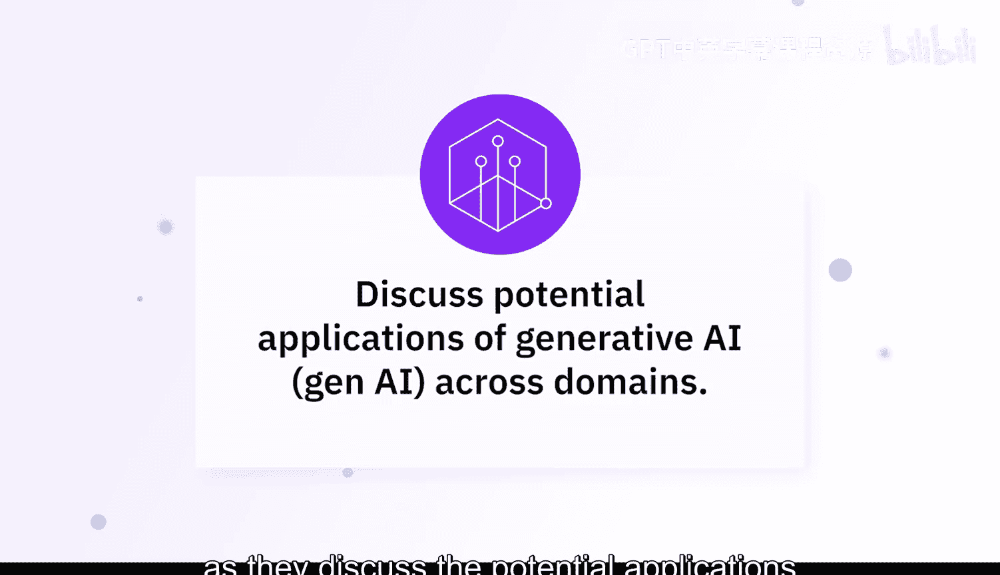
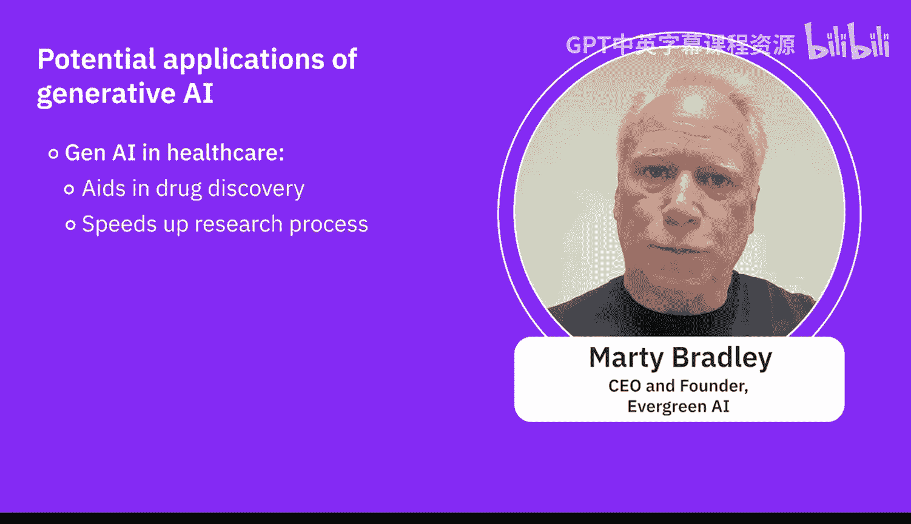
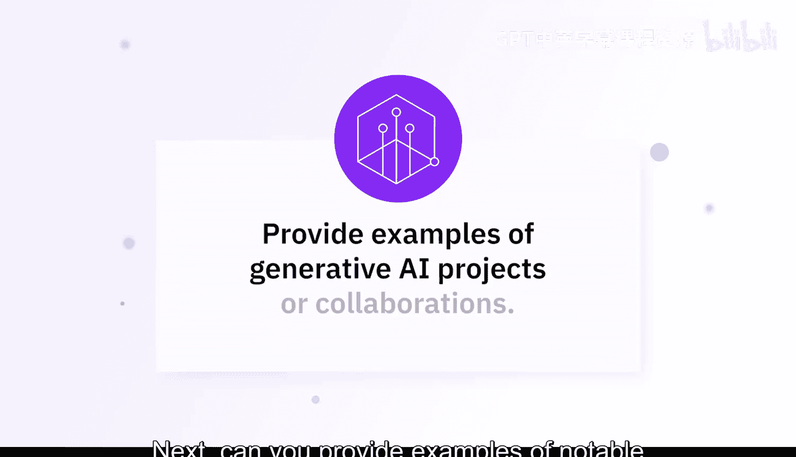
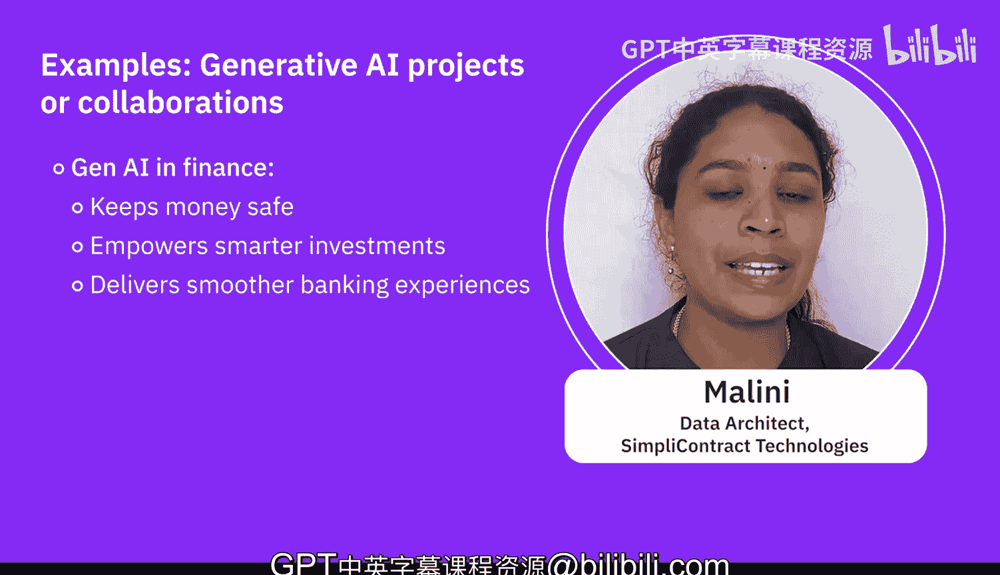

生成式AI基础：05：探索跨领域生成式AI应用 🚀




在本节课中，我们将聆听专家们的观点，共同探索生成式AI在不同行业领域的潜在应用。我们将看到，这项技术正从教育、金融到医疗等多个方面，深刻地改变着我们的工作和生活。

---

### 教育领域的应用 📚

上一节我们了解了生成式AI的广泛潜力，本节中我们来看看它在教育领域的具体应用。

在Skills Network，我们已经开始将生成式AI应用到多个环节。我们不仅开发了能够自动批改作业和测验的工具，更重要的是，它能在学习者答错时提供反馈。这得益于生成式AI的能力，我们只需设计一个简单的提示词，例如：
```
根据以下评分标准批改此作业，如果存在错误，请生成一段文字帮助学习者从错误中学习。
```
这项功能几乎无需额外成本即可实现。

此外，我们还有一个名为“TI”的个人导师，它是我们的个人教学助手。当你在实验中遇到困难、不知如何继续或收到错误信息时，只需将错误信息交给TI，它就会帮助你解决问题，无论是定位代码中的错误，还是提供修复思路。这使得学习过程更像双向对话，你可以随时提问并获得即时帮助，而无需在留言板上等待数天或数周。

更重要的是，有了这位全程陪伴的个人导师，学习者能随时获得作业的审阅和批改。这对我们来说非常实用，因为有些课程拥有成千上万甚至更多的学习者，仅凭有限数量的讲师和助教，批改如此多的作业是不可能的。生成式AI有效地填补了这一空白。

以下是生成式AI在教育中的几个关键应用点：
*   **自动化评估与反馈**：根据既定标准批改作业，并提供个性化的学习建议。
*   **个人学习助手**：即时解答学习过程中的疑问，提供代码调试帮助。
*   **规模化教学支持**：解决大规模在线课程中师资与评估资源不足的问题。

---

### 金融领域的应用 💰



了解了教育领域的变革后，我们转向金融行业，看看生成式AI如何在这里发挥作用。




生成式AI正在改变金融世界。首先，它像一名侦探，能够识别交易中的可疑活动以防止欺诈。其次，它通过分析大量市场运作数据，帮助交易员做出更明智的决策。此外，它还赋能了那些友好的在线聊天机器人，帮助客户处理咨询和交易。

像摩根大通和高盛这样的大型机构已经在使用生成式AI。摩根大通的“COIN”系统用于快速理解法律文件，节省了时间和金钱。高盛则利用它来预测市场走势，为交易员提供优势。生成式AI正在变革金融业，而这仅仅是个开始。准备好迎接一个资金更安全、投资更智能、银行体验前所未有的流畅的未来吧。

以下是生成式AI在金融中的主要应用方向：
*   **欺诈检测**：分析交易模式，实时识别和预防欺诈行为。
*   **智能投顾与市场分析**：处理海量数据，生成市场洞察和投资策略建议。
*   **自动化文档处理**：快速解析合同、报告等复杂金融文件，提取关键信息。
*   **客户服务**：驱动智能客服，高效处理客户查询和标准化交易。

---

### 医疗与生命科学领域的应用 🏥

看过了金融行业的应用，接下来我们进入一个至关重要的领域——医疗与生命科学。

生成式AI在医疗领域具有变革性潜力。它有助于药物发现，通过生成具有所需特性的分子结构，显著加速研发进程。同时，它还能协助医学影像分析，通过增强图像分辨率和检测异常来提高诊断准确性。

本课程中描述的生成式AI应用包括但不限于IT与开发运维、医疗健康、金融、人力资源、市场营销和娱乐。具体到医疗健康行业，生成式AI带来了许多进步，例如医学图像生成。通过创建合成图像数据，它使我们能够构建、训练和验证更强大的、基于医学影像的机器学习模型。它还能帮助药物发现。在制药行业，生成式AI一个流行的应用方向是生成个性化医疗方案。它被用于创建氨基酸序列、蛋白质模式和基因组模式，利用这些信息为相关症状制定个性化的医疗方案。其核心思想是，从现有数据和信息中创建新的、未知的模式，这一过程因生成式AI而变得更为容易。

以下是该领域一些著名的生成式AI项目或合作案例：
*   **DeepMind的AlphaFold**：能够根据氨基酸序列预测蛋白质的3D结构。
*   **AI赋能影像分析**：通过生成对抗网络（GANs）生成合成数据，用于构建更强大的卷积神经网络，从而更准确地检测乳腺癌，帮助医生决策，造福患者。
*   **Insilico Medicine**：利用生成式AI识别新的候选药物，加速早期发现阶段。
*   **英伟达与伦敦国王学院的合作**：使用AI模型创建合成的大脑MRI扫描图像，用于培训放射科医生，同时避免了隐私问题。

---

### 总结




本节课中，我们一起学习了生成式AI在多个核心领域的应用实践。我们看到，在教育领域，它化身个人导师与评估助手，实现个性化与规模化教学；在金融领域，它成为风控侦探与智能分析师，提升安全与效率；在医疗领域，它加速药物研发、增强影像诊断并推动个性化医疗。这些案例表明，生成式AI并非遥远的概念，而是正在持续落地、解决实际行业痛点的强大工具，其“从数据中创造新内容与模式”的核心能力，正在开启一个充满智能辅助与创新解决方案的未来。