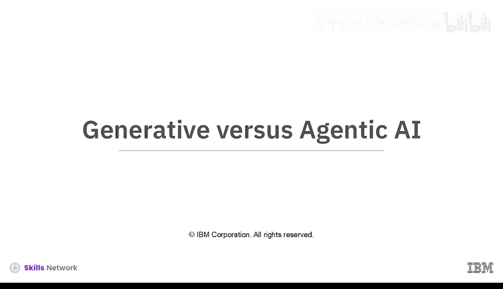
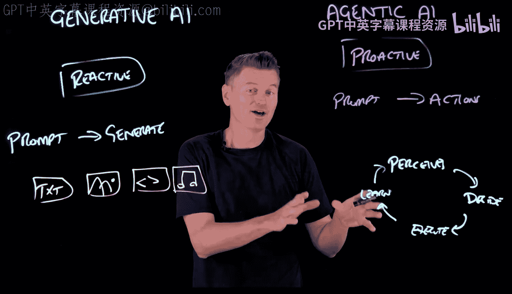
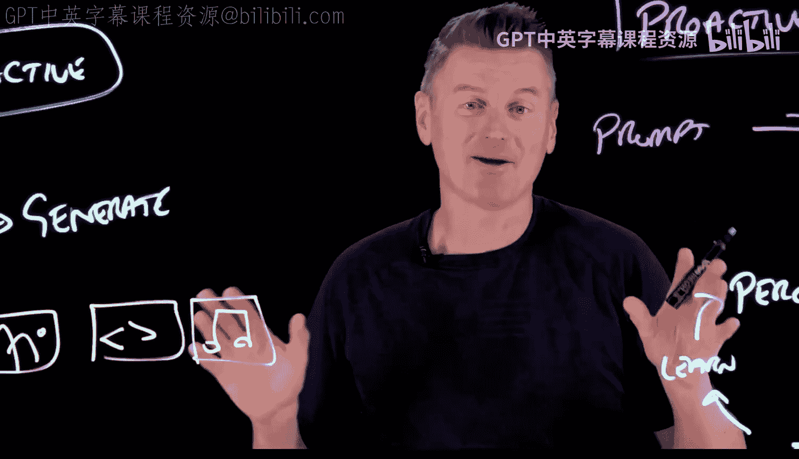
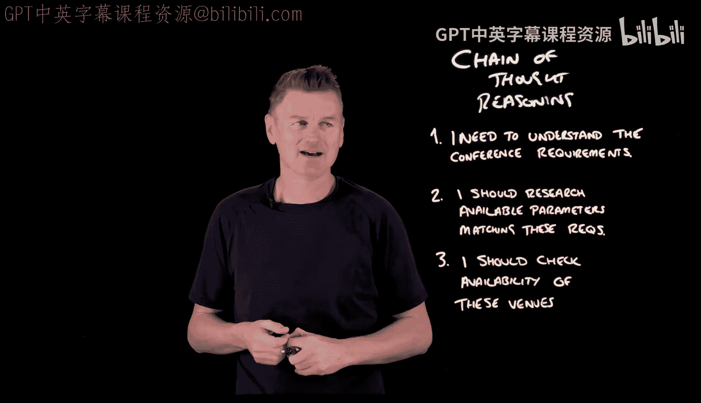

# 016：生成式AI与代理式AI对比 🧠

在本节课中，我们将要学习生成式人工智能与代理式人工智能的核心区别。我们将探讨它们各自的工作原理、应用场景以及它们如何共同构建更强大的未来AI系统。

## 概述

生成式AI与代理式AI是人工智能领域的两种不同方法。生成式AI是我们熟悉的聊天机器人、图像生成器等，它们本质上是**反应式**系统。代理式AI则不同，它们是**主动式**系统，能够自主规划并执行一系列动作以实现目标。

## 生成式AI：反应式的内容创造者

上一节我们介绍了两种AI的基本概念，本节中我们来看看生成式AI的具体特点。

生成式AI系统等待用户的指令（即提示词），然后基于其训练所学到的模式，生成相应的内容。它的核心工作是**预测**，根据给定的输入，计算出最可能出现的下一个词、像素或音符。

以下是生成式AI的关键特征：
*   **反应式**：需要用户输入提示词才能启动。
*   **内容生成**：其输出是文本、图像、代码或音频等内容。
*   **模式匹配**：本质上是复杂的模式匹配机器，学习了海量数据中的统计关系。
*   **任务终点**：生成内容后，其工作便告结束，不会主动采取进一步行动。

其工作流程可以概括为：**用户提示 (Prompt) -> AI生成 (Generate) -> 输出内容 (Output)**。

## 代理式AI：主动的目标达成者

了解了生成式AI的被动性后，我们再来看看代理式AI的主动性。

代理式AI系统同样是基于用户提示开始工作，但它的目标不是生成单一内容，而是利用这个提示去**规划和执行一系列动作**，以达成某个目标。它能以最小化的人工干预，自主运行一个完整的生命周期。

以下是代理式AI的工作周期：
1.  **感知**：感知其环境或接收输入信息。
2.  **决策**：基于感知，决定下一步要采取的行动。
3.  **执行**：执行所决定的行动。
4.  **学习**：从行动的结果中学习，并循环此过程。

## 共同的基础与不同的应用

尽管路径不同，但生成式AI和代理式AI通常共享一个共同的技术基础：**大语言模型**。

*   对于聊天机器人这类生成式AI，LLM是其核心“大脑”。
*   对于代理式AI，LLM则充当其“推理引擎”，提供规划和思考的能力。

在深入技术细节之前，让我们通过一些现实世界的应用案例来更直观地理解它们的区别。

### 生成式AI的应用：人类主导的创作助手

生成式AI擅长在需要人类创意指导和最终裁决的场景中充当助手。

例如，一个视频创作者可以使用生成式AI来审阅脚本草稿、建议缩略图概念，甚至生成背景音乐。然而，在每一步中，**人类创作者**都在审查和提炼AI生成的内容。AI负责生成可能性，而人类负责策展和最终决策。

### 代理式AI的应用：自主的多步骤管理器

代理式AI则在需要持续管理和多步骤流程的场景中表现出色。

设想一个个人购物代理。当你给出“购买某产品”的指令后，它会主动执行以下步骤：跨平台搜索商品库存、监控价格波动、处理结账流程，甚至协调物流配送。它只在必要时（如确认支付或收货地址）才向你寻求输入，其余时间自主工作。

## 背后的引擎：思维链推理

那么，代理式AI是如何实现这种复杂决策的呢？答案在于利用生成式AI（特别是LLM）的推理能力，即**思维链**推理。

这是一种让AI将复杂任务分解为更小、更逻辑化步骤的过程，类似于人类解决难题的方式。LLM非常擅长此道。

例如，一个负责组织会议的代理AI，可能会利用GenAI生成这样的内部对话来进行规划：
> “首先，我需要理解会议的规模、会期和预算等要求。然后，我应该研究符合这些参数的可用场地。接着，对于符合条件的场地，我需要核查其 availability...”

通过这种自我对话，代理AI在采取行动前探索了问题空间。在这里，生成式AI充当了驱动代理决策的**认知引擎**。

## 展望未来：智能协作体

展望未来，最强大的AI系统可能既非纯粹的生成式，也非纯粹的代理式，而是**智能协作体**。

它们将理解何时需要通过生成来探索各种选项，何时需要通过代理行动来执行确定方案。就像一个智能助手，它知道何时该为我生成同人小说的下一章，以便在我完成视频拍摄后就能审阅。

## 总结

本节课中我们一起学习了生成式AI与代理式AI的核心区别。生成式AI是**反应式的内容生成器**，专注于根据提示创造新内容。代理式AI是**主动的目标达成者**，能够规划并执行一系列动作以完成任务。两者常以**大语言模型**为基础，但应用方式不同。未来的趋势是二者融合，形成能够自主决策与创造性协作的智能系统。