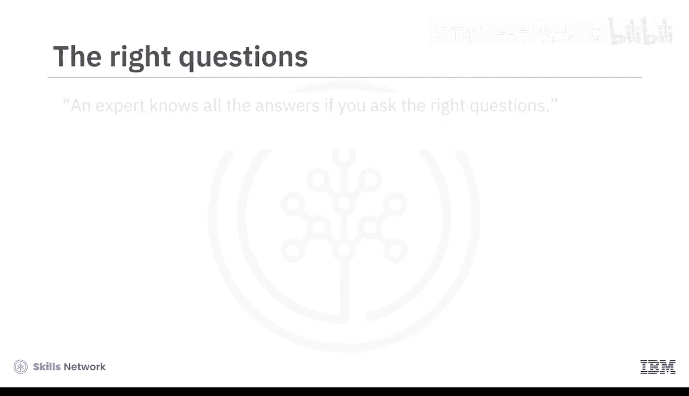
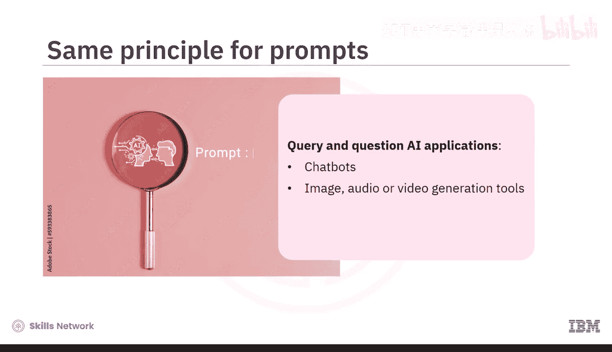
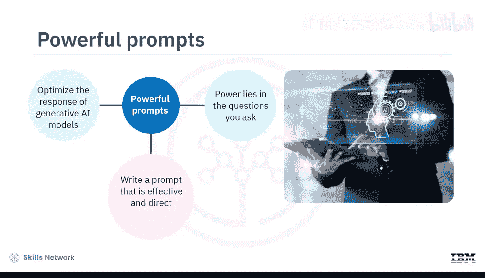
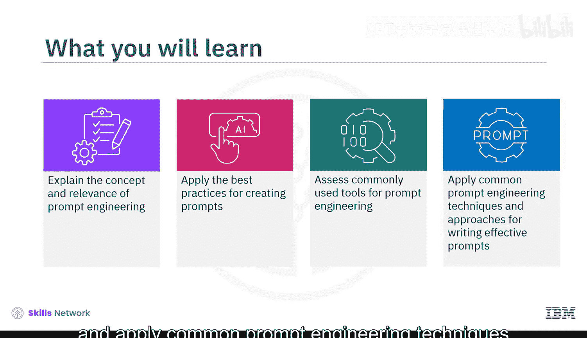
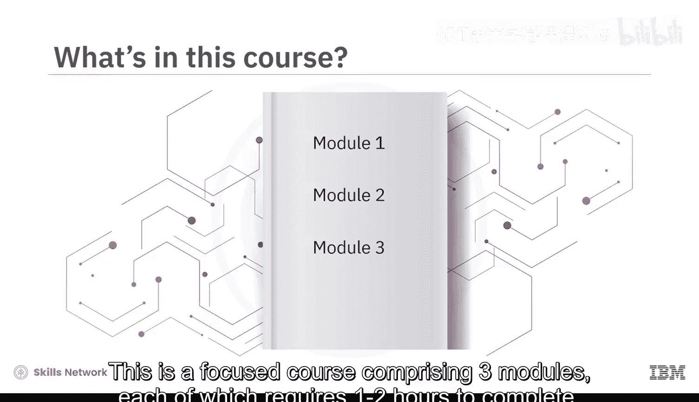
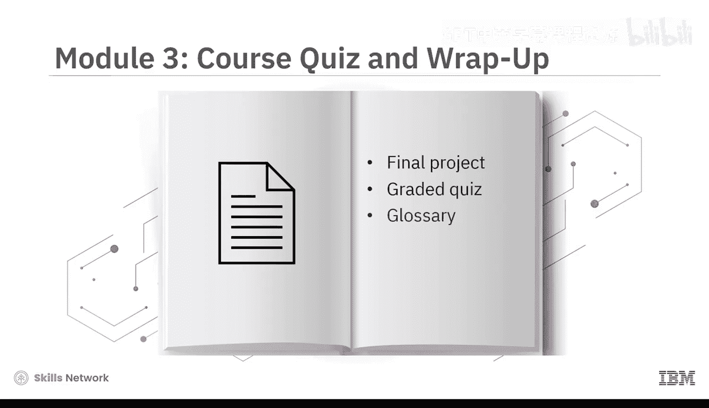
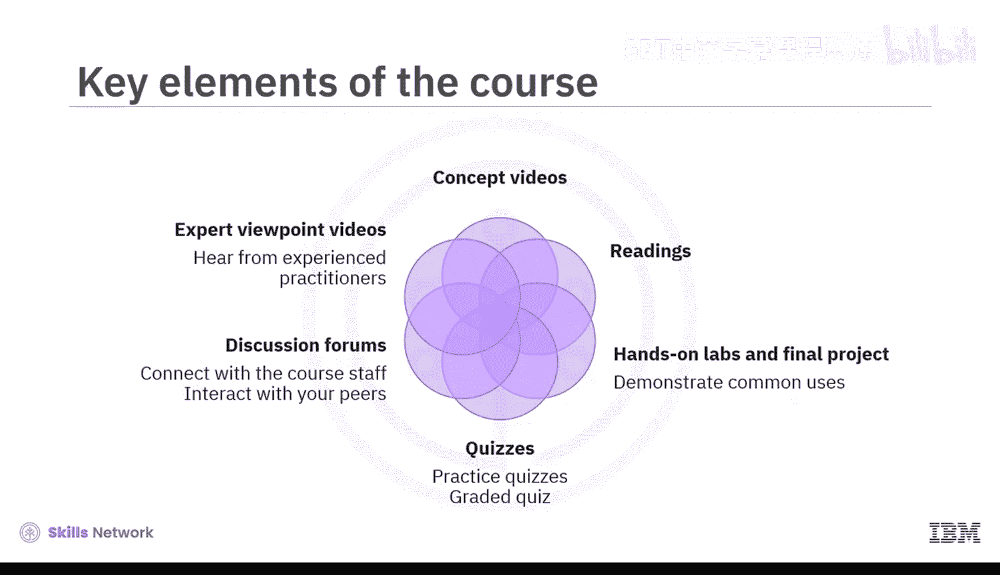
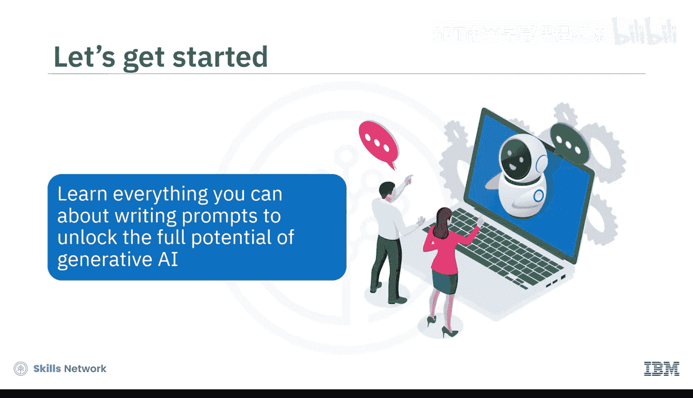

# 017：课程介绍与提示工程入门 🚀

在本节课中，我们将要学习提示工程的基础概念，了解如何通过设计有效的问题来引导生成式AI模型，从而获得更精确、更相关的输出。课程面向所有初学者，无论背景如何，旨在帮助大家掌握与AI高效对话的核心技能。

## 概述

专家之所以能给出所有答案，关键在于你提出了正确的问题。有趣的是，这正是我们为生成式AI模型设计提示时所遵循的原则。我们使用提示来查询和提问AI应用，例如聊天机器人、图像、音频或视频生成工具，甚至虚拟世界。提示能够优化生成式AI模型的响应。其力量在于你所提出的问题——知道如何撰写一个有效且直接的提示，将使你能够生成更精确、更相关的内容。

学完本课程后，你将能够：
*   解释提示工程的概念及其在生成式AI模型中的重要性。
*   应用创建提示的最佳实践。
*   评估常用的提示工程工具。
*   应用常见的提示工程技术和方法来撰写有效的提示。

## 课程结构 📚

这是一个聚焦的课程，包含三个模块，每个模块需要一到两个小时完成。

上一节我们介绍了课程的整体目标，本节中我们来看看具体的课程安排。

以下是三个模块的主要内容：

1.  **模块一：提示工程基础**
    *   你将学习提示工程的概念，从如何定义提示及其构成元素开始。
    *   你将学习应用撰写有效提示的最佳实践。
    *   你将评估常见的提示工程工具，例如IBM Watson X Prompt Lab、Spellbook和Dust。

2.  **模块二：提示工程方法与技巧**
    *   你将学习各种提示工程方法，如访谈模式、思维链和思维树。
    *   你将发现巧妙设计提示的技巧，例如零样本和少样本提示，以产生精确且相关的响应。

3.  **模块三：实践与评估**
    *   本模块邀请你参与一个最终项目，并提供一个分级测验来检验你对课程概念的理解。
    *   你还可以访问课程术语表，并获得关于后续学习路径的指导。

## 学习资源与活动 🛠️

课程精心编排了概念视频和辅助阅读材料。观看所有视频以充分掌握学习材料的潜力。

以下是课程中包含的主要学习活动：

*   **实践实验室与最终项目**：你将享受动手实验和一个最终项目，该项目演示了如何在IBM生成式AI教室中通过创建有效提示来优化结果。
*   **练习与分级测验**：课程包含练习测验以帮助你巩固学习。在课程结束时，你还需要完成一个分级测验。
*   **讨论论坛**：课程提供讨论论坛，方便你与课程工作人员联系并与同伴互动。
*   **专家观点视频**：最有趣的是，通过专家观点视频，你将听到经验丰富的从业者分享他们对提示工程中使用的工具、方法以及撰写有效提示的艺术的见解。

## 总结

本节课中我们一起学习了提示工程的核心价值——通过提出正确的问题来释放生成式AI的全部潜力。我们概述了课程目标、结构以及丰富的学习资源。准备好学习关于撰写提示的一切，以解锁生成式AI的全部潜力了吗？让我们开始吧。