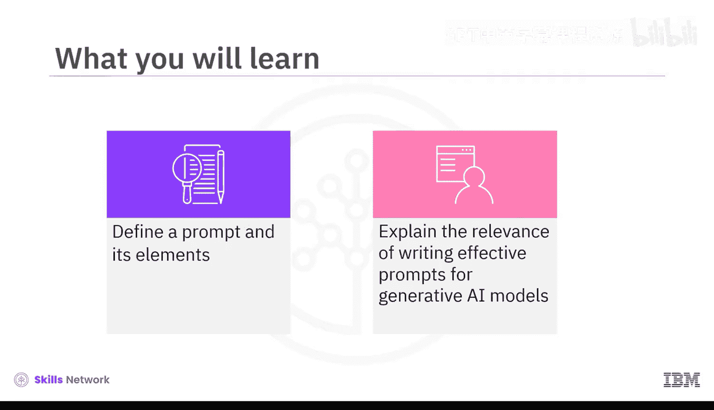
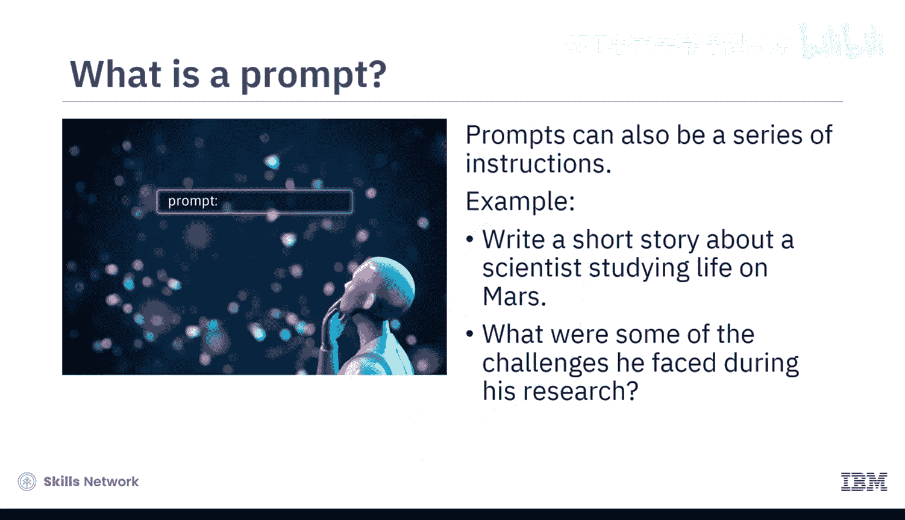
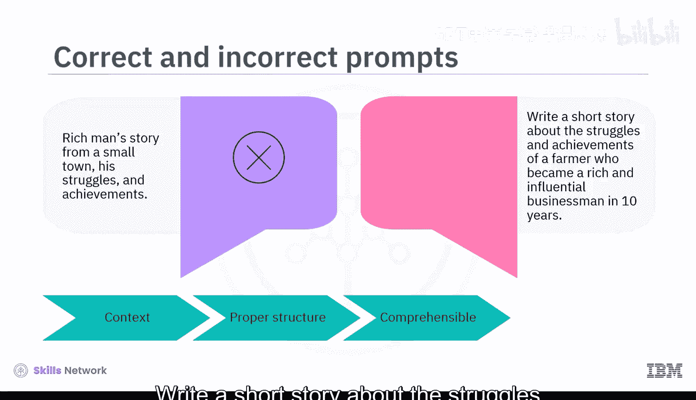
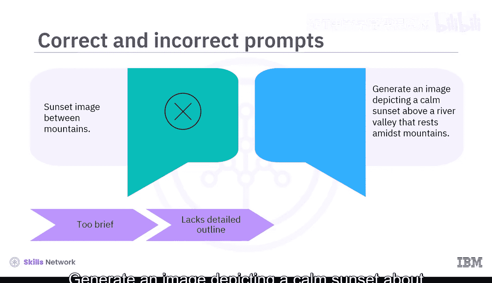

生成式AI基础：01：什么是提示词 🧠

在本节课中，我们将要学习生成式AI中的一个核心概念：提示词。我们将定义提示词及其构成要素，并解释为何编写有效的提示词对于引导AI模型产生期望结果至关重要。

生成式AI模型的一项显著能力是其输出与人类创作的内容高度相似：相关、有上下文、富有想象力、细致入微且语言准确。而生成这种输出的关键因素之一，就是提示词。

那么，什么是提示词？提示词是您提供给生成式模型的任何输入，用以产生期望的输出。您可以将其视为给模型的指令。例如：
*   `写一小段文字描述你最喜欢的度假胜地。`
*   `编写HTML代码，为在线表单生成一个城市下拉选择框。`

这些都是用于产生特定输出的直接提示。提示词也可以是一系列逐步细化输出的指令，以达到理想结果。例如：
*   `写一个关于一位研究火星生命的科学家的短篇故事。他在研究期间面临了哪些挑战？`

通过这些例子可以清楚地看到，提示词包含问题、上下文文本、引导模式或示例，以及基于这些以自然语言形式提交的请求，为模型提供的部分输入。生成式AI模型收集信息、进行推断并提供创造性的解决方案。这些指令帮助模型基于提供的输入，产生相关且合乎逻辑的回应或输出。

让我们看更多例子来更好地理解这一点。

假设您希望模型写一个关于一位农民在10年内成为成功商人的奋斗与成就的短篇故事。如果您的提示词是“一个小镇富人的故事，他的奋斗与成就”，模型将产生一个通用的输出。这就是我们所说的**朴素提示**，即以最简单的方式向模型提问。

为了向模型准确传达您的意图，您可以进行简单的调整，从而显著改善结果。您的提示词必须具备清晰的上下文、恰当的结构并且易于理解。

因此，您可以将提示词重写为：
`写一个关于一位农民在10年内成为富有且有影响力的商人的奋斗与成就的短篇故事。`

再看另一个例子，您希望模型生成您想象中的日落风景图像。将提示词写为“山间的日落图像”可能无法得到期望的输出。这个提示词过于简短，缺乏对您脑海中图像的详细描述。

您可以将其重写为：
`生成一幅描绘宁静日落的图像，场景是坐落在群山之间的河谷。`

要掌握编写有效提示词的艺术，让我们逐一理解一个结构良好的提示词的构建模块。

以下是构建有效提示词的四个核心要素：

**指令**
为模型提供关于您希望执行任务的明确指导，引导生成式AI模型的行为，以影响其回应的形成。例如：`写一篇600字的文章，分析全球变暖对海洋生物的影响。`

**上下文**
上下文有助于建立指令所处的环境背景，并为生成相关内容提供一个框架。为了理解这一点，让我们为上一个例子中的提示词添加一些上下文：
`近几十年来，全球变暖经历了显著变化，导致海平面上升、风暴强度增加以及天气模式改变。这些变化对海洋生物产生了严重影响。写一篇600字的文章，分析全球变暖对海洋生物的影响。`
这个提示词将帮助模型生成与上下文一致的内容。

**输入数据**
输入数据是您作为提示词一部分提供的任何信息片段。这可以作为生成式模型的参考，以获得包含特定细节或想法的回应。为了提供输入数据，同样的提示词可以重构如下：
`您已获得一个包含太平洋温度记录和海平面测量值的数据集。写一篇600字的文章，分析全球变暖对太平洋海洋生物的影响。`

**输出指示器**
输出指示器为评估模型生成输出的属性提供了基准。它可以在提示词中概述您期望输出应具备的语气、风格、长度和其他品质。在提示词`写一篇600字的文章，分析全球变暖对海洋生物的影响`中，输出指示器明确了生成的输出应是一篇600字的文章。它将根据分析的清晰度以及相关数据或案例研究的整合程度来评估。

这些要素中的每一个都在帮助生成式AI模型理解您的需求并给出期望输出方面发挥着作用。

本节课中，我们一起学习了提示词是您提供给生成式模型以产生期望输出的任何输入或一系列指令。这些指令有助于引导模型的创造力，并协助产生相关且合乎逻辑的回应。一个结构良好的提示词的构建模块包括指令、上下文、输入数据和输出指示器。这些要素帮助模型理解我们的需求并生成相关的回应。