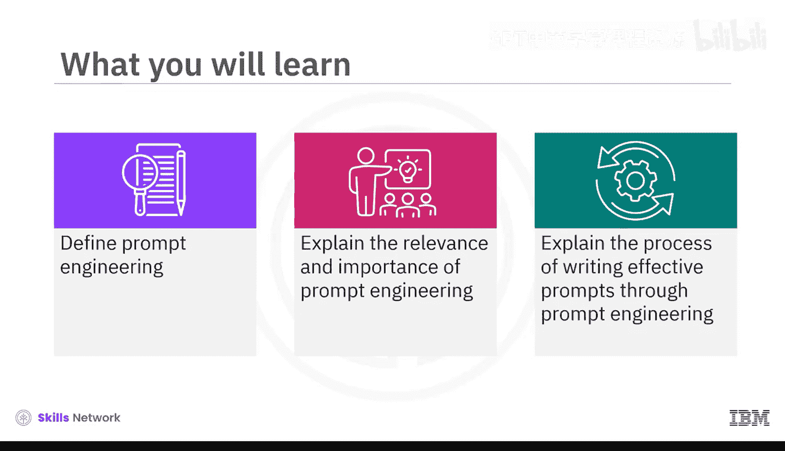
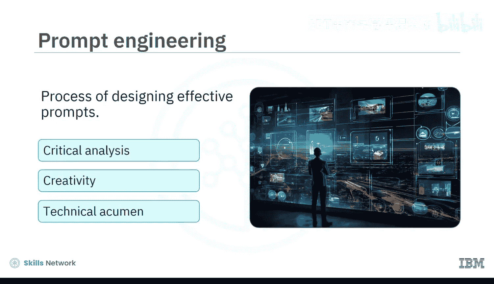
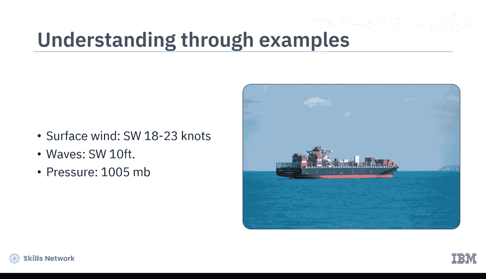
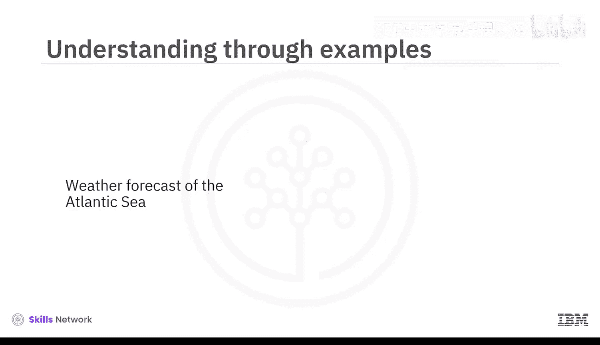
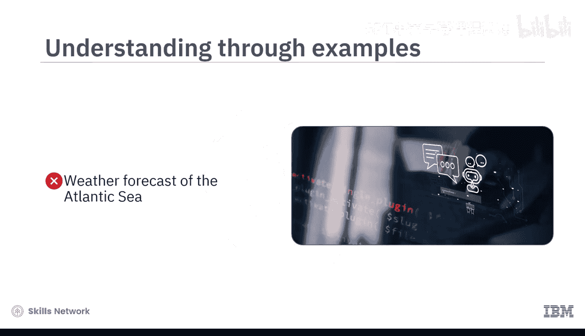
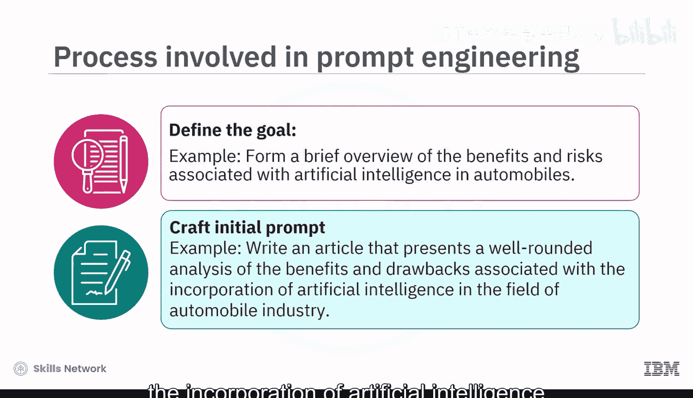
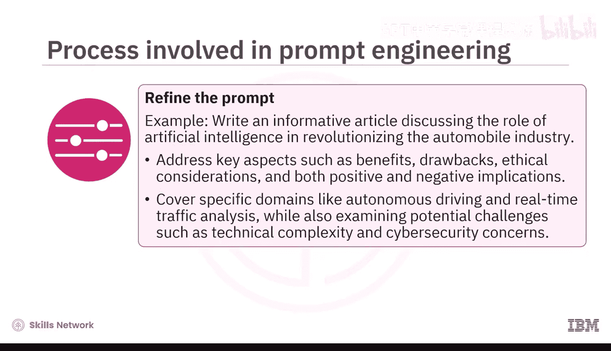
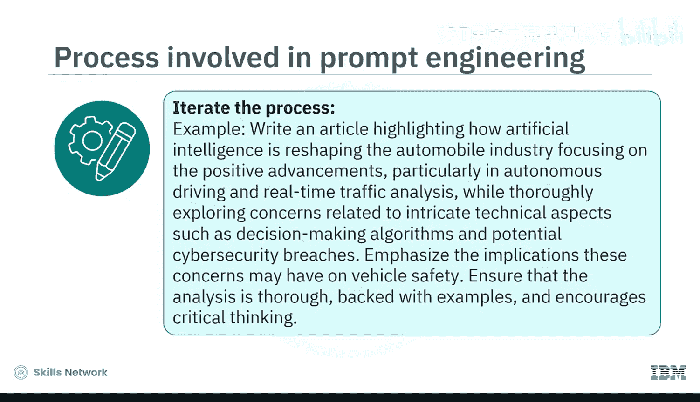
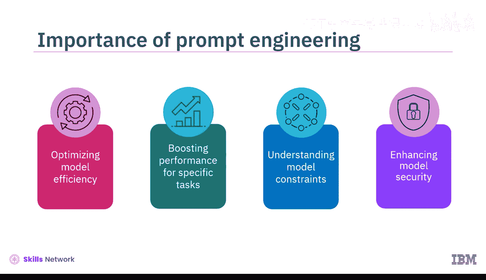

生成式AI基础：03：什么是提示词工程 🎯

在本节课中，我们将要学习提示词工程的核心概念。我们将定义什么是提示词工程，解释其在生成式AI模型中的相关性与重要性，并详细阐述通过提示词工程来制定有效提示词的过程，以引导模型产生相关回应。

提示词工程是指设计有效提示词以生成更优质、更符合期望的回应过程。

尽管生成式AI模型有潜力辅助人类创造力，但如果未能提供精确的提示词，这些模型可能会产生不充分的结果，甚至是虚假和误导性的信息。提示词工程融合了批判性分析、创造力和技术敏锐度。它不仅仅局限于提出正确的问题，还包括在正确的语境下构建问题，提供正确的信息，并明确表达对期望结果的预期，以引出最恰当的回应。

让我们通过一个例子来理解这一点。一艘船正在大西洋航行。为了规划航程，船长需要知道特定地点在特定时间的天气预报。在这种情况下，向模型提供一个简单的提示词，例如“大西洋的天气预报”，可能无法获得期望的结果。为了获得最准确的结果，船长需要“设计”提示词。

在设计提示词时，船长需要定义语境，包含诸如天气预报的目标位置（经纬度）和预测的时间范围等细节。例如：
> 一艘船的船长正计划在大西洋进行一次战略航行。为了帮助船长有效导航，请提供2023年8月28日至9月1日未来一周的天气预报。目标位置的坐标在北纬20度至30度，西经40度至20度之间。

船长还必须指明是否需要特定的输出，例如模型是否应返回可能影响航程的其他天气要素信息。例如：
> 为了帮助规划大西洋的有效航行，请提供关于指定时间段和地点内，预期风型、浪高、降水概率、云量以及任何可能影响航程的潜在风暴的详细信息。

重要的是要认识到，提示词工程是一个结构化的迭代过程，涉及优化提示词并尝试可能影响模型输出的各种因素。

接下来，让我们了解通过提示词工程创建有效提示词所涉及的逐步过程。

以下是创建有效提示词的步骤：

1.  **定义目标**：该过程的第一步是建立一个明确的目标。你必须确切知道希望模型生成什么。例如，目标是“形成一份关于人工智能与汽车相关的益处和风险的简要概述”。
2.  **创建初始提示词**：明确了目标后，现在可以创建初始提示词。根据目标，这可能表现为一个问题、一个指令甚至一个情境。例如：“撰写一篇文章，全面分析人工智能融入汽车领域相关的益处和弊端。”
3.  **测试提示词**：现在应该测试并分析你所创建提示词的回应。虽然回应可能相关，但可能缺乏你所追求的独特视角。例如，对初始提示词的回应直接列出了人工智能融入汽车行业的益处和弊端，但没有强调可能出现的伦理问题，也没有讨论其正面和负面影响。
4.  **分析回应**：你必须仔细审查回应，检查其是否符合你的目标。如果不符合，请记下不足之处。例如，所使用的初始提示词未能涵盖人工智能在汽车行业中相关益处和风险的全面范围。
5.  **优化提示词**：利用通过测试和分析获得的知识，现在可以修改提示词。这可能包括增强其特异性、加入额外语境或重新措辞。初始提示词可以优化如下：“撰写一篇信息性文章，讨论人工智能在革新汽车行业中的作用。阐述关键方面，如益处、弊端、伦理考量以及自动驾驶和实时交通分析等特定领域的正面和负面影响，同时审视技术复杂性和网络安全担忧等潜在挑战。”
6.  **迭代过程**：重复最后三个步骤（测试、分析、优化），直到你对回应感到满意。因此，经过几轮优化后，最终的提示词可能呈现为这种形式：“撰写一篇文章，重点介绍人工智能如何重塑汽车行业，聚焦于自动驾驶和实时交通分析等方面的积极进展，同时深入探讨与复杂技术方面（如决策算法）和潜在网络安全漏洞相关的担忧。强调这些担忧可能对车辆安全产生的影响。确保分析透彻、有实例支持并鼓励批判性思考。”

现在，让我们总结一下提示词工程在生成式AI模型中的重要性和相关性。

提示词工程的重要性体现在以下几个方面：

*   **优化模型效率**：提示词工程有助于设计智能提示词，使用户能够充分利用这些模型的能力，而无需进行大量重新训练。
*   **提升特定任务性能**：提示词工程使生成式AI模型能够提供细致入微且具有上下文的回应，使其对特定任务更加有效。
*   **理解模型限制**：通过每次迭代优化提示词并研究模型的相应回应，可以帮助我们理解其优势和弱点。这些知识可以进一步指导未来的功能增强或模型的完整开发。
*   **增强模型安全性**：熟练的提示词工程可以防止因提示词设计不当而导致有害内容生成的问题，从而增强模型的安全使用。

本节课中，我们一起学习了提示词工程是设计有效提示词以充分利用生成式AI模型能力、产生最佳回应的过程。我们还学习了通过提示词工程优化提示词的流程。最后，我们探讨了提示词工程在优化模型效率、提升性能、理解模型限制以及增强安全性方面的重要性。