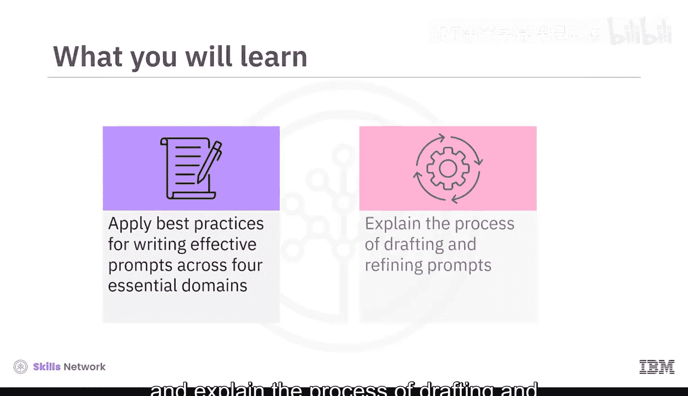
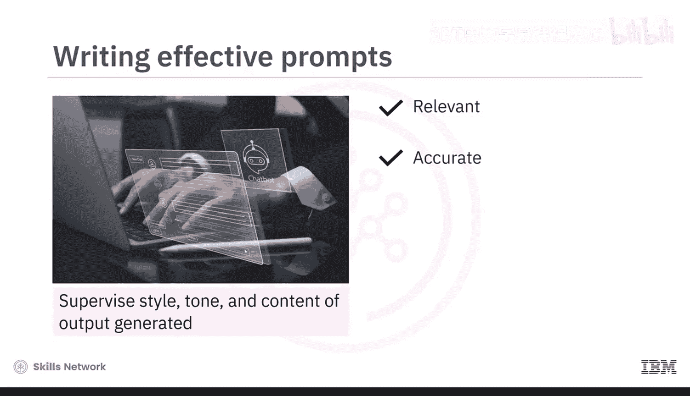
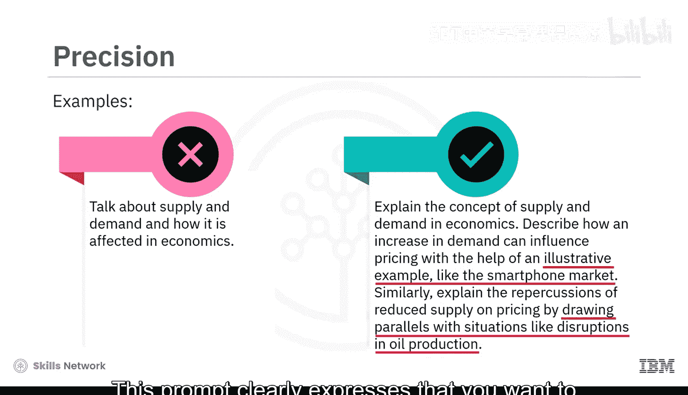
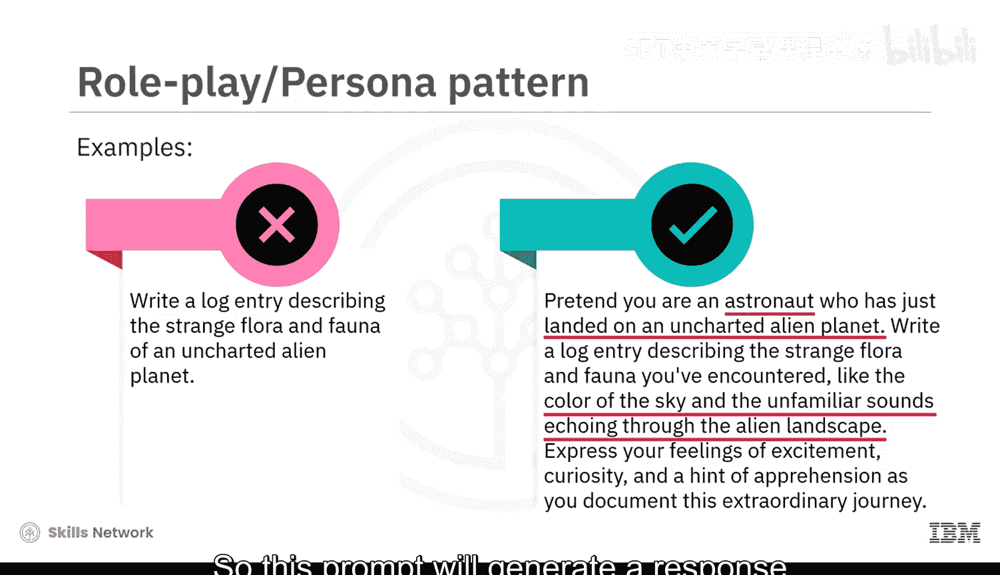

# 020：提示词创建最佳实践 🎯

在本节课中，我们将学习如何为生成式AI模型创建有效的提示词。通过掌握最佳实践，你可以更好地引导模型生成符合你期望的风格、语气和内容的回答。

---

## 概述：什么是有效的提示词？

撰写有效的提示词对于充分发挥生成式AI模型的潜力至关重要。通过应用最佳实践，你可以监督模型输出的风格、语气和内容。创建有效提示词的最佳实践主要围绕四个核心维度展开：**清晰度**、**上下文**、**精确度**和**角色扮演**。

上一节我们介绍了有效提示词的重要性，本节中我们将逐一深入探讨这四个维度。

---

## 清晰度：让指令简单明了

清晰度要求你的提示词易于理解，没有歧义。以下是实现清晰度的关键点：

*   **使用简单直接的语言**：简单的语言能更轻松地传达指令。
*   **避免专业术语**：复杂的术语可能会让模型或用户感到困惑。
*   **明确任务描述**：模糊的提示词可能导致回答偏离你的意图。

让我们通过一个例子来理解。考虑以下提示词：
> “讨论在植物完全展开的托叶上借助阳光发生的烹饪过程。同时提及一个绿色物质，以及光、空气和水对植物地上部分的重要性。”

这个提示词存在多处问题：
1.  它没有明确提及想要讨论的过程（光合作用）。
2.  使用了“完全展开的托叶”等复杂术语。
3.  描述模糊，任务不清晰。

为了确保清晰度，我们可以将其重写为：
> “解释植物光合作用的过程，详细说明叶绿素的作用，以及阳光、二氧化碳和水如何参与这一生物功能。”

修改后的提示词使用了**简单、清晰、简洁的语言**，并**明确声明**了要讨论的主题。

---

## 上下文：提供背景信息

上下文帮助模型理解情境或主题。这包括提供简短的介绍、解释相关情况，或融入人物、地点、事件等具体细节。

例如，提示词“写下1775年革命战争爆发期间发生了什么”缺乏足够的背景和具体细节来引导模型的理解。

为了建立正确的上下文并包含相关信息，我们可以将其重写为：
> “描述导致美国革命战争的历史事件，重点关注波士顿倾茶事件、萨拉托加战役等关键事件。强调美洲殖民地与英国政府之间的紧张关系，并解释这些事件如何导致1775年革命战争的爆发。”

---

## 精确度：明确你的要求

精确度有助于在提示词中勾勒出你的具体请求。如果你在寻找特定类型的回答，请清晰地表达出来。在提示词中**融入示例**可以帮助模型理解你期望的回答类型，并引导其思考过程。

例如，提示词“谈谈经济学中的供求关系及其影响”没有精确地勾勒出特定的回答类型，也没有提供示例。

为了确保精确度，我们可以将其重写为：
> “解释经济学中的供求概念。描述需求增加如何影响价格，并借助一个说明性示例（如智能手机市场）进行阐述。同样，通过类比石油生产中断等情况，解释供应减少对定价的影响。”

这个提示词**清晰地表达**了需要借助示例来解释概念。

---

## 角色扮演：从特定视角出发

从特定角色或人物视角撰写的提示词，可以帮助模型生成与该视角一致的回答。提供必要的上下文细节能使模型有效地扮演特定角色。

例如，提示词“写一篇日志，描述一个未知外星星球上奇特的动植物。”只会给出关于外星星球的科学细节，而不会从专业人士的视角进行解释。

你可以将提示词重写为：
> “假设你是一名刚刚登陆未知外星星球的宇航员。写一篇日志，描述你遇到的奇特动植物，例如天空的颜色和回荡在异星景观中的陌生声音。表达你记录这段非凡旅程时的兴奋、好奇以及一丝忧虑。”

在这个例子中，你**明确提供了上下文细节**，并**假设自己是一名宇航员**。因此，这个提示词将生成与宇航员视角一致的回答。

---

## 总结

本节课中，我们一起学习了为生成式AI模型撰写有效提示词的最佳实践。我们了解到，这主要围绕四个维度展开：

*   **清晰度**：使用简单、无歧义的语言。
*   **上下文**：提供背景和所需细节。
*   **精确度**：具体明确，并提供示例。
*   **角色扮演**：通过假设人物角色并提供相关上下文来增强回答。

掌握这些实践方法，并根据具体需求进行调整，你将能更有效地引导生成式AI模型，获得更优的结果。