生成式AI基础：05：常见提示词工程工具 🛠️

在本节课中，我们将要学习提示词工程工具的常见功能，并介绍几款常用的工具。提示词工程是设计精确且符合语境的提示词，以与生成式AI模型交互，从而生成相关且准确输出的过程。为了辅助这一过程，市面上有多种提示词工程工具可供选择。

这些工具提供了丰富的功能和特性，旨在优化提示词的创建，以实现期望的结果。它们对于可能不精通自然语言处理技术，但又希望在使用生成式AI模型时获得特定结果的用户尤为有用。

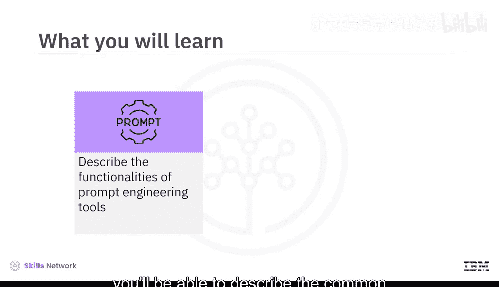

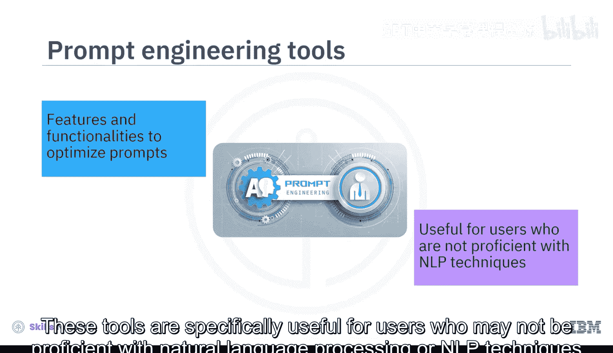

接下来，我们首先来探索这些工具普遍提供的核心功能。

### 常见功能概览

以下是提示词工程工具通常具备的一些关键功能：

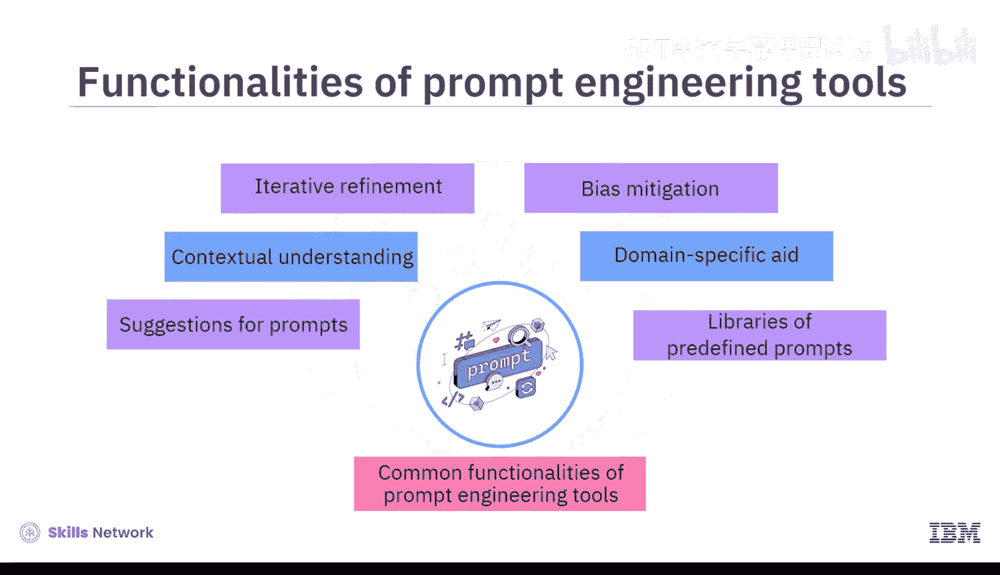

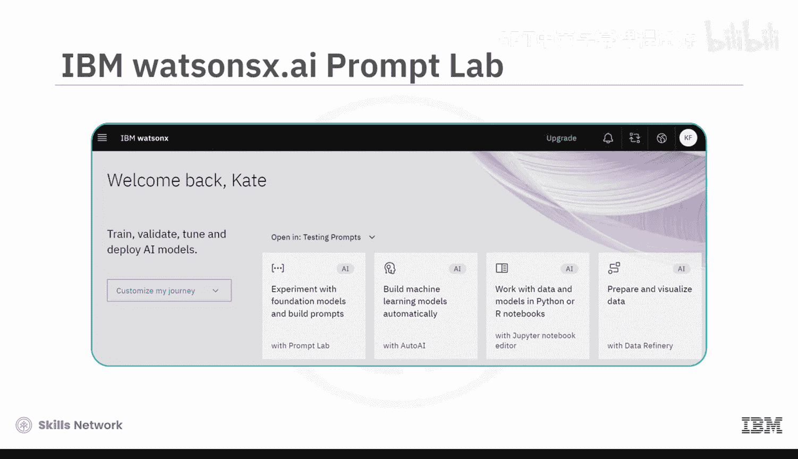

*   **提示词建议**：根据给定的输入或期望的输出，提供提示词建议。
*   **结构优化**：建议如何构建提示词，以实现更好的语境沟通。它们帮助精心设计能够为模型提供必要上下文、以理解用户意图的提示词。
*   **迭代优化**：可以根据工具的初始响应，迭代地优化提示词，以找到最有效的版本。
*   **偏见缓解**：提供功能来帮助减轻生成式AI模型响应中的偏见。它们可以指导如何设计提示词，以减少偏见或不恰当输出的可能性。
*   **领域特定支持**：帮助创建针对特定领域（如法律、医疗或技术）的提示词。
*   **预定义提示库**：提供针对各种用例的预定义提示词库，这些提示词可以根据具体需求进行定制。

了解了核心功能后，接下来让我们具体看看几款常见的提示词工程工具。

### 常见工具介绍

**1. IBM Watsonx.ai Prompt Lab**
IBM Watsonx.ai 是一个集成的平台，用于轻松地训练、调优、部署和管理基础模型。该平台包含 **Prompt Lab** 工具，使用户能够基于不同的基础模型试验提示词，并根据自身需求构建提示词。为帮助您入门，Prompt Lab 为不同用例（包括摘要、生成和提取）提供了示例提示词。要创建符合您特定需求的提示词，您可以通过添加指令和示例来训练模型，向模型展示如何响应输入。

**2. Spellbook (Scale AI)**
Spellbook 是 Scale AI 提供的一个集成开发环境。通过 Spellbook，您可以基于大型语言模型构建应用程序，并为各种用例（包括文本生成、文本提取、分类、问答、自动补全和摘要）试验提示词。在提示词工程方面，Spellbook 包含一个提示词编辑器，供您编辑和测试提示词。您可以使用提示词模板来利用结构化提示词生成文本，也可以访问预构建的提示词作为示例。

**3. Dust**
Dust 提供了一个用于编写提示词并将其链接在一起的 Web 用户界面。您可以管理链式提示词的不同版本。它还提供了一种自定义编码语言和一组标准模块，用于处理 LLM 提供的输出。Dust 也支持集成其他模型和服务。

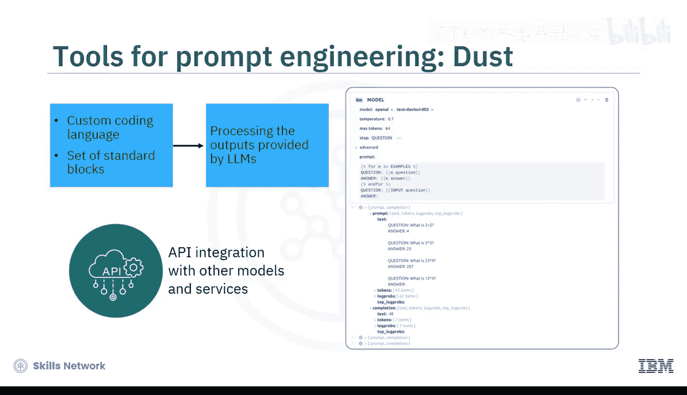

**4. PromptPerfect**
这是一款用于高效提示词工程的工具，可用于为不同的 LLM 或文生图模型优化提示词。它支持常见的文本模型（如 GPT、Claude、Stable LM 和 LLaMA）和图像模型（如 DALL-E 和 Stable Diffusion）。要编写或优化提示词，您首先需要选择要为其优化提示词的相关模型，不同模型有不同的优化策略。您还可以选择与预览质量、语言和审核相关的附加功能。在编写提示词时，您可以尝试自动补全功能，该功能会在您键入时提供建议。您可以进一步优化已编写的提示词。例如，工具可以展示用户编写的原始提示词和由 PromptPerfect 生成的相应优化后提示词。为了更进一步的优化，您可以在流线模式下逐步优化和完善提示词：编写提示词 -> 优化 -> 再次编辑提示词 -> 优化，直到您对输出满意为止。

除了上述专门工具，还有一些其他流行的平台和接口也提供了提示词工程资源或帮助您试验提示词。

**其他资源与平台**

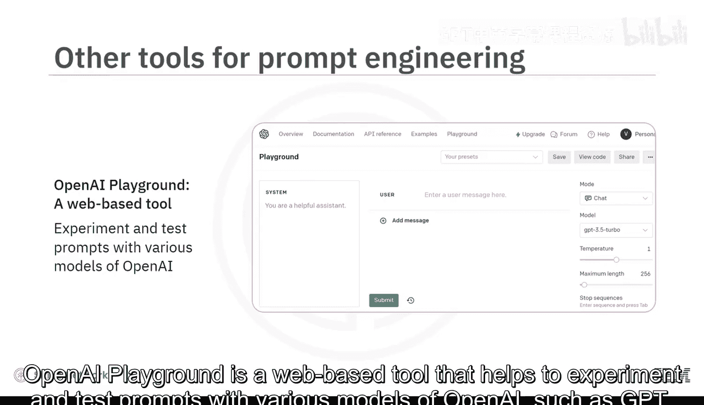

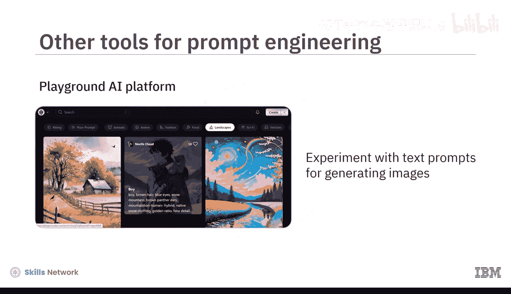

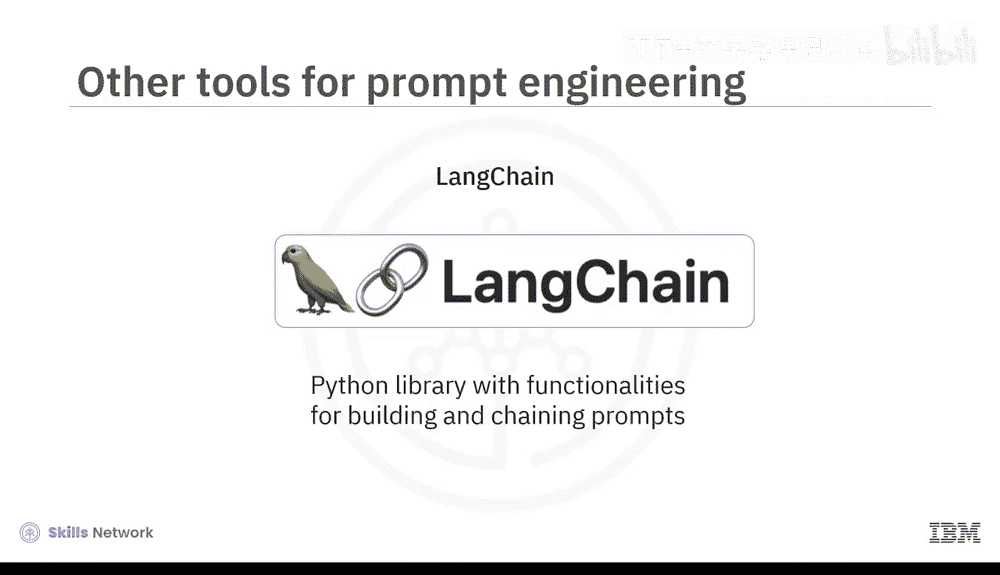

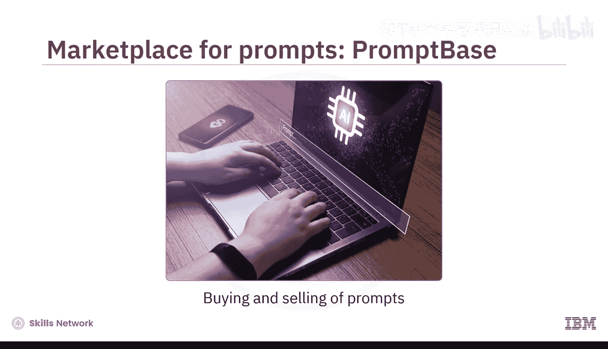

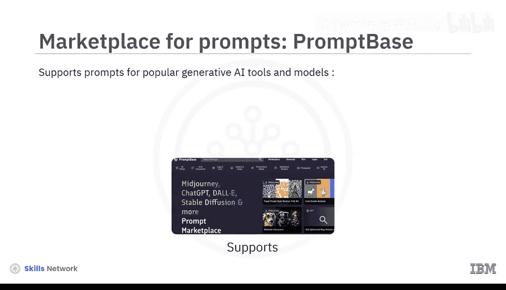

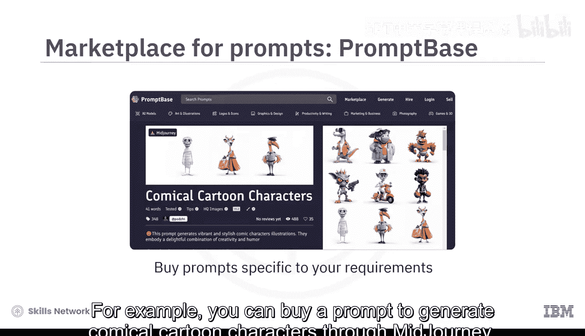

*   **GitHub**：提供了大量关于提示词工程和 LLM 的代码仓库。这些仓库中的指南、示例和工具有助于提升提示词工程技能。
*   **OpenAI Playground**：一个基于 Web 的工具，帮助您使用 OpenAI 的各种模型（如 GPT 系列）试验和测试提示词。
*   **Playground AI**：一个平台，帮助您使用 Stable Diffusion 模型试验用于生成图像的文本提示词。
*   **LangChain**：一个 Python 库，提供了构建和链接提示词的功能。
*   **提示词市场 (如 PromptBase)**：有趣的是，提示词也可以进行买卖。PromptBase 就是一个提示词市场的例子，它支持为流行的生成式AI工具和模型（如 Midjourney、ChatGPT、DALL-E、Stable Diffusion 和 LLaMA）提供提示词。通过 PromptBase，您可以购买针对特定需求和特定模型或工具的提示词。例如，您可以购买一个用于通过 Midjourney 生成滑稽卡通角色的提示词。同样，如果您拥有出色的提示词设计技能，也可以通过 PromptBase 上传和出售提示词。该平台还支持直接在其平台上设计提示词并在其市场上出售。

### 总结

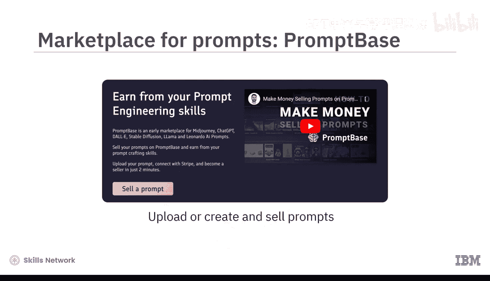

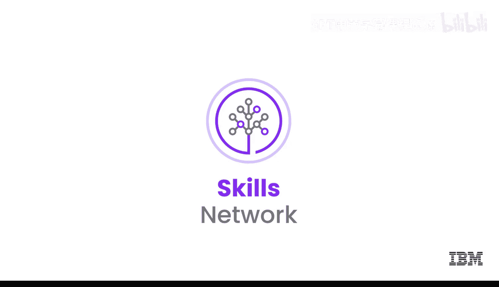

本节课中，我们一起学习了提示词工程工具。我们了解到，这些工具提供了多种功能和特性来优化提示词，包括提供提示词建议、增强语境理解、支持迭代优化、缓解偏见、提供领域特定支持以及维护预定义提示词库。我们还介绍了几款常见的工具和平台，例如 IBM Watsonx.ai Prompt Lab、Spellbook、Dust 和 PromptPerfect，以及其他有用的资源和市场。掌握这些工具将帮助您更高效地与生成式AI模型进行交互。