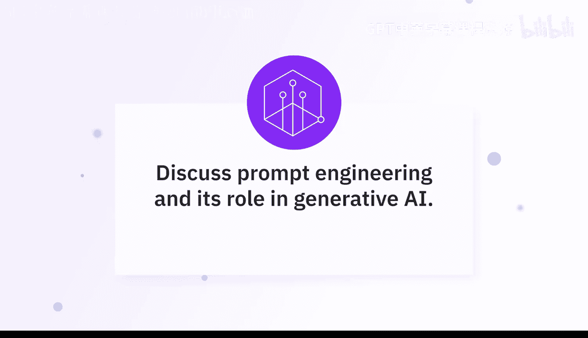
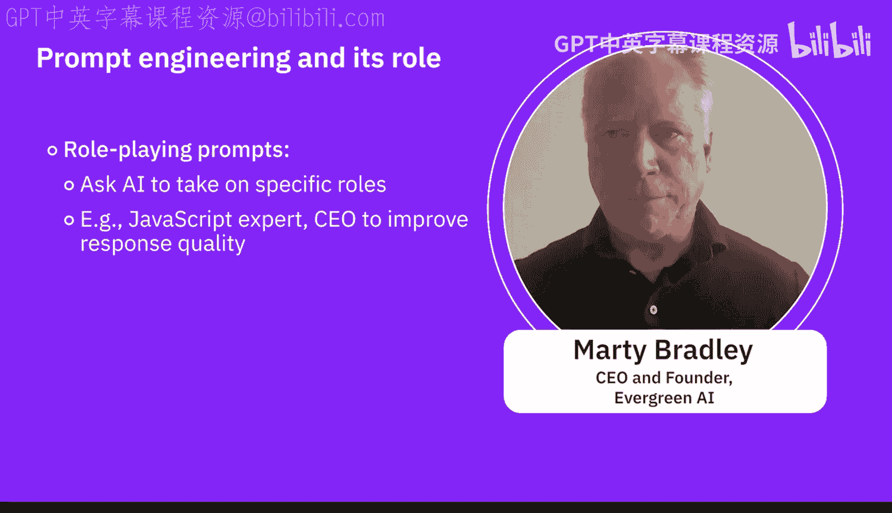

# 023：探索生成式人工智能中的提示词工程 🧠

在本节课中，我们将学习提示词工程的核心概念、常用技巧与工具。多位专家将分享他们的见解，帮助我们理解如何通过精心设计的提示词，从生成式AI模型中获得更准确、更符合预期的输出。

## 什么是提示词工程？

提示词工程是一门撰写优质、高效提示词的技术。模型将利用这些提示词，生成一致且出色的输出结果。

提示词工程的具体技巧通常取决于你所使用的具体应用，但其基本要素是明确的：你需要思路清晰，提供充分的上下文，并列出你希望从模型中获得的具体功能。

提示词工程是近两年随着生成式AI的兴起而出现的一个术语。它的核心在于理解如何向大型语言模型发出提示，以获得你想要的回应。

## 核心技巧与策略

上一节我们定义了提示词工程，本节中我们来看看专家们推荐的具体技巧和策略。

以下是几种关键的提示方法：

*   **零样本提示**：这是目前人们使用ChatGPT等工具的典型方式，即直接要求模型做某事。“样本”即示例，零样本意味着不提供任何示例，只是说“做这个”。
*   **单样本提示**：在提出请求时，提供一个示例格式。例如：“请为我撰写这个内容。这里有一个我希望你使用的格式示例。”这样，模型就能利用这个格式来组织所需信息，并以更好的方式格式化输出。
*   **少样本提示**：为模型提供两个或更多示例。有趣的是，这些示例本身不一定需要内容正确，但格式必须正确。你甚至可以先用生成式AI根据你提供的格式创建更多示例，然后将这些新示例也加入你的提示词中。
*   **思维链**：在提示词中要求模型分步思考。例如：“我将给你一系列步骤，请你先制定计划，然后一步一步地执行。”这有助于语言模型保持思路清晰。它会先制定一个计划，然后逐步执行每条指令，最后整合出答案。对于处理复杂任务，学习使用思维链提示非常有效。

此外，一个最重要且最常被提及的技巧是：**为模型设定一个角色**。例如，让它扮演JavaScript专家、产品经理或小型企业组织的CEO。你为它提供的角色示例越具体，输出的质量就越高。

## 关键参数与迭代

除了提示方法，与模型交互时还可以调整一些关键参数。

首先，我们应该明确指定任务，清晰地告诉模型我们在寻找什么，并提供一些上下文。有时我们可以提供一些示例，这利用了**少样本学习**的概念，让模型了解我们期望的输出形式。

我们可以进行**迭代反馈**，让模型根据不同的提示词进行学习。通过微调，我们可以观察哪种提示方式效果更好，能提供我们想要的回应。

我们还可以通过参数控制模型的生成方式。例如，**温度**、**Top-K**、**Top-P**等参数能使我们的模型更具生成性。我们可以调整这些参数，并结合之前提到的示例，让模型了解我们期望的输出结构。

因此，提示词工程实际上是一项使我们能够与模型交互，并要求它以我们期望的格式和方式提供回应的任务。

## 常用工具与实践

了解了核心概念后，我们来看看专家们常用的提示词工程工具有哪些。

以下是专家们提到的一些实用工具和方法：

*   **Watsonx.ai Prompt Engineering Lab**：这是目前最突出的提示词工程工具之一，特别适用于针对特定应用练习和开发有效的提示词。
*   **官方指南与工具**：像OpenAI、Microsoft Copilot等平台，都有关于如何撰写优秀提示词的章节。你可以利用这些工具来帮助你撰写提示词，并预览可能获得的回应类型。
*   **直接与模型对话**：例如，一位专家分享道，他曾直接询问ChatGPT：“我想让你为我分析一个工作流。以什么格式提供给你最好？”模型回复了一个结构建议。当他按照该结构提供信息后，模型就能精确地进行匹配，完成他想要的各种有趣任务。

需要注意的是，像**Llama 2**这样的模型有自己特定的语法规则需要遵循。如果不正确遵循，效果可能会不理想。虽然模型通常仍会输出内容，但我们的目标是以最少的试错、时间和资源浪费，获得我们想要的输出。因此，提示词工程在当前极具价值，它相对容易学习，绝对值得投入相当的时间去掌握。

## 总结

本节课中，我们一起学习了提示词工程在生成式AI中的关键作用。我们了解到，提示词工程是通过精心设计输入指令来引导AI模型生成理想输出的技术。核心技巧包括零样本、少样本、思维链提示以及为模型设定角色。同时，我们可以利用迭代反馈和调整参数来优化结果。最后，掌握如Watsonx.ai Lab等专业工具，并遵循特定模型的语法，能显著提升我们与AI交互的效率与效果。对于初学者而言，投入时间学习提示词工程是高效利用生成式AI的重要一步。