# 024：文本到文本提示词技术 📝

在本节课中，我们将学习如何通过精心设计的文本提示词来提升大型语言模型的可靠性与输出质量。我们将探讨多种核心提示词技术及其带来的益处。

近年来，自然语言处理领域因大型语言模型的应用取得了显著进步。然而，随着LLM规模和复杂度的增加，其可靠性、安全性和潜在偏见等问题也随之浮现。有效使用文本提示词是应对这些挑战的一个可行方案。文本提示词是精心设计的指令，用于引导LLM的行为以生成期望的输出。生成内容的质量和相关性，取决于提示词的有效性以及LLM本身的能力。

接下来，让我们探索那些能使文本提示词更有效、并能提升LLM输出可靠性的技术。

## 任务明确化 🎯

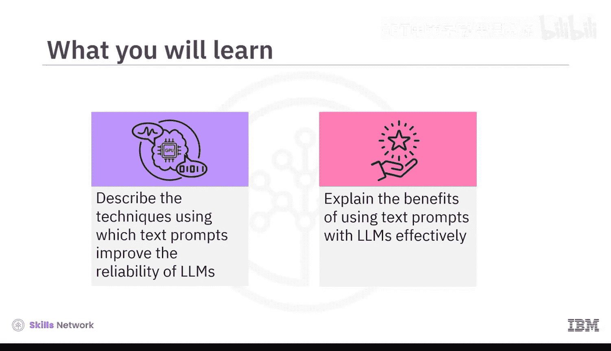

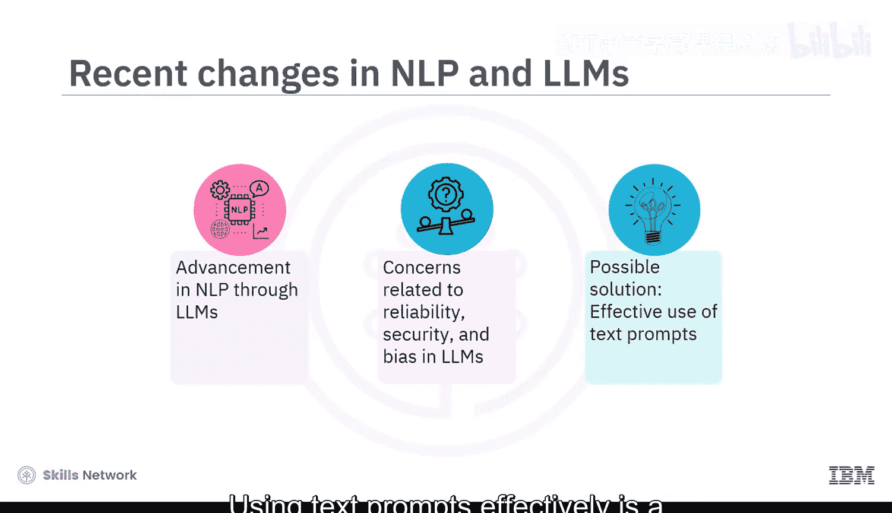

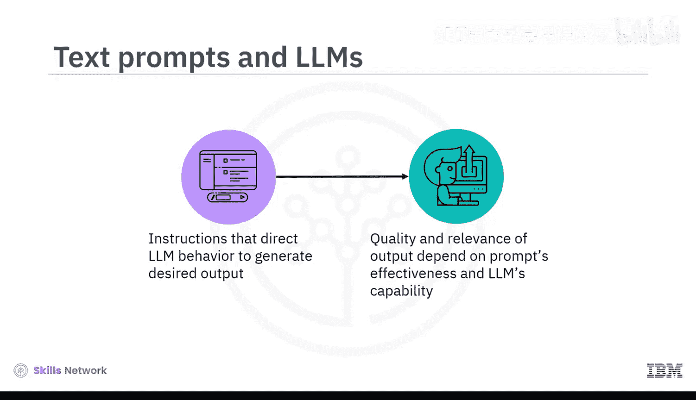

上一节我们提到了提示词的重要性，本节中我们首先来看看任务明确化技术。文本提示词应向LLM明确说明目标，以提高回答的准确性。

例如，提示词“将这句英文翻译成法语”就是一个实现任务的清晰指令。

## 上下文引导 🧭

上下文引导是一种技术，通过文本提示词为LLM提供具体指令，以生成相关输出。

例如，如果你想让模型生成一篇关于纽约市地标的短文，使用“写一段关于纽约市的短文”这样的提示词可能会得到一个笼统的回应。而一个更具体的提示词，如“写一段关于纽约市的短文，重点介绍其标志性地标”，由于包含了上下文信息，将能生成更贴切的输出。

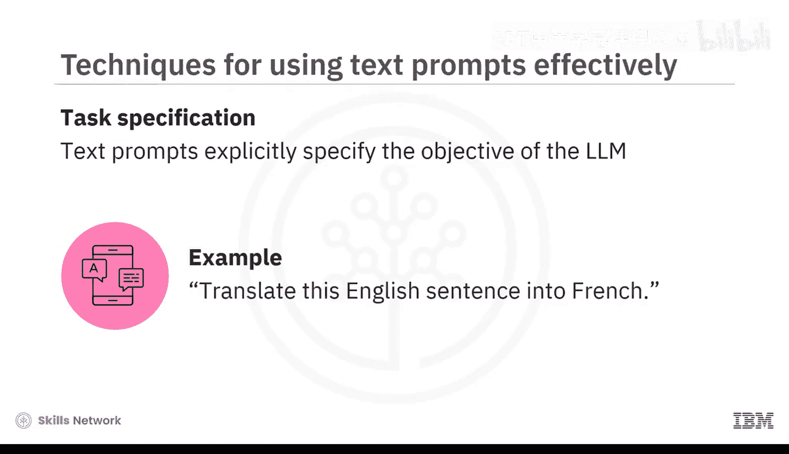

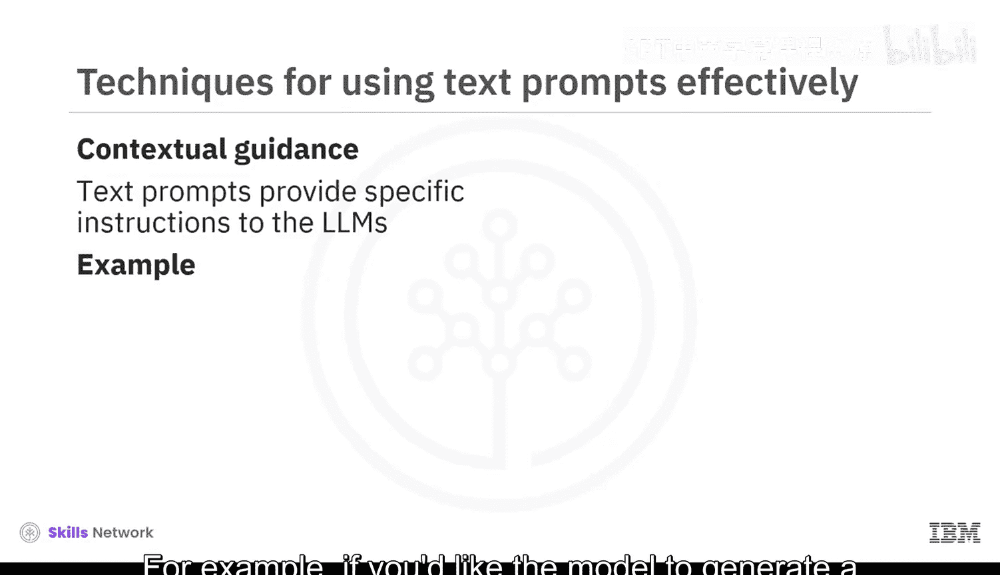

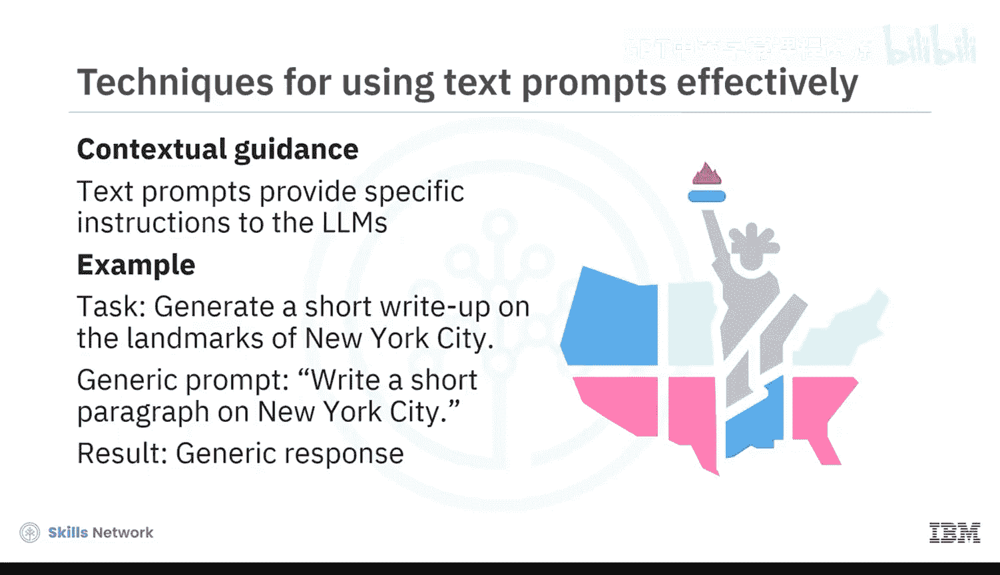

## 领域专业知识 ⚕️

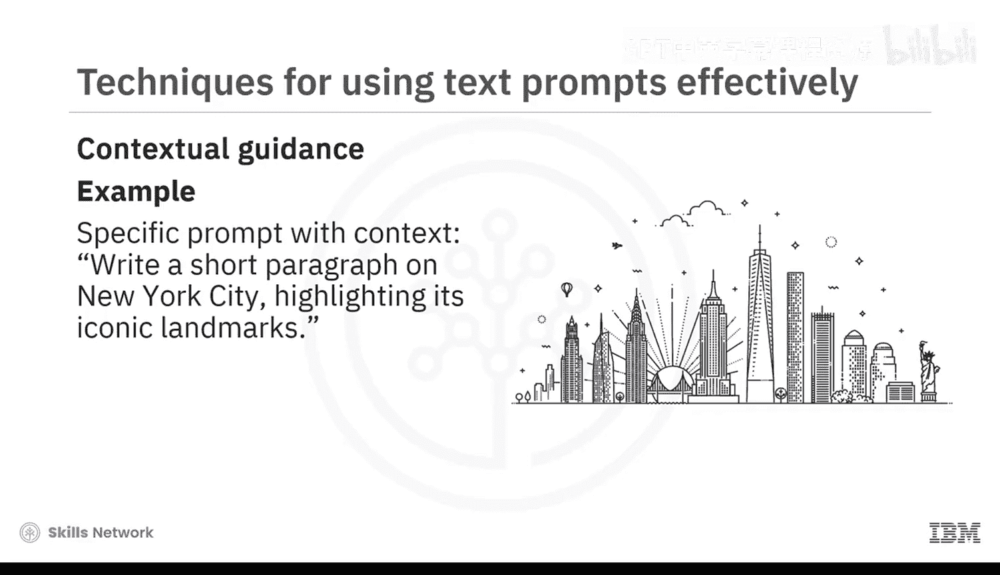

领域专业知识对于提升LLM的可靠性也至关重要。当你需要LLM在医学、法律或工程等专业领域生成内容，且准确性和精确性至关重要时，文本提示词可以使用领域特定的术语。

假设你想获取关于甲状腺功能减退症的医学信息，你的提示词可以这样写：“请解释甲状腺功能减退症的病因、症状和治疗方法，包括最新研究和医学指南。”

## 偏见缓解 ⚖️

偏见缓解是一种技术，通过文本提示词提供明确的指令，以生成中立的回应。

例如，假设你担心模型在回应关于领导力特质的提示时存在性别偏见。为了解决这个问题，你可以使用这样的文本提示词：“写一段100字的关于领导力特质的段落，不偏向任何性别，并提供所有性别的平等示例。”

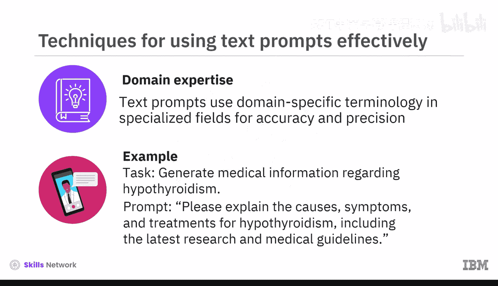

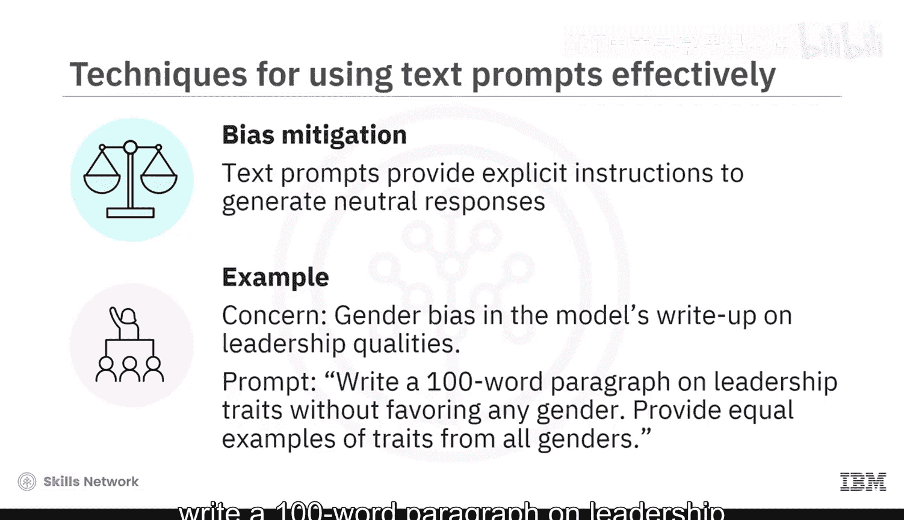

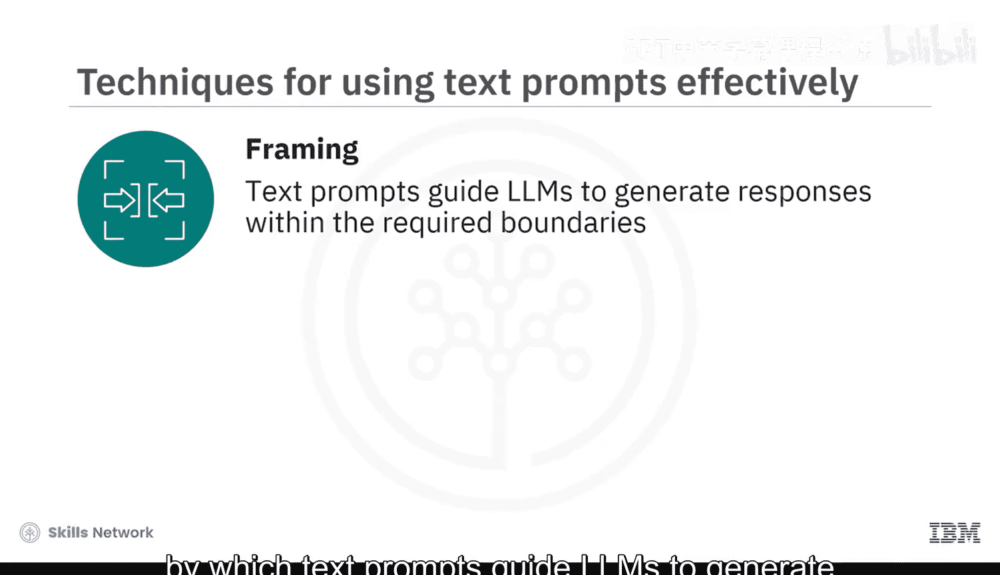

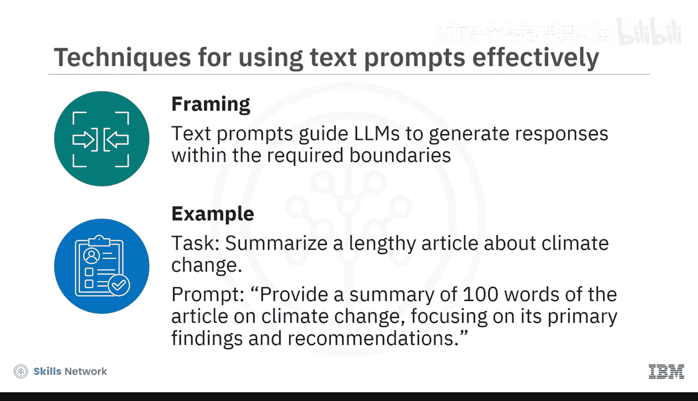

## 框架设定 📐

框架设定是另一种技术，通过文本提示词引导LLM在所需边界内生成回应。

假设你想让模型总结一篇关于气候变化的冗长文章。你的文本提示词可以是：“用100字总结这篇关于气候变化的文章，聚焦其主要发现和建议。”

## 零样本提示 🚀

你知道吗？如今，经过海量数据训练并被调整以遵循指令的LLM，可以在无需针对特定任务进行训练的情况下执行任务。零样本提示是一种方法，生成式AI模型无需先验训练即可对提示词生成有意义的回应。

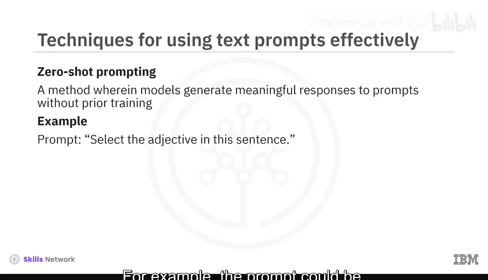

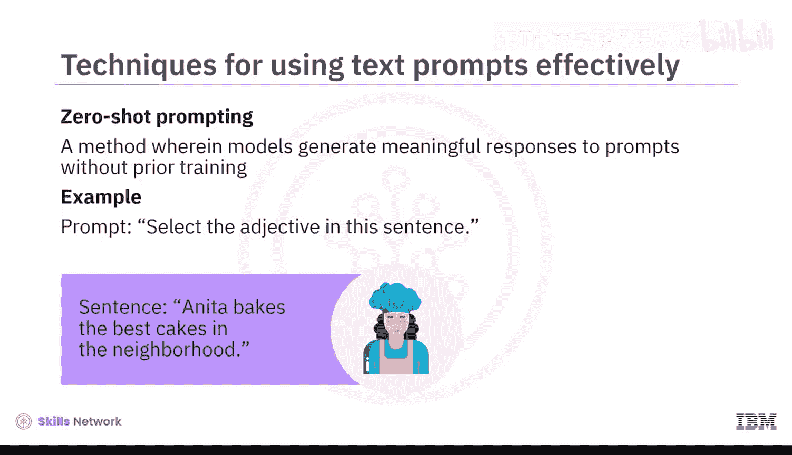

例如，提示词可以是：“选出这句话中的形容词。句子是：‘Anita烤出了社区里最好的蛋糕。’”这里的输出将是“最好的”。

然而，你通常无法通过一次提示就获得理想的回应，可能需要多次迭代。这就引出了用户反馈循环技术。

## 用户反馈循环 🔄

在用户反馈循环技术中，用户对文本提示词提供反馈，并根据LLM生成的回应迭代优化提示词。这个循环允许用户逐步改进模型的输出质量，直到达到期望的状态。

例如，用户通过文本提示词要求模型写一首诗。LLM生成了一首诗。用户说：“让它更有趣些。”LLM调整诗歌以包含更多幽默元素。用户认可了修改后的诗。

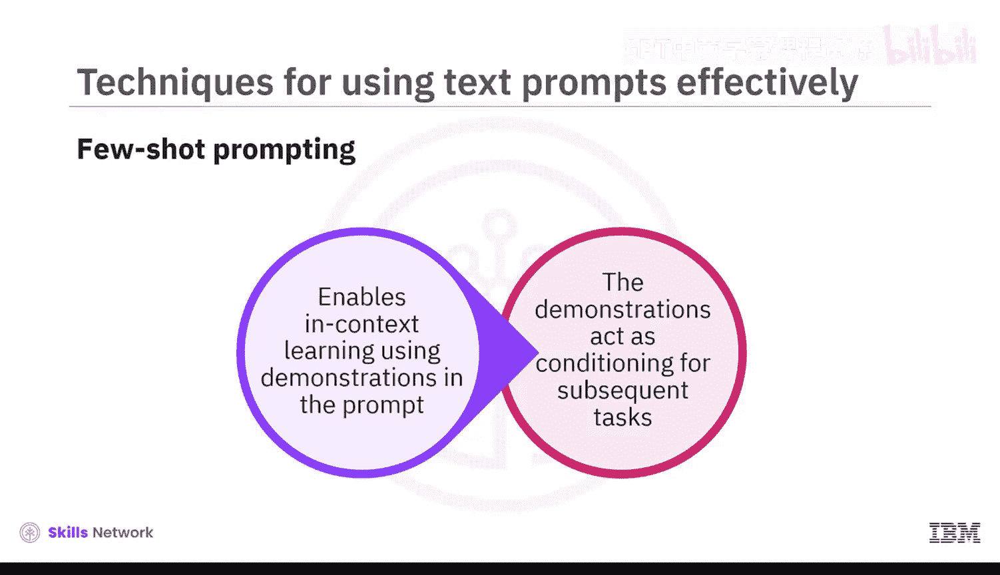

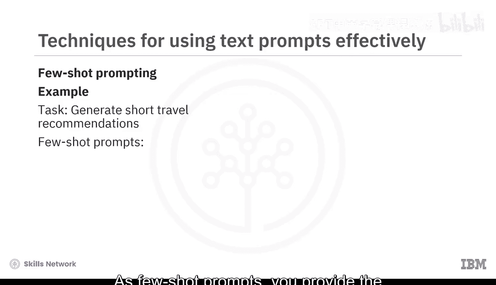

## 少样本提示 🧠

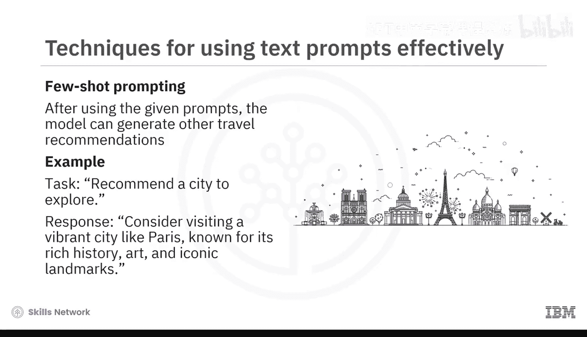

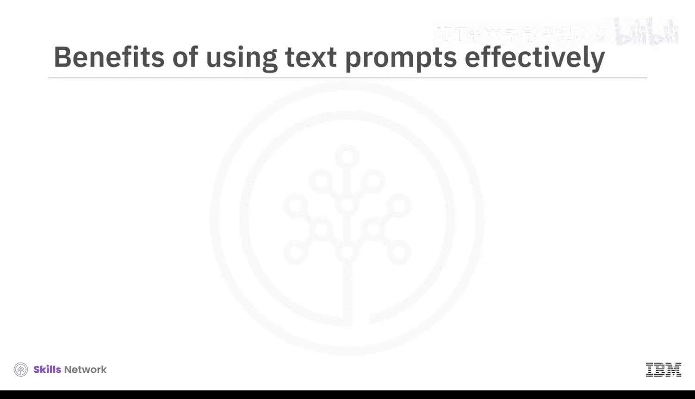

类似地，对于复杂任务，当你无法清晰描述需求时，会使用一种称为少样本提示的技术。它支持上下文学习，即在提示词中提供示例，以引导模型的表现。这些示例作为后续希望模型生成回应的样本的条件。

例如，假设模型的任务是生成简短的旅行推荐。作为少样本提示，你为模型提供以下引导性上下文：
*   “推荐一个以美丽海滩闻名的夏季旅行目的地。”
*   “推荐一个以美丽秋叶闻名的秋季旅行目的地。”

在使用这些少样本提示后，模型可以为其他类型的假期生成旅行推荐。例如，如果任务是“推荐一个值得探索的城市”，模型将生成答案：“考虑访问像巴黎这样充满活力的城市，以其丰富的历史、艺术和标志性地标而闻名。”这就是模型如何基于少样本提示中提供的最少训练数据，为不同类型的假期生成旅行推荐。

## 有效使用文本提示词的益处 ✨

当你使用我们刚刚讨论的方法将文本提示词与LLM结合使用时，会带来诸多益处。以下是其中一些：

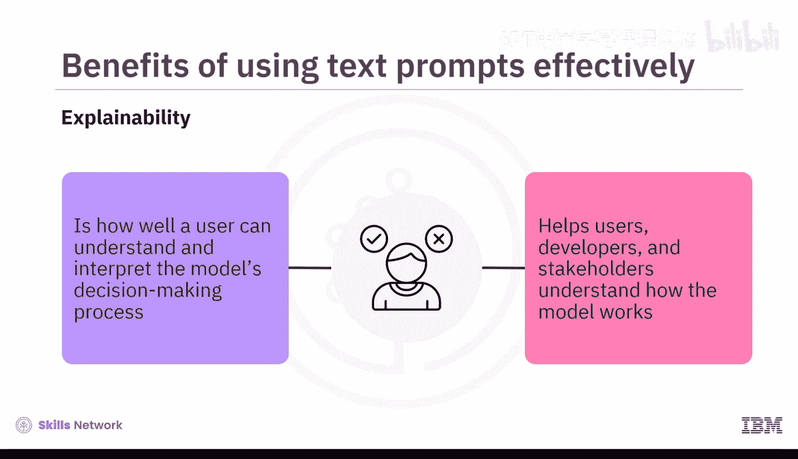

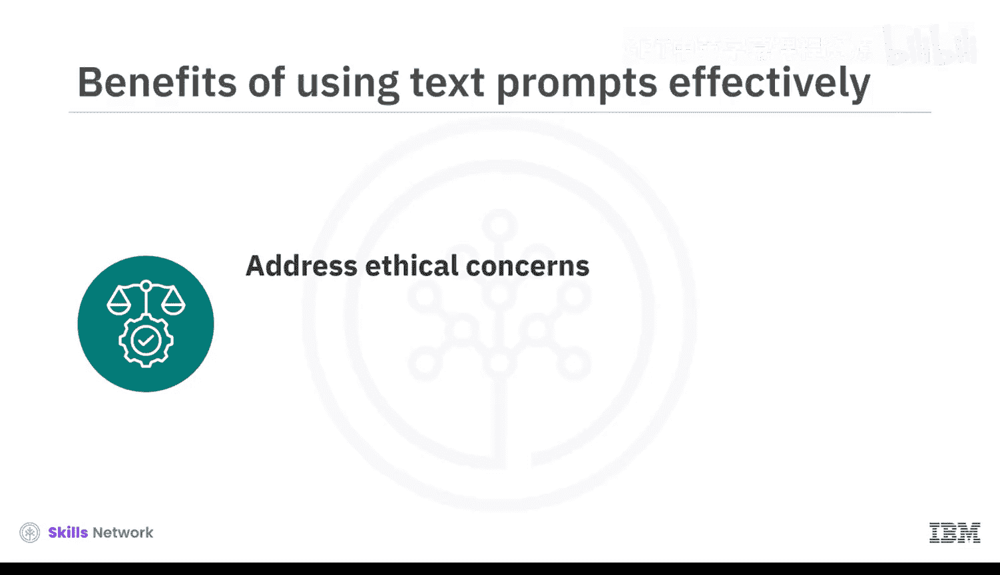

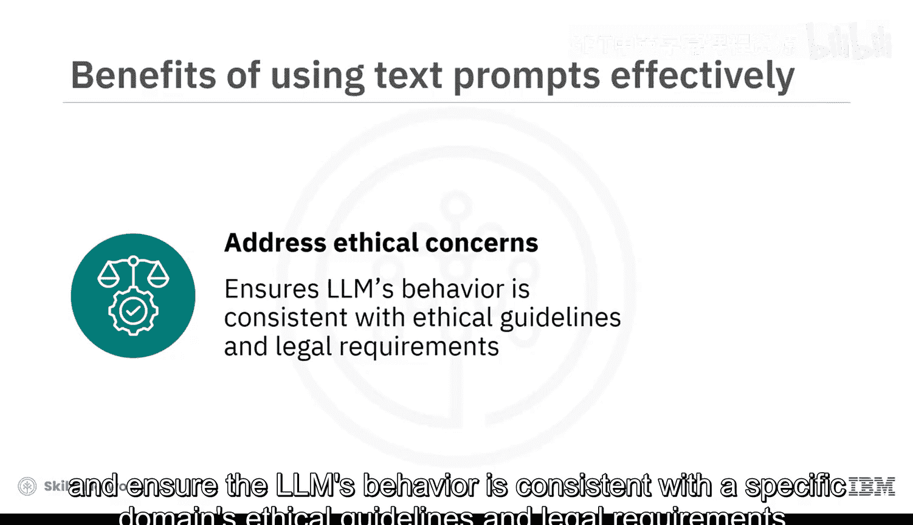

*   **增强LLM的可解释性**：可解释性指的是用户理解和解释模型决策过程及其生成输出背后原因的程度。它帮助用户、开发者和利益相关者理解模型如何工作、为何做出某些预测或生成特定文本，以及是否可以在各种应用中信任它。可解释性对于解决与AI相关的伦理问题至关重要，它帮助所有利益相关者评估并确保LLM的行为符合特定领域的伦理准则和法律要求。
*   **解决伦理考量**：除了提高LLM的可靠性和可解释性，有效的文本提示词还有助于解决伦理问题。
*   **建立用户信任**：当用户能够理解LLM的工作原理，并看到他们的指令对LLM行为的直接影响时，就会在用户和LLM之间建立起透明且有意义的互动，从而培养信任。

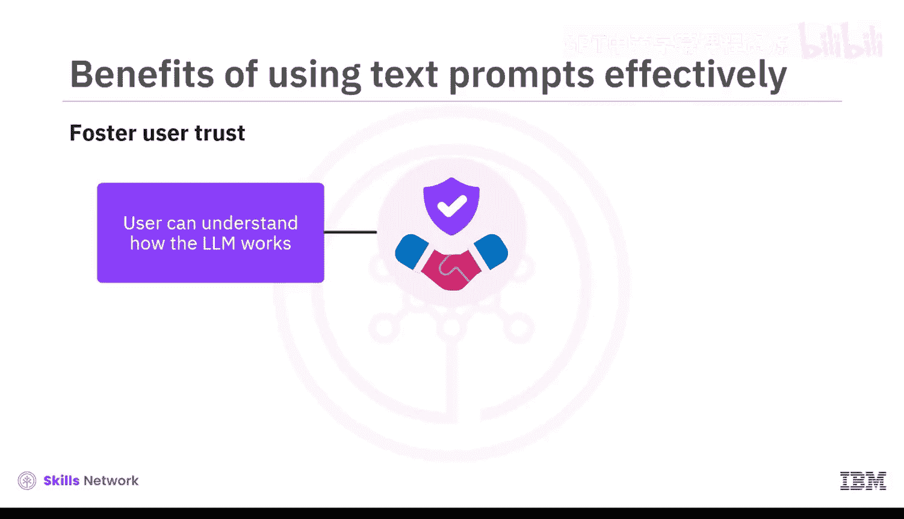

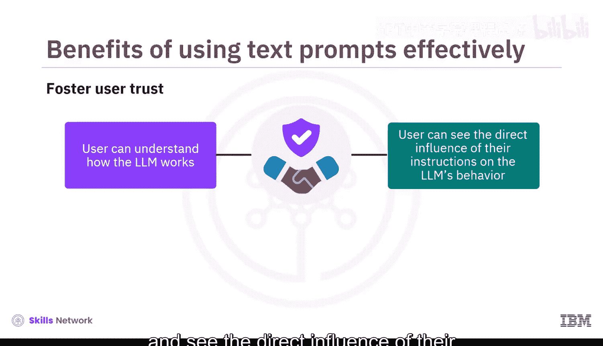

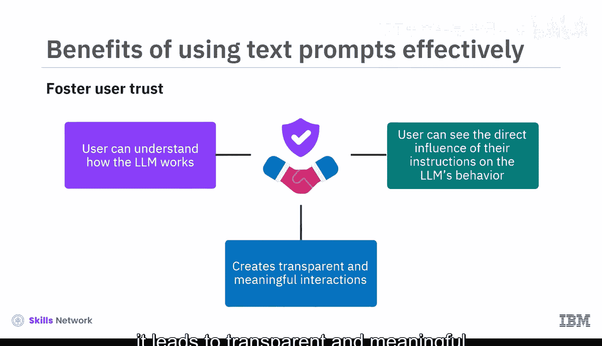

## 总结 📝

本节课中，我们一起学习了多种可以通过文本提示词提升LLM可靠性和输出质量的技术。具体来说，我们探讨了任务明确化、上下文引导、领域专业知识、偏见缓解、框架设定和用户反馈循环。我们还学习了零样本和少样本提示技术。最后，我们了解了有效使用文本提示词与LLM结合的多项益处，例如增强LLM的可解释性、解决伦理考量和建立用户信任。