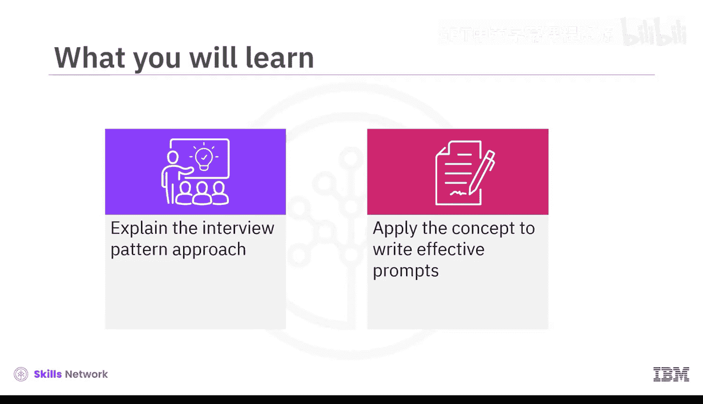
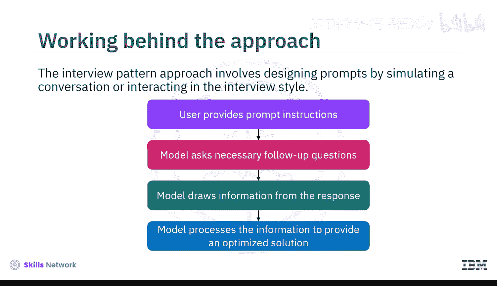
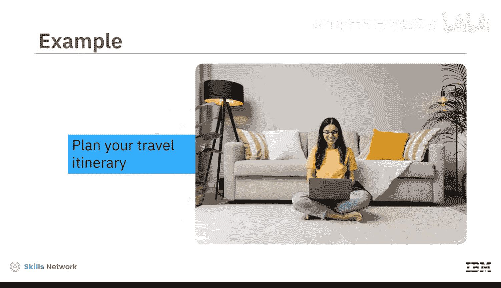
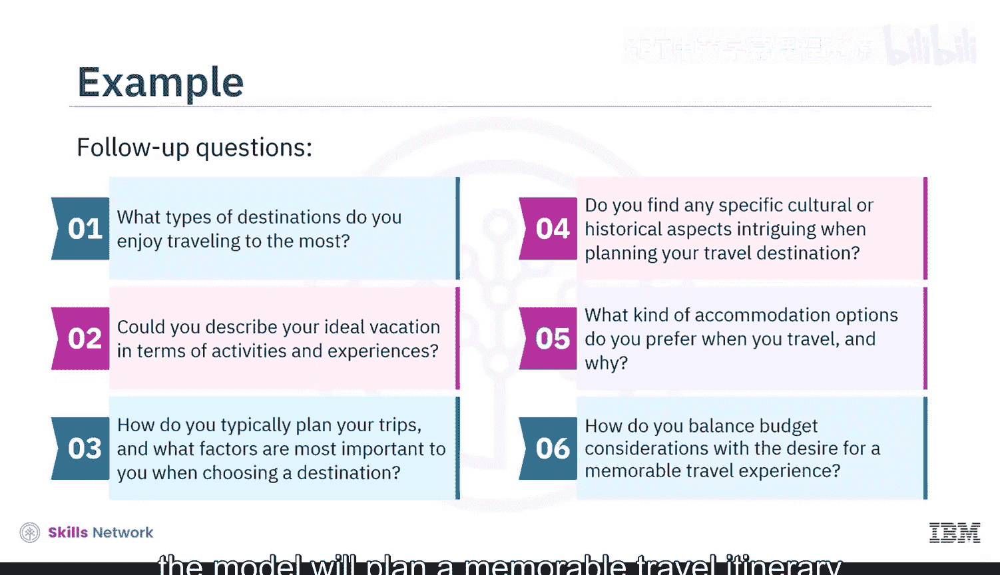
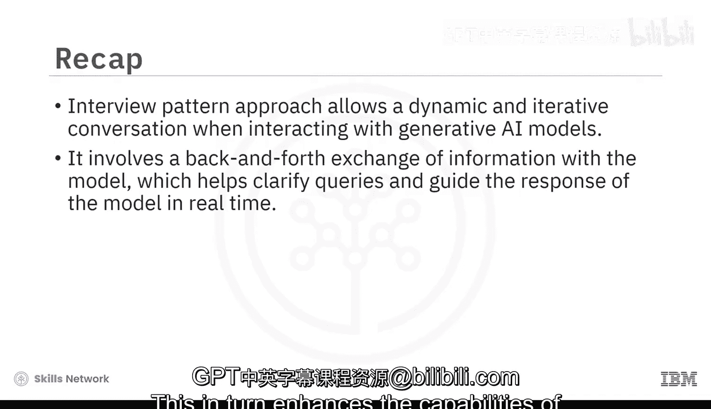

# 025：访谈模式方法 🎤

在本节中，我们将学习提示工程中的“访谈模式方法”。我们将解释其核心概念，并学习如何应用此方法来编写更有效的提示，从而让生成式AI模型产生更具体、更符合需求的回答。

上一节我们介绍了提示工程的基本概念，本节中我们来看看一种更高级的策略——访谈模式方法。



## 什么是访谈模式方法？ 🤔

访谈模式方法是一种提示工程策略，其核心在于通过模拟对话或访谈的形式与AI模型进行交互。这种方法不是提供一个静态的、一次性的指令，而是开启一个动态的、迭代的对话过程。

**核心公式**可以概括为：
`用户提供初始指令 -> 模型提出追问 -> 用户回答 -> 模型处理信息并生成优化回答`

## 访谈模式如何工作？ ⚙️

这种方法需要对提示进行细致的优化，以确保模型生成的响应能精确满足你的目标。它通常遵循以下步骤：

以下是该方法典型的工作流程：





1.  **用户提供初始指令**：你首先给模型一个角色和任务框架。
2.  **模型提出追问**：模型根据你的指令，向你提出一系列必要的后续问题，以收集关键信息。
3.  **用户回答问题**：你逐一回答模型提出的问题。
4.  **模型处理并生成回答**：模型根据你提供的所有信息，进行处理和整合，最终提供一个精心优化的回答。

你提供的信息越详细，最终得到的结果就越好。

## 实战示例：旅行顾问 🧳

为了更好地理解，让我们通过一个例子来说明。假设你想让模型扮演旅行顾问，为你规划假期行程。

以下是你可以使用的访谈模式提示：

```text
你将扮演一位经验丰富的旅行专家。你的目标是与我进行一次全面的旅行规划对话。请首先提出一系列详细的问题（一次一个），以收集所有必要信息，从而根据我的具体偏好、兴趣和预算，制定出最量身定制且令人难忘的旅行行程。
```

针对这个提示指令，模型可能会提出以下后续问题：

*   你最喜欢去哪种类型的旅行目的地？
*   你能用活动和体验来描述一下你理想的假期吗？
*   你通常如何规划旅行？在选择目的地时，哪些因素对你最重要？
*   在规划旅行目的地时，是否有特定的文化或历史方面让你特别感兴趣？
*   旅行时你偏好哪种住宿选择？为什么？
*   你如何平衡预算考虑与获得难忘旅行体验的愿望？

在这个例子中，每个问题都建立在前一个问题的基础上，形成了一个关于旅行偏好的结构化、信息丰富的对话。根据你对这些问题的回答，模型将规划出一个符合你偏好和需求的、令人难忘的旅行行程。

## 方法优势总结 🏆



在本视频中，我们了解到访谈模式方法优于传统的单次提示方法，因为它允许在与生成式AI模型交互时进行更动态、迭代的对话。

访谈模式涉及与模型进行来回的信息交换，这有助于实时澄清疑问并引导模型的响应方向。这反过来增强了用户优化所获结果的能力。



**本节课中我们一起学习了**：访谈模式方法的定义、其分步工作流程，以及如何通过一个旅行规划的实例来应用它。掌握这种方法，你将能更有效地引导AI模型，获得更精准、个性化的输出。