生成式AI基础：2.3：思维链方法 🧠

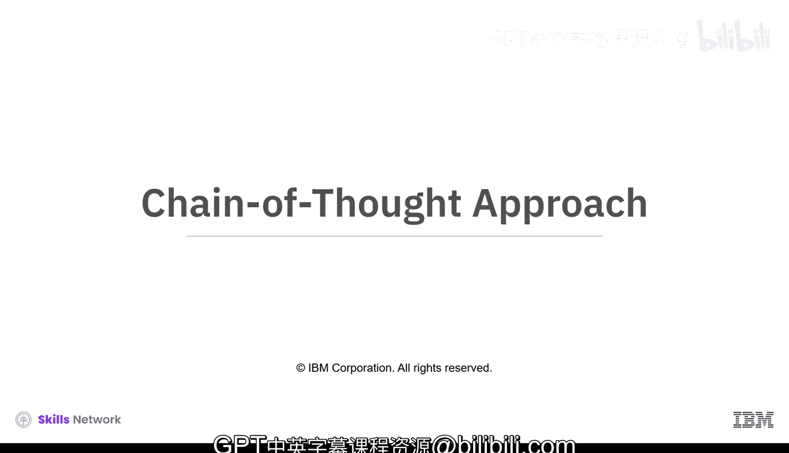

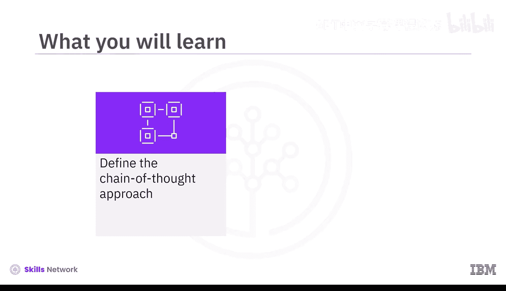

在本节中，我们将学习一种名为“思维链”的方法。这种方法通过将复杂任务分解为更小的步骤，来引导生成式AI模型进行逻辑推理，从而提升其解决问题的准确性和可解释性。

思维链方法是一种通过一系列提示或问题，将困难或复杂的任务分解为更小、更易管理的步骤的方法。每个提示都建立在前一个提示的基础上，引导AI模型逐步思考问题并生成期望的回应。这种方法使模型能够展示其推理过程，并提高其准确解决类似问题的能力。通过向模型提供问题及其解决方案，思维链帮助模型以结构化和逻辑化的方式处理任务。

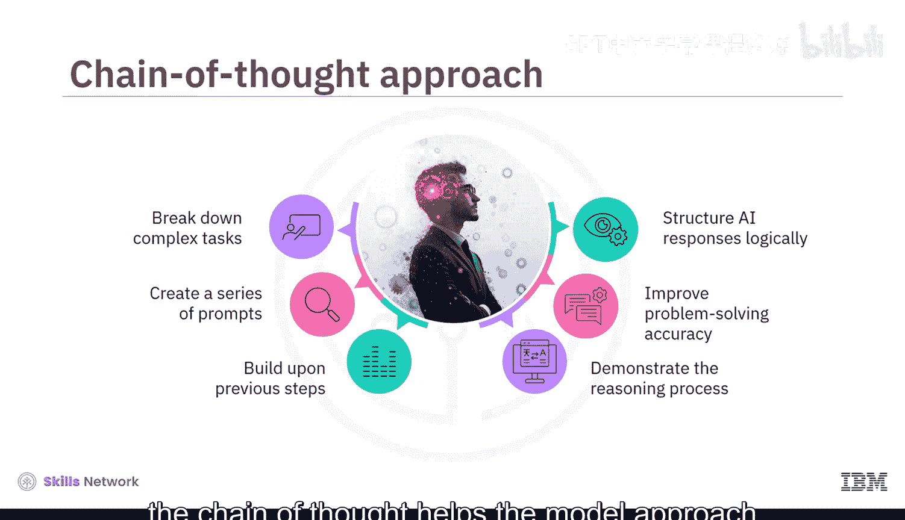

上一节我们了解了思维链的基本概念，本节中我们来看看它为何在生成式AI中被广泛应用。

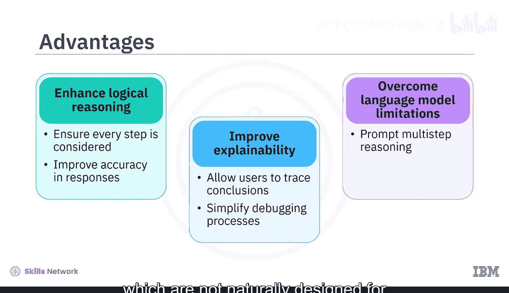

这种方法在生成式AI中被广泛使用，因为它能增强逻辑推理能力，并确保过程中的每一步都被考虑到，从而得到更准确的结果。它还能提高可解释性，允许用户追溯AI得出结论的过程，并简化调试。此外，它有助于克服语言模型的局限性，因为语言模型本身并非为多步推理而设计，除非被提示这样做。

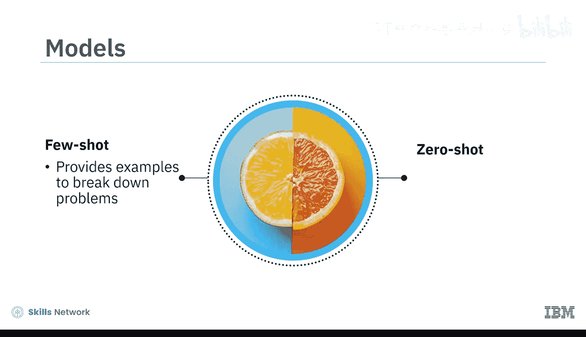

思维链建模中最常见的两种模型是**少样本思维链**和**零样本思维链**。少样本思维链通过提供示例来展示如何分解问题，而零样本思维链则鼓励模型独立地逐步思考。

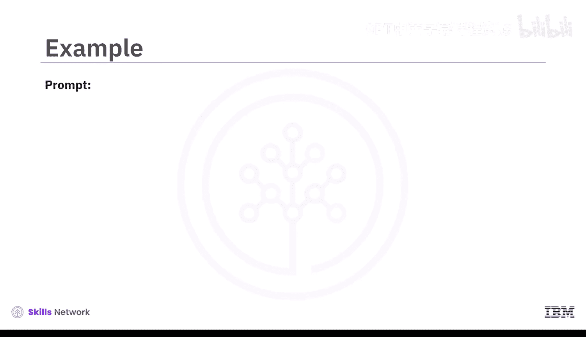

为了更清晰地理解这两种方法，让我们通过一个例子来说明。我们将从少样本方法开始。

示例问题是关于一家商店以每个3美元的价格出售橙子，并提供“买二赠一”的优惠。

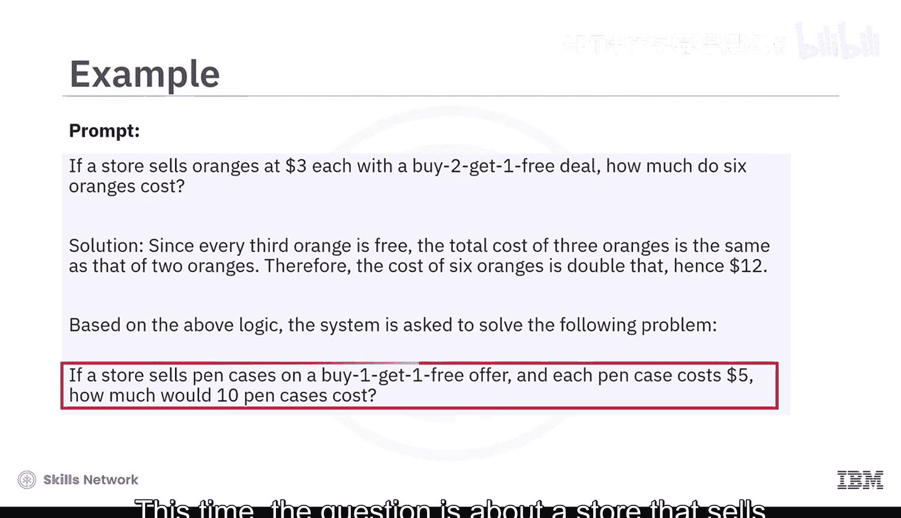

解决方案通过以下步骤展开：首先认识到每第三个橙子是免费的，因此三个橙子的成本等同于支付两个橙子的钱。扩展这个逻辑，六个橙子的成本等同于四个橙子的钱，即12美元。

现在，系统被给予一个类似的问题。这次的问题是，一家商店出售笔盒，提供“买一赠一”优惠，每个笔盒5美元。利用提示中作为样本示例提供的相同思维链推理，系统首先理解优惠结构，然后基于推理生成回应。因此，它能够得出正确答案：成本将是25美元。因为10个笔盒中，只需支付5个的费用。

在零样本方法中，不提供任何示例，而是鼓励系统独立找出答案。提示中会添加诸如“让我们逐步思考”或“让我们一步步解决这个问题以确保答案正确”等短语，以帮助系统独立设计方法解决问题。

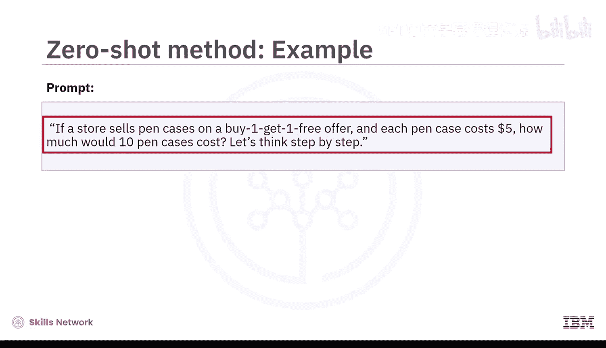

让我们以同样的笔盒问题为例，看看如何使用零样本方法解决。提示如下：“如果一家商店以‘买一赠一’优惠出售笔盒，每个笔盒5美元，那么10个笔盒需要多少钱？让我们逐步思考。”在这种情况下，系统不依赖事先的样本或示例，而是尝试独立推理问题。它首先解释优惠，理解每两个笔盒中，顾客只需支付一个的费用。

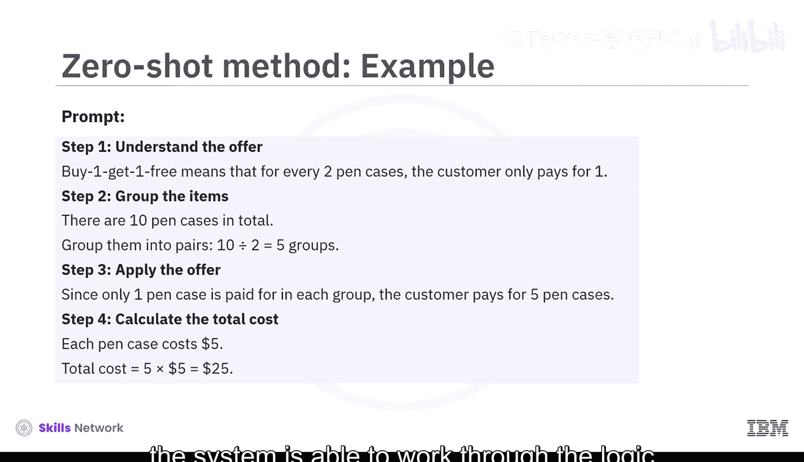

然后，它将这种理解应用于问题。它将10个笔盒分成5个“付费与免费”的对，意识到只需支付5个笔盒的费用，并计算出总价为25美元。因此，即使没有先看到样本，系统也能够逐步推理逻辑并得出正确答案。

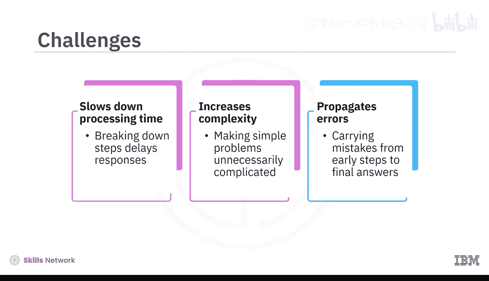

尽管思维链方法有诸多优势，但也存在一些挑战需要考虑。

以下是思维链方法面临的主要挑战：
*   将回应分解为步骤可能会减慢模型速度，这对于聊天机器人等需要快速响应的应用可能并不理想。
*   这种方法可能使简单问题变得不必要的复杂，让AI显得效率低下。
*   早期步骤中的错误可能会延续下去，导致最终答案错误。

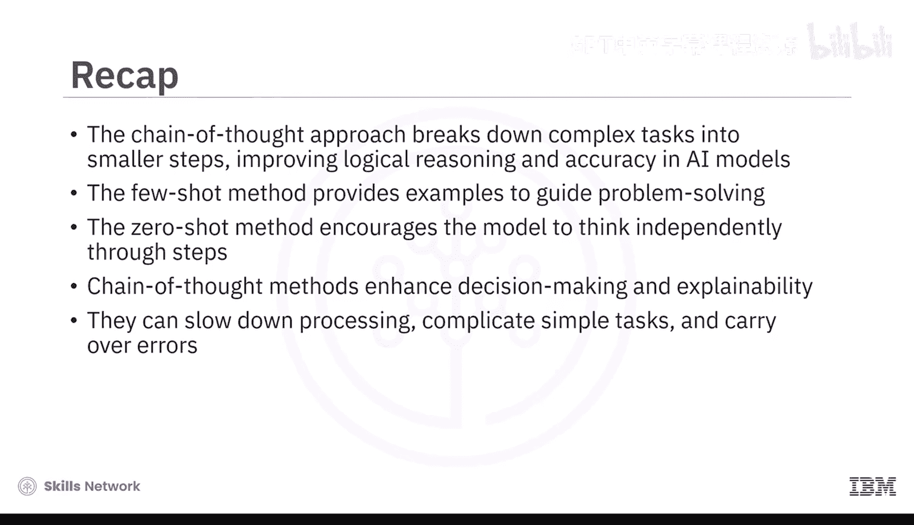

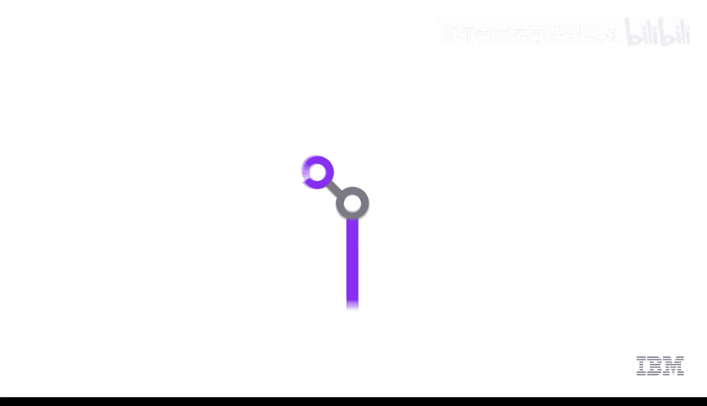

在本节课中，我们一起学习了思维链方法。我们了解到，思维链方法通过将复杂任务分解为更小的步骤，提高了AI模型的逻辑推理能力和准确性。两种主要的思维链方法是**少样本思维链**（提供示例以指导问题解决）和**零样本思维链**（鼓励模型独立逐步思考）。虽然思维链增强了决策能力和可解释性，但它也可能减慢处理速度、使简单任务复杂化，并可能延续早期步骤的错误。