# 027：思维树方法 🧠

在本节课中，我们将要学习一种名为“思维树”的高级提示工程方法。这种方法通过结构化、多路径的推理，帮助生成式AI模型解决复杂问题。我们将了解其核心概念、应用过程，并通过实例分析其优势与挑战。

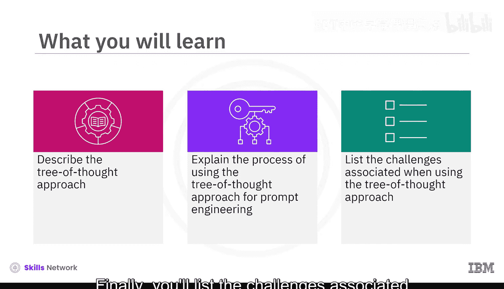

## 概述

思维树方法通过将提示结构化为一个具有层级分支的树，来增强AI的推理能力。每个分支代表不同的思考路径，允许AI同时评估多种可能性，权衡潜在结果，并聚焦于最有希望的选项。这种方法为复杂问题提供了明确的指导，并探索了多种解决方案。

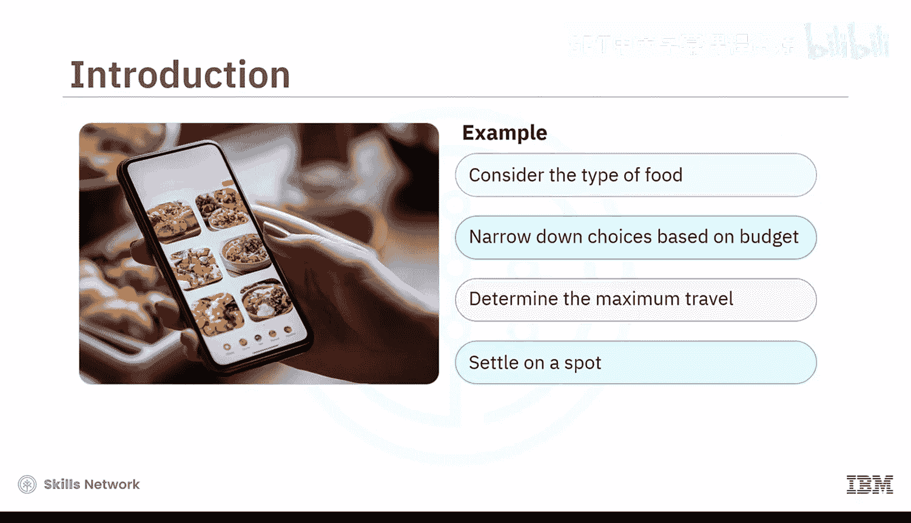

## 思维树方法的核心概念

想象一下，你和朋友需要选择一家餐厅吃饭。首先，你们会考虑想吃什么类型的食物。然后，根据预算和愿意出行的距离来缩小范围。最后，你们选定一个符合口味和偏好的地点。这就是思维树方法在现实中的一个例子。

思维树方法的核心在于**结构化**与**并行评估**。它引导模型像人类一样思考：先发散出多种可能性（分支），再对每个分支进行评估和收敛，最终形成一个综合性的解决方案。

## 思维树方法的应用过程

以下是使用思维树方法进行提示工程的一般过程：

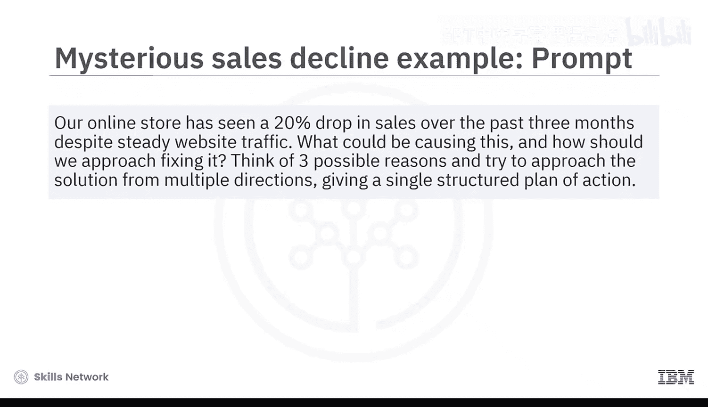

1.  **定义问题**：清晰地陈述需要解决的复杂问题。
2.  **构建思维分支**：在提示中引导模型从多个角度或维度思考问题的可能原因或解决方案路径。
3.  **并行评估**：要求模型对每个分支进行深入分析，评估其利弊、风险和可行性。
4.  **综合与收敛**：指导模型整合各分支的评估结果，形成一个结构化的、分步骤的行动计划或决策建议。

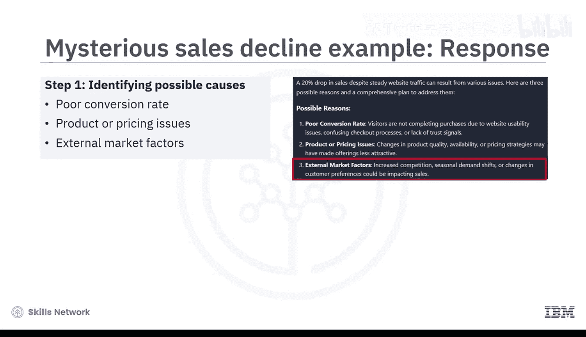

## 实例分析：在线商店销售下滑

让我们通过一个实例来具体理解思维树方法的应用。假设一家在线商店在过去三个月销售额神秘下降了20%，但网站流量保持稳定。我们可以构建如下提示：

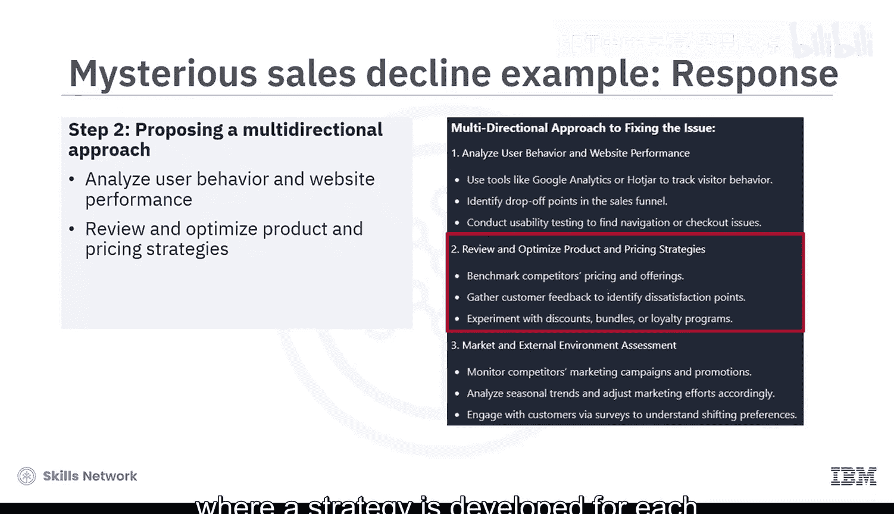

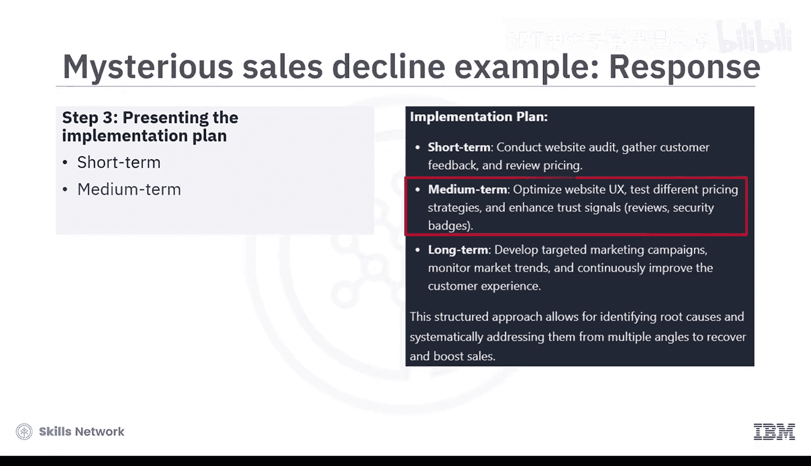

> “我们的在线商店在过去三个月销售额下降了20%，但网站流量保持稳定。可能是什么原因导致的？我们应该如何解决？请思考三种可能的原因，并从多个方向尝试解决问题，最终给出一个结构化的行动计划。”

### 模型的响应过程

1.  **识别原因（构建分支）**：模型首先识别并清晰列出了销售下滑的三个最可能原因：
    *   转化率低
    *   产品或定价问题
    *   外部市场因素

2.  **多方向解决方案（并行评估）**：模型针对每个主要原因提出了针对性的解决策略：
    *   对于转化率低：优化网站用户体验和结账流程。
    *   对于产品或定价问题：分析产品竞争力和定价策略。
    *   对于外部市场因素：研究市场趋势和竞争对手动态。

3.  **结构化实施计划（综合收敛）**：模型最终提出了一个分阶段的行动计划，涵盖短期、中期和长期的行动。

### 方法解析

在这个例子中，思维树提示通过鼓励模型探索多条推理路径，实现了对相互关联维度的深入分析。模型没有给出泛泛而谈的回应，而是将问题分解为三个独立的原因，从用户体验、定价和市场趋势等不同功能视角评估纠正策略，并综合成一个循序渐进的行动计划。这模仿了人类专家处理复杂、多层面问题的方式：测试并行假设，摒弃较弱选项，构建全面解决方案。

## 扩展应用：职业转型决策

思维树方法的应用不仅限于商业问题，也能扩展到个人决策领域，例如应对职业转型的困惑。

考虑以下提示：
> “我正在考虑转换职业，但感到不确定。请基于我当前的技能和兴趣，阐述三条我可以选择的路径，例如：在当前领域提升技能、转向相关领域、或进行彻底转变。针对每条路径，分解出需要做出的子决策和步骤，评估潜在的风险和收益，并帮助我确定在选择最佳方向时应考虑哪些因素。”

### 模型的响应分析

模型遍历了每条思考路径：

*   **路径一：在当前领域提升技能**
    *   **优势**：保持与行业趋势一致。
    *   **局限**：需要时间和资金投入。

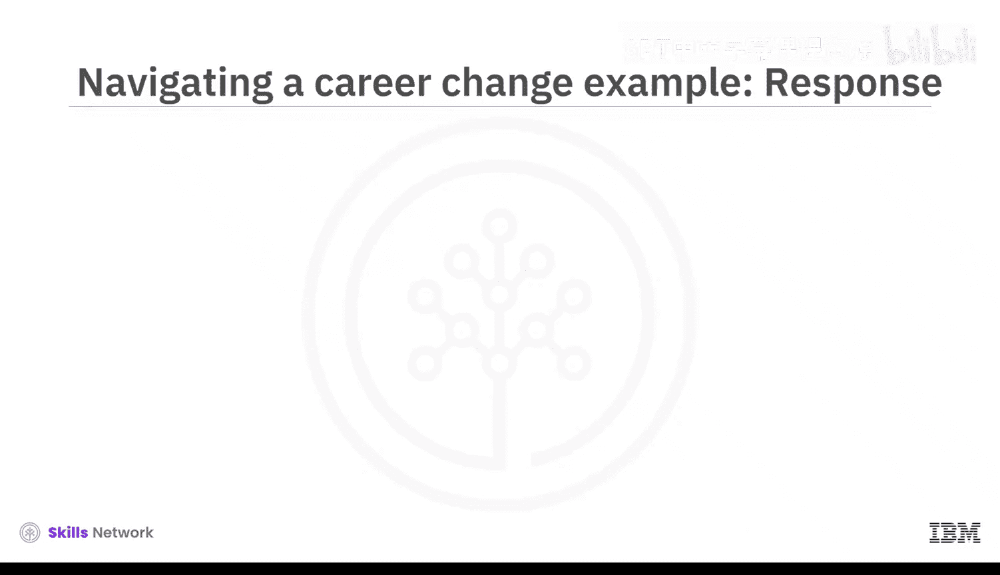

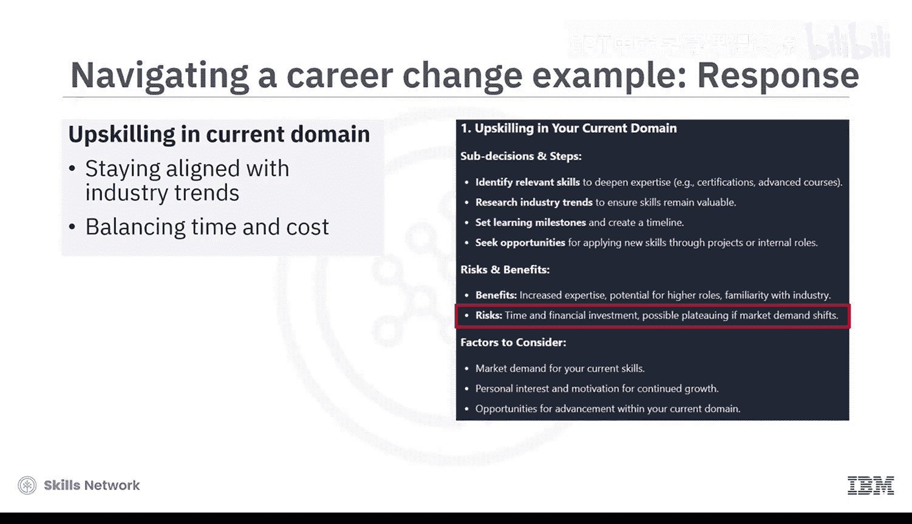

*   **路径二：转向相关领域**
    *   **优势**：拓宽职业机会。
    *   **局限**：现有技能与新角色的兼容性问题。

*   **路径三：彻底转变职业**
    *   **优势**：可能获得更大的个人满足感。
    *   **局限**：财务风险高，存在失败可能。

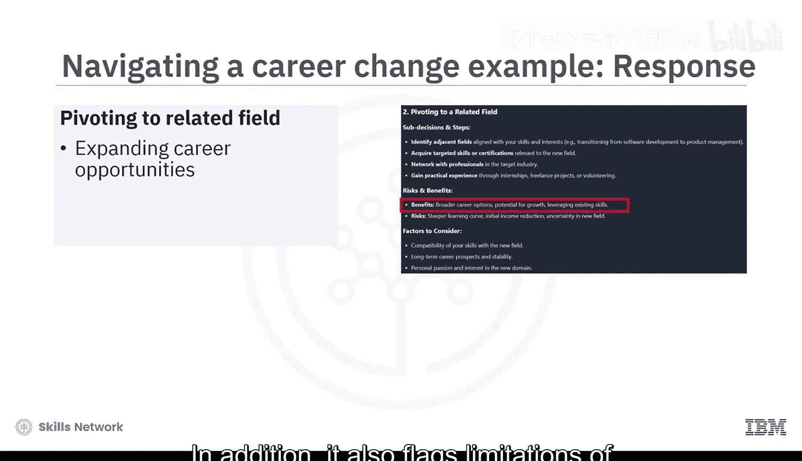

最终，模型将最终决定权留给用户，并提供了关键的考虑因素，如个人兴趣、风险承受能力和市场需求。

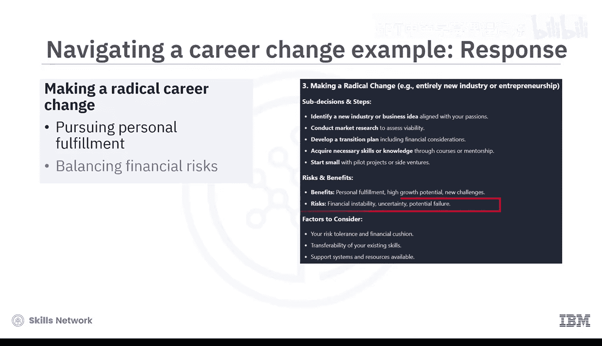

这个例子展示了思维树方法如何支持在不确定性中进行深思熟虑的决策，通过并行评估不同选项的优劣，帮助用户更清晰地看到全局。

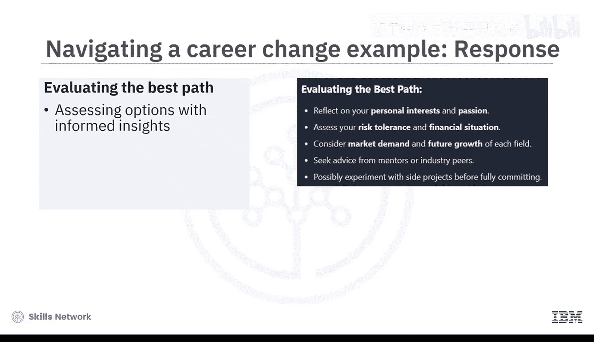

## 思维树方法的挑战与局限

尽管思维树提示法对于结构化推理和处理复杂的多步骤问题非常有效，但它也存在一些局限性。

以下是其主要挑战：

*   **过度生成**：可能导致模型探索过多分支或偏离到不太相关的路径，使得回应冗长或重点被稀释。
*   **路径均等假设**：此方法可能默认所有推理路径都同等有效，但在高风险或时间敏感的场景中，确定优先级至关重要。
*   **错误自信风险**：如果模型围绕有缺陷的逻辑或不准确的事实创建了详细的推理链，可能会给薄弱的结论带来虚假的可信度，导致错误自信。

因此，用户需要仔细解读模型的输出，并结合自身判断进行决策。

## 总结

本节课中我们一起学习了思维树方法。

*   思维树方法是一种高级提示工程技术，它使生成式AI模型能够通过结构化、逐步推理多种解决路径来处理复杂问题。
*   它鼓励模型探索不同的可能性，并行评估它们，并交付深思熟虑、有充分支持的结论。
*   这种方法对于需要分层决策的现实世界情况特别有用。
*   同时，思维树提示法也存在一些局限性，例如过度生成的风险、过度分支到低价值路径，以及需要用户仔细解读。

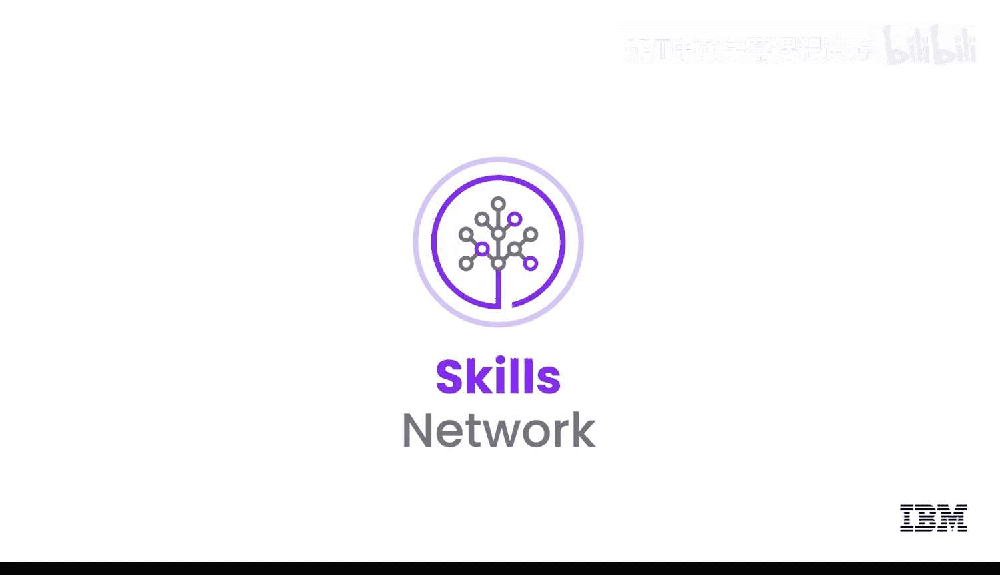

当经过深思熟虑地使用时，这种方法为在AI支持下驾驭模糊性和做出明智决策提供了一个强大的框架。