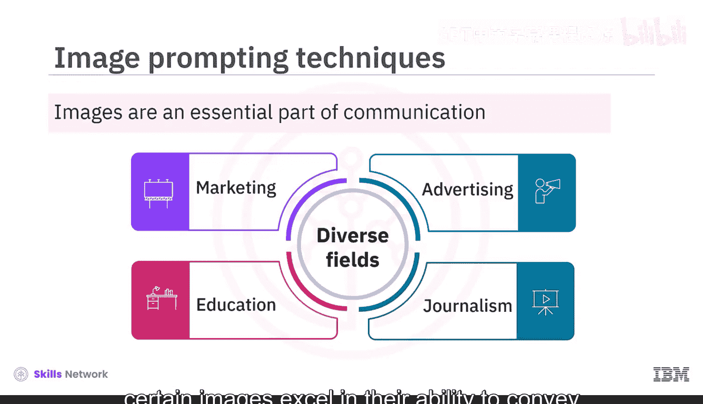
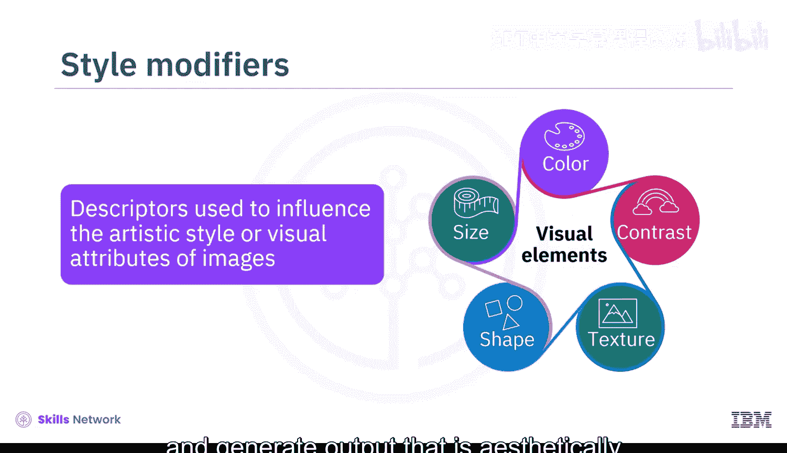
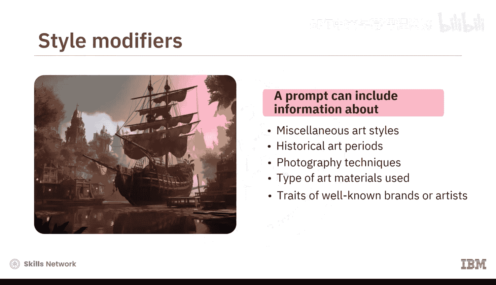
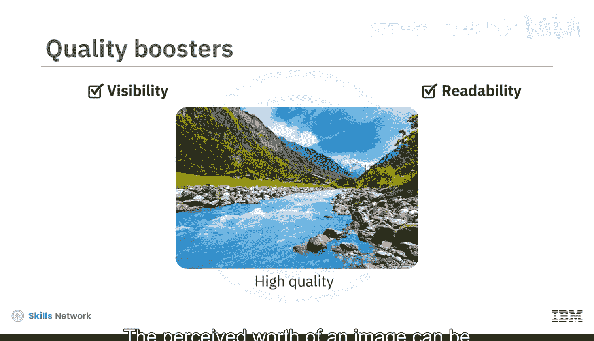
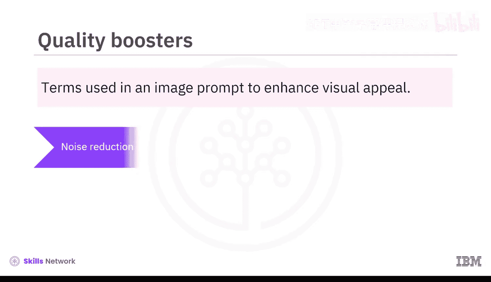
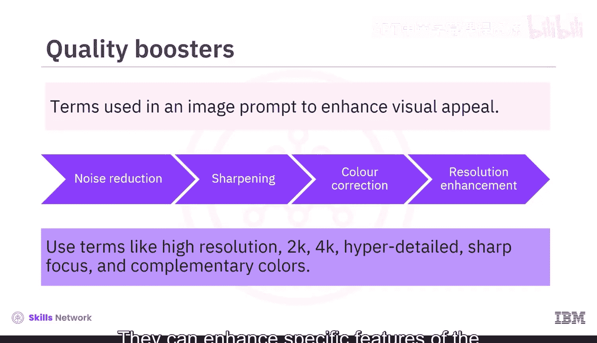
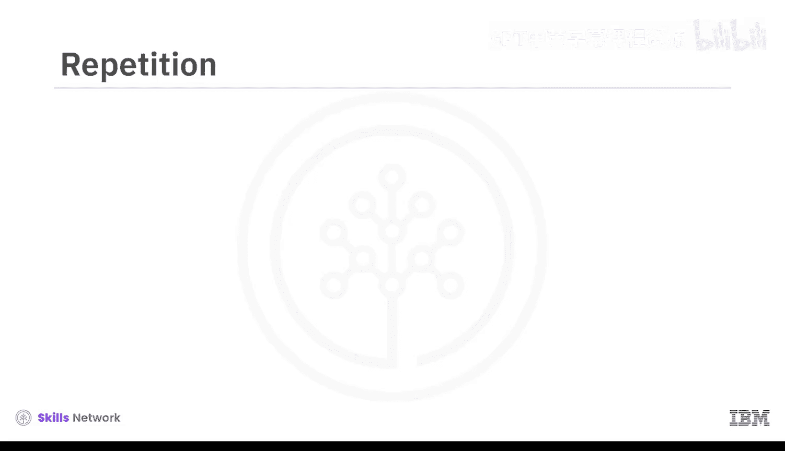
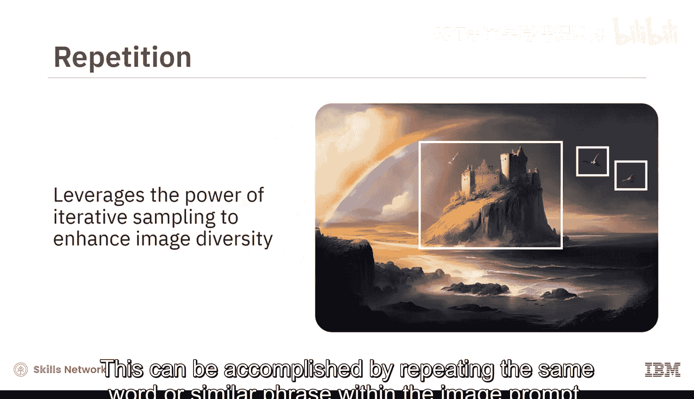
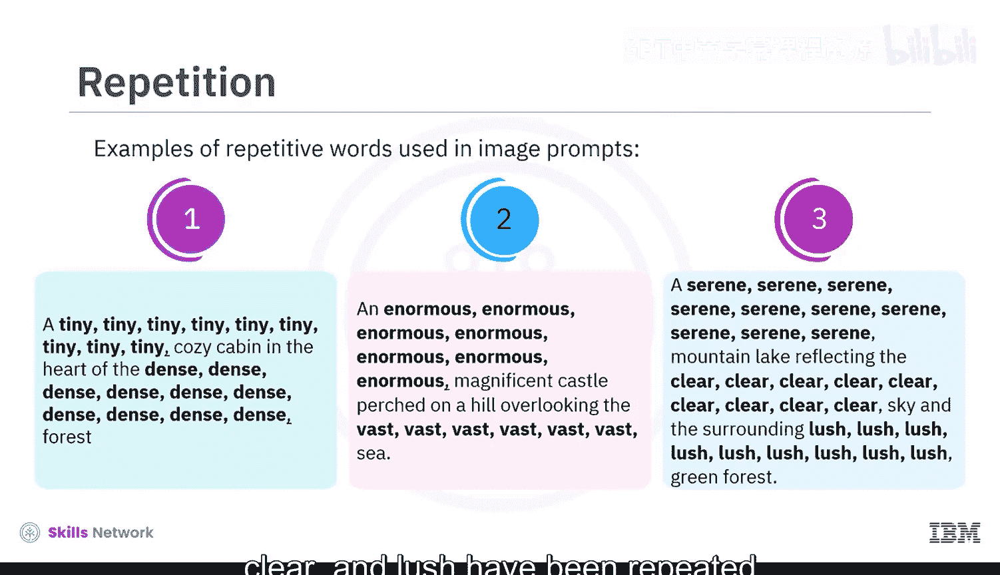
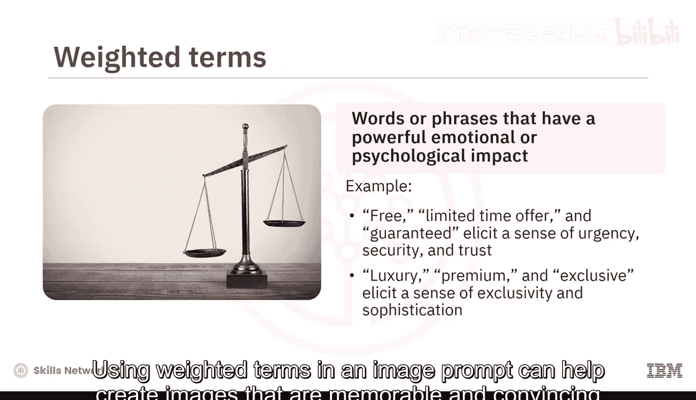

生成式AI基础：5.3：文本到图像提示词技术 🎨

在本节课中，我们将学习如何通过特定的提示词技术，提升生成式AI模型所创建图像的质量与表现力。我们将介绍五种核心的提示词技巧，帮助你写出更有效的图像生成指令。

图像是沟通的重要组成部分，广泛应用于市场营销、广告、教育、新闻等诸多领域。然而，有些图像在传达情感方面比其他图像更为出色。图像提示词是对你想要生成图像的文本描述。它可以简单到一个单词或短语，也可以更详细地描述图像的构图、色彩和氛围。

为了提升通过生成式AI模型获得的图像的影响力，使其更具说服力和吸引力，你可以使用图像提示词技术。这些技术旨在提高生成式AI模型所产生图像的质量、多样性和相关性。

有多种图像提示词技术可用于改善图像效果。接下来，我们将逐一了解这些技术。

**风格修饰词**

风格修饰词是用于影响生成式AI模型所产生图像的艺术或视觉属性的描述符。这些描述符可以帮助模型在遵循输入提示词结构和内容的同时，生成具有创新风格的图像。

你可以修改图像的各种视觉元素，如颜色、对比度、纹理、形状和大小，从而生成具有美学吸引力、视觉上令人愉悦的输出。你的提示词可以包含关于各种艺术风格、历史艺术时期、摄影技术、所用艺术材料类型，甚至是你希望模型模仿的知名品牌或艺术家特征的信息。所有这些信息都有助于生成模型理解期望的输出图像外观或风格。

以下是图像提示词中使用风格修饰词的一些例子：

*   `一个宁静的湖泊，**印象派风格**，柔和的色彩。`
*   `一只猫坐在窗台上，**赛博朋克美学**，霓虹灯，雨夜。`
*   `未来城市景观，**极简主义**，干净的线条，单色调。`

**质量增强词**

高质量的图像比低质量的图像更具说服力和可信度。低分辨率图像通常会出现模糊和像素化，使观看者难以辨别其中的细节。另一方面，高分辨率图像保证了基本的可见性和可读性。使用高质量的图形设计可以提升图像的感知价值。

质量增强词是用于图像提示词中的术语，旨在增强视觉吸引力，并提高输出的整体保真度和清晰度。这些特定术语可以指导生成式AI模型执行降噪、锐化、色彩校正和分辨率增强等步骤。你可以在图像提示词中使用诸如“高分辨率”、“超详细”、“锐利”、“互补色”等术语作为质量增强词。它们可以增强图像的特定特征，从而产生更连贯的输出。

让我们看一些例子来理解如何在图像提示词中使用质量增强词：

*   `一张**高分辨率**的蜜蜂微距照片，**突出纹理**，**锐利对焦**。`
*   `一幅**4K分辨率**的日落数字绘画，**鲜明色彩**，**细腻线条**。`
*   `一幅肖像画，使用**互补色**，**背景模糊**，主体**突出**。`

**重复技巧**

这种技术利用迭代采样来增强模型生成图像的多样性。重复涉及强调图像中的特定视觉元素，为模型创造一种熟悉感，使其能够专注于你想要突出的特定想法或概念。这可以通过在图像提示词中重复相同的单词或相似的短语来实现。重复有助于强化通过图像传达的信息，并提高模型对该元素的记忆性。

模型不会仅根据提示生成一张图像，而是生成多张具有细微差别的图像，从而产生一组多样化的潜在输出。当生成模型面对抽象或模糊的提示词，且存在多种有效解释时，这种技术尤其有价值。

让我们看一些在图像提示词中使用重复词的例子：

*   `**微小**、**密集**的星星布满**巨大**、**广阔**的夜空。`
*   `一个**宁静**、**清澈**的湖泊，周围是**茂密**、**翠绿**的森林。`

**加权术语**

加权术语指的是使用能够产生强烈情感或心理影响的词语或短语。例如，“免费”、“限时优惠”和“保证”等词常用于广告中，以引发紧迫感、安全感和信任感。同样，“奢华”、“高端”和“独家”等词用于营造排他性和精致感。

生成式AI模型允许你为正负术语赋予权重，以强调或淡化某种情感。在图像提示词中使用加权术语有助于创建令人难忘、有说服力并能引起观众情感反应的图像。

以下是一些在图像提示词中使用加权术语的例子：

*   `一个**温暖**（权重：+10）、**噼啪作响**（权重：+8）的壁炉。`
*   `一个**闪闪发光**（权重：+6）、**霓虹灯照亮**（权重：+8）的城市雨夜。`
*   `一只**色彩斑斓**（权重：-6）、**异国情调**（权重：+10）的鸟。`

**修正畸形生成**

该技术用于修改可能影响图像效果的畸形或异常。图像中的畸形可能包括扭曲（特别是在人体部位如手或脚上）、像素化或其他影响图像视觉吸引力和清晰度的质量问题。通过使用良好的负面提示词，可以在一定程度上缓解这些问题。

以下是一些在图像提示词中使用的修正畸形生成技术的例子：

*   `一个美丽的天使，**没有畸形的手**，**没有多余的肢体**。`
*   `一张清晰的产品照片，**没有模糊**，**没有像素化**。`
*   `一幅对称的建筑画，**没有扭曲**，**比例正确**。`

**总结**

本节课中，我们一起学习了图像提示词技术在提升生成式AI模型图像生成能力方面起着至关重要的作用。风格修饰词、质量增强词、重复技巧、加权术语和修正畸形生成是五种可用于改善图像效果的技术。通过结合运用这些技巧，可以创造出更令人难忘、更具吸引力和说服力的视觉内容，从而有效地传达预期信息。