# 030：课程总结 🎓

在本节课中，我们将回顾整个课程的核心概念，总结你所学到的关于提示工程的知识与技能。

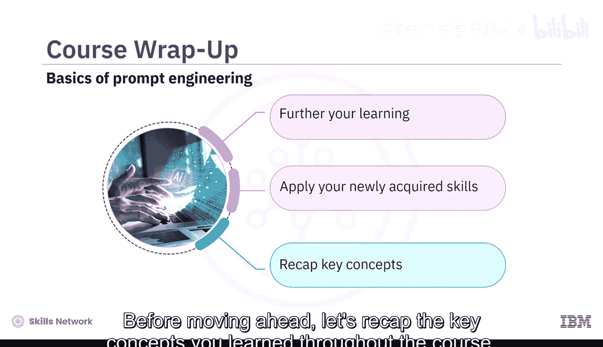

恭喜你完成了提示工程基础课程。现在你已经牢固掌握了如何设计有效的提示、使用生成式AI工具来构建提示，以及运用文生文和文生图技术。你将发现许多进一步学习和应用新技能的机会。在继续前进之前，让我们回顾一下你在整个课程中学到的关键概念。

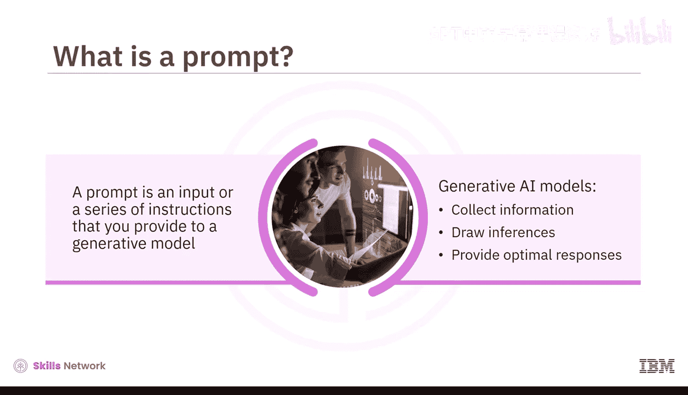

## 核心概念回顾

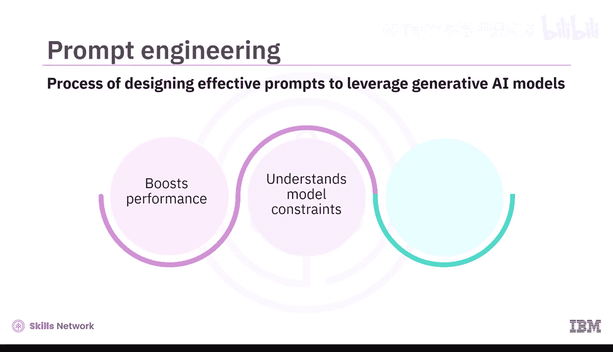

上一节我们完成了课程学习，本节中我们来系统地回顾所有核心知识点。

### 提示的定义
你了解到，**提示**是提供给生成式AI模型的任何输入或一系列指令，模型据此收集信息、进行推断并提供最佳响应。

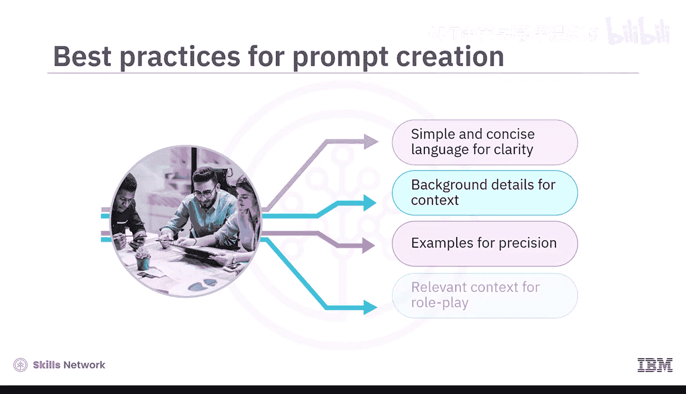

### 提示的构成要素
一个结构良好的提示包含以下基本构建模块：
*   **指令**：明确告诉模型要做什么。
*   **上下文**：提供相关的背景信息。
*   **输入数据**：给出模型需要处理的具体信息。
*   **输出指示器**：指定期望输出的格式或类型。

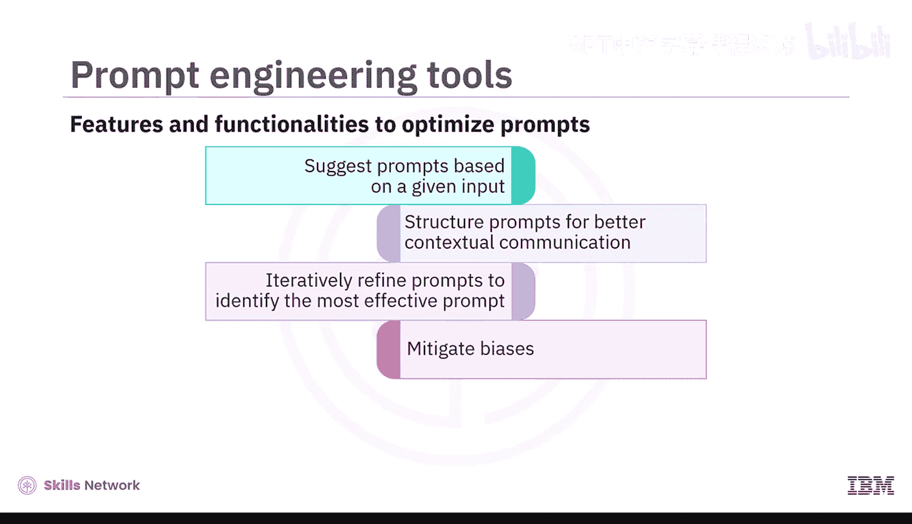

### 提示工程
设计有效提示以充分利用生成式AI模型能力的过程被称为**提示工程**。这个过程能提升模型性能、理解模型限制并增强模型安全性。

### 撰写有效提示的最佳实践
以下是撰写有效提示的一些最佳实践：
*   使用**简单明了的语言**以确保清晰度。
*   提供**背景细节**以构建上下文。
*   **具体明确并提供示例**以提高精确度。
*   提供**相关上下文**以进行角色扮演。

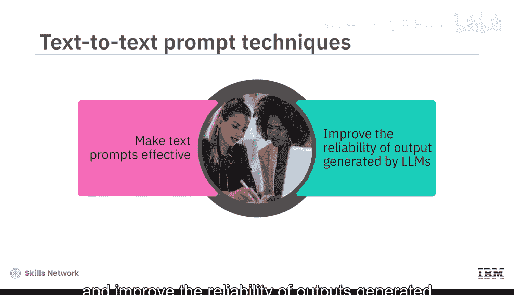

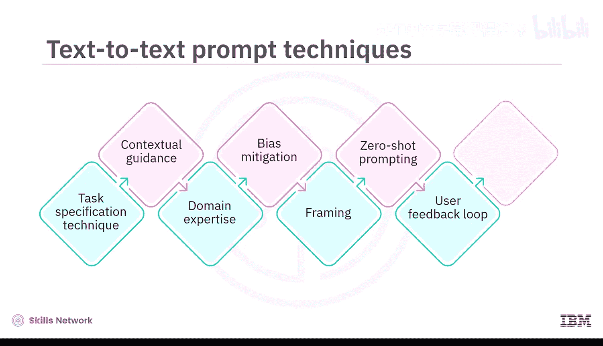

### 提示工程工具
提示工程工具提供各种功能来优化提示。你可以使用这些工具：
*   根据给定输入**建议提示**。
*   **构建提示结构**以实现更好的上下文沟通。
*   **迭代优化提示**，以找出最有效的提示、减轻偏见并为特定领域创建提示。

### 文生文提示技术
你学习了使文本提示有效并提高大语言模型输出可靠性的文生文提示技术。这些技术包括：
*   **任务规范技术**
*   **上下文引导**
*   **领域专业知识**
*   **偏见缓解**
*   **框架设定**
*   **零样本提示**
*   **用户反馈循环**
*   **少样本提示**

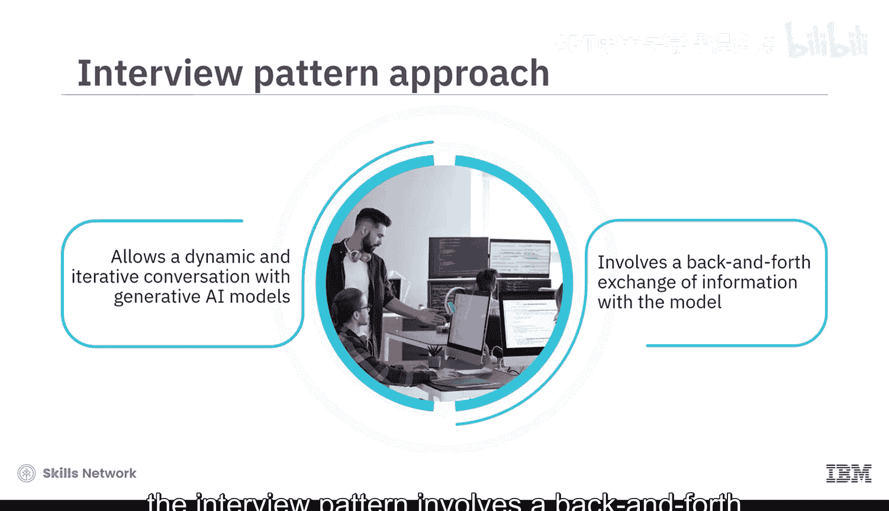

### 访谈模式方法
**访谈模式**方法允许与生成式AI模型进行动态、迭代的对话。它不是提供单一的静态提示，而是涉及与模型进行来回的信息交换，这有助于实时澄清查询并引导模型的响应。

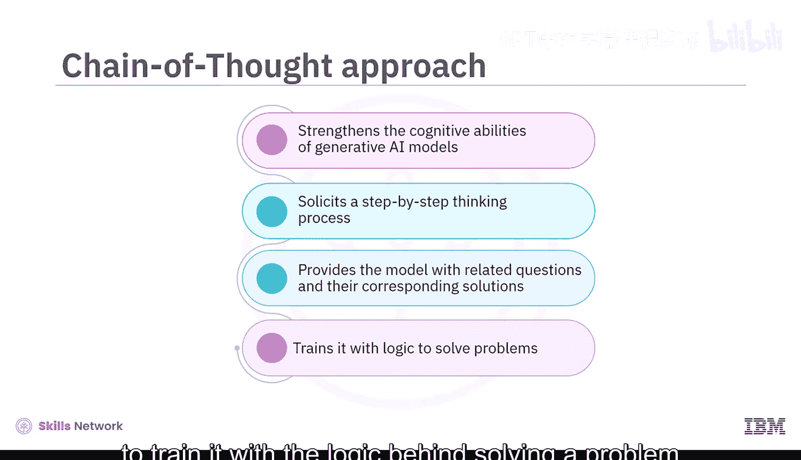

### 思维链方法
**思维链**方法增强了生成式AI模型的认知能力。它引导模型进行逐步的思考过程。通过向AI模型提供相关的问题及其对应的解决方案，训练其理解解决问题背后的逻辑，使其能够解决其他类似问题。

### 思维树方法
**思维树**方法是一种创新技术，建立在思维链方法之上。它涉及以分层结构构建提示，以指导模型的推理和输出生成。这使得模型能够同时探索各种可能性和想法，像决策树一样分支展开。

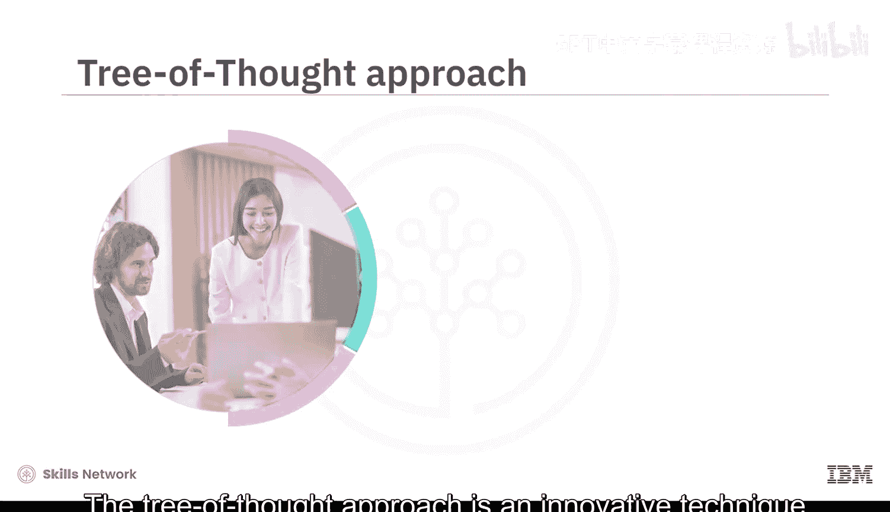

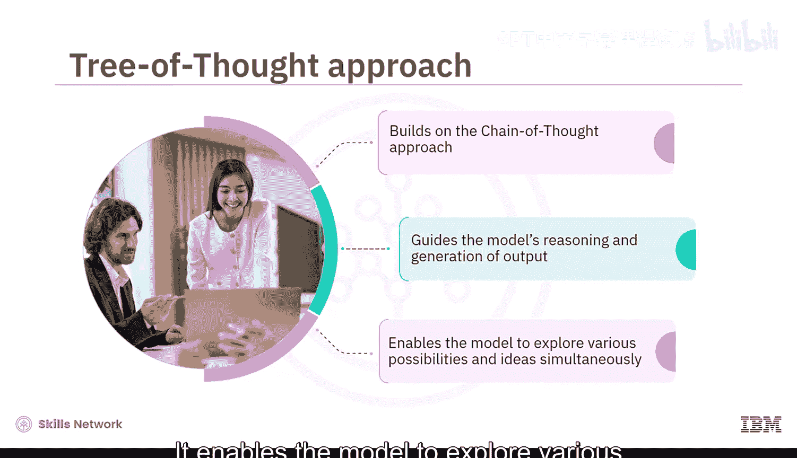

### 多模态提示
**多模态提示**通过整合多种输入类型（如文本、图像和音频）来扩展生成式AI的能力，从而在不同场景中实现更丰富、更准确的理解、互动和创造力。

### 对弈方法
**对弈方法**涉及生成多个提示-响应对，并根据清晰度、精确度和上下文相关性等标准对它们进行评估。这种迭代方法有助于持续改进提示设计。

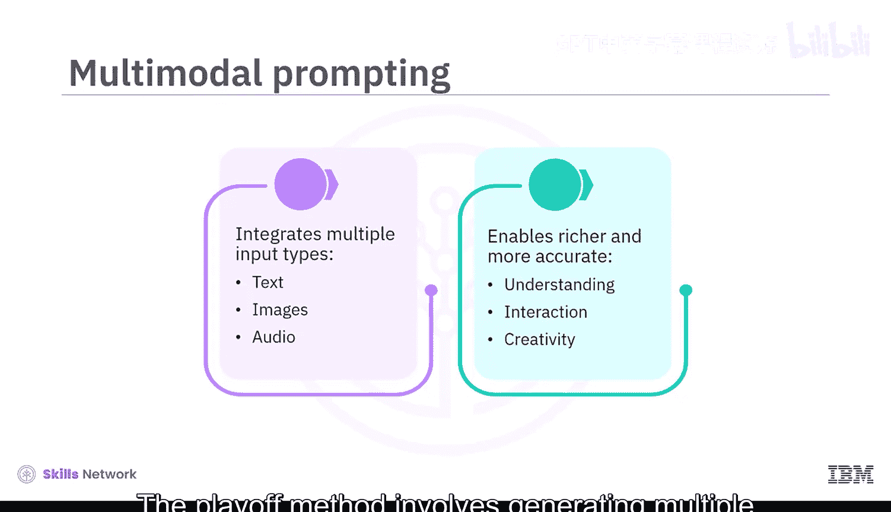

### 图像提示技术
图像提示技术增强了通过生成式AI模型获得的图像的影响力，使其更具说服力和吸引力。常用的图像提示技术包括：
*   **风格修饰符**
*   **质量增强器**
*   **重复**
*   **加权术语**
*   **固定形态生成**

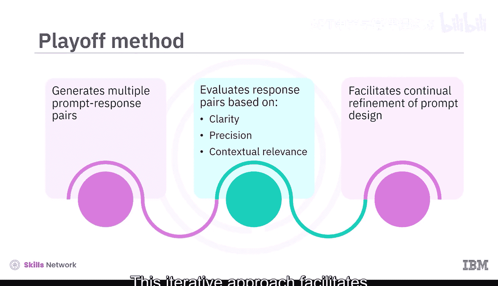

## 实践与项目

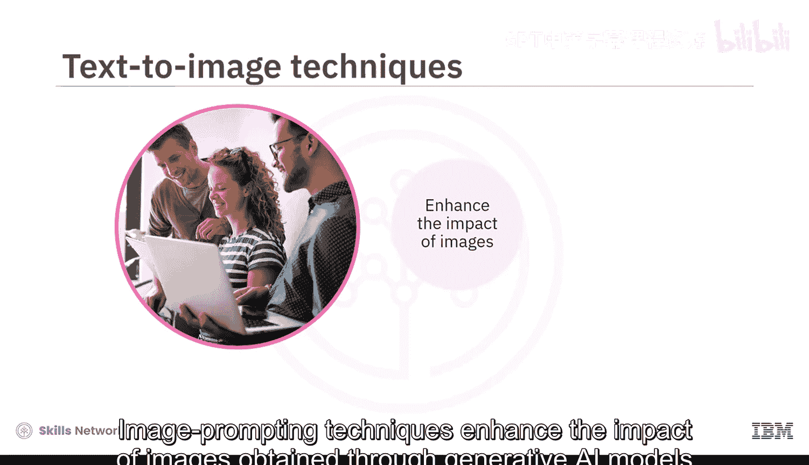

现在你已经回顾了本课程涵盖的基本概念。请记住查阅课程末尾的术语表，以复习讨论过的关键术语及其定义。

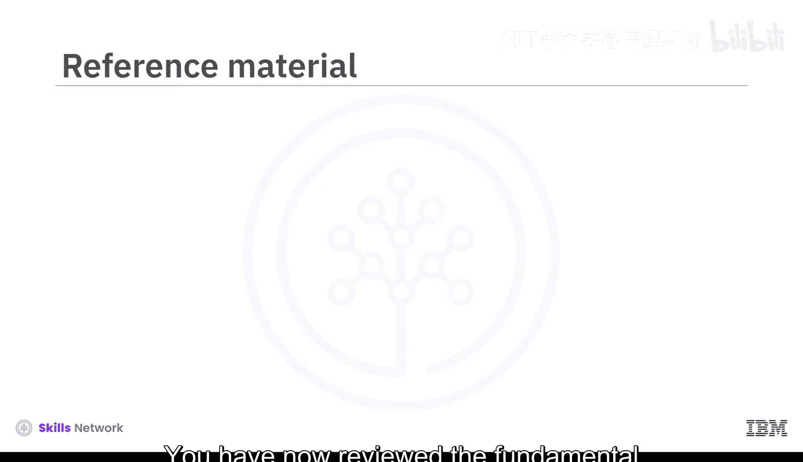

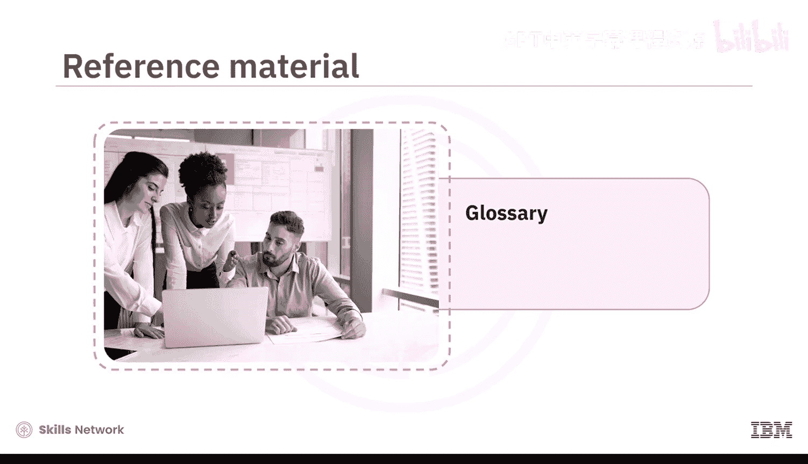

本课程包含实践实验和一个最终项目。通过完成实验，你获得了以下主题的实践经验：
*   熟悉我们的AI提示工具。
*   尝试基础提示和角色扮演模式。
*   提示工程中的访谈提示方法。
*   提示工程中的思维链方法。
*   提示工程中的思维树方法。
*   多模态提示。
*   对弈方法。
*   用于图像生成的有效文本提示。

我们建议你继续实践在本课程中学到的概念。我们希望这些原则能磨练你的技能，并帮助你在职业生涯中取得进步。

## 总结

本节课中我们一起学习了提示工程的核心概念、多种高级技术以及最佳实践。你掌握了从构建基础提示到运用思维链、思维树等复杂方法的能力，并了解了多模态提示和对弈评估等前沿思路。通过课程中的实验，你将理论知识应用于实践。

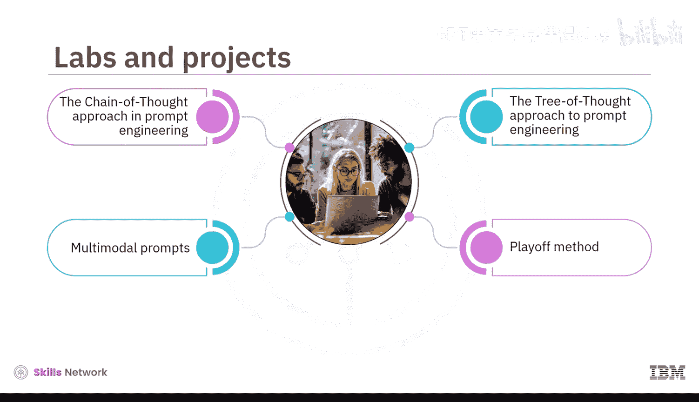

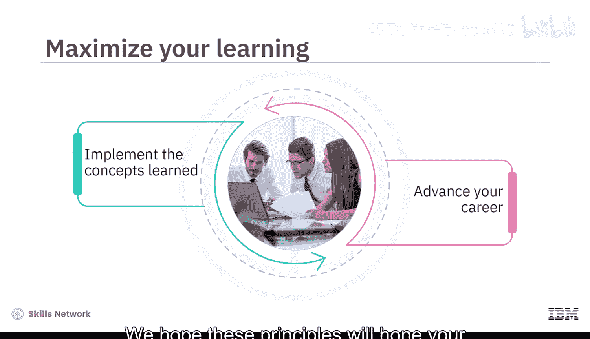

恭喜你完成本课程。我们感谢你参与这段学习旅程，并祝你一切顺利。