生成式AI基础：1.1：课程介绍

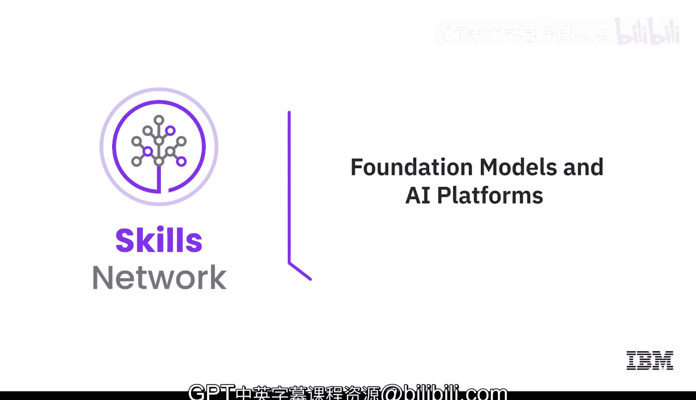

在本节课中，我们将要学习生成式AI，特别是基础模型，如何重塑全球各行各业。本课程将聚焦于生成式AI的核心原理，这些原理是创建强大AI模型、平台和应用的基础。掌握这些原理，可以最大化你的生成式AI学习体验。

本课程面向所有初学者，无论你是专业人士、爱好者、从业者还是学生。只要你对快速发展的生成式AI领域有真正的兴趣，这门课程就适合你。这是一门面向所有人的课程，无论你的背景或经验如何。

课程结束时，你将能够：
*   识别构成生成式AI基础的核心概念。
*   列举常用生成式AI模型的能力。
*   解释基础模型如何生成文本、图像和代码。
*   描述动态AI平台（如IBM Watson X和Hugging Face）的用途。

---

### 课程结构与内容

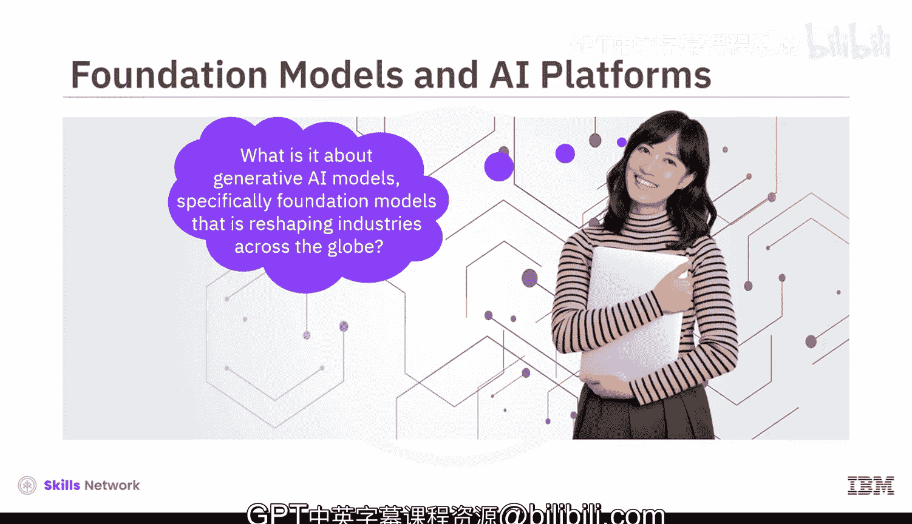

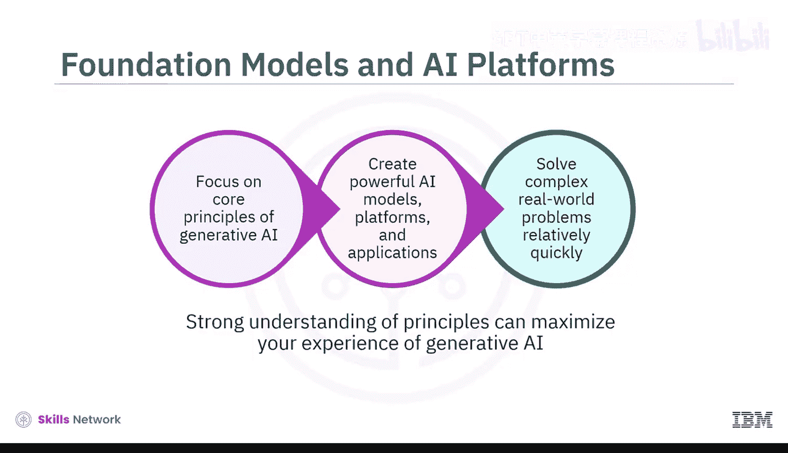

本课程是一个精炼课程，包含三个模块，预计每个模块需要1到2小时完成。

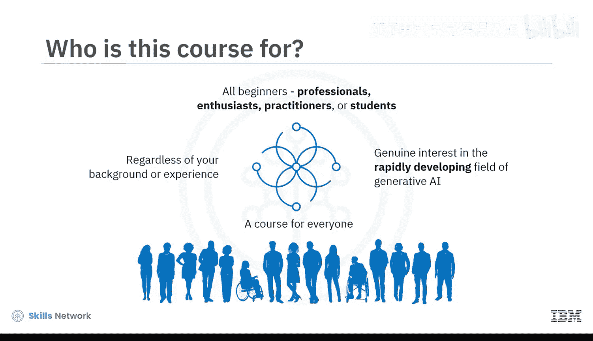

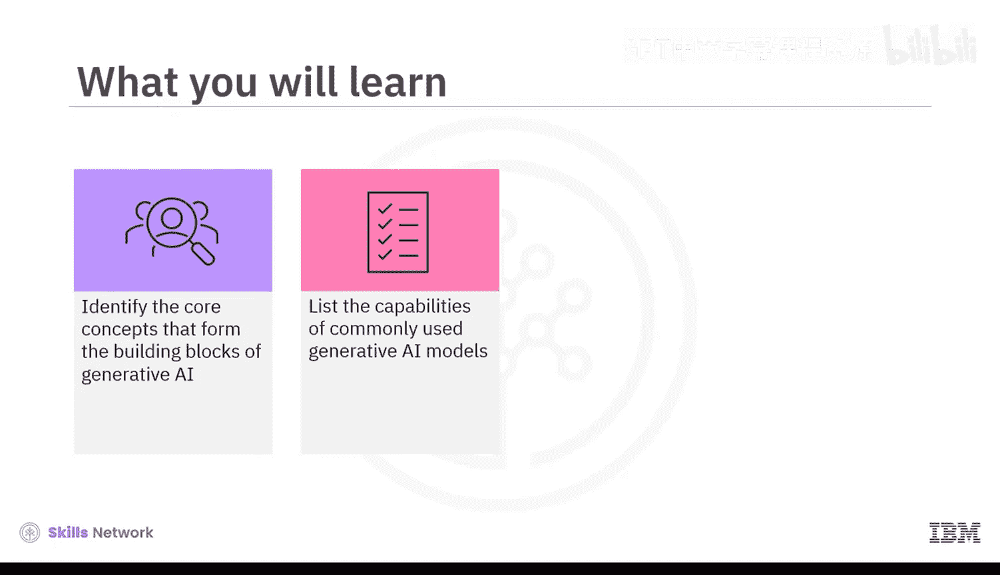

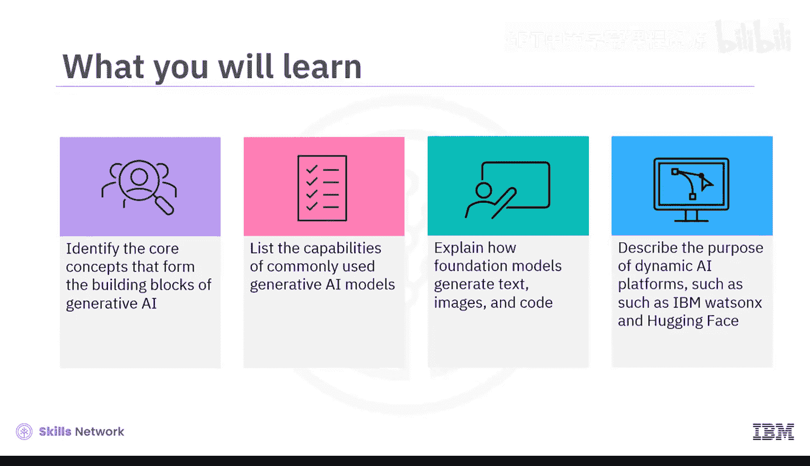

**模块一：核心原理与模型**

在模块一中，你将探索深度学习架构的原理与组件，并理解大型语言模型是如何创建的。你将区分常用生成式AI模型的能力，例如：
*   **变分自编码器**
*   **生成对抗网络**
*   **基于Transformer的模型**
*   **扩散模型**
*   **基础模型**

**模块二：模型应用与平台**

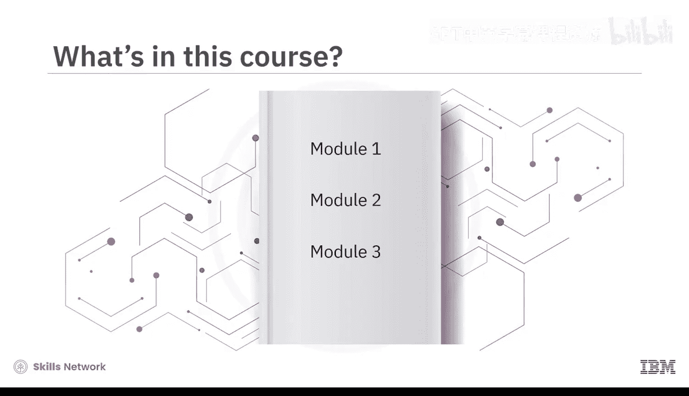

上一节我们介绍了核心模型，本节中我们来看看它们的具体应用。在模块二中，你将通过T5、双向自回归Transformer模型、Imagen和代码序列模型等实例，学习预训练基础模型如何生成文本、图像和代码。此外，你还将了解动态AI平台（如IBM Watson X和Hugging Face）如何帮助企业创造价值并获得竞争优势。

**模块三：实践与评估**

模块三要求你参与一个最终项目，并完成一个计分测验来检验你对课程概念的理解。你也可以访问课程术语表，并获得关于后续学习路径的指导。

---

### 学习资源与互动

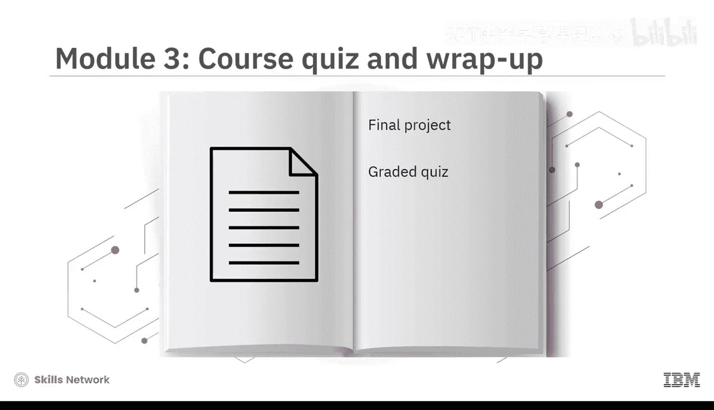

本课程融合了概念讲解视频和辅助阅读材料。观看所有视频以充分掌握学习材料的潜力。

以下是课程提供的实践与互动环节：
*   **动手实验**：你将体验展示基础模型能力的动手实验。
*   **最终项目**：在模块三中参与一个最终项目。
*   **练习测验**：每节课后都有练习测验，帮助你巩固学习。
*   **计分测验**：课程结束时需完成一个计分测验。
*   **讨论论坛**：提供讨论论坛，供你与课程工作人员联系并与同伴交流。
*   **专家观点视频**：通过专家观点视频，聆听经验丰富的从业者分享他们对课程所涵盖概念的见解。

---

### 总结

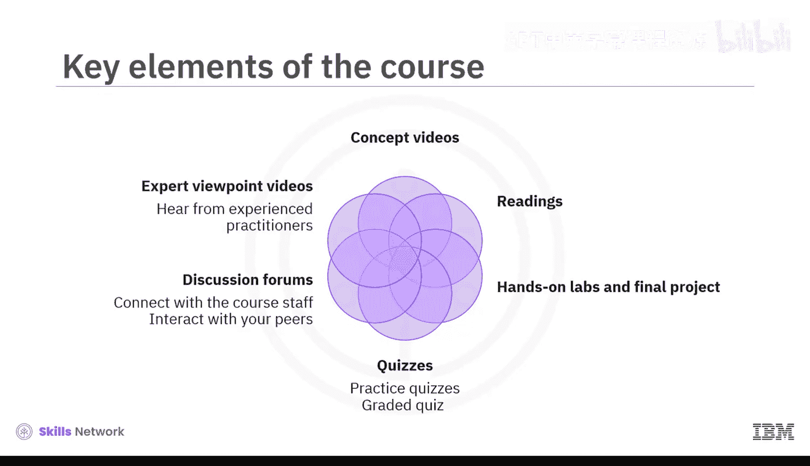

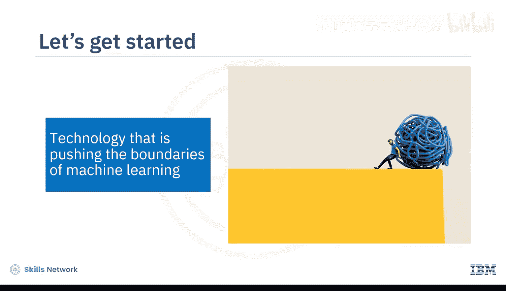

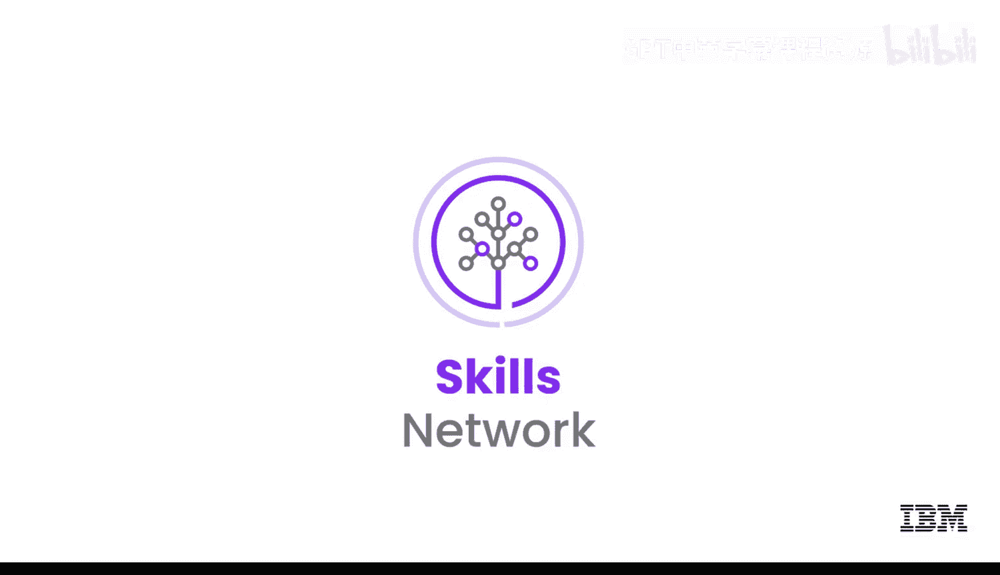

本节课中我们一起学习了《生成式AI基础》课程的整体框架、学习目标和内容结构。如果你一直想掌握这项正在突破机器学习边界的技术，那么你来对地方了。让我们开始学习吧。