# 032：深度学习与大型语言模型 🧠

在本节课中，我们将要学习生成式人工智能的核心概念，特别是深度学习与大型语言模型。我们将解释深度学习如何工作，并描述大型语言模型如何执行类人任务。

## 深度学习如何发生？

深度是通过层级结构创造的。你处理的信息层数越多，对周围世界的理解就越深入。这是人脑的工作方式，也是深度学习技术背后的驱动原理。

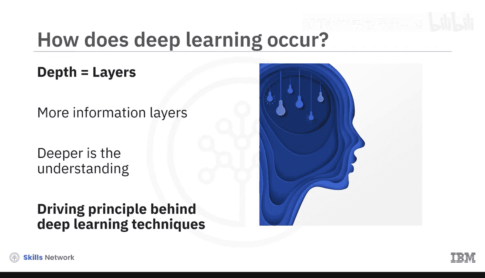

## 人工神经网络

人工神经网络是实现深度学习的关键。ANN由多个称为神经元的计算单元组成，这些神经元组织在三个相连的层中：**输入层**、一个或多个**隐藏层**以及**输出层**。

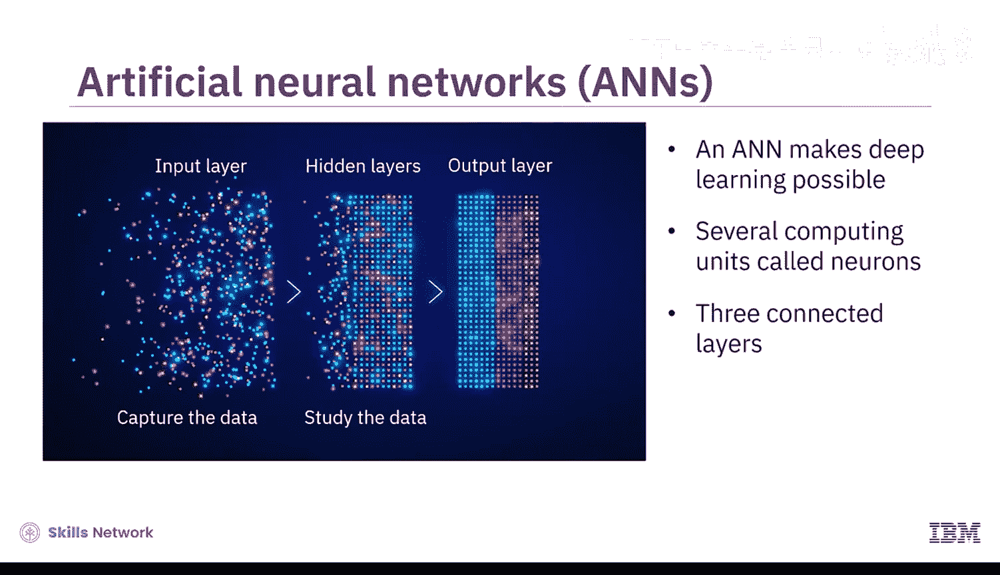

当一个庞大的数据集被输入网络时，输入层的神经元捕获数据，隐藏层的神经元随后研究这些数据。

## 参数：网络的内部变量

隐藏层中的每个神经元都包含固有的**偏置参数**；两个神经元之间的连接则建立了**权重参数**。

参数可以被定义为网络的内部值，随着神经元在庞大数据集上反复训练而得到优化。偏置和权重参数的数量越多，网络的计算能力就越强，从而带来更高的预测准确性。

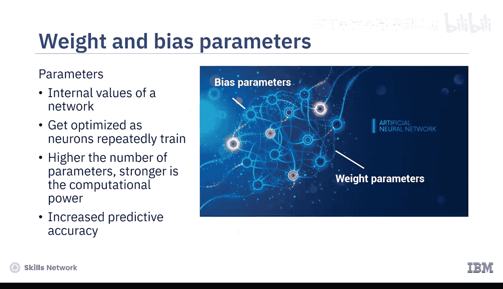

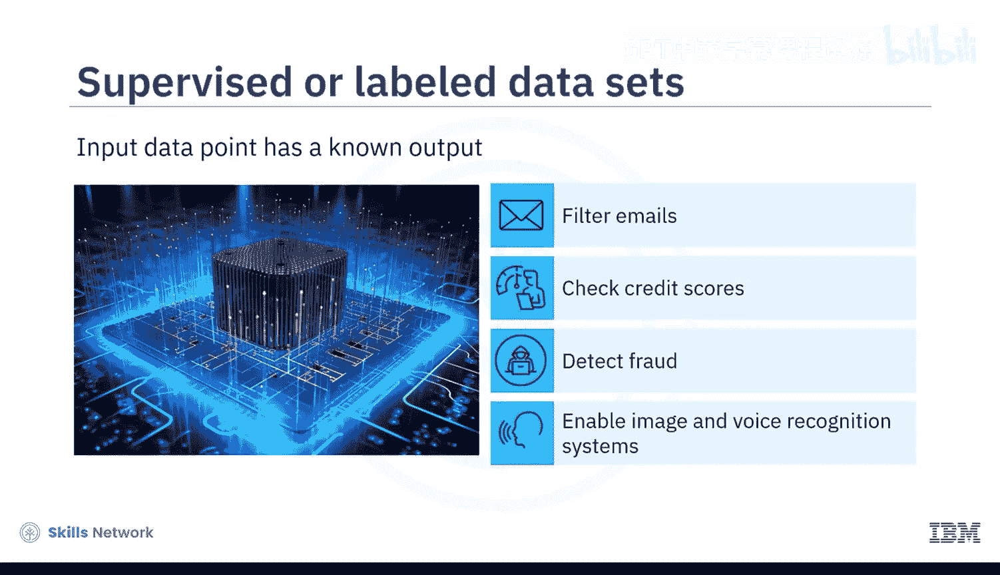

## 监督学习

有时，深度学习算法在**监督式**或**已标记**的数据集上进行训练，其中每个输入数据点都有已知的输出。这种监督学习有助于创建过滤电子邮件、检查信用评分、检测欺诈以及实现图像和语音识别系统的工具。

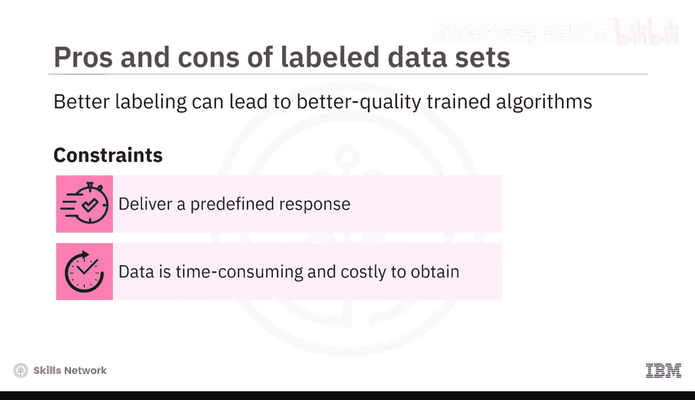

虽然更好的标记可以带来更高质量的算法训练，但它也引入了一些限制。监督学习算法被限制为只能提供预定义的响应，并且获取标记数据既耗时又昂贵。

## 无监督学习

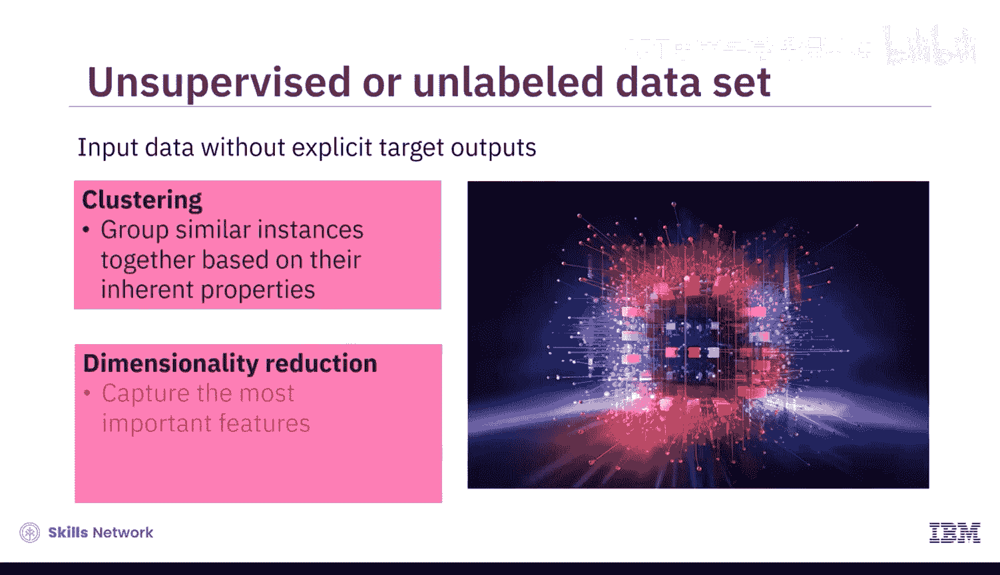

更常见的情况是，深度学习算法在**无监督**或**未标记**的数据上进行训练，其中训练数据由没有明确目标输出的输入数据组成。

以下是两种常见的无监督学习应用：

*   **聚类**：算法根据实例的固有属性将相似的实例分组在一起。
*   **降维**：算法捕获数据中最重要的特征，同时丢弃冗余或信息量较少的特征。

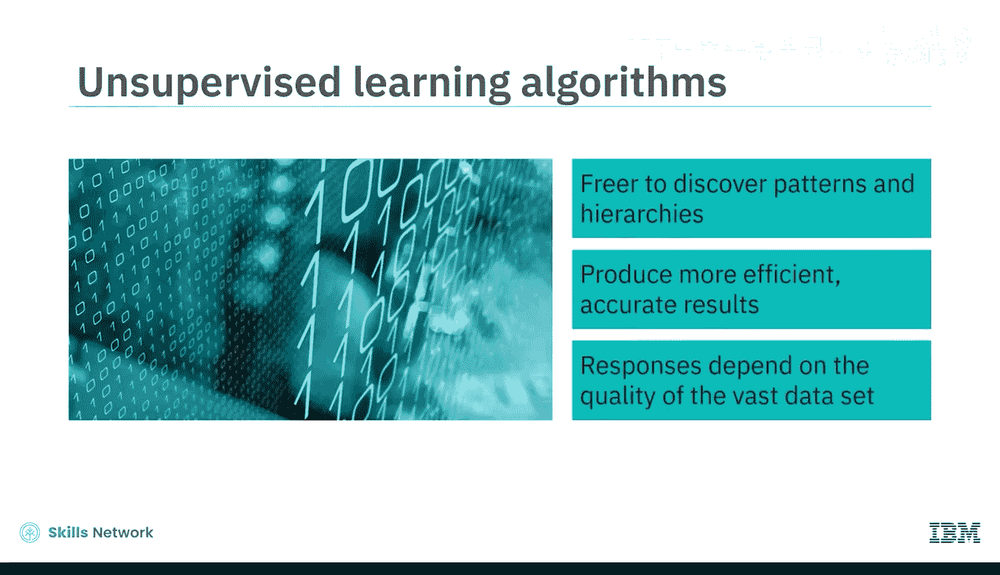

因此，无监督学习算法可以更自由地发现数据集内的模式和层次结构，从而产生更高效、更准确的结果。

这就是为什么深度学习算法产生高质量响应的能力，在很大程度上取决于它们被要求探索和查询的庞大数据集的质量。

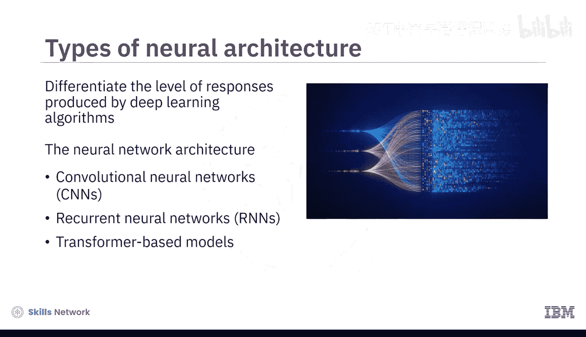

## 神经网络架构的影响

另一个可以区分深度学习算法响应水平的因素是神经网络架构。在深度学习中部署的架构会影响算法产生的响应。

主要有三种类型的深度学习架构被区别使用：

*   **卷积神经网络**：包含一系列层，每一层都对前一层进行卷积或数学运算。当应用于基于网格的数据（如图像）时，CNN可以快速从图像中提取有用信息，以识别模式、分类图像和分割图片。CNN在图像处理、视频识别和自然语言处理中很有用。
*   **循环神经网络**：更擅长处理序列数据，如文本或语音。它们拥有一个记忆组件，使其能够捕获随时间变化的依赖关系和上下文信息。RNN在机器翻译、情感分析和语音识别中很有用。
*   **基于Transformer的模型**：不使用卷积或循环来处理数据。相反，它们具有一个双栈结构，其中编码器和解码器处理异常大量的参数，以更深入地理解语言模式。

## 大型语言模型的诞生

Transformer中的深度学习算法可以分析和捕获层次序列中单词的上下文和含义，并预测输出序列中的下一个单词。

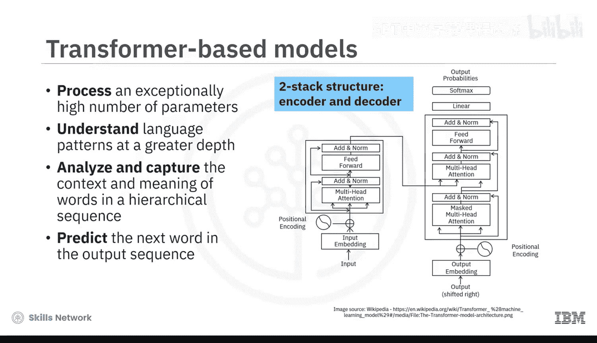

其结果就是创建了能够执行自然语言处理任务的大型语言模型，例如内容生成、预测分析、语言翻译和流程自动化。这些**大型语言模型**构成了生成式AI应用的基础机制。

LLM的示例包括OpenAI的生成式预训练Transformer **GPT-3**和**GPT-4**、Google的**PaLM 2**以及Meta的**Llama**。

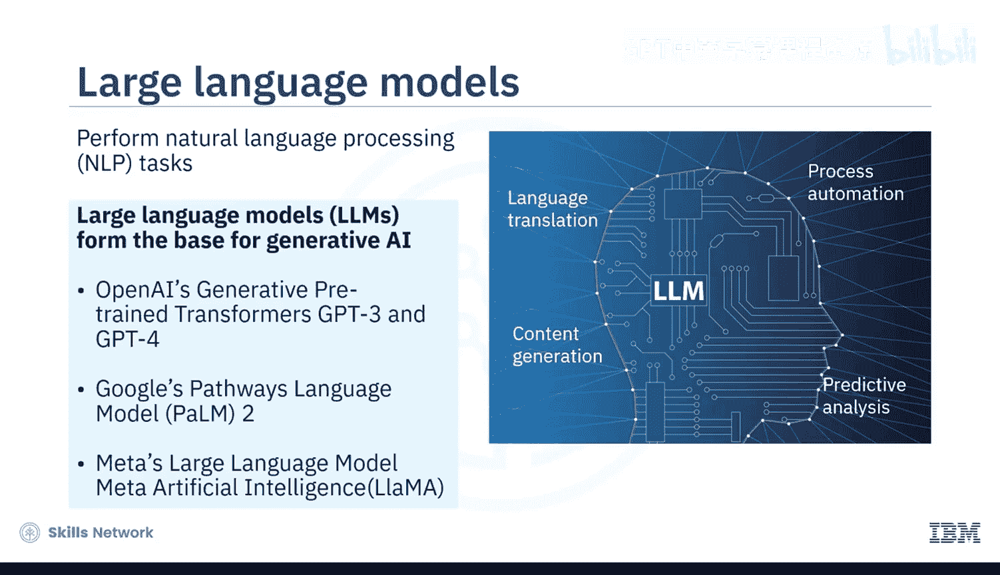

## 实例：GPT-4

例如，GPT-4是一个语言处理AI，它基于互联网上海量的文本数据（包括书籍、文章和网站）进行训练。该模型拥有超过**170万亿个参数**。这帮助它执行自然语言处理任务，例如创建内容、建立对话系统和翻译语言。

人们利用这些能力来撰写高质量的论文和案例报告，或进行机器翻译和摘要。组织则利用这些能力来驱动聊天机器人和虚拟代理，甚至将国际商务通信或其网站内容翻译成当地语言。

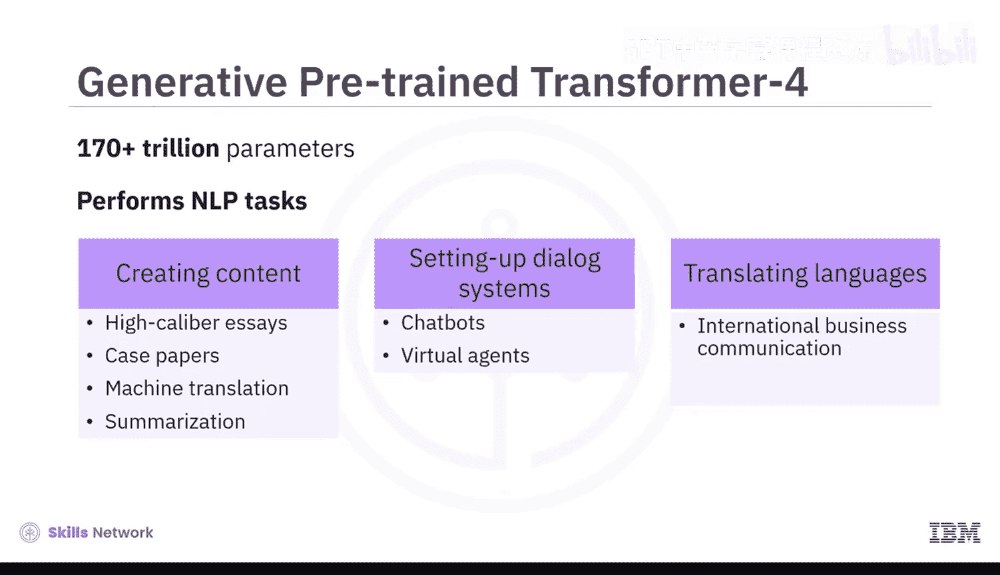

## 未来展望

随着深度学习架构和技术的演进，LLM也将更努力地思考，以提供更准确和可接受的结果，帮助生成式AI模型执行日益复杂的任务。

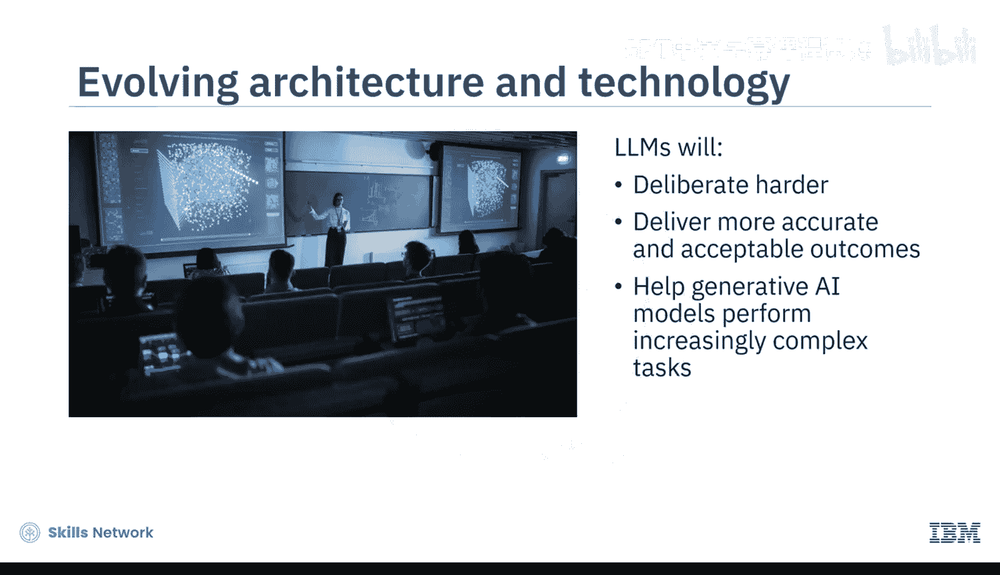

## 总结

本节课中，我们一起学习了生成式AI的核心概念，并理解了大型语言模型如何执行类人任务。LLM利用Transformer网络的力量，在庞大的数据集上对深度学习算法进行预训练。这些算法捕获数据集内的模式和层次结构，以生成准确的类人响应。这项技术使得生成式AI具有可扩展性。

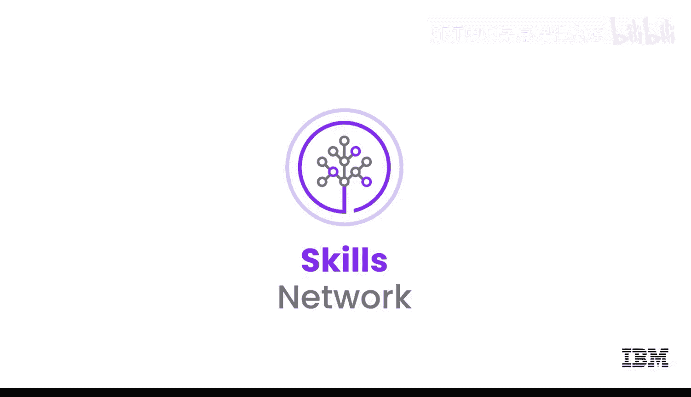

