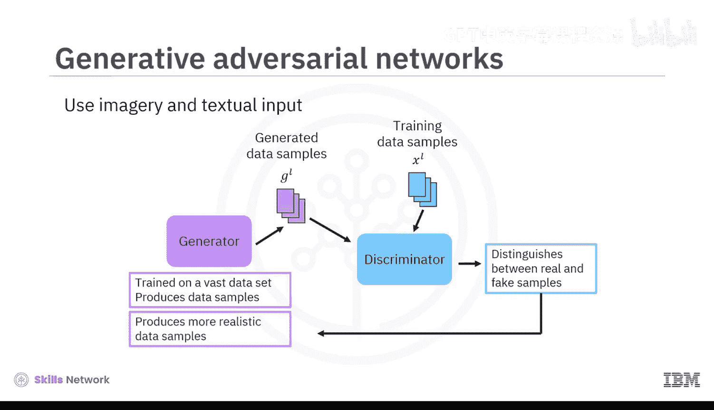
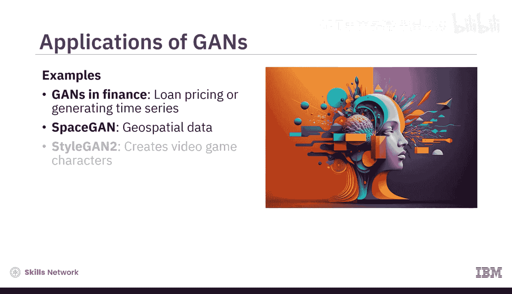
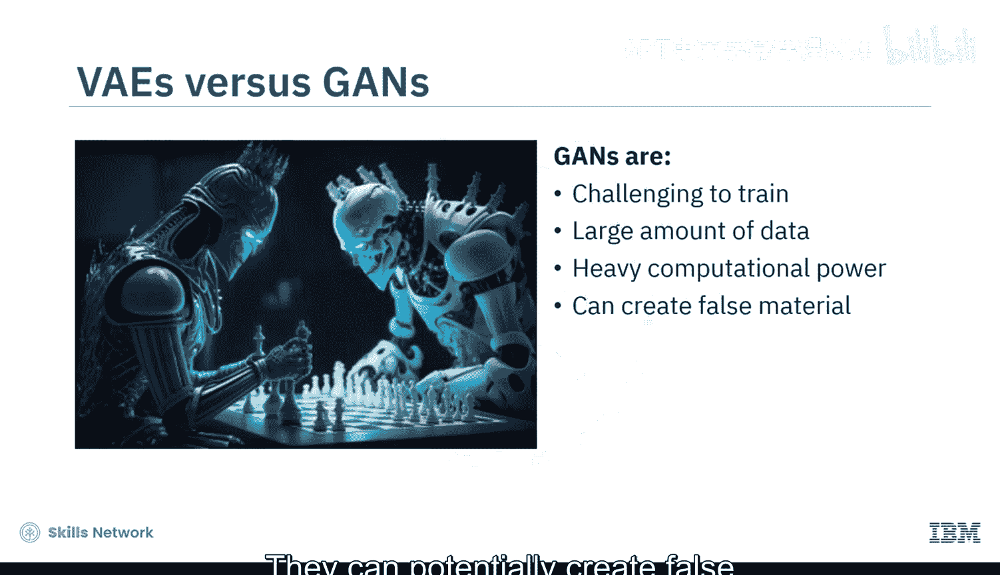
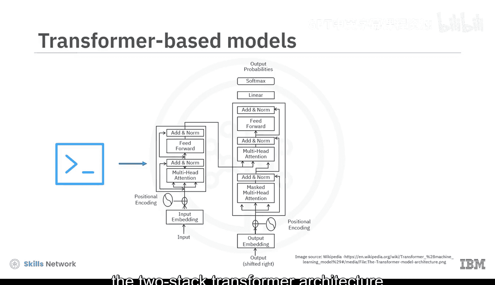
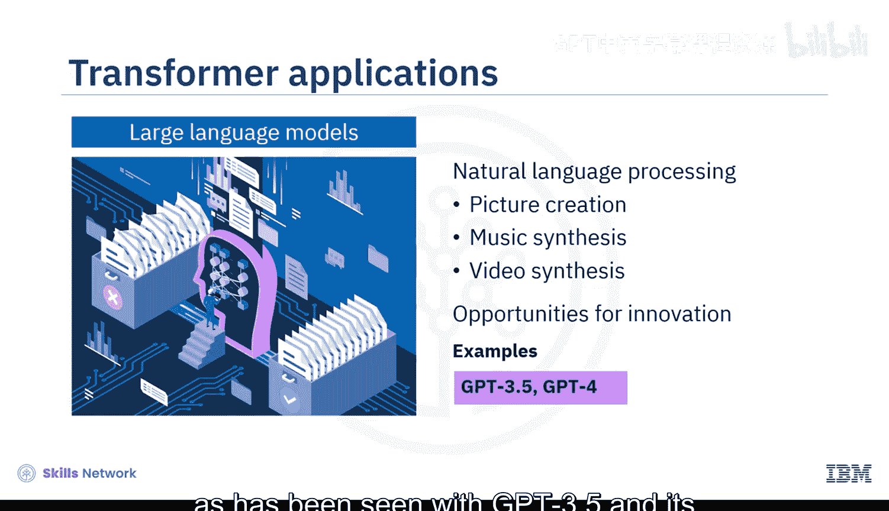
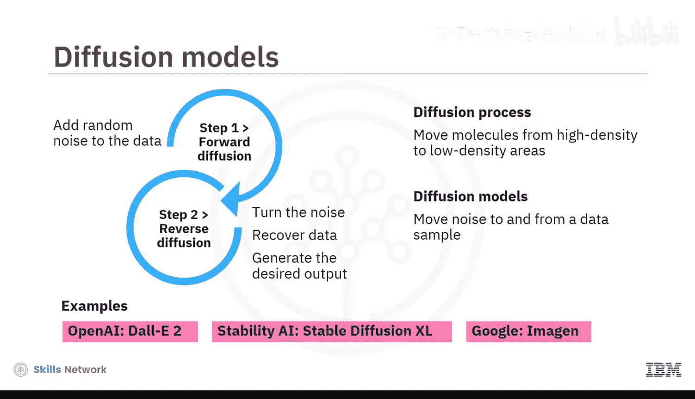
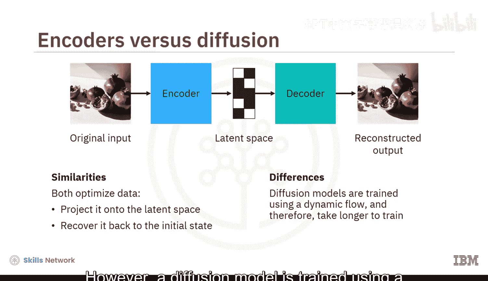
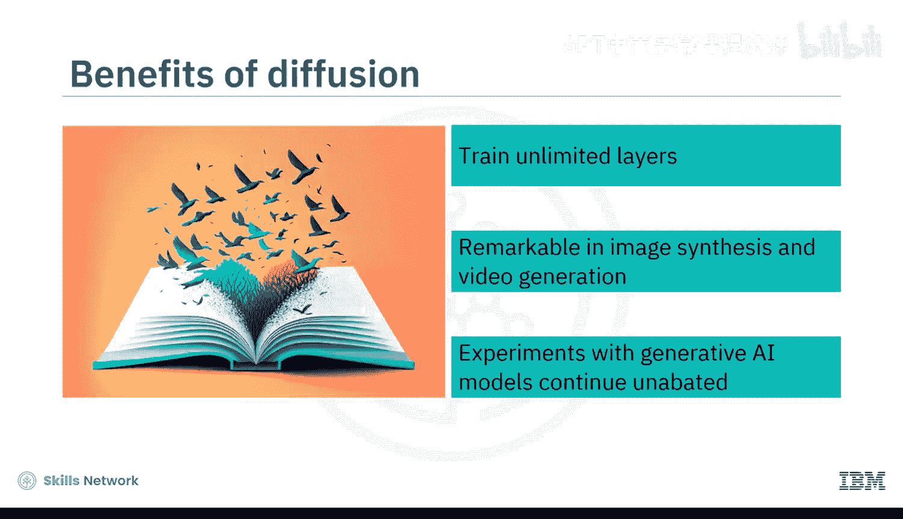

生成式AI基础：03：生成式人工智能模型 🧠

在本节课中，我们将学习生成式人工智能的核心模型。这些模型是构建生成式AI应用的基石，每种模型都有其独特的工作原理和应用特点。

生成式AI领域有四个模型产生了重大影响：变分自编码器、生成对抗网络、基于Transformer的模型以及扩散模型。每个模型都采用了不同类型的深度学习架构并应用了概率技术。接下来，我们将深入了解它们的工作原理。

### 变分自编码器

变分自编码器是所有生成式AI模型中最受欢迎的，原因有二：第一，它们能处理多样化的训练数据，如图像、文本和音频；第二，它们能快速降低图像、文本或音频的维度，以创建更新、改进的版本。

以下是其工作原理的简要介绍：

1.  **编码器**：这是一个自给自足的神经网络，它研究输入数据的概率分布。简单来说，这意味着它会分离出最有用的数据变量。这使得编码器能够创建数据样本的压缩表示，并将其存储在**潜在空间**中。你可以将潜在空间视为模型架构内的一个数学空间，其中高维数据以压缩格式表示。
2.  **解码器**：或称反向编码器，同样是一个自给自足的神经网络，它将潜在空间中的压缩表示解压缩，以生成期望的输出。

基本上，算法使用**最大似然原理**进行训练，这意味着它们试图最小化原始输入数据与重建输出之间的差异。

尽管变分自编码器在静态环境中训练，但其潜在空间是连续的。因此，它们可以通过从数据的概率分布中随机采样来生成新样本。由于它们能用少量训练数据生成逼真且多样的图像，变分自编码器被用于图像合成、数据压缩和异常检测等任务。

例如，娱乐行业使用变分自编码器创建游戏地图和动漫头像；金融行业使用它们预测股票的波动率曲面；医疗保健领域则利用变分自编码器通过心电图信号检测疾病。

### 生成对抗网络

生成对抗网络是另一种使用图像和文本输入数据的生成式AI模型。在这个模型中，两个卷积神经网络在对抗性游戏中相互竞争。

以下是其核心机制：

*   一个CNN扮演**生成器**的角色，在大量数据集上训练以产生数据样本。
*   另一个CNN扮演**判别器**的角色，试图根据判别器的响应来区分真实样本和伪造样本。

基于判别器的反馈，生成器力求产生更逼真的数据样本。生成对抗网络可以生成新的逼真图像、执行风格迁移或图像到图像的转换，甚至创建深度伪造内容。

金融行业使用生成对抗网络训练贷款定价模型或生成时间序列工具。例如，SpaceGAN处理地理空间数据，而Video StyleGAN2以创建视频游戏角色而闻名。

与变分自编码器不同，生成对抗网络的训练可能具有挑战性，因为它们需要大量数据和强大的计算能力。它们还可能产生虚假材料，这是一个伦理问题。

### 基于Transformer的模型

基于Transformer的模型在几年前被引入，当时循环神经网络开始面临一个称为“梯度消失”的问题。由于这个问题，循环神经网络难以处理长文本序列。

为了应对这一挑战，Transformer被构建出来，它带有**注意力机制**，能够聚焦于文本中最有价值的部分，同时过滤掉不必要的元素。这使得Transformer能够对文本中的长期依赖关系进行建模。

例如，当你输入一个简单的提示时，双栈Transformer架构使用编码器-解码器机制来生成连贯且与上下文相关的文本。由于Transformer模型可以查询广泛的数据库，它们能够创建大型语言模型并执行自然语言处理任务，如图片创建、音乐合成甚至视频合成。

这标志着我们在内容创作方法上的重大突破，并为创新提供了许多机会，正如我们在GPT-3.5及其版本、BERT和T5中所看到的那样。

### 扩散模型

扩散模型是生成式AI模型世界中较新的成员。它们通过应用扩散原理，解决了因潜在空间中的噪声而导致的数据系统性衰减问题。这些模型试图防止信息丢失。

就像在扩散过程中分子从高密度区域移动到低密度区域一样，扩散模型使用两步过程将噪声移入和移出数据样本：

1.  **前向扩散**：算法逐渐向训练数据添加随机噪声。
2.  **反向扩散**：算法逆转噪声以恢复数据并生成期望的输出。

OpenAI的DALL-E 2、Stability AI的Stable Diffusion、XL以及Google的Imagen都是成熟的扩散模型，能够生成高质量的图形内容。

与变分自编码器类似，扩散模型也试图通过首先将数据投影到潜在空间，然后将其恢复回初始状态来优化数据。然而，扩散模型使用动态流进行训练，因此训练时间更长。

那么，为什么这些模型被认为是创建生成式AI模型的最佳选择？因为它们训练了数百层，甚至可能是无限数量的层，并且在图像合成和视频生成的实验中显示出显著的效果。

随着无监督算法不断带来惊喜，对生成式AI模型的实验仍在持续进行。

### 总结

本节课中，我们一起学习了作为生成式AI基石的四个核心模型：**变分自编码器**能快速降低样本维度；**生成对抗网络**利用竞争网络产生逼真样本；**基于Transformer的模型**使用注意力机制对文本长期依赖关系进行建模；**扩散模型**则通过消除潜在空间中的噪声来解决信息衰减问题。理解这些模型是掌握生成式AI技术的关键第一步。