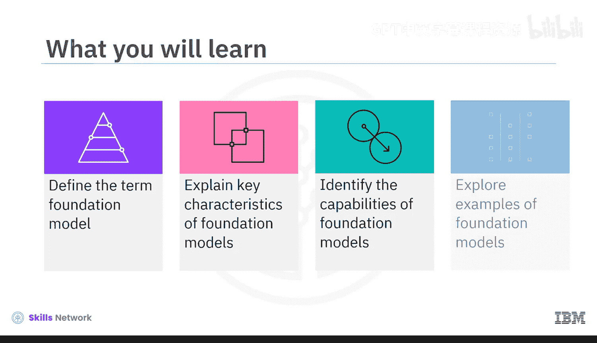
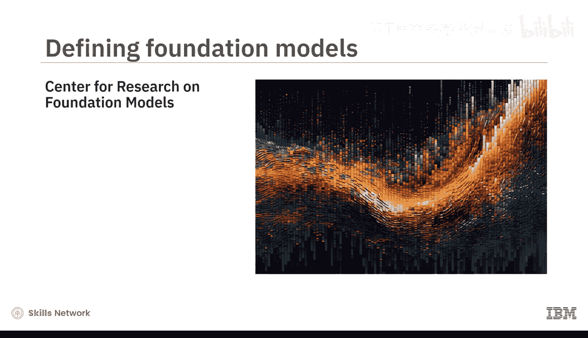
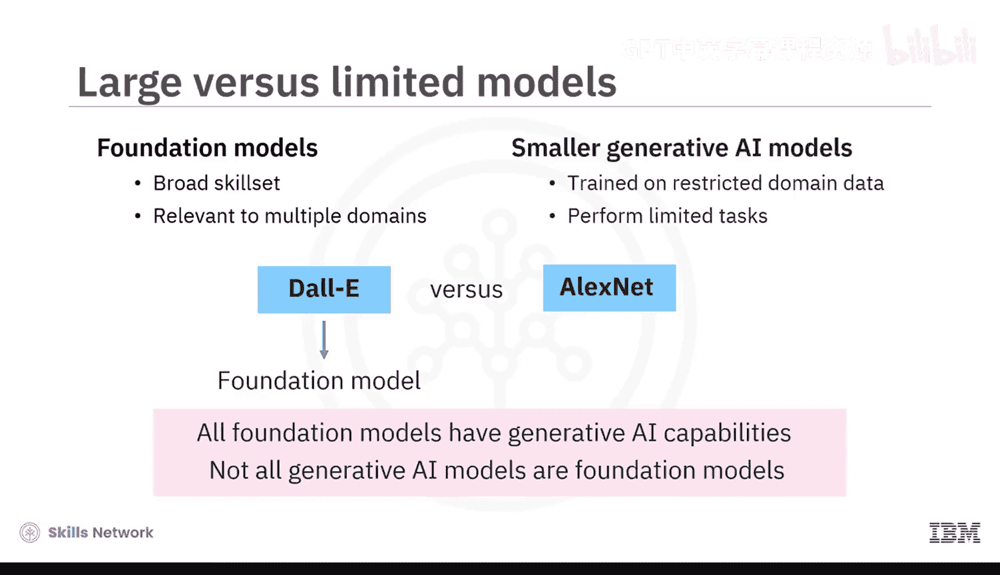
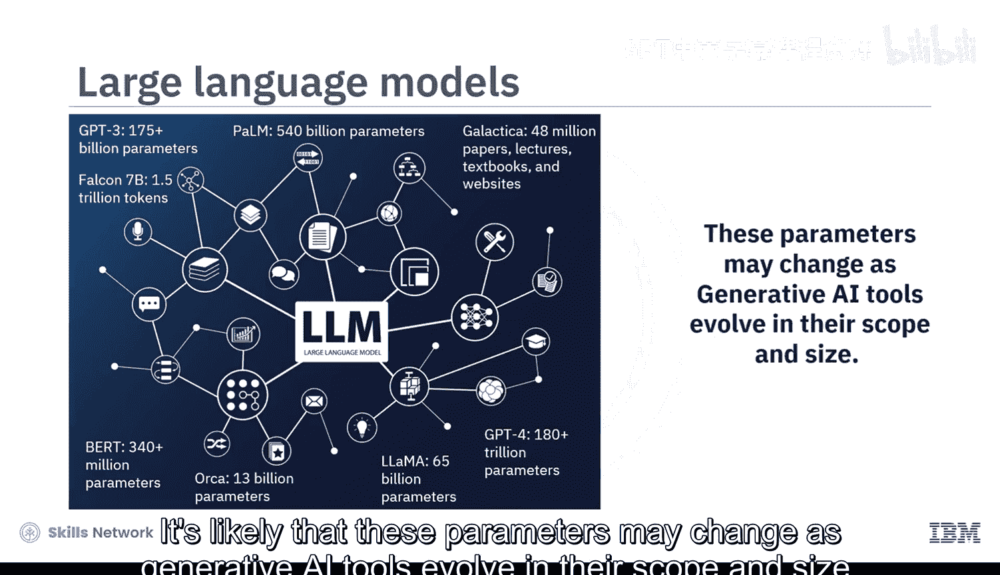
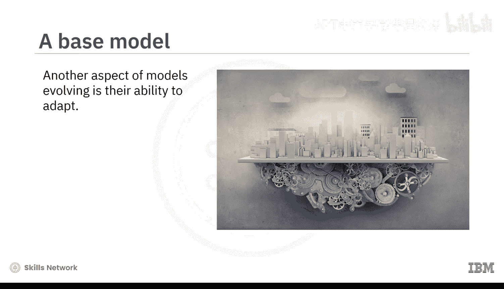
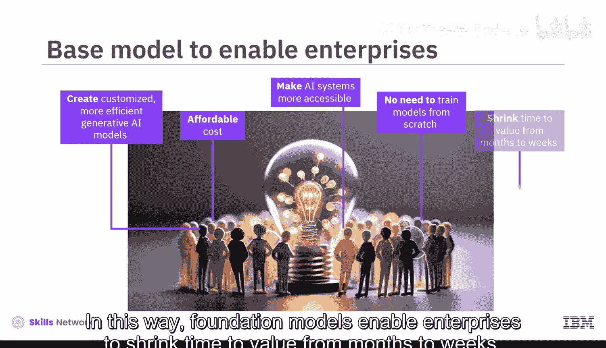
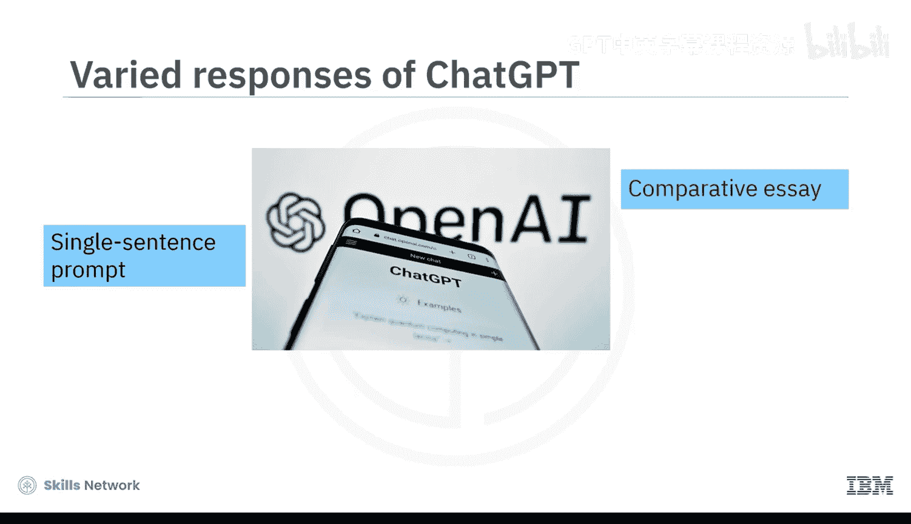
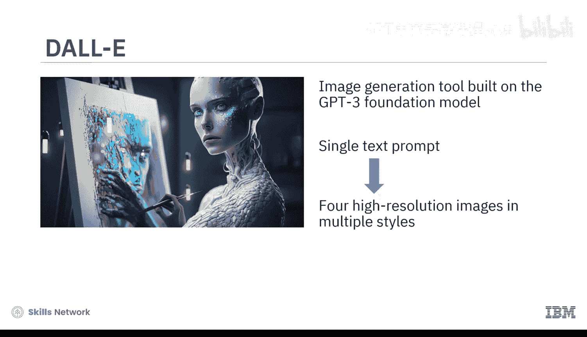
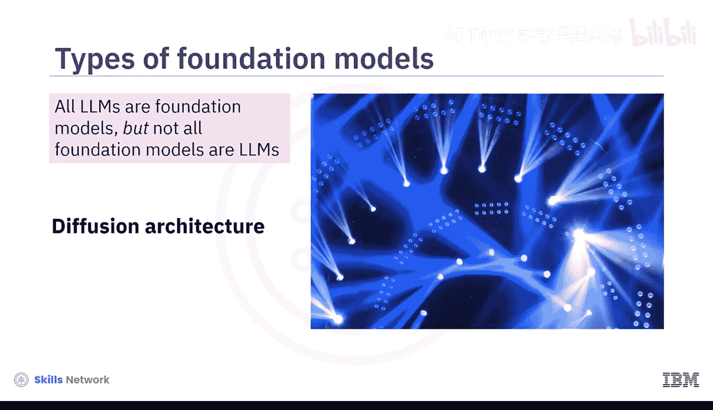
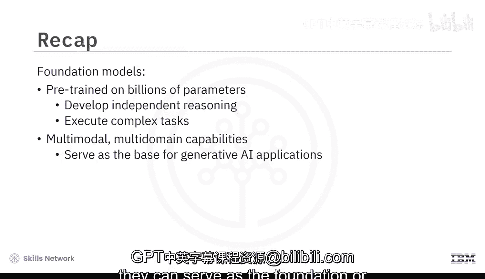

# 034：基础模型 🧠

在本节课中，我们将要学习**基础模型**的核心概念。我们将了解其定义、关键特征、能力，并通过实例来加深理解。

---

## 概述

斯坦福大学基础模型研究中心将基础模型定义为一种构建AI系统的新范式：**在一个海量数据集上训练一个模型，并将其适配到多种应用中**。我们称这样的模型为基础模型。

接下来，让我们深入探讨这个定义。

---

## 定义解析：海量数据训练

定义的第一部分指出，基础模型是在**海量数据**上训练的。其运作方式如下：

基础模型是一个大型、通用目的、自监督的模型。它通过**预训练**在大量无标签数据上，建立了数十亿甚至数万亿的参数。

**预训练**是一种技术，在此期间，无监督算法被反复赋予自由，在不同信息片段之间建立联系。这使得基础模型能够发展出**多模态、多领域**的能力。

以下是基础模型的关键特征：

*   **多模态输入**：它们可以接受文本、图像、音频或视频等多种形式的输入提示。
*   **复杂任务执行**：它们能够执行复杂且富有创造性的任务，例如回答问题、总结文档、撰写文章、解方程、从图像中提取信息，甚至编写代码。
*   **广泛适用性**：这种广泛的技能组合使这些模型与多个领域相关。

这与较小的生成式AI模型形成对比，后者通常在受限的领域数据上训练，并被要求执行有限的任务。

例如，OpenAI的DALL-E系列模型被认为是基础模型，因为它们可以执行许多与图像相关的任务。相比之下，AlexNet不被归类为基础模型，因为它只执行图像分类任务。

因此，我们可以明确：**虽然所有基础模型都具有生成式AI能力，但并非所有生成式AI模型都是基础模型**。

---

## 大型语言模型

当基础模型在庞大的自然语言处理数据库上进行训练时，它们被称为**大型语言模型**。

LLMs发展出了独立的推理能力，使它们能够独特地响应查询。例如：

*   OpenAI的GPT模型家族，包括预训练了超过1750亿参数的GPT-3，以及估计预训练了超过180万亿参数的GPT-4。
*   谷歌的PaLM模型，预训练了5400亿参数。
*   Meta的LLaMA模型，预训练了650亿参数。
*   谷歌的BERT模型，预训练了超过3.4亿参数。
*   Meta的Galactica（面向科学家的LLM），在4800万篇论文、讲义、教科书和网站内容上预训练。
*   阿联酋技术创新研究所的Falcon-7B，在1.5万亿个词元上预训练。
*   微软的Orca模型，预训练了130亿参数，小到可以在笔记本电脑上运行。

随着生成式AI工具在范围和规模上的发展，这些参数很可能会发生变化。

---

## 定义解析：适配多种应用

定义的另一个方面是，我们可以将基础模型**适配到许多应用**中。

这是可能的，因为基础模型的广泛训练使其能够学习新事物并适应新情况。小型企业可以利用这种能力，以可承受的成本创建定制化、更高效的生成式AI模型。

这就是为什么基础模型也被称为**基础模型**。它们帮助那些没有资源从头开始训练自己模型的企业和个人更容易地使用AI系统。通过这种方式，基础模型使企业能够将价值实现时间从数月缩短到数周。

以聊天机器人的演进为例。OpenAI的GPT-3和GPT-4基础模型驱动了ChatGPT聊天机器人。谷歌的PaLM模型驱动了Google Bard聊天机器人。这些都是当今异常聪明的聊天机器人。

然而，回想早期聊天机器人的运作方式，我们意识到它们是在较小的数据集上训练的，这限制了它们的生成能力。它们只能基于关键词预测回复，并且只能提供预定的响应。

相比之下，今天的聊天机器人在广泛的数据集上进行了多次预训练。因此，它们能够提高词语预测的准确性，并以更有帮助和创造性的方式回应。你可以尝试一下：如果你在ChatGPT中输入一个简单的句子提示，你很可能会得到不止一个基本回复。根据你的提示要求，聊天机器人可能会撰写一篇比较论文、创建一个信息图、设计一个清单或编写一个短篇故事。

OpenAI的GPT-3也是图像生成工具DALL-E的基础模型。对于单个文本提示，DALL-E可以生成四种高分辨率图像，支持多种风格，包括照片级真实图像和绘画。

这里需要澄清另一点：**虽然所有大型语言模型都是基础模型，但并非所有基础模型都是大型语言模型**。

---

## 其他架构：扩散模型

一些基础模型使用**扩散架构**能力来提高其图像生成的规模和范围。例如：

*   DALL-E使用Transformer架构，但其最新版本使用扩散模型从文本生成图像。
*   Stability AI的Stable Diffusion使用扩散架构，根据用户的描述生成高分辨率图像，风格可以是写实、卡通或抽象。
*   谷歌的Imagen使用基于LLM构建的级联扩散模型，从文本提示生成图像。

---

## 局限性与注意事项

随着基础模型在其优势和应用方面的发展，我们也看到了一些局限性：

1.  **偏见风险**：如果训练基础模型的数据存在偏见，那么期望的输出也可能带有偏见。
2.  **幻觉问题**：LLMs可能会产生“幻觉”响应，这意味着它们会生成虚假信息，因为它们误解了数据集中数据参数的上下文。

因此，**你必须谨慎地验证生成式AI聊天机器人输出的准确性**。只要稍加注意，你就可以享受基础模型带来的诸多好处。

---

## 总结

本节课中，我们一起探索了基础模型的概念。这些模型在数十亿参数上进行预训练，使其能够发展独立推理能力并执行大量复杂任务。鉴于其多模态、多领域的能力，它们可以作为生成式AI应用的**基础或基石**。