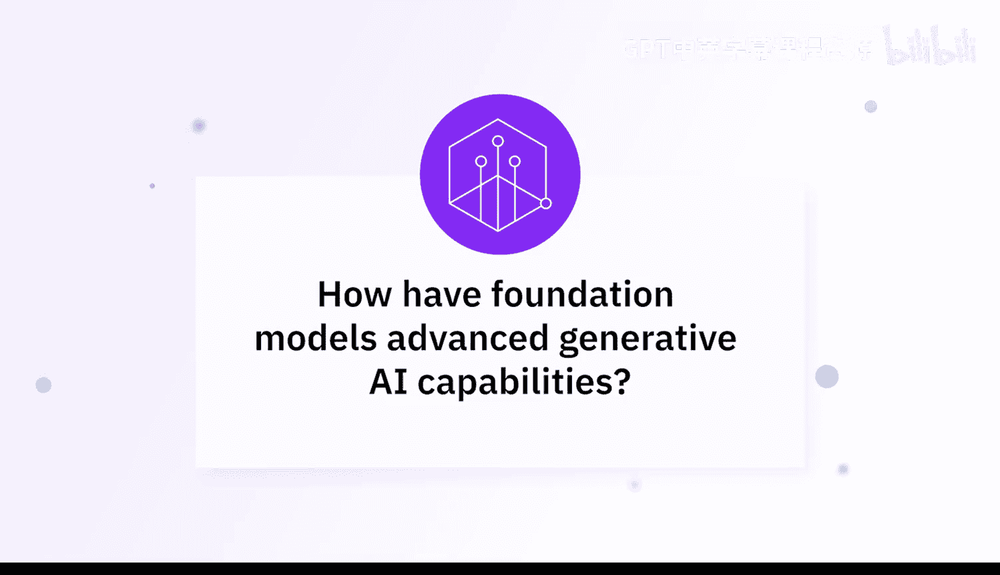
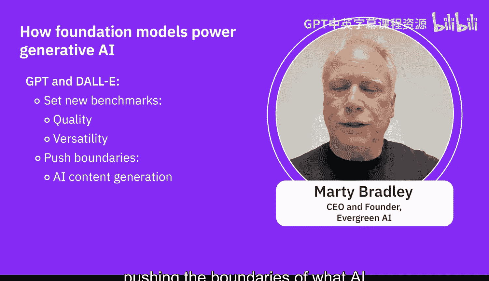
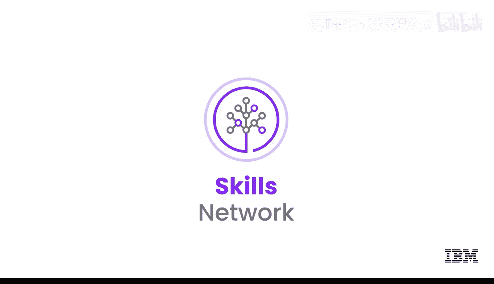

# 035：推进生成式人工智能能力 🚀

在本节课中，我们将通过专家的视角，了解以GPT和DALL-E为代表的基础模型是如何显著推进生成式AI领域发展的。我们将探讨它们的技术原理、应用场景以及随之而来的伦理考量。

---

## 基础模型的突破性进展

上一节我们介绍了生成式AI的基本概念，本节中我们来看看具体模型的贡献。GPT和DALL-E等基础模型通过展示生成高度连贯、符合语境的文本和图像的能力，极大地推动了该领域的发展。

具体而言，ChatGPT和DALL-E是两个帮助社区熟悉生成式AI概念的开源平台。这两个大型模型在庞大数据集上进行了训练，能够处理其领域内的许多不同用例和主题。

## 核心技术：Transformer与生成式预训练

关于Transformer架构的研究，最终将生成对抗网络（GANs）的概念与Transformer结合，从而诞生了**生成式预训练Transformer（GPT）**。其优势在于语言模型本身非常鲁棒。

对于一个经过预训练的Transformer（特别是自然语言处理管道）来说，生成人工或合成文本是一个非常受欢迎的选择。因为它已经用大量优质信息进行了预训练，能够生成看似完美的文本。

例如，ChatGPT可以处理许多不同的文本生成用例，并且非常通用，因为它在训练阶段接触过许多不同的数据集。DALL-E在图像生成方面同样具有创造性和广泛的适用性。

## 模型的应用与优势

以下是这些模型的核心应用与优势：

*   **GPT（生成式预训练Transformer）**：擅长生成类人文本。这使得聊天机器人、自动化内容创作、语言翻译等应用成为可能。
*   **DALL-E**：能够根据文本描述生成图像。它展示了AI在艺术、设计和广告等创意领域的潜力。

GPT模型是大型语言模型产业最重要的支柱之一，所有基于它的工具都非常流行。DALL-E则是一个基于自动编码器的软件，专门用于创建人工图像。两者都是各自应用领域内非常受欢迎的选择，它们所使用的生成式网络的预训练部分包含了海量信息，使其作为预训练模型极具价值。

## 微调与可及性

微调的概念也帮助社区和其他用户能够在不需要巨大计算能力或海量数据的情况下使用这些模型，降低了技术门槛。

## 伦理与社会影响

从早期阶段开始，拥有这些模型就促使社区讨论其伦理和社会影响。这让我们开始思考伦理问题，以确保我们关注这些模型响应中可能存在的偏见和伦理问题。我们需要对模型的响应施加一些限制，并关注围绕模型的治理与监控，从而能够信任这些大型语言模型或生成式AI为我们提供的结果。

---

## 总结

本节课中，我们一起学习了GPT和DALL-E如何作为基础模型推动生成式AI的发展。它们通过在庞大语料上预训练并结合Transformer等先进架构，在文本和图像生成的质量与多样性上设立了新的标杆，不断拓展AI在内容生成领域所能达到的边界。同时，它们的出现也促使我们更早地关注并思考AI应用的伦理与治理问题。