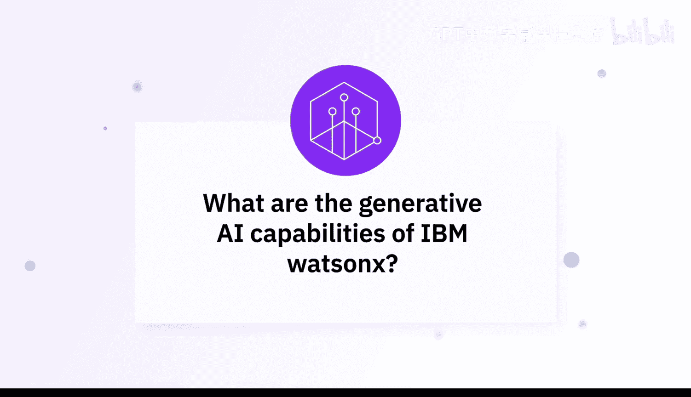
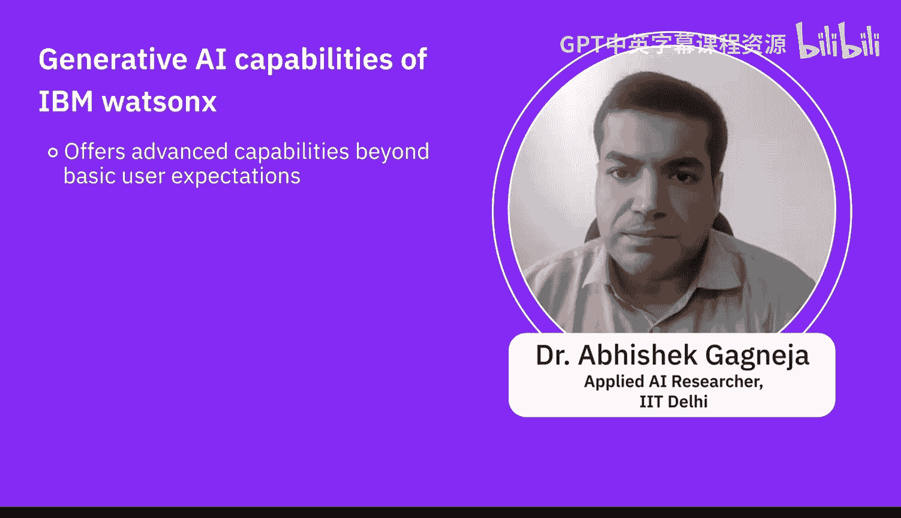
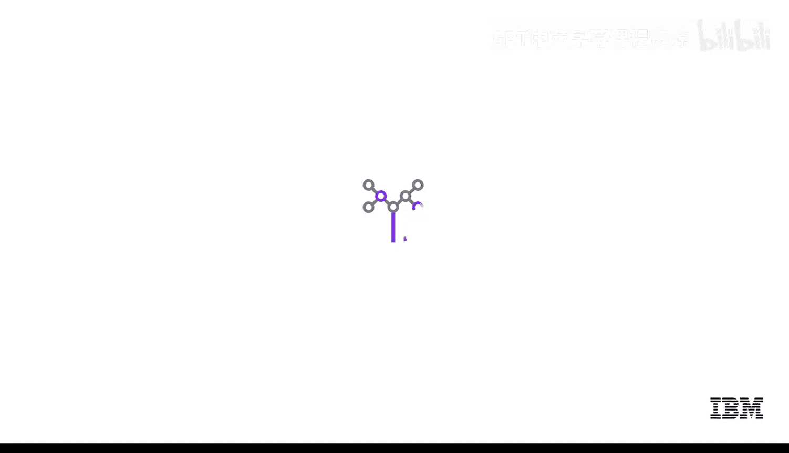

# 036：探索IBM Watsonx的生成式人工智能能力 🧠



在本节课中，我们将跟随AI专家的视角，深入了解IBM Watsonx平台所提供的强大生成式人工智能能力。我们将探讨其核心组件、关键功能以及如何满足企业级应用的需求。

---

## 概述

IBM Watsonx是一个集成了多种工具和生成式AI能力的综合性平台。它利用先进的AI模型来生成文本、代码和数据洞察，其自然语言处理功能能够创建详细且上下文准确的报告、摘要和响应，使其在客户服务、内容创建和数据分析领域极具价值。

## 核心组件与工作流程

上一节我们概述了Watsonx的价值，本节中我们来看看其具体的核心组件和典型工作流程。

### 1. 数据访问与准备：Watsonx.data

处理任何数据科学和生成式AI用例，首先需要访问正确的数据集。为此，Watsonx提供了 **Watsonx.data** 组件。

*   **功能**：它旨在帮助企业克服数据孤岛问题，无论数据存储在何处，都能便捷地访问。
*   **生成式AI赋能**：该组件融入了生成式AI的优势，支持**交互式查询**。用户可以使用自然语言询问所需数据，例如请求特定表格或执行数据预处理任务。

### 2. 模型选择与应用：Watsonx.ai

在准备好数据之后，下一步是选择和应用合适的大语言模型。**Watsonx.ai** 正是为此设计的模型集合。

*   **模型库**：它是一个包含多种大语言模型的套件，既包括由IBM研究院开发的专有模型，也集成了开源大语言模型。
*   **模型质量**：IBM在开发自有大语言模型时，确保用于训练的数据经过精心准备和清洗，避免了攻击性数据集和数据偏见问题。
*   **自动化工具**：平台还提供了大量自动化软件和工具，极大地方便了数据科学家和数据工程师进行模型相关工作。

以下是Watsonx.ai平台可能包含的模型类型示例：
```python
# 示例：Watsonx.ai 可能提供的模型类型（概念性代码）
available_models = {
    "ibm_models": ["granite-series", "watsonx-code"],
    "open_source_models": ["llama-2", "mistral", "flan-t5"]
}
```

### 3. 治理与监控：Watsonx.governance

部署和使用AI模型时，治理与监控至关重要。**Watsonx.governance** 平台专门负责这一环节。

*   **模型目录与仪表板**：它不仅帮助用户对模型进行编目，提供一个统一的仪表板来查看所有模型及其不同版本和当前阶段。
*   **性能监控**：更重要的是，它帮助用户从多个维度监控模型性能，例如**幻觉（hallucination）**、**偏见（bias）** 等。当发现问题时，平台会发出警报，有时能自动缓解问题，并可以追溯到事务级别， pinpoint 具体是哪些数据导致了问题。

### 4. 代码与数据生成

除了文本处理，Watsonx还支持其他形式的生成任务。

*   **代码生成**：支持**代码生成（cogeneration）**，帮助开发者自动化重复性编码任务，提升软件开发效率。
*   **合成数据生成**：平台生成合成数据的能力，有助于训练机器学习模型，在解决隐私顾虑的同时提供高质量的数据集。

### 5. 模型评估

评估大语言模型的结果比传统模型更为复杂，因为输出通常是图像或文本。Watsonx平台内置了评估机制。

*   **自动化评估**：对于摘要生成等不同任务，平台默认包含了相应的**评估指标（evaluation metrics）**。当用户选择特定任务时，系统会自动选择合适的评估指标，帮助用户持续评估模型效果。

评估生成质量的公式可以抽象表示为：
**评估分数 = f(生成内容， 参考标准， 任务目标)**
其中 `f` 代表根据具体任务（如摘要、问答）设计的评估函数。

---

## 总结





本节课中，我们一起学习了IBM Watsonx平台的生成式AI能力。我们了解到，Watsonx远不止于基础应用，它是一个非常完善且细致的软件平台。它通过 **Watsonx.data**、**Watsonx.ai** 和 **Watsonx.governance** 三大核心组件，覆盖了从数据准备、模型选择与应用到最终治理监控的完整AI生命周期，并提供了代码生成、合成数据生成等高级功能，是一个强大的企业级生成式AI解决方案。