# 037：文本到文本生成 📝

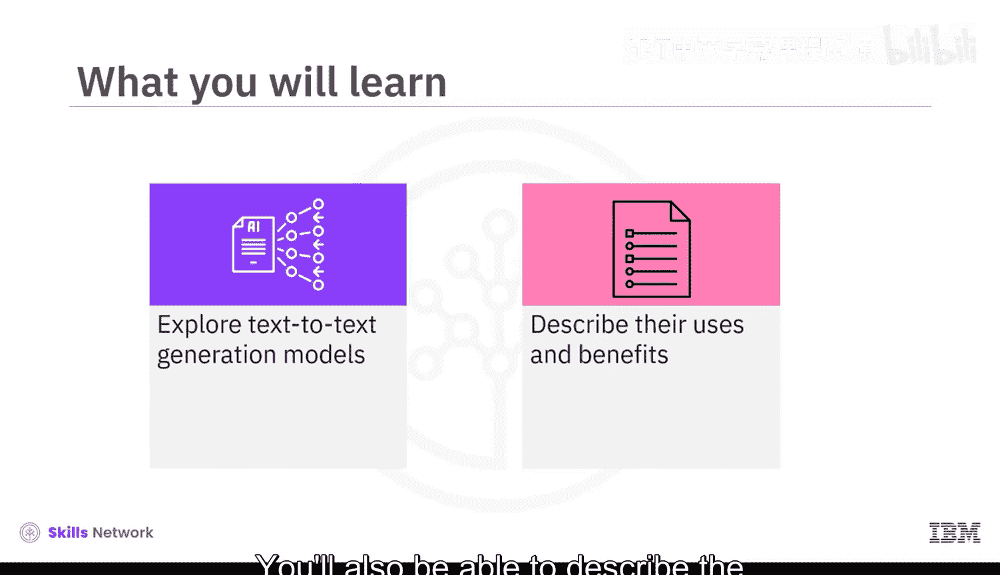

在本节课中，我们将要学习生成式AI中的文本到文本生成模型。我们将探讨这类模型的不同类型、工作原理、以及它们在现实世界中的应用和优势。

## 概述

文本到文本生成模型是一种机器学习模型，它能够根据给定的输入文本生成新的文本。这些模型在大型文本语料库上进行训练，学习语言中的模式、语法和上下文信息。它们可以生成多种格式的文本，包括代码、脚本、音乐、电子邮件和信件等。

## 文本到文本生成模型简介

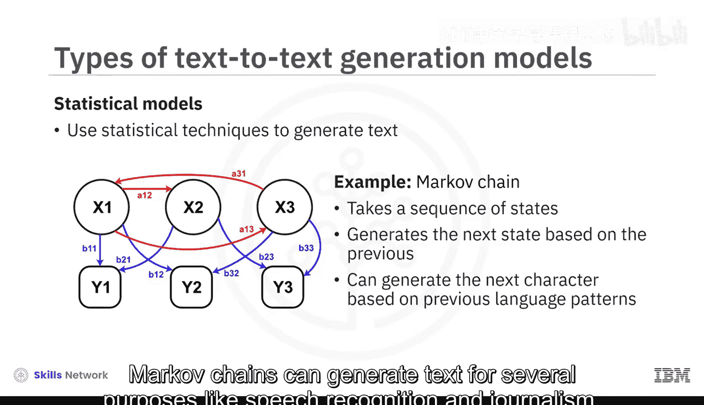

文本到文本生成模型主要用于从给定的输入生成文本。它们通过学习海量文本数据中的规律来工作。

主要有两种类型的文本到文本生成模型：统计模型和神经网络模型。

以下是这两种模型的简要介绍：

*   **统计模型**：这类模型使用统计技术来生成文本。一个常见的例子是马尔可夫链。
*   **神经网络模型**：这类模型使用人工神经网络来生成文本，能够表示数据之间更复杂的关系。

## 模型架构：Seq2Seq与Transformer

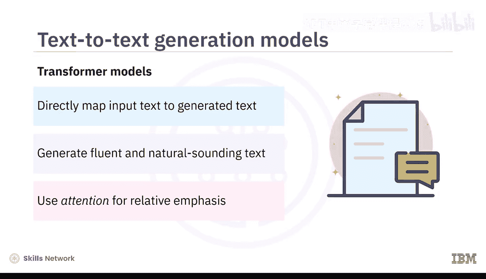

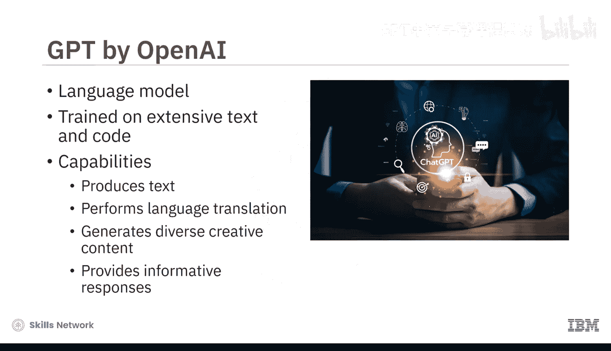

上一节我们介绍了模型的基本类型，本节中我们来看看它们具体使用的架构。文本到文本生成模型主要采用序列到序列（Sequence-to-Sequence）或Transformer类型的架构。

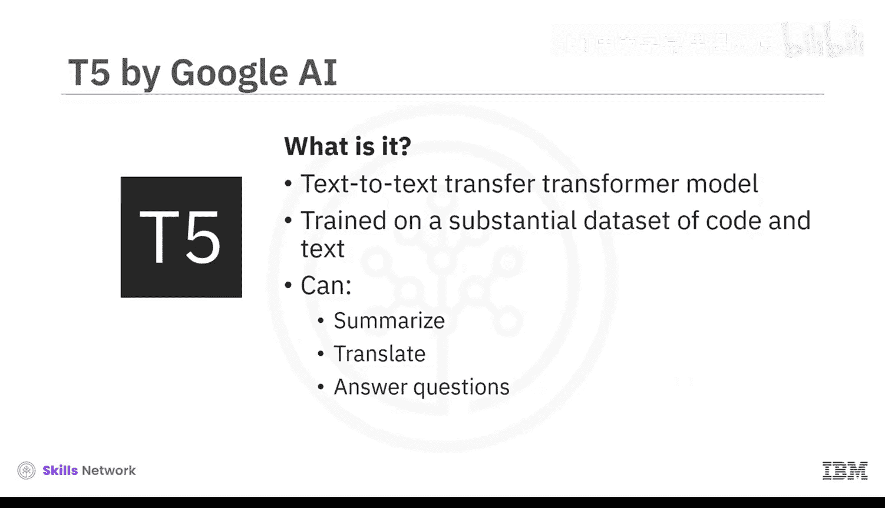

*   **序列到序列模型**：这类模型首先将输入文本编码成一个数字序列，然后将该序列解码成代表生成文本的新序列。其公式可简化为：`输出序列 = 解码器(编码器(输入序列))`。它常用于摘要、语音识别和机器翻译等任务。
*   **Transformer模型**：这类模型直接将输入文本映射到生成的文本，通常能产生比序列到序列模型更流畅、自然的文本。Transformer的一个关键特性是**注意力机制**，它能强调相关词汇的权重，为特定词汇或标记提供上下文。

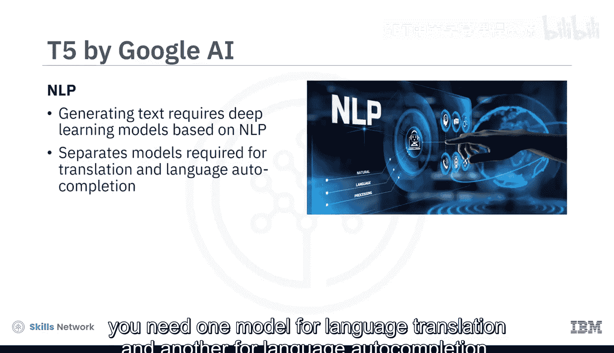

## 流行的文本到文本生成模型

了解了基础架构后，我们来看看几个最流行的文本到文本生成模型的具体实例。

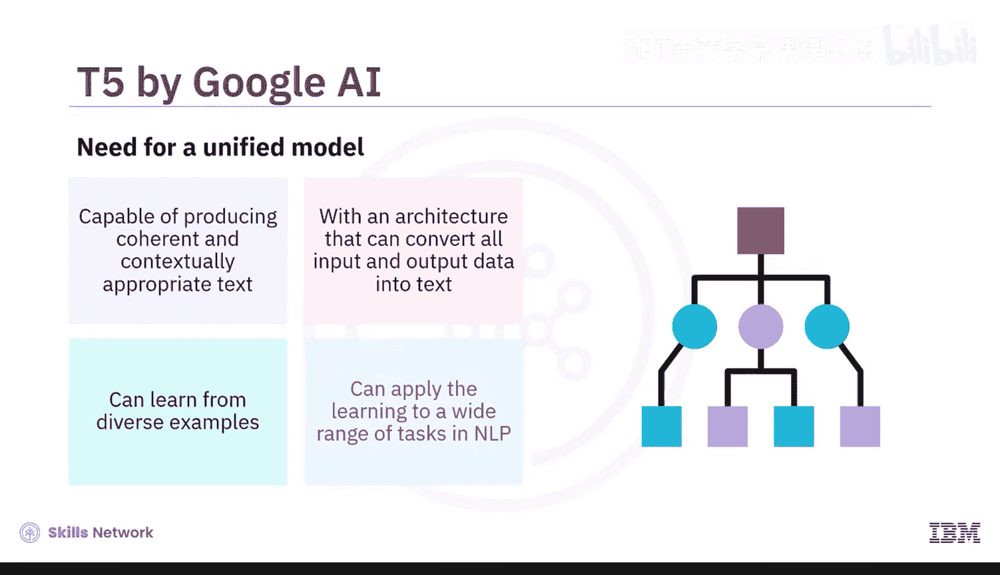

以下是三个具有代表性的模型：

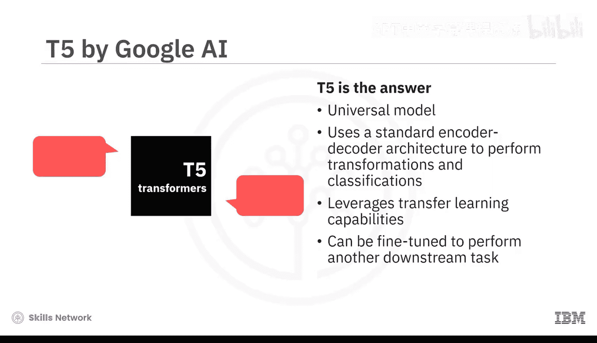

1.  **GPT（由OpenAI创建）**：这是一个大型语言模型，通过在大量文本和代码上训练而成。它能够生成文本、进行语言翻译、创作多种形式的创意内容，并对用户查询提供信息丰富的回答。
2.  **T5（由Google AI开发）**：这是一个“文本到文本迁移Transformer”模型。它的核心思想是将所有NLP任务都框架为“文本到文本”问题，使用统一的编码器-解码器架构来执行翻译、分类等多种任务，并利用迁移学习能力。
3.  **BART（由Facebook AI开发）**：这是一个双向自回归Transformer模型。它结合了类似BERT的双向编码器（能同时向前和向后处理文本）和类似GPT的自回归从左到右解码器。这种结构使其能够完成情感分析、问答、语言翻译和生成类人文本等任务。

## 应用与优势

现在我们已经认识了这些强大的模型，本节中我们来看看它们在实际中有何用途，又能带来哪些好处。

文本到文本生成模型是完成多种任务的强大工具。

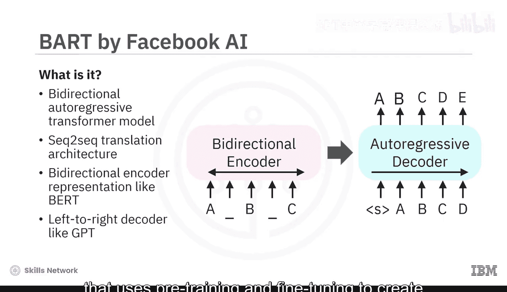

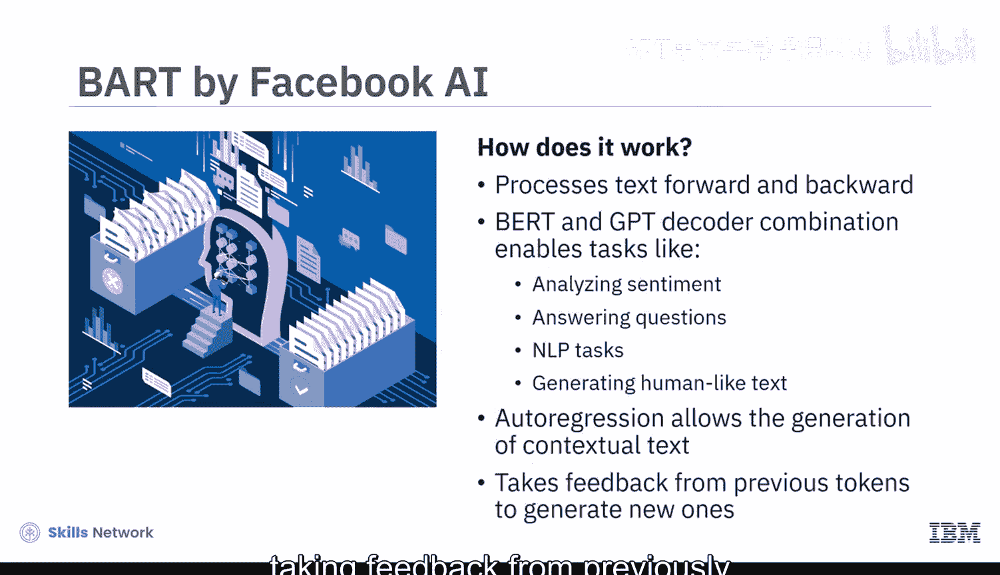

以下是几个典型应用示例：

*   **文本摘要**：模型可以处理输入文本，生成概括其要点的摘要，而不改变原意。
*   **对话智能**：通过基于文本的查询响应提供个性化辅助，支持聊天机器人和虚拟助手。
*   **内容创作**：生成产品描述、撰写电子邮件、创建简历等数字文本。

正因为这些广泛的应用，文本到文本模型提供了显著的优势：

*   **提高生产力**：通过自动化任务，如生成营销文案或社交媒体帖子。
*   **提升准确性**：减少人为错误，例如，模型可以无误地进行上下文相关的文档翻译。

## 总结

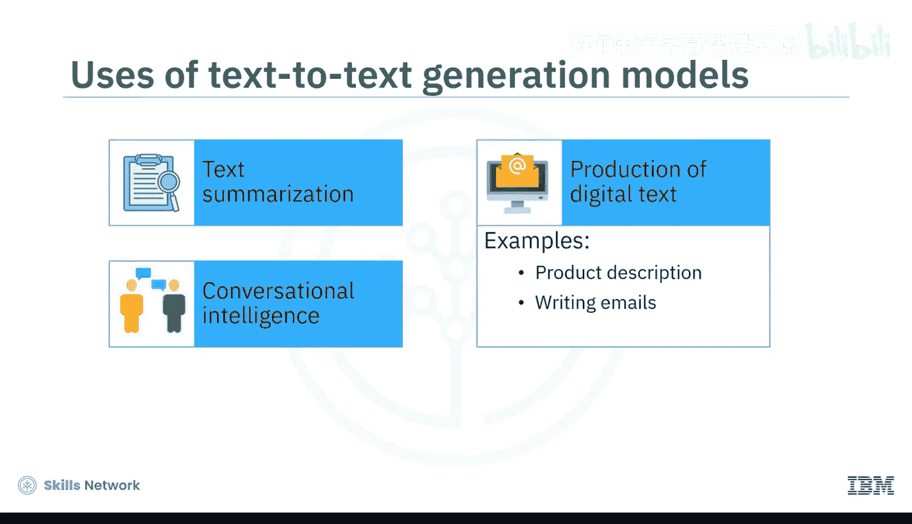

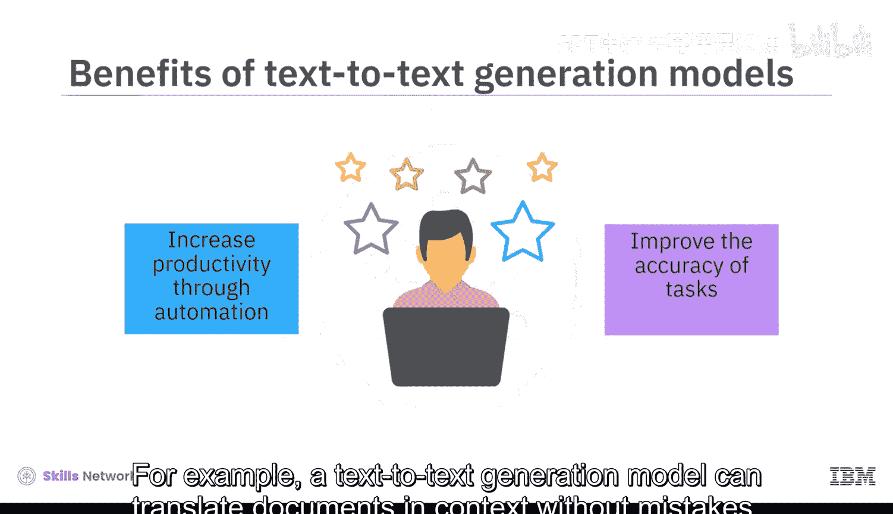

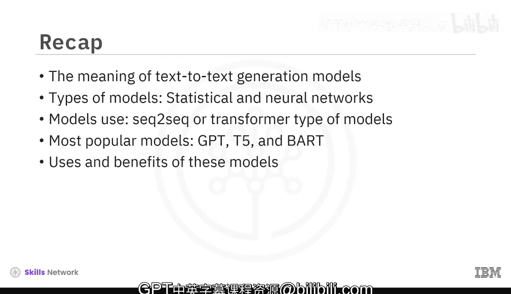

本节课中我们一起学习了生成式AI中文本到文本生成模型的核心知识。我们了解了这类模型的定义，认识了统计模型和神经网络模型两种主要类型，并深入探讨了序列到序列和Transformer两种关键架构。我们还具体分析了GPT、T5和BART这三个流行模型的特点。最后，我们回顾了这些模型在摘要、对话和内容创作等方面的多种用途，以及它们在提升生产力和准确性方面带来的重要价值。