# 038：文本到图像生成 🖼️

在本节课中，我们将学习文本到图像生成模型。你将了解这类模型的工作原理、主要类型，并认识两种最流行的模型：DALL-E和Imagen。

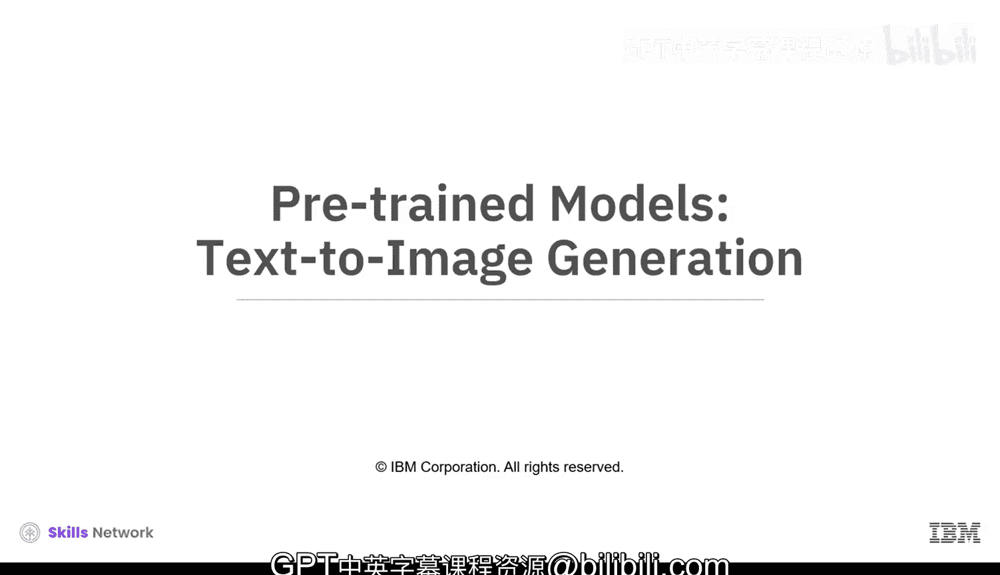

文本到图像生成模型是一种机器学习模型，用于根据文本描述生成图像。它们利用生成式人工智能技术，理解文字的含义并将其转化为独特的图像。

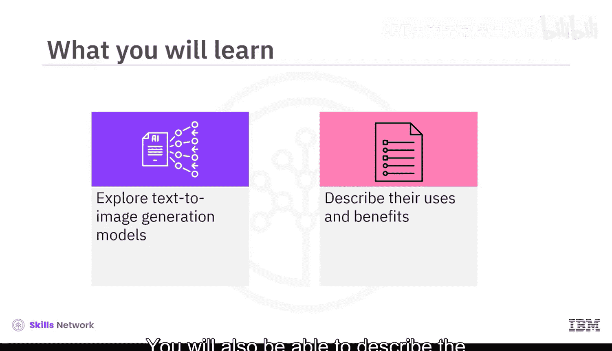

这些模型在大量的文本和图像数据集上进行训练，能够生成各种类型的图像，包括写实图像、抽象图像，甚至现实世界中不存在的图像。

## 文本到图像生成模型的类型

文本到图像生成模型主要分为两类：生成对抗网络和扩散模型。接下来我们分别看看它们。

### 生成对抗网络

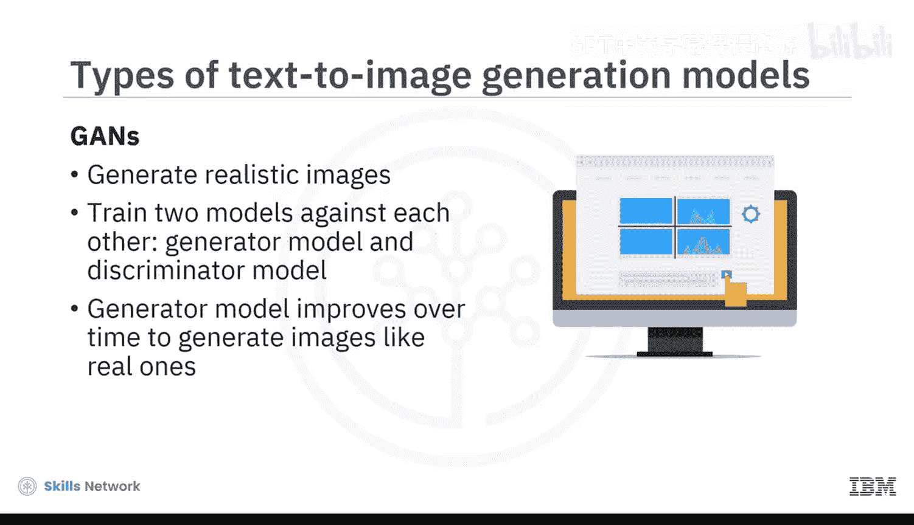

生成对抗网络是一种可用于生成逼真图像的机器学习模型。其工作原理是让两个模型相互对抗训练：一个**生成器模型**负责生成图像，一个**判别器模型**负责区分真实图像和生成图像。生成器模型会随时间推移不断改进，直到其生成的图像与真实图像难以区分。

其核心对抗过程可以概括为以下公式：
`min_G max_D V(D, G) = E_{x~p_data(x)}[log D(x)] + E_{z~p_z(z)}[log(1 - D(G(z)))]`
其中，`G`是生成器，`D`是判别器。

### 扩散模型

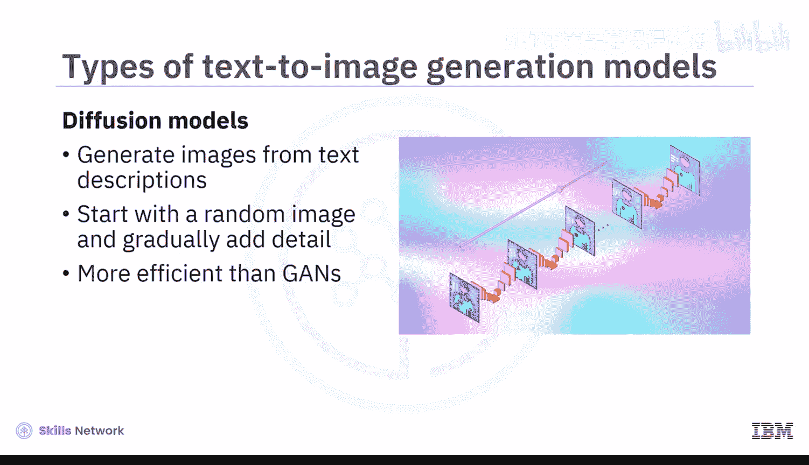

扩散模型是另一种用于根据文本描述生成图像的机器学习模型。其工作方式是从一个随机噪声图像开始，逐步向图像添加细节，直到它与文本描述相匹配。扩散模型通常比生成对抗网络更高效，并能生成更具创意和抽象的图像。

扩散过程的核心是逐步去噪，其前向和反向过程可以用以下代码概念表示：
```python
# 概念性代码：前向过程逐步添加噪声
for t in range(T):
    image = add_noise(image, t)
# 反向过程：从噪声中重建图像
for t in reversed(range(T)):
    image = remove_noise(image, t, text_description)
```

## 流行的文本到图像生成模型

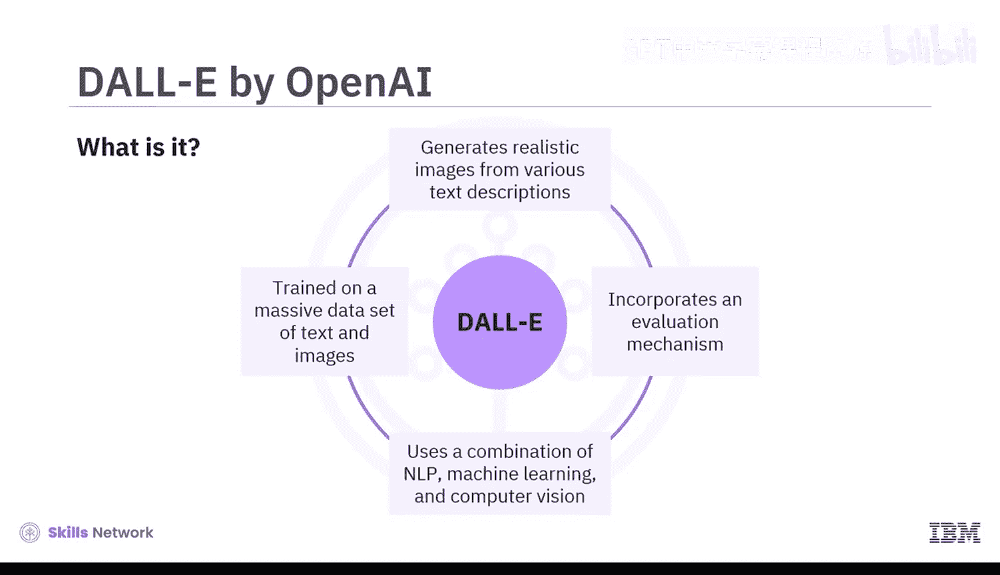

在扩散模型中，有两种最流行的文本到图像生成模型：DALL-E和Imagen。以下是它们的详细介绍。

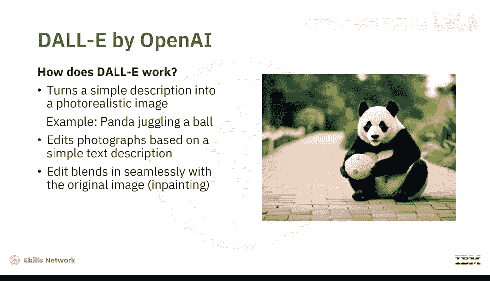

### DALL-E

DALL-E是由OpenAI开发的文本到图像生成模型。它在海量的文本和图像数据集上训练，可以根据各种文本描述生成逼真的图像。为了实现最终图片的准确性，它还包含了一个评估机制。

DALL-E结合了其核心要素：自然语言处理、机器学习和计算机视觉。例如，它可以接受一个简单的描述，如“一只熊猫在玩杂耍球”，并将其转化为一张前所未有的、照片般逼真的图像。

不仅如此，DALL-E还可以基于简单的文本描述编辑照片，使编辑部分与原始图像无缝融合，这被称为“图像修复”。

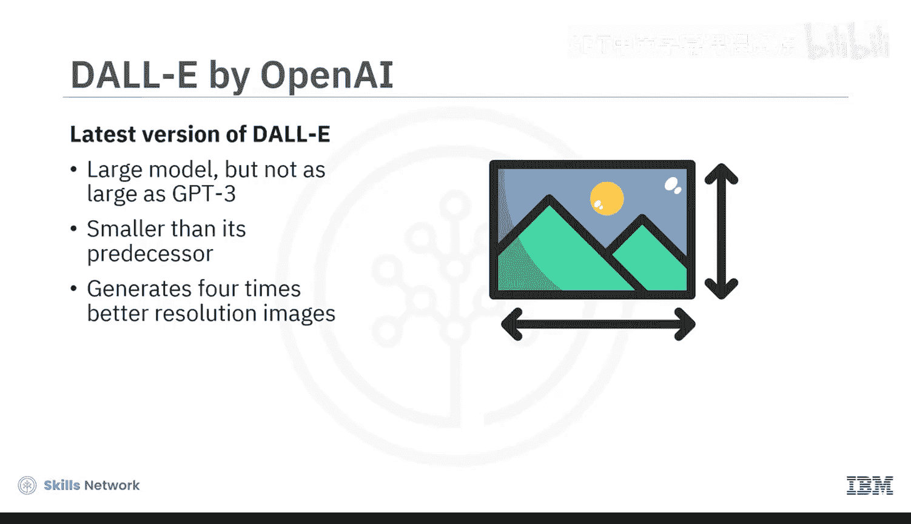

DALL-E的特殊之处在于，深度学习使其能够理解单个对象（如熊猫和球）以及事物之间的关系。最新版本的DALL-E是一个大型模型，但远小于GPT-3，有趣的是，它比其前身还要小。尽管体积更小，但这个新版本生成的图像分辨率比旧版DALL-E高出四倍。

**DALL-E的优势如下：**
*   **评估理解能力**：DALL-E生成的图像可以告诉我们，系统是真正理解了我们的描述，还是仅仅在重复它所学到的东西。
*   **促进AI安全发展**：通过使我们理解AI如何解读我们的世界，DALL-E在开发有用且安全的AI方面发挥着至关重要的作用。

### Imagen

Imagen是由Google AI开发的文本到图像生成模型。与DALL-E一样，Imagen也在海量的文本和图像数据集上训练，用于根据多种文本描述生成逼真的图像。

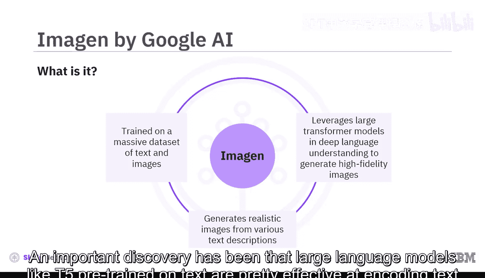

Imagen利用大型Transformer模型和深度语言理解的能力来生成高保真度的图像。一个重要发现是，像T5这样在文本上预训练的大型语言模型，在编码文本以生成图像方面非常有效。因此，增加Imagen中语言模型的规模，比增加图像扩散模型的规模更能提升图像保真度。

Imagen声称能够产生前所未有的照片真实感，这是其主要优势之一。其工作流程如下：模型接收文本（例如“两把白色雨伞升上天空。云在移动。正在下雨”），并将其转换为描绘该场景的图像。生成的图像可以是照片般逼真的，也可以是艺术化的诠释。

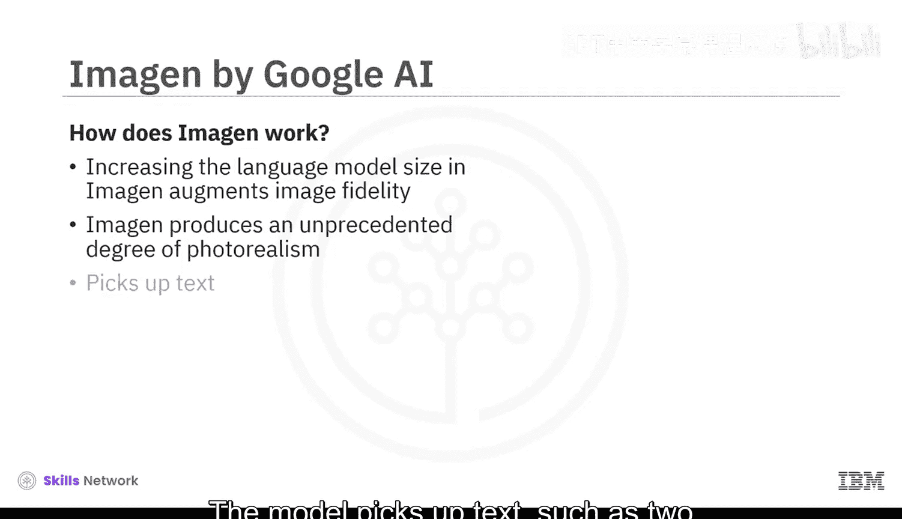

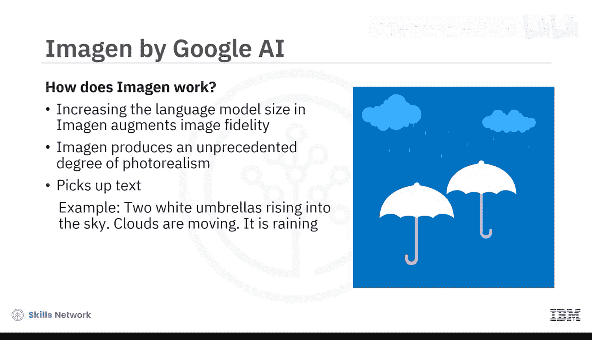

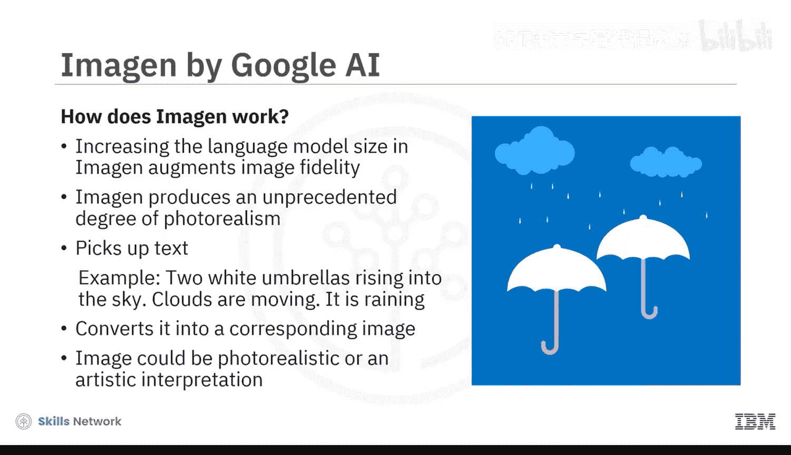

**Imagen的优势如下：**
*   **极高的照片真实感**：能够生成细节丰富、极其逼真的图像。
*   **强大的语言理解**：得益于大型语言模型，对文本描述的语义理解非常深刻。
*   **灵活的生成风格**：既能生成写实图像，也能生成艺术化图像。

## 总结

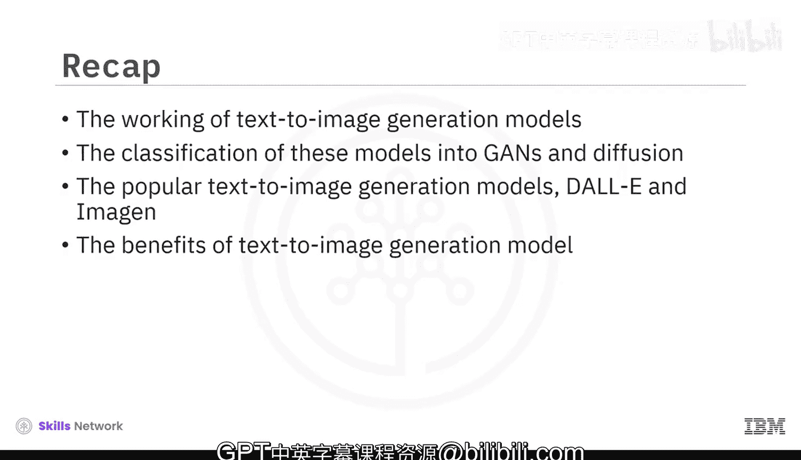

本节课中，我们一起学习了文本到图像生成模型的工作原理。这些模型主要分为**生成对抗网络**和**扩散模型**两大类。在扩散模型中，我们重点探讨了两种最流行的模型：**DALL-E**和**Imagen**。最后，我们了解了每种模型的优势和应用价值。掌握这些模型，是理解现代生成式AI在视觉领域应用的关键一步。