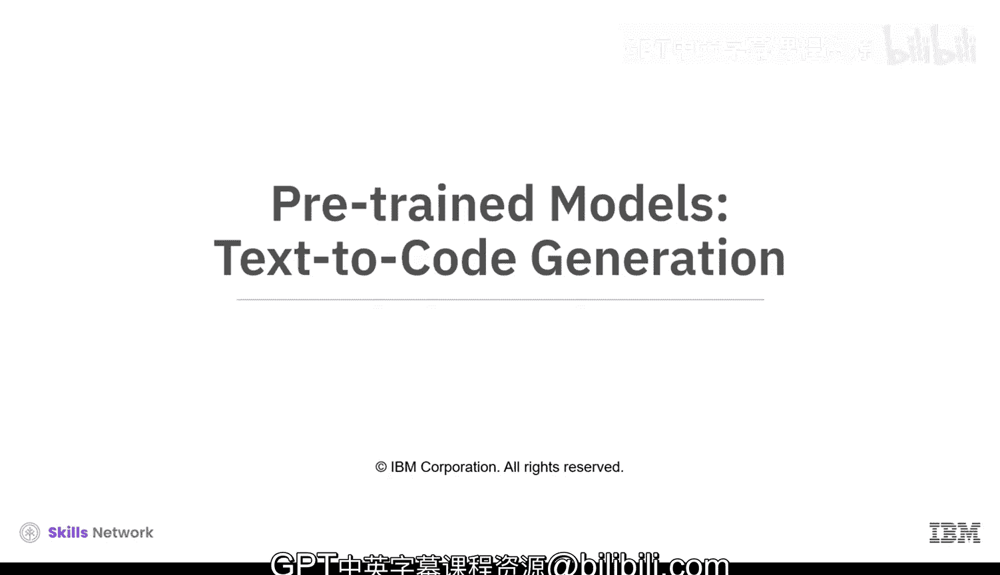
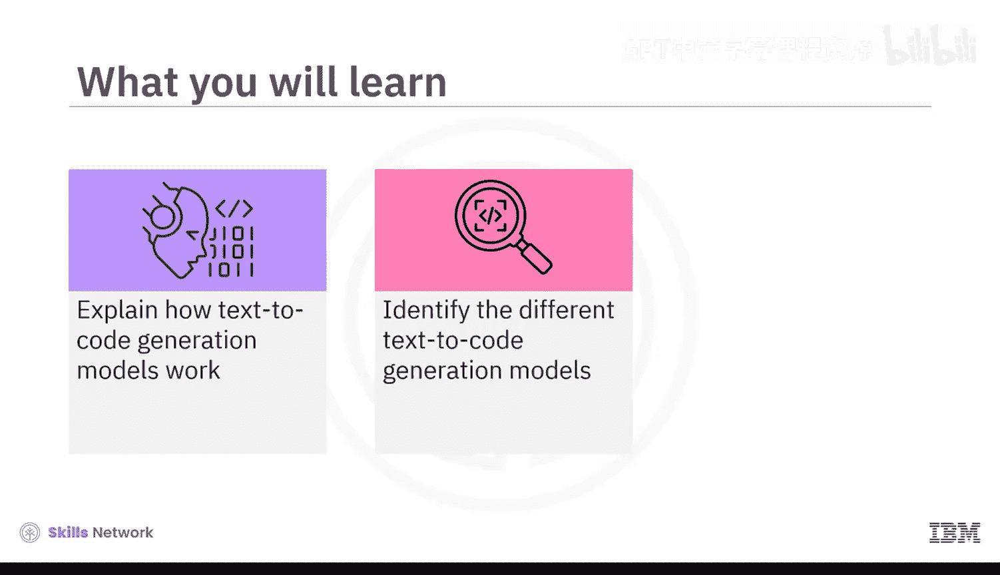
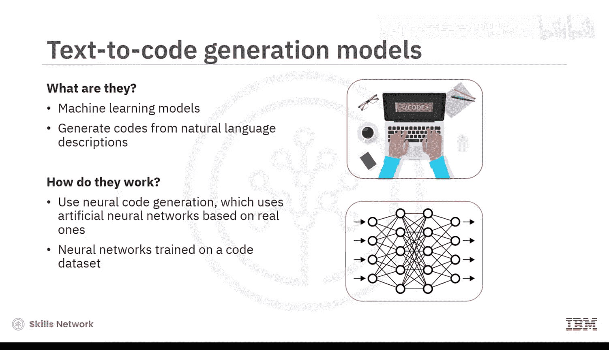
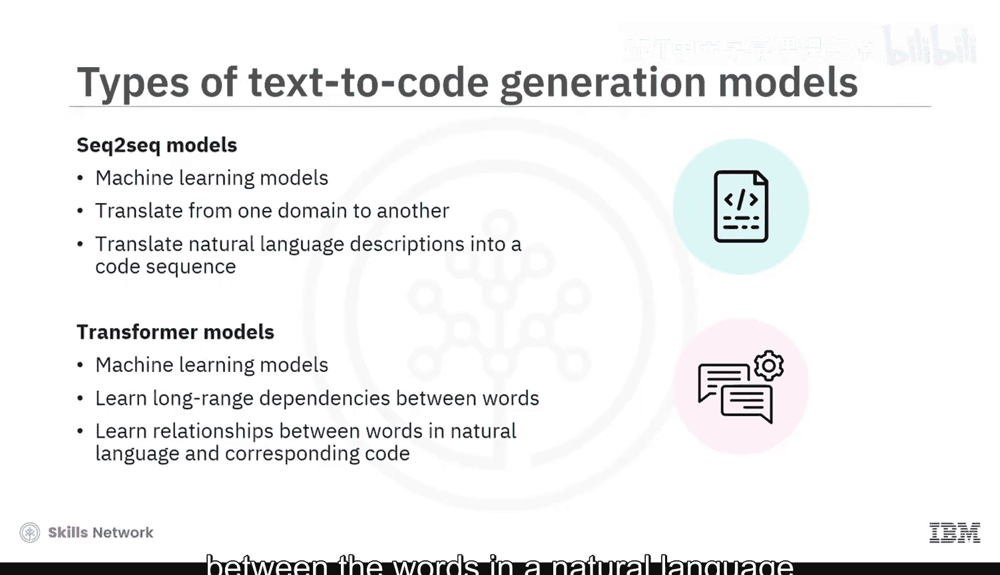
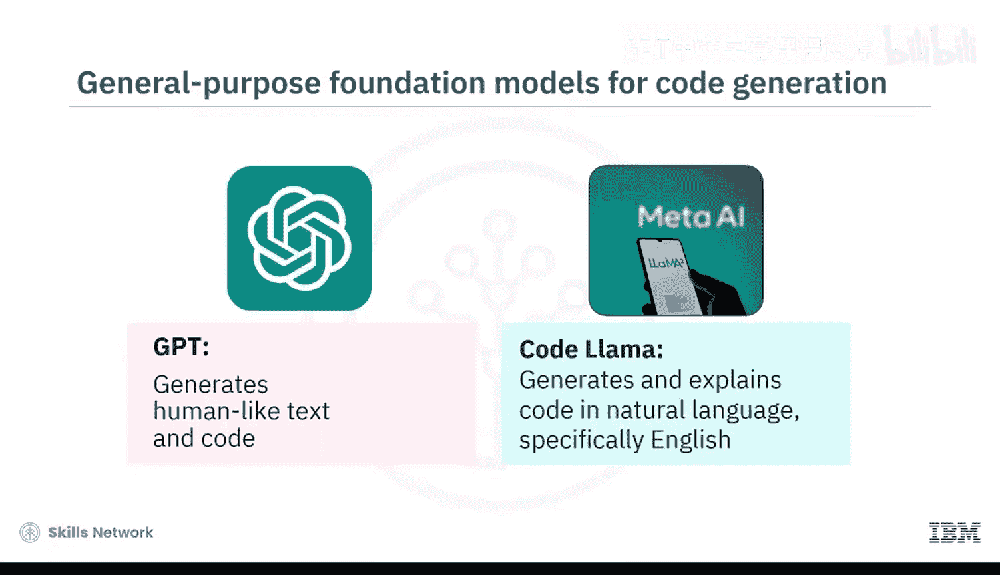
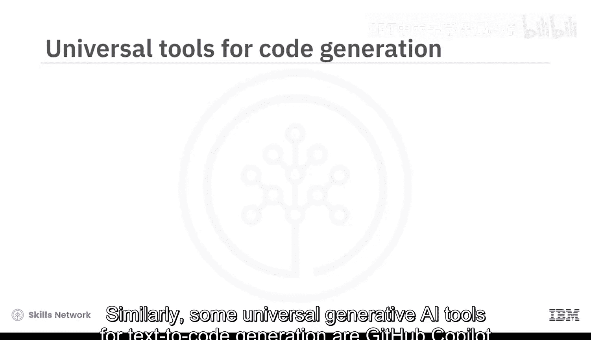
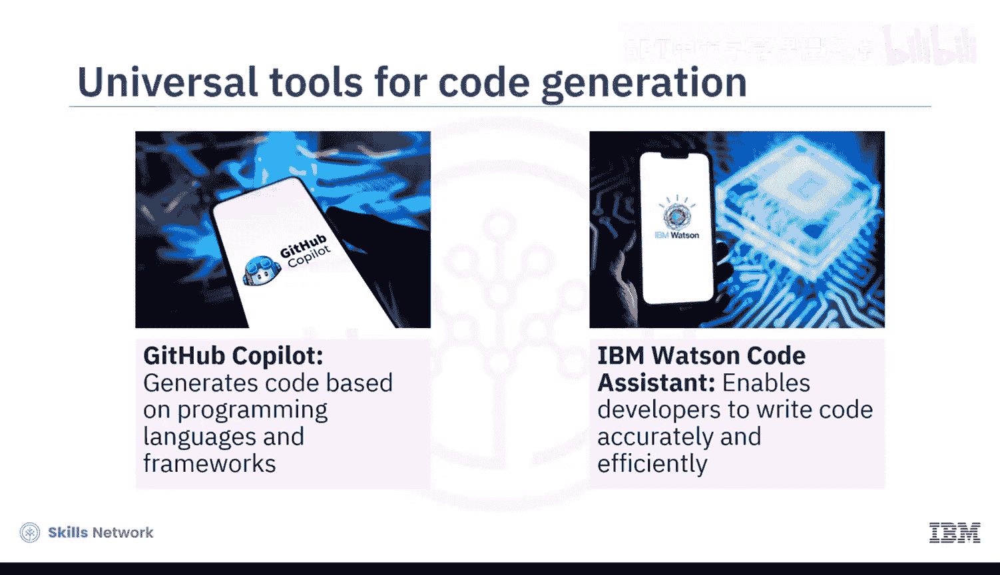
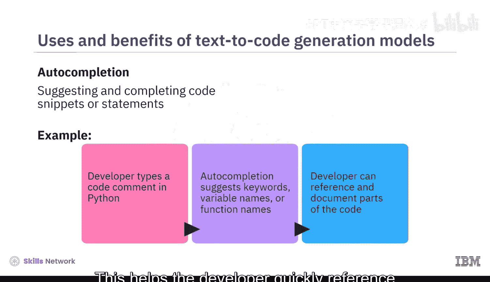
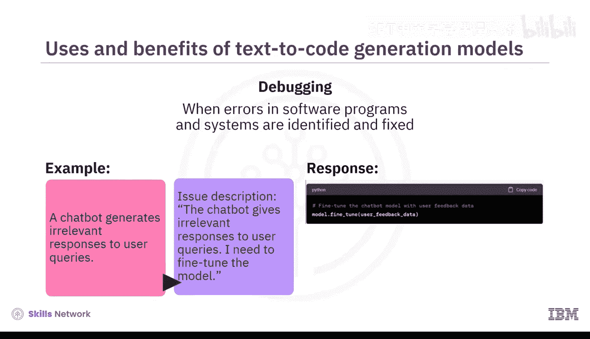
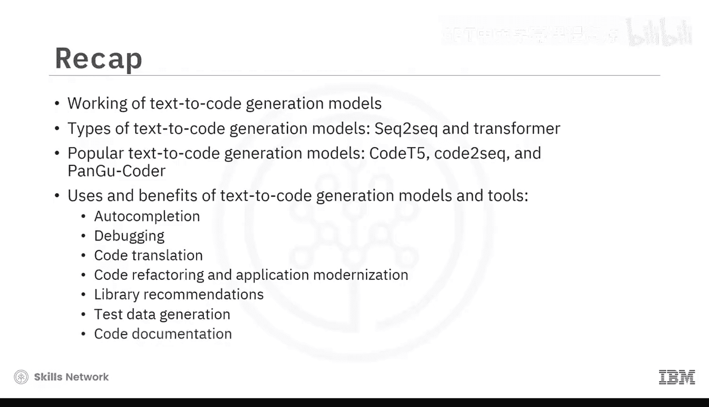

# 039：文本到代码生成 🧠➡️💻

在本节课中，我们将要学习文本到代码生成模型的工作原理。我们将了解这类模型如何将自然语言描述转化为实际的代码，识别不同的模型类型，并探讨它们的用途与优势。

## 模型工作原理

文本到代码生成模型是一种机器学习模型，它能够根据自然语言描述生成代码。这些模型利用生成式AI，通过**神经代码生成**的过程来编写代码。





神经代码生成是一个使用人工神经网络的过程，这些网络的设计灵感来源于人脑中的神经网络。这些神经网络在大量代码示例的数据集上进行训练，然后进行微调，以生成代码片段、函数乃至完整的应用程序。生成的代码在结构和功能上与其训练过的示例相似。



## 主要模型类型

上一节我们介绍了模型的基本原理，本节中我们来看看两种主要的文本到代码生成模型。



以下是两种核心的模型架构：

1.  **序列到序列模型**：这是一种能够将一个领域的内容“翻译”到另一个领域的机器学习模型。在文本到代码生成中，模型可以将自然语言描述翻译成代码序列。
    *   **公式/概念**：`自然语言序列 -> 编码器 -> 解码器 -> 代码序列`

2.  **Transformer模型**：这也是一种机器学习模型，特别擅长学习词语之间的长距离依赖关系。在文本到代码生成中，模型被训练来理解自然语言描述中的词语与对应代码之间的关系。
    *   **核心机制**：**自注意力机制**，允许模型在处理每个词时，权衡输入序列中所有其他词的重要性。

## 流行的文本到代码模型

了解了基础架构后，让我们具体看看一些基于上述架构的流行模型。

以下是几个具有代表性的文本到代码生成模型：

*   **CodeT5**：由Google AI开发的序列到序列模型。它是第一个代码感知、基于编码器-解码器的预训练编程语言模型。CodeT5在大量文本和代码数据集上训练，能够支持广泛的代码智能应用，例如代码摘要、问答和语言翻译。

*   **Code-to-Sequence**：由OpenAI开发的序列到序列模型。它采用了一种利用编程语言句法结构来更好地编码源代码的替代方法。该模型可以生成用于代码摘要、文档生成和检索等任务的代码。例如，它可以为代码片段分配描述其功能的自然语言标题。

*   **Pangu-Coder**：由微软研究院开发的Transformer模型。它是一个仅解码器的预训练语言模型，基于Pangu-Alpha架构（一种用于自然语言处理的大规模神经网络）。该模型可以生成用于函数定义、类定义和程序综合等任务的代码。例如，它能根据自然语言描述成功合成可运行的问题解决方案代码。

## 通用模型与工具







除了专门的代码生成模型，一些通用的基础模型和工具也具备强大的文本到代码生成能力。

以下是两个著名的例子：

*   **GPT系列与Code Llama**：OpenAI的GPT模型在类人文本生成方面表现出色，在代码创作上也展示了令人印象深刻的能力。Meta的Code Llama则专门用于生成和解释自然语言（特别是英语）代码。

*   **GitHub Copilot 与 IBM Watson Code Assistant**：这些是实用的生成式AI工具。GitHub Copilot由OpenAI Codex驱动，可以根据多种编程语言和框架生成代码。IBM Watson Code Assistant基于IBM watsonx.ai构建，通过实时推荐、自动完成功能和代码重构辅助，帮助开发者准确高效地编写代码。

## 用途与优势



文本到代码生成模型和工具在软件开发中有着广泛的应用，能带来诸多好处。

以下是其主要用途和优势：

*   **自动完成**：在开发者键入时，建议并补全代码片段或语句，提升编码速度。
    *   **示例**：当开发者用Python编写代码注释时，工具能根据注释上下文建议相关的关键字、变量名或函数名。



*   **代码生成与文档**：根据自然语言描述自动生成代码，并改善代码可读性和文档。
    *   **示例任务**：“创建一个能计算给定整数阶乘的Python函数。”
    *   **生成代码**：
        ```python
        def factorial(n):
            if n == 0:
                return 1
            else:
                return n * factorial(n-1)
        ```

*   **调试辅助**：帮助识别和修复软件程序中的错误，减少调试时间。
    *   **示例场景**：聊天机器人生成无关响应。开发者描述问题后，模型可能生成用于微调模型的代码片段，帮助快速解决问题。

*   **代码翻译与重构**：自动在不同编程语言间翻译代码，促进跨平台兼容和迁移；自动化识别过时或低效代码段并建议优化替代方案，简化应用现代化流程。

*   **框架推荐与测试数据生成**：根据项目需求推荐合适的库和框架；自动创建代码片段来生成多样、真实的测试用例，填充数据库或数据结构。

*   **自动文档生成**：根据代码功能自动生成注释、函数描述和文档，使代码库更易于理解和维护。

## 总结



本节课中，我们一起探索了文本到代码生成模型的各个方面。我们学习了这类模型通过神经代码生成进行工作的原理，认识了两种主要类型：序列到序列模型和Transformer模型。我们还了解了CodeT5、Code-to-Sequence和Pangu-Coder等流行模型及其用途。最后，我们详细探讨了文本到代码生成模型和工具在自动完成、调试、代码翻译、重构与现代化、框架推荐、测试数据生成以及代码文档化等方面的多种用途和显著优势。