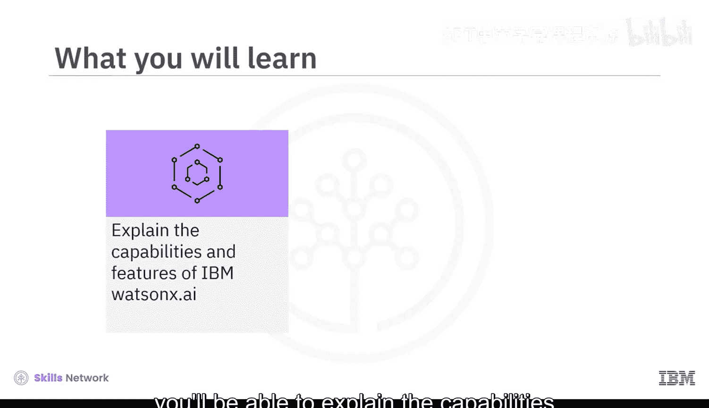
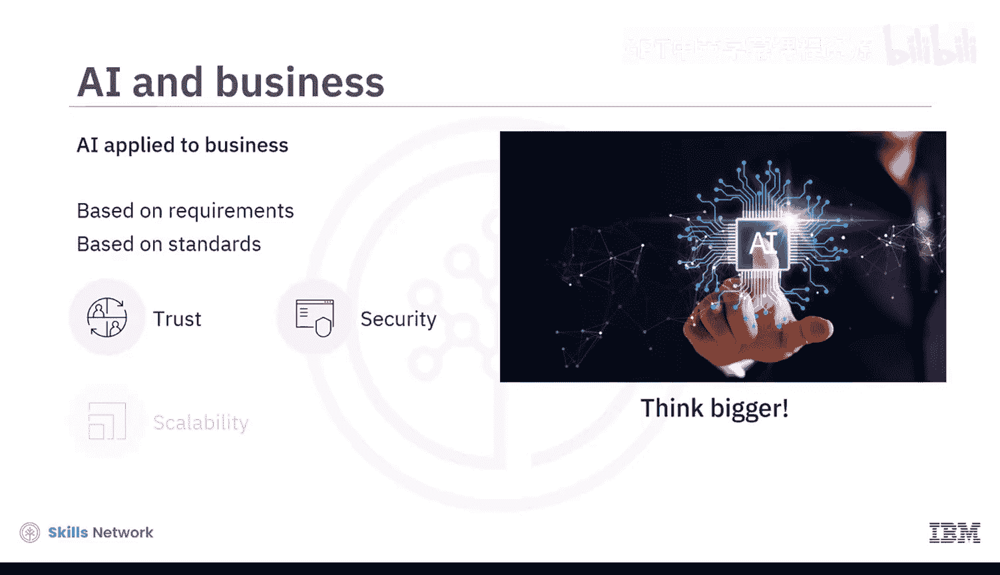
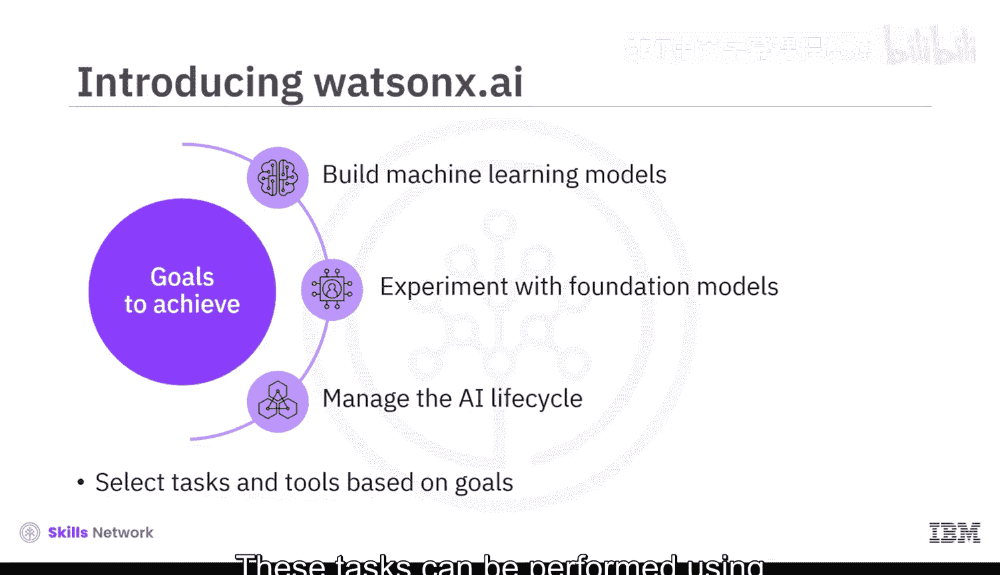
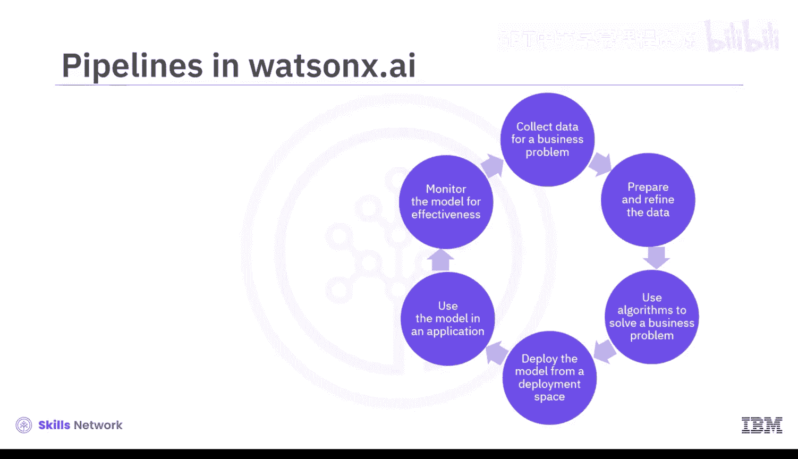
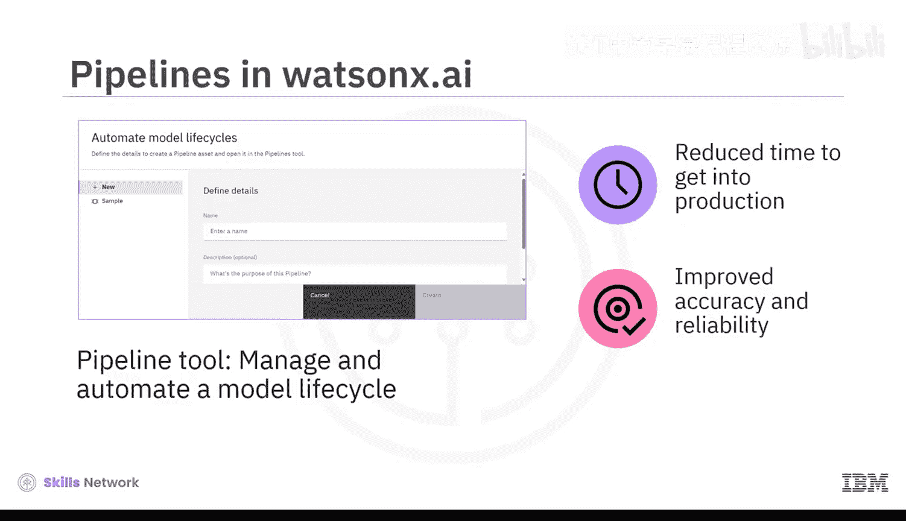
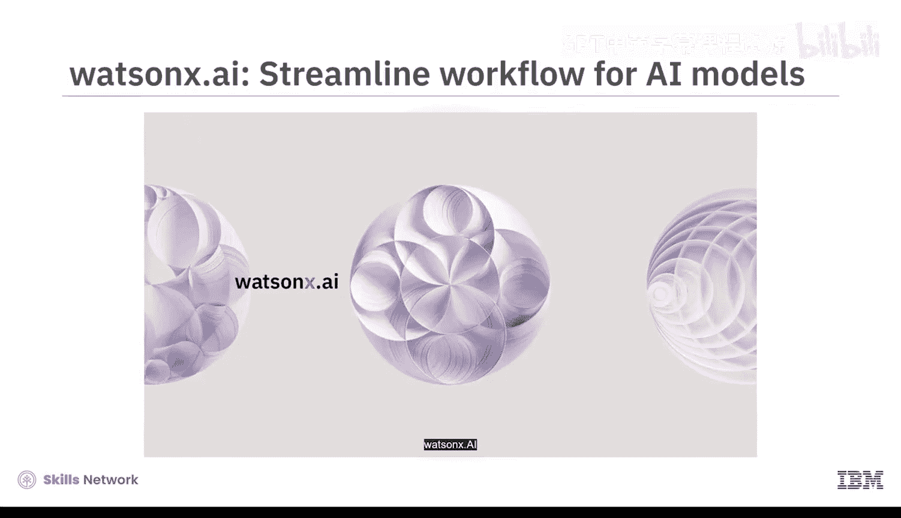

**生成式AI基础：第10章：IBM Watsonx.ai人工智能平台** 🚀

在本节课中，我们将学习IBM Watsonx.ai平台。这是一个专为企业级AI应用设计的集成工具集，旨在帮助AI构建者高效、安全地开发和部署生成式AI与机器学习模型。

---

### 平台概述

上一节我们介绍了生成式AI的基础概念，本节中我们来看看如何将其应用于企业环境。用AI创作诗歌或艺术很有趣，但将AI应用于商业领域时，需要考虑更宏大的目标。企业级AI需要基于更高的标准构建，它必须**可信、安全、可扩展且适应性强**。IBM Watsonx正是这样一个帮助企业利用AI的平台。

IBM Watsonx是一个面向AI构建者的集成式AI与数据平台。该平台包含三个核心产品：
1.  **Watsonx.ai**：一个用于新型基础模型、生成式AI和机器学习的工作室。
2.  **Watsonx.data**：一个数据存储库。
3.  **Watsonx.governance**：一个用于AI监控与治理的工具包。

本视频将重点介绍Watsonx.ai。

---

### Watsonx.ai 核心功能

Watsonx.ai是一个由基础模型驱动的集成工具工作室，用于处理生成式AI和构建机器学习模型。通过Watsonx.ai，你可以轻松地**训练、调优、部署和管理**基础模型。这能帮助你在**更短的时间**内，使用**更少的数据**构建AI应用。

以下是使用Watsonx.ai可以实现的主要目标：
*   **构建机器学习模型**。
*   **试验基础模型**。
*   **管理AI生命周期**。

根据你的目标，你可以选择Watsonx.ai提供的任务。这些任务可以通过平台上的工具来完成。Watsonx.ai中的任务和工具与模型的AI生命周期紧密对齐：准备数据 -> 构建实验并训练模型 -> 部署模型并构建应用 -> 持续管理和优化模型。

---

### 关键工具介绍

Watsonx.ai提供了多种工具来支持AI开发流程。以下是其中几个核心工具：

**1. 模型访问与Prompt Lab**
Watsonx.ai允许访问IBM精选的Hugging Face开源模型，以及一系列IBM训练的不同规模和架构的模型。作为AI价值创造者，你还可以将自己的模型和数据带入Watsonx.ai。

例如，通过 **Prompt Lab** 工具，AI构建者可以试验基础模型，并构建满足其需求的提示词。Prompt Lab使用户能够通过实验性提示词来支持一系列自然语言处理任务，包括：
*   问答
*   内容生成
*   摘要
*   文本分类与信息提取

**2. 模型调优工作室**
作为AI创造者，你可能希望基于自己的数据为特定业务用例定制模型。Watsonx.ai通过 **Tuning Studio** 工具使你能够做到这一点。该工具提供了先进的调优方法，只需点击几下即可设置。后续版本将包含提示词调优和微调基础模型的示例，以获得更好的性能和准确性。

**3. 自动化流水线**
将模型投入生产是一个涉及多步骤的过程。Watsonx.ai提供了 **Pipeline** 工具来管理和自动化模型生命周期。流水线工具可用于自动化以下步骤：
*   加载数据
*   训练模型
*   部署模型
*   评估模型

这可以**缩短模型投产时间**，并**提高模型的准确性和可靠性**。

---

### 工作流程与优势

让我们通过一个示例了解Watsonx.ai中的不同工具如何协同工作，创建一个简化的AI模型工作流。

过去，AI模型必须经过训练才能执行非常具体的任务。但现在，借助基础模型的力量，你可以用**更少的时间和数据**构建强大的AI应用。

1.  **在Prompt Lab中**，你可以通过易于使用的工具构建和优化提示词，引导模型满足你的需求，达成预期结果。
2.  **如需进一步定制**，你可以在Tuning Studio中导入数据集，用少至100个示例来调优你的模型，使其为你的业务用例更加精准。
3.  **模型准备就绪后**，即可创建企业级部署并开始构建你的应用程序。

就这样，通过Watsonx.ai，你的团队能够在一个**协同环境**中工作，该环境**简化了整个AI生命周期的工作流程**，从而为企业**倍增AI的力量**。它**实用、高效且易于使用**。

---

### 安全与隐私

IBM Watsonx.ai确保你正在处理的数据和模型的安全性。你创建的数据和模型**仅对你自己可见**。你的数据以加密格式存储，你创建的模型也仅属于你的账户。**IBM无法访问你的数据或模型**，未经你的许可，它们也永远不会被IBM或任何其他个人或组织使用。

---

### 总结

本节课中，我们一起学习了IBM Watsonx，这是一个帮助企业在负责任和透明的前提下创建AI的AI与数据平台。Watsonx的产品之一Watsonx.ai，是一个用于训练、调优和部署生成式AI模型的集成工具工作室。Watsonx.ai提供的主要工具包括**Prompt Lab**、**Tuning Studio**和**Pipeline工具**。