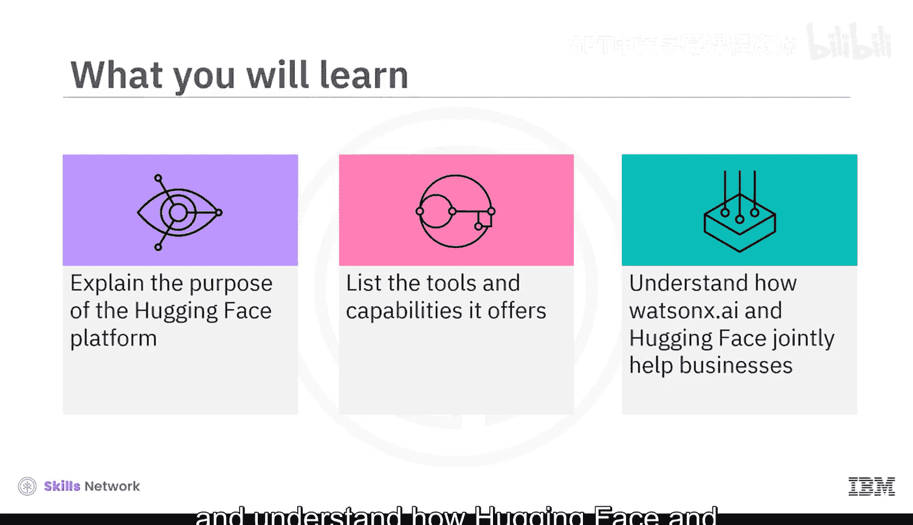
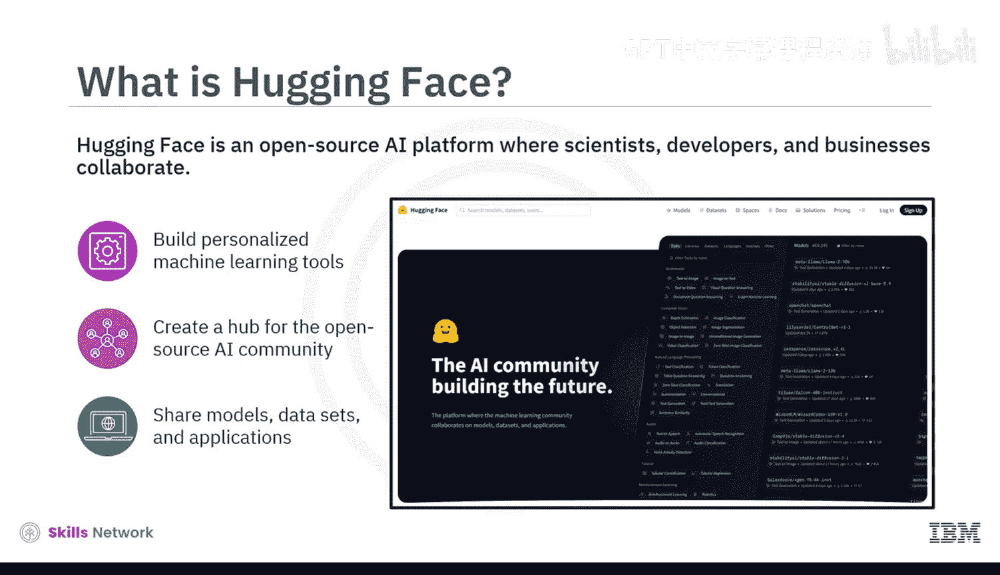
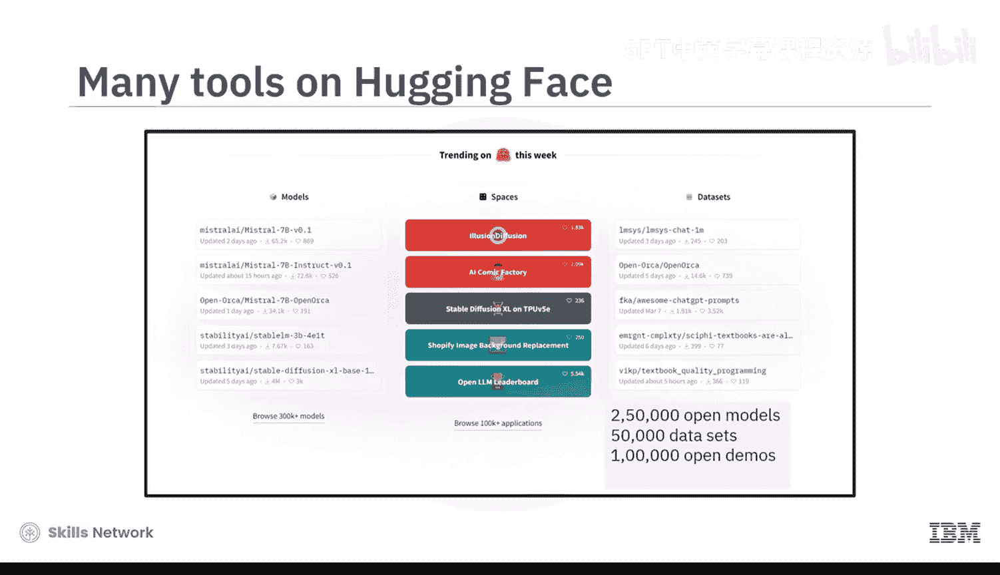
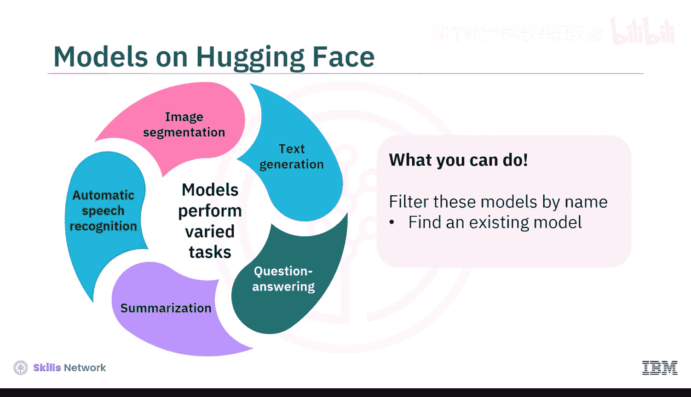
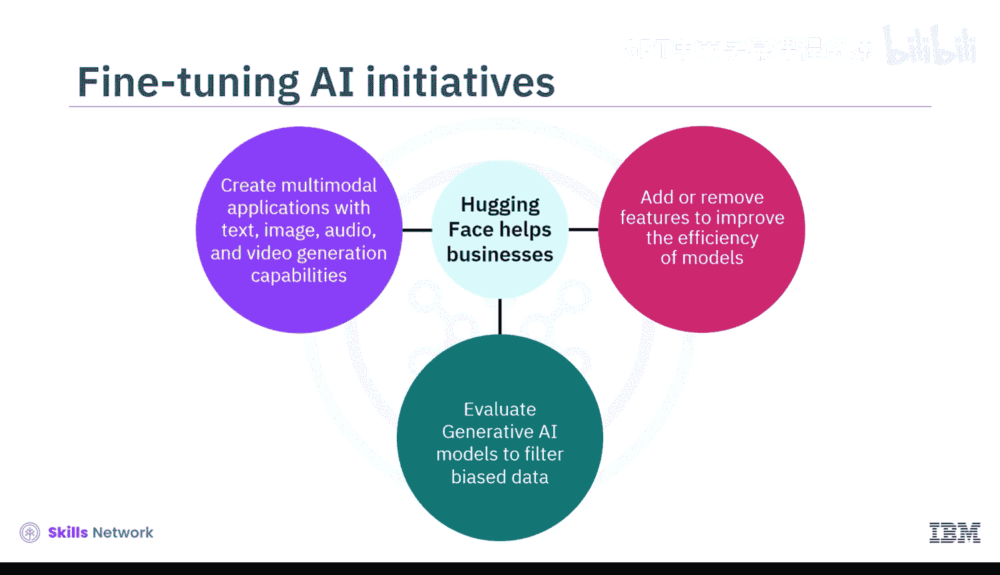
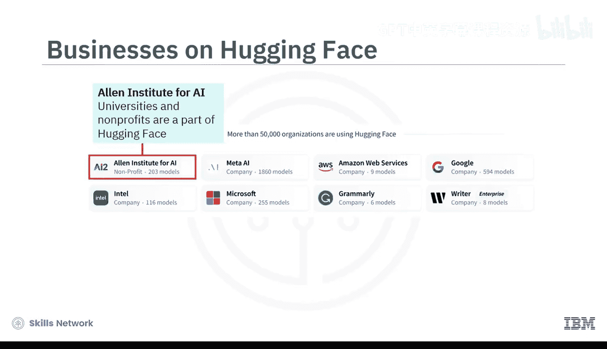
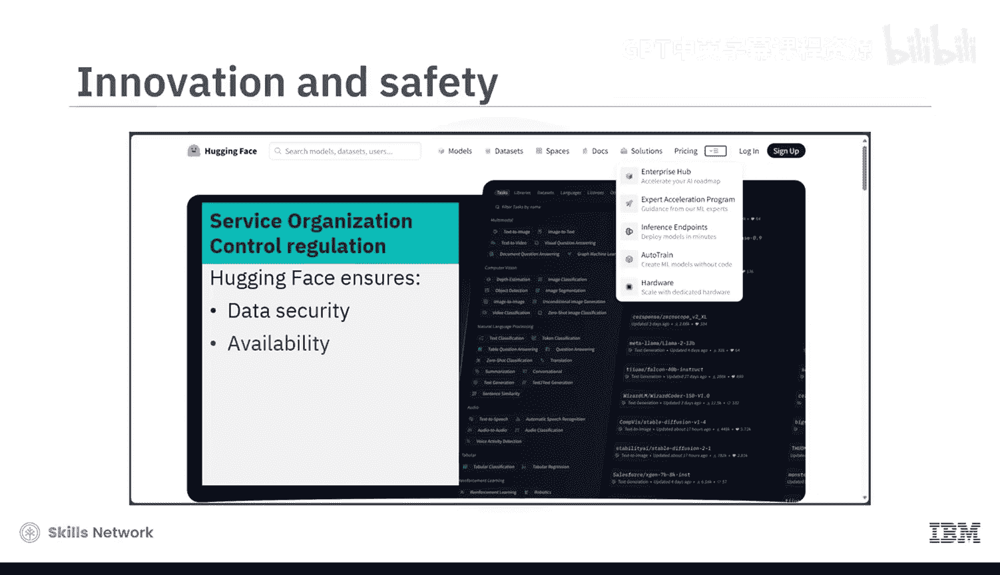
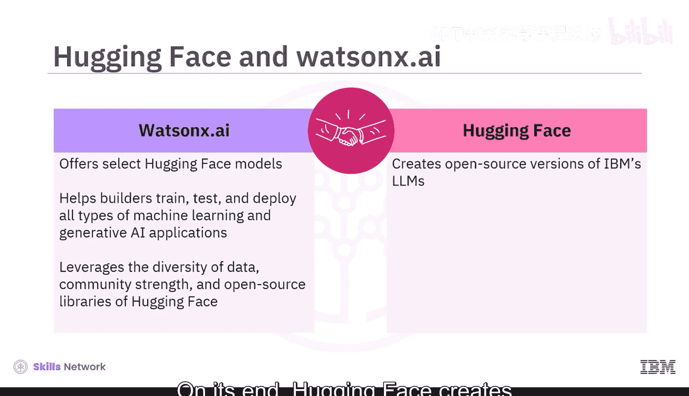
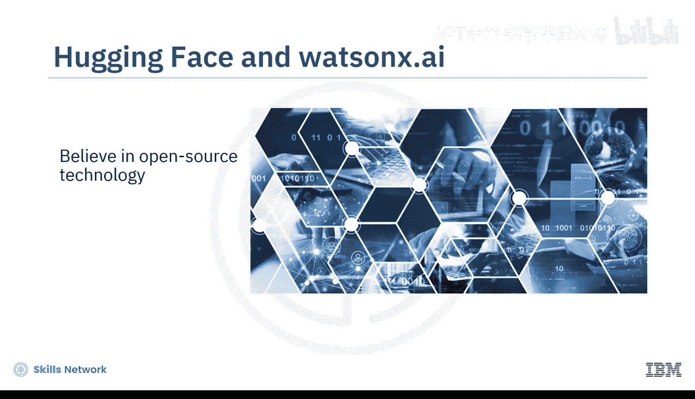
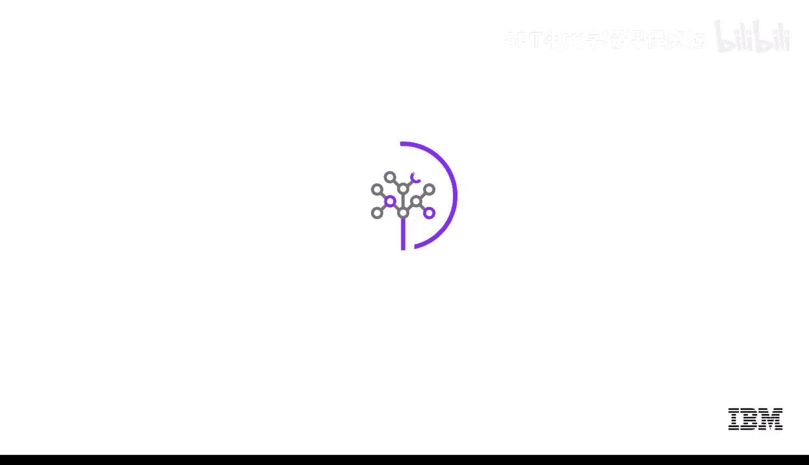

# 041：Hugging Face平台 🤗

在本节中，我们将学习Hugging Face平台。这是一个开源的AI平台，旨在让科学家、开发者和企业能够协作构建个性化的机器学习工具。我们将了解其核心目的、提供的工具与能力，以及它如何与Watson X AI等平台合作，共同助力企业发展。

## 平台概述与目的

Hugging Face是一个开源人工智能平台。其创建目的是为开源AI社区建立一个中心，用于共享模型、数据集和应用程序。这使得各类用户都能接触和使用AI，即使是那些没有独立构建机器学习应用预算或资源的用户。因此，Hugging Face被誉为推动了AI的民主化，因为它汇集了众人之力，让人们能够从众多精炼的小型模型中受益，挑战了“一个通用模型统治一切”的假设。

最初，Hugging Face社区专注于创建基于Transformer的模型，以利用自然语言处理（NLP）的能力。然而，如今该平台提供了各种用于生成文本、图像、音频和视频的机器学习工具。

## 核心资源与工具

目前，Hugging Face平台托管了超过25万个开源模型、5万个数据集和100万个开源演示应用，并且这个列表还在持续增长。

科学家和开发者使用Hugging Face来构建、训练和部署他们的AI模型。他们可以访问平台的**开源Transformer库**，该库拥有超过2.5万个预训练模型，支持PyTorch、TensorFlow和Google JAX。

以下是这些框架的简要说明：
*   **PyTorch**：一个深度学习库。
*   **TensorFlow**：一个机器学习平台。
*   **Google JAX**：一个机器学习框架。

该库中的模型执行多种任务，例如文本生成、问答、摘要、自动语音识别和图像分割等。用户可以通过名称筛选这些模型以找到现有模型，也可以将自己的模型分享到库中。

开发者还可以在“Spaces”选项卡上托管生成式AI应用的演示，允许用户进行交互和验证。

## 企业如何受益

上一节我们介绍了平台的核心资源，本节中我们来看看企业如何从中受益。

Hugging Face为企业提供“企业中心”，企业可以从中访问预训练模型和数据集。这使得企业能够利用现有基础设施，而不是从头开始构建模型。这不仅减少了他们的碳足迹、扩展所需的时间和成本，还允许企业使用专有数据和相关用例来训练模型。

此外，Hugging Face帮助企业：
*   **A**：添加或移除功能以提高模型效率。
*   **B**：评估其生成式AI模型以过滤有偏见的数据。
*   **C**：创建具有文本、图像、音频和视频生成能力的多模态应用。

超过5万家大大小小的公司都在积极使用Hugging Face。例如：
*   生成式AI解决方案提供商Writer在Hugging Face上托管其PALM大语言模型。
*   Intel已正式加入Hugging Face的硬件合作伙伴计划，并与之合作构建先进的机器学习硬件和端到端机器学习工作流。
*   大学和非营利组织也是Hugging Face社区的一部分。

在其他服务中，Hugging Face还提供专家加速计划来指导非开发人员使用机器学习模型。HuggingChat是首个开源的ChatGPT替代品。

## 安全与合作伙伴关系

为了保护用户，Hugging Face遵循服务组织控制类型2（SOC 2）法规。这意味着确保用户数据的安全性、可用性、处理过程、完整性、机密性和隐私性。

Hugging Face将协作努力更进一步，与Watson X.ai（IBM为AI构建者打造的下一代企业工作室）建立了独特的合作伙伴关系。

Watson X.ai在其工作室中提供精选的Hugging Face模型，以帮助其构建者社区训练、测试和部署各种类型的机器学习和生成式AI应用。这样，该工作室就利用了Hugging Face提供的数据多样性、社区力量和开源库。

另一方面，Hugging Face创建了IBM大语言模型的开源版本，并将其提供在自己的平台上。双方都相信开源技术，并押注社区在AI领域创造价值。

由于专有AI模型可能很快过时，Hugging Face可能在AI领域的“五大”（即Google、OpenAI、Meta、IBM和Microsoft）中占据优势。这是因为它支持并得到了持续创新的开源AI社区的支持。

## 总结

本节课中，我们一起学习了关于Hugging Face平台的知识。这个AI平台展示了开源AI社区的协作力量。它为企业在降低成本、缩短时间框架、减少碳足迹的情况下构建定制的专有模型创造了空间。组织、大学和非营利机构则利用平台的工具和服务从自然语言处理中受益。简而言之，您不必是一家大公司也能从生成式AI中获益。