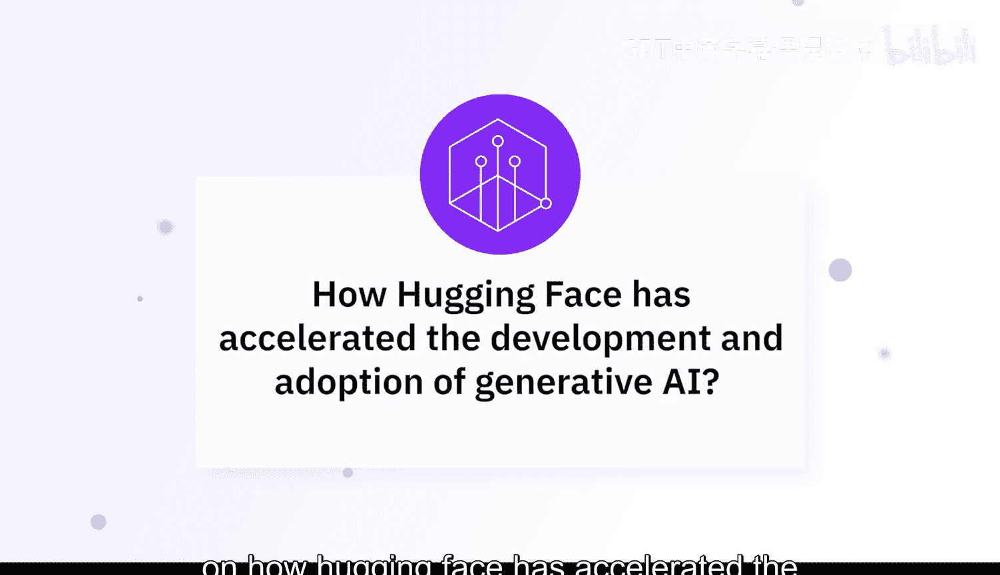
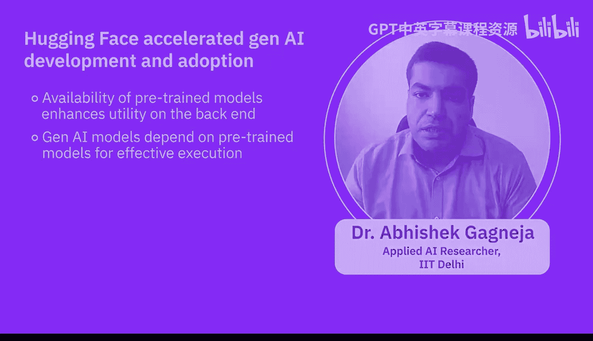
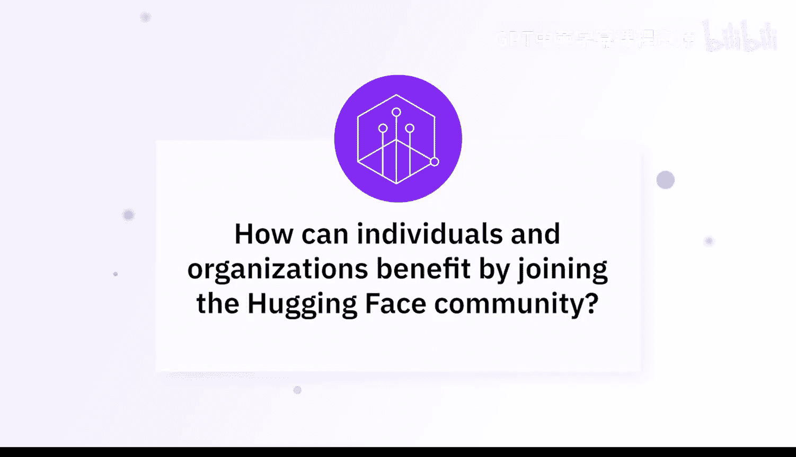
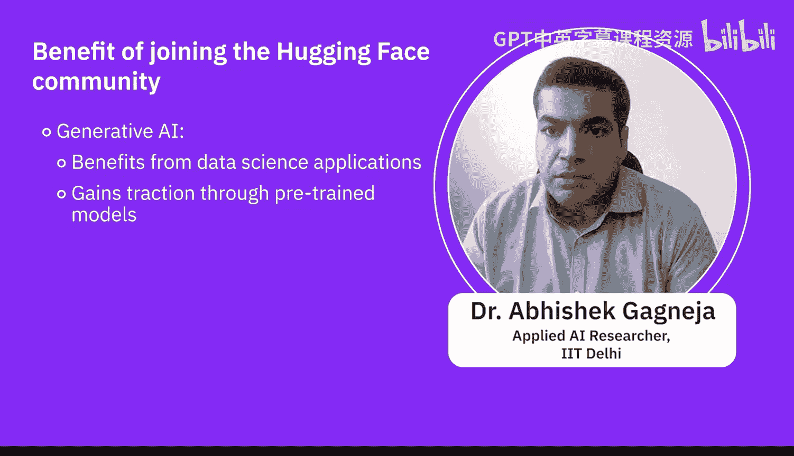

生成式AI基础：5.2：专家观点：通过Hugging Face促进创新 🚀

在本节课中，我们将聆听专家们分享Hugging Face如何加速生成式AI和大语言模型的开发、部署与应用。我们将了解其社区驱动模式、核心资源以及为个人和组织带来的具体价值。

---

Hugging Face在生成式AI和大语言模型的开发、部署与应用中扮演了至关重要的角色。其核心在于采用了**社区驱动**的方法。

他们提供了一个框架，让每个人都能访问预训练大语言模型的仓库。用户无需投入大量时间和计算资源，就能使用这些模型，并针对自己的数据集进行**微调**，以适配特定的应用场景。

以下是Hugging Face提供的关键资源：
*   **教育与学习材料**：为社区提供了大量可供利用和使用的学习资源。
*   **多样化部署选项**：为这些大语言模型提供了多种部署方案，不仅支持开发，也支持部署，通过与知名云平台和API的集成来实现。

---

上一节我们了解了Hugging Face的基础资源，本节中我们来看看其平台如何具体加速创新。

Hugging Face通过提供一个可共享、可部署的先进AI模型的可访问平台，显著加速了生成式AI的发展。其开源库 **`transformers`** 简化了复杂模型的使用，让开发者能够轻松地将先进的AI能力集成到自己的应用中。

Hugging Face还提供了诸如 **Model Hub（模型中心）** 这样的工具。在这里，我们可以使用预训练模型和数据集，这极大地促进了协作与创新。

使用Hugging Face的最大优势在于其**社区属性**。Hugging Face为包括面部识别、物体检测在内的多种任务创建了众多后端模型。这些预训练模型的可用性直接影响了后端模型的效用。生成式AI模型将依赖于这些代码片段和预训练模型的信息，因为像GPT这样的模型自身并不完全具备执行所有任务的能力。

---

了解了平台的优势后，我们自然会问：个人和组织如何通过加入这个社区获益？

个人和组织通过加入Hugging Face社区，能够获取丰富的资源和专业知识。社区的协作环境促进了知识共享，使用户能够相互学习，并紧跟AI领域的最新进展。

此外，该平台用户友好的界面和全面的文档，使得无论是学习者还是专家都能更轻松地实验和部署新模型，最终加速项目进程并减少开发时间。

IBM也与Hugging Face建立了合作伙伴关系。我们相信社区支持和协作的力量，Hugging Face作为为社区提供这一平台的领导者之一，让每个人都能使用和利用这项技术，这非常了不起。

Hugging Face拥有一个非常活跃的社区支持。无论遇到什么问题，社区中的成员都可能提供多种解决方案。当然，知识共享总是能让学习变得更高效、更有成果。是的，生成式AI在数据科学应用领域正获得极大的关注和益处。

---

本节课中，我们一起学习了Hugging Face如何通过其社区驱动模式、**`transformers`** 库、**Model Hub** 等核心工具，以及强大的协作生态，降低了生成式AI的应用门槛，加速了创新进程。无论是个人开发者还是大型企业，都能从中获取资源、学习知识并推动项目发展。