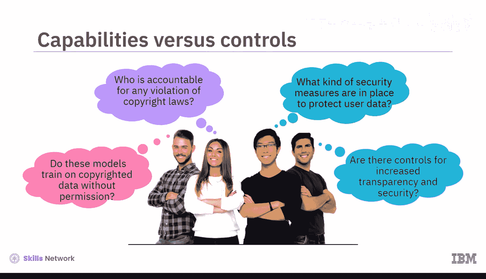
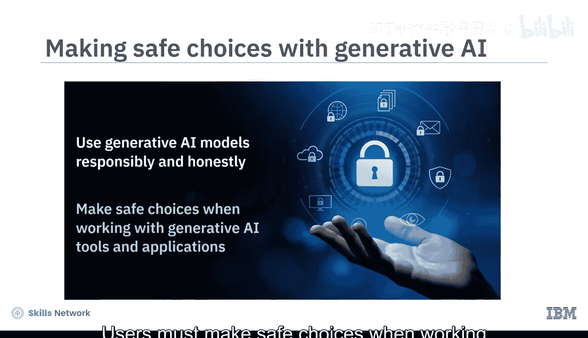
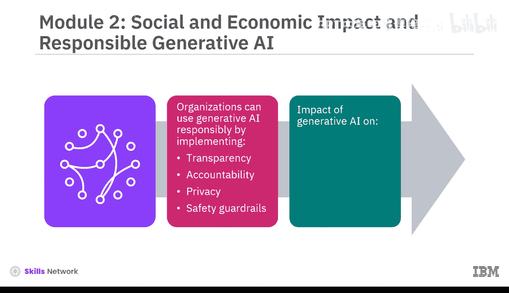
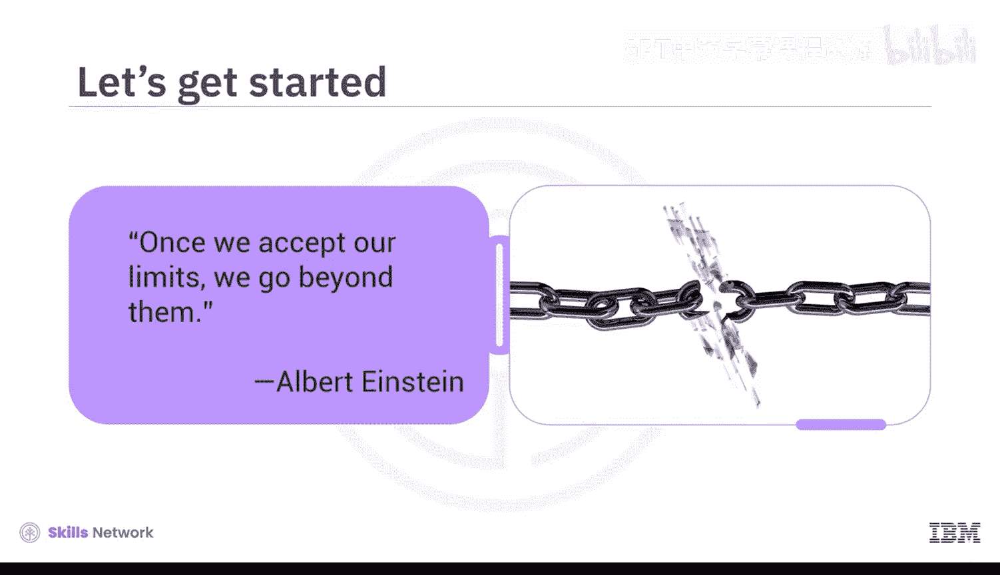

# 043：课程介绍与影响概述 🎯

在本节课中，我们将要学习生成式AI带来的广泛影响、相关考量以及伦理问题。基础模型正在不可逆转地改变我们构建和分享信息的方式，这正影响着我们的经济和社会发展。

## 生成式AI的核心影响与关键问题 🤔

上一节我们介绍了课程的整体目标，本节中我们来看看生成式AI带来的具体影响和随之而来的核心问题。

基础模型对社会和经济的影响是深远的。与此同时，我们必须正视一系列关键问题：

以下是几个必须考虑的核心问题：
*   这些模型是否在未经许可的情况下使用了受版权保护的数据进行训练？
*   如果发生侵权行为，谁应该负责？
*   为了保护用户数据并安全地享受生成式AI的能力，采取了哪些安全措施？

为了解决这些问题，实施增强透明度、安全性等方面的控制措施至关重要。

## 负责任地使用生成式AI 🤝

理解了潜在问题后，我们来看看不同角色应如何负责任地使用这项技术。

组织必须负责任且诚实地使用生成式AI模型。用户在使用生成式AI工具和应用程序时，也必须做出安全的选择。

## 课程适合人群与学习目标 🎓

本课程面向所有初学者，无论您是专业人士、爱好者、从业者还是学生。如果您对快速发展的生成式AI领域有真正的兴趣，那么这门课程就适合您。这是一门面向所有人的课程，无论您的背景或经验如何。

在本课程结束时，您将能够：
*   描述生成式AI的局限性及相关关切。
*   识别与生成式AI相关的伦理问题、关切和滥用行为。
*   举例说明负责任使用生成式AI的考量因素。
*   讨论生成式AI对经济和社会的影响。

## 课程结构与内容模块 📚

本课程是一个由三个模块组成的精炼课程。预计您需要花费一到两小时来完成每个模块。

在**模块1**中，您将探索与生成式AI相关的各种局限性和关切，例如**训练数据偏见**、缺乏准确性、可解释性。您将识别伦理考量，如**数据隐私**、**版权侵权**和**幻觉**，并了解与深度伪造相关的风险。

在**模块2**中，您将了解组织如何通过实施透明度、问责制、隐私和安全护栏等措施来负责任地使用生成式AI。您还将全面审视生成式AI对我们经济增长和社会福祉的影响。

**模块3**将邀请您参与一个最终项目，并提供一个计分测验来检验您对课程概念的理解。您还可以访问课程术语表，并获得关于后续学习步骤的指导。

## 学习方法与资源 💡

本课程融合了概念视频和辅助阅读材料。观看所有视频以充分掌握学习材料的潜力。您将通过动手实验来理解生成式AI模型的局限性，并在模块3中参与最终项目。

每节课末尾都有练习测验，帮助您巩固学习。课程结束时，您还需要完成一个计分测验。课程还提供讨论区，供您与课程工作人员联系并与同伴交流。

最有趣的是，通过专家观点视频，您将听到经验丰富的从业者谈论关于生成式AI伦理考量和局限性的现实情况。

正如阿尔伯特·爱因斯坦所说：“一旦我们接受了自己的极限，我们就能超越它们。”让我们开始吧。

---

**本节课中我们一起学习了**生成式AI基础课程的开篇介绍，涵盖了生成式AI的广泛影响、引发的关键伦理与安全问题、课程的目标受众与学习目标，以及整个课程的结构、内容和学习方法。我们认识到，在拥抱这项强大技术的同时，必须对其局限性保持清醒，并以负责任的态度加以运用。