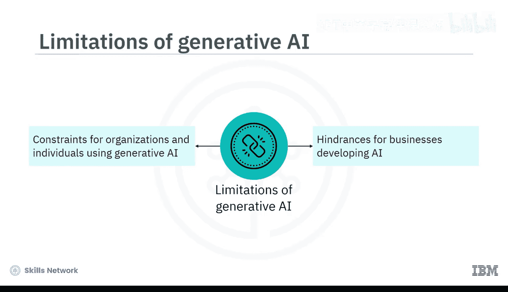
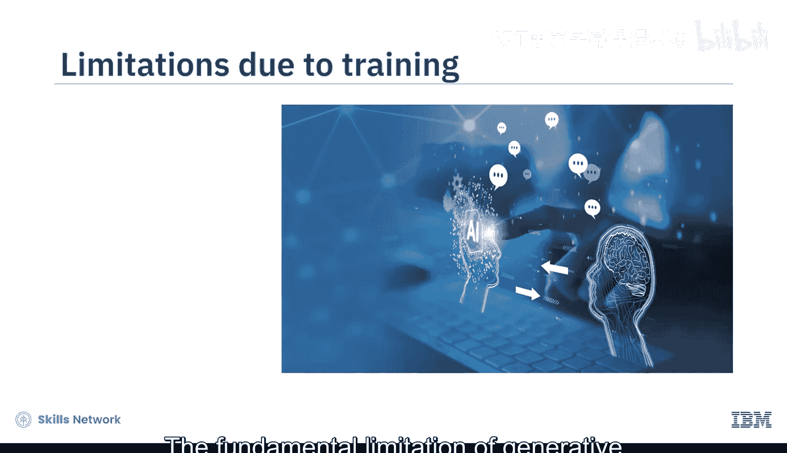
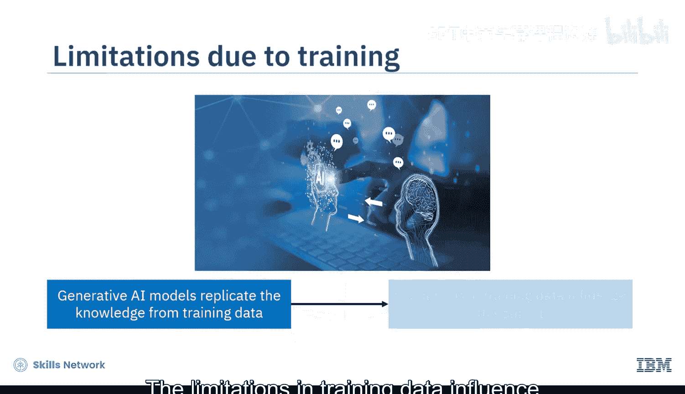
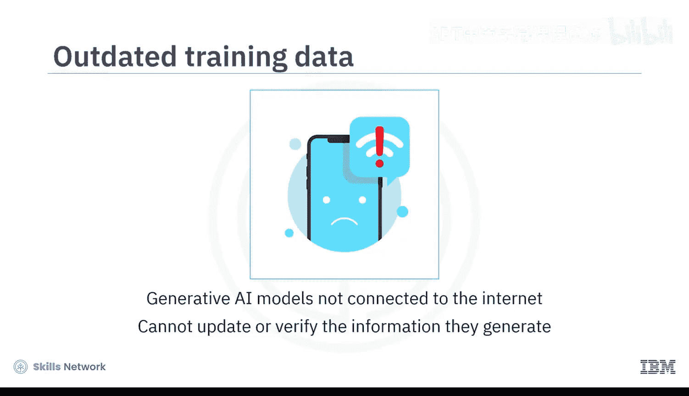
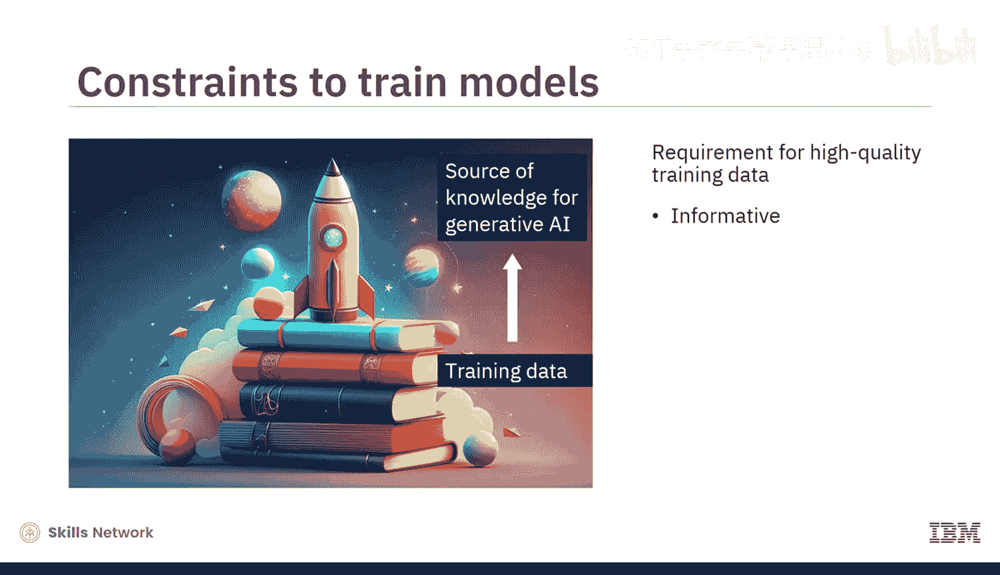

# 044：生成式AI的局限性 🧠

在本节课中，我们将要学习生成式人工智能的主要局限性。了解这些限制对于评估其适用性、规避潜在风险以及负责任地使用该技术至关重要。

观看本节内容后，你将能够描述生成式AI在训练数据方面的局限性，并识别其其他重要的限制。

## 概述：生成式AI的广泛应用与固有局限

生成式AI能够生成新颖、呈现良好且令人信服的内容，这使其在商业、社会领域以及各行各业中得到广泛应用。然而，在将其视为完全可用的商业工具之前，必须正视生成式AI显著的局限性。这些局限性可能成为企业开发AI的潜在障碍，也是组织和个人使用生成式AI时的约束条件。

接下来，让我们探讨生成式AI的几个主要局限性。

## 核心局限一：对训练数据的依赖 📊

生成式AI最根本的局限性与其训练数据密切相关。生成式AI模型本身并非信息的存储库，它们只是努力根据所训练的数据来生成和复制知识。训练数据的局限性直接影响模型输出的质量。

以下是训练数据相关的几个具体问题：

*   **数据范围有限导致输出受限**：如果图像生成模型的训练数据集范围有限，生成的图像也会在范围上受限。例如，当你要求模型生成一张猫的图片时，它可能只会生成一只外观普通的猫，而无法体现特定品种或个体猫的独特特征。
    *   **公式/代码描述**：`生成的图像质量 ≈ 训练数据集的多样性与质量`
*   **数据截止日期导致信息过时**：许多生成式AI模型基于具有截止日期的数据进行训练，这会导致其提供过时或错误的信息。模型因此无法回答关于当前信息和事件的问题。例如，GPT-3.5的训练数据截止到2022年1月。当要求它生成基于2022年1月之后发生的事实或事件的信息时，模型要么不提供回应，要么生成不准确或虚构的回应。在这种情况下，AI模型应明确说明其回答所依据的数据截止日期。
*   **缺乏实时更新与验证能力**：此外，许多生成式AI模型并未连接到互联网，无法更新或验证它们生成的信息。
*   **高质量数据获取困难**：由于训练数据是生成式AI模型知识的主要来源，因此对高质量训练数据有很高要求。训练数据需要信息丰富、及时更新、准确且无偏见。然而，训练所需的大规模数据集并非总能轻易获得，或者成本非常高昂。例如，对于罕见疾病等特定领域，由于病例稀缺、患者隐私考虑以及需要专业医学知识等原因，获取足够数据可能既困难又昂贵。

上一节我们介绍了训练数据带来的根本性限制，本节中我们来看看生成式AI在理解和创造力方面的边界。

## 核心局限二：语境理解与创造力的边界 🎨

生成式AI擅长分析数据以识别模式和趋势，并利用它们生成新内容。然而，当面对超出其训练参数范围的新数据、信息或解决方案时，它在理解语境方面存在局限。

例如，考虑一个经过训练用于辅助法律文件审查的生成式AI模型。它接受了大量法律文件的训练，擅长识别常见的法律条款并提供相关建议。但是，如果你提交一个新颖、复杂的法律案件，该模型可能难以提供有深度的分析，因为它缺乏处理此类独特且前所未有的法律场景的语境和训练。

生成式AI无法完全取代人类的创造力或批判性思维。它的创造力仅限于其训练数据的边界之内，不具备发明一个全新想法的能力，无法“跳出框框”思考。

一个需要考虑的例子是：它可以就一个想法或辩论生成信息，但无法评估哪一方更有深度或更可信。它也无法识别幽默或讽刺等抽象概念。所有这些都需要人类的参与。

从用户的角度来看，生成式AI还有一个显著的局限性。

## 核心局限三：缺乏可解释性与透明度 ❓

生成式AI模型通常被认为是复杂且不透明的。用户可能难以理解模型是如何生成内容、做出预测或得出特定决策的。这种缺乏透明度和可预测性的情况，引发了人们对AI生成输出的问责制和可靠性的担忧。

## 总结

本节课中，我们一起学习了可能制约生成式AI广泛采用的几个主要局限性：

1.  **训练数据依赖**：生成式AI的根本局限性与训练数据相关。所需的大规模数据集可能不易获得、可能过时或不准确。训练数据的局限性直接影响模型的输出。
2.  **理解与创造力受限**：生成式AI的理解和创造力仅限于其训练数据，无法完全取代人类的创造力或批判性思维。
3.  **缺乏可解释性**：生成式AI缺乏可解释性和透明度。这种不透明和不可预测性引发了对其问责制和可靠性的担忧。

认识到这些局限性，有助于我们在利用生成式AI强大能力的同时，保持审慎和批判性的态度。