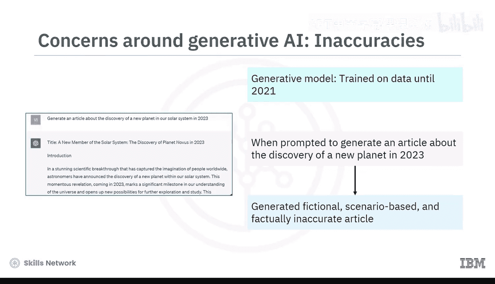
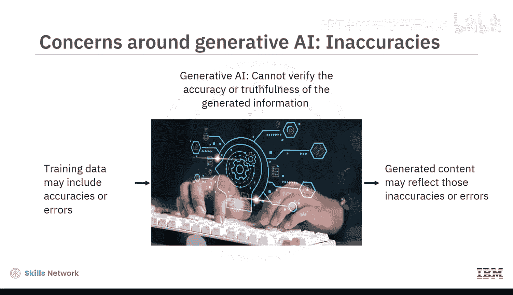
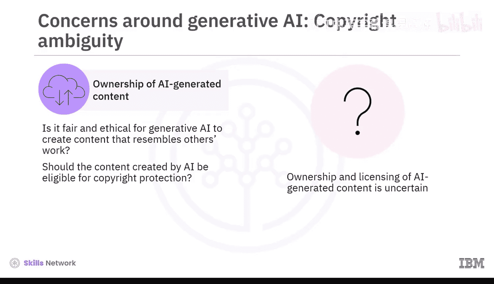
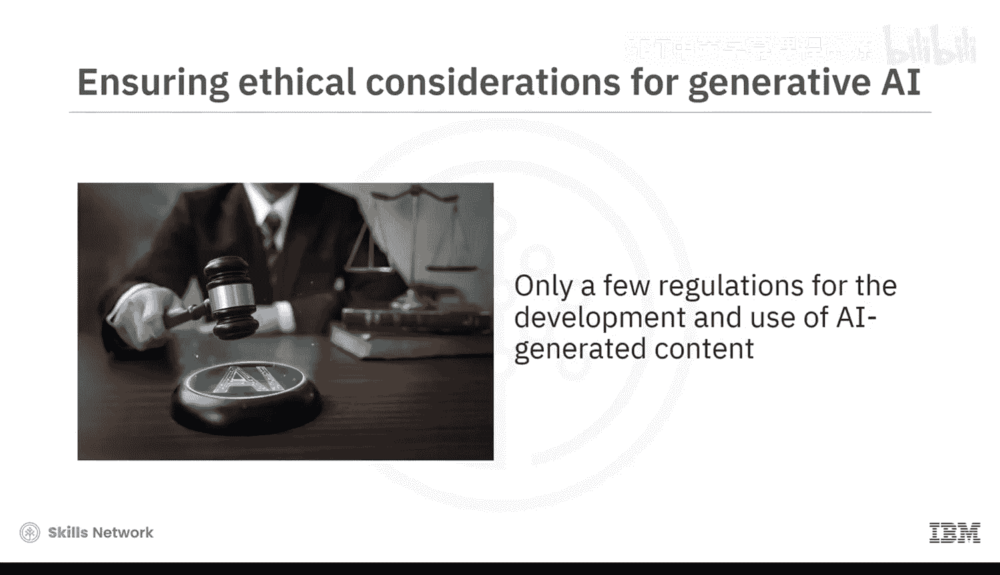
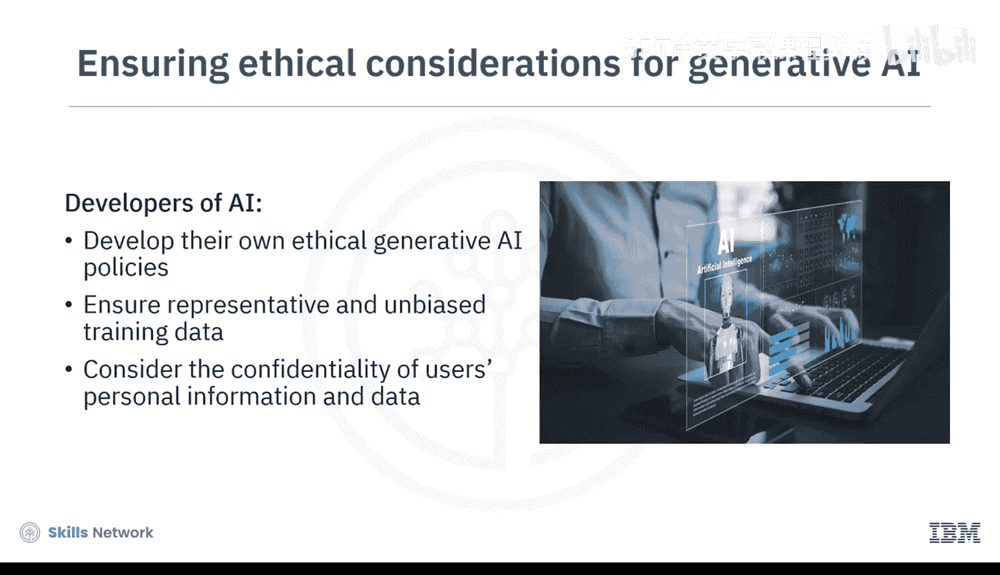
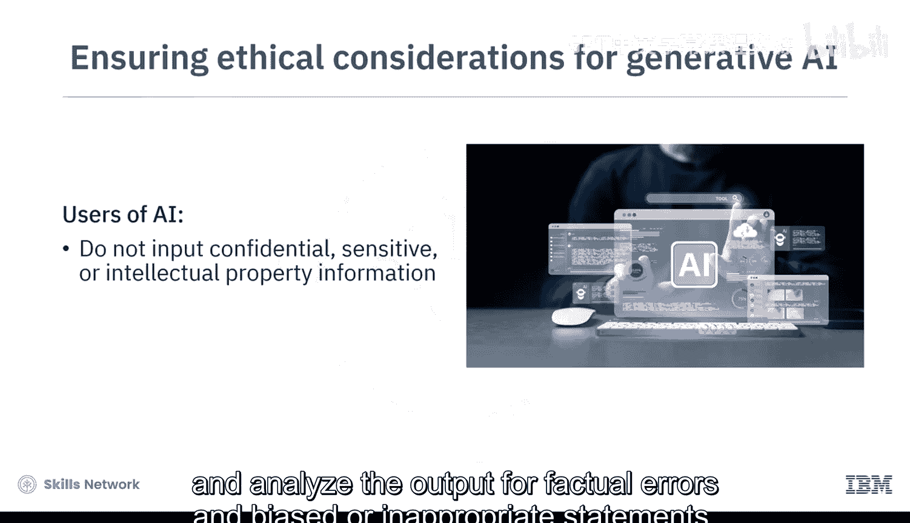
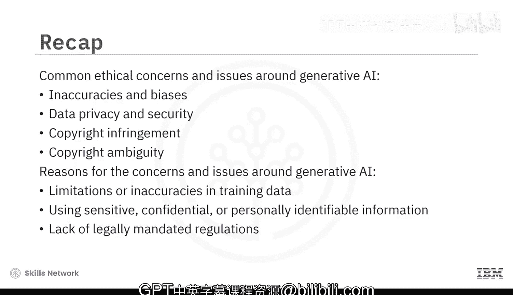

# 045：生成式AI的问题与关切 🧐

在本节课中，我们将探讨生成式人工智能在广泛应用过程中所引发的一系列常见问题与伦理关切。理解这些问题对于负责任地开发和使用AI技术至关重要。

## 概述

生成式AI凭借其自然语言理解、内容创作、图像合成和问题解决等突破性能力，正被各行各业大规模采用。高德纳公司预测，到2025年，生成式AI将占所有产出数据的10%。然而，这种能力的快速发展和随之而来的广泛采用，也催生了一些关键的问题和伦理关切。

## 主要关切点

以下是围绕生成式AI最普遍的几类关切。

### 1. 不准确性与偏见

上一节我们提到了生成式AI的广泛应用，本节中我们首先来看看其输出内容的可靠性问题。生成式AI模型可能产生事实不准确或带有偏见的内容。

**不准确性示例**：假设一个生成式模型在截至2021年的大型文章数据集上训练。当被要求生成一篇关于2023年太阳系内发现新行星的文章时，该模型可能会根据其对天文学和科学发现的理解，生成一个基于虚构场景且事实不准确的“文章”。这里的核心局限在于，生成式AI**缺乏验证其生成信息准确性或真实性的能力**。如果训练数据本身包含错误，模型的输出就会反映这些错误。此外，大多数生成式AI模型是在海量数据上预训练的，但**无法动态跟进最新事实或新信息**。

**偏见问题**：除了不准确性，训练数据也可能存在偏见。当训练数据采样不佳、未能准确反映真实世界时，就可能产生偏见。生成式AI模型中常见的偏见模式包括负面或过时的刻板印象与歧视。例如，一个图像生成AI工具在被要求生成“CEO”的图像时，可能总是生成中年白人男性的图像。已观察到的偏见还包括与性别、种族、宗教或其他人口统计特征相关的刻板印象、政治偏见、文化和语言偏见，以及历史信仰或实践。

为了减少这些偏见，确保训练数据的**多样性和代表性**至关重要。开发者和用户必须通过谨慎的数据选择、微调以及评估和改进流程来解决这个问题。

### 2. 数据隐私与安全

接下来，让我们聚焦于与生成式AI相关的数据隐私与安全方面。

你输入到开源AI模型中的任何数据或查询，都可能被用作训练数据。这些数据可能包含敏感信息，例如个人身份信息或组织的机密信息。因此，生成式AI模型可能会**在其输出中意外地或有意地泄露用户的个人数据或组织的机密数据**，并将其公之于众。

### 3. 版权侵权与模糊性

数据隐私和安全问题可以延伸到版权和法律风险领域。

**版权侵权**：生成式AI模型可能会在其输出中泄露创作者或组织的原始数据和内容，这些内容可能被其他用户和组织使用或利用。据此，一个模型可能侵犯用户或其他公司的**版权和知识产权**。此外，生成式AI模型生成的内容可能包含受版权保护的要素，如徽标、商标或受版权保护的图像。未经许可将此类内容用于商业目的可能导致法律诉讼。

**版权模糊性**：另一个相关关切是版权归属的模糊性，即**AI生成内容的所有权问题**。这决定了谁拥有通过AI模型生成的内容和创意作品的著作权。有几个主要问题需要考虑：
*   **所有权归属**：例如，考虑一幅基于或类似于达芬奇名画《蒙娜丽莎》的AI生成图像。那么，谁拥有这种生成创意作品的所有权？是原始图像的艺术家、拥有并训练了生成该图像的AI模型的组织，还是提示模型生成该图像的用户？
*   **伦理公平性**：生成式AI创作与他人作品高度相似的艺术或内容，是否公平且符合伦理？
*   **版权保护资格**：AI创作的内容是否有资格获得版权保护？一种观点认为没有，因为它不是人类创造力的产物。然而，也有人认为有，因为它是算法、编程与人类输入共同作用的结果。

目前，确定AI生成内容的所有权和许可仍然是一个悬而未决的话题，仅有少数法律强制规定的法规。

## 责任与行动建议

鉴于上述问题，AI开发者应率先制定自己的**伦理生成式AI政策**，以保护自身和客户。例如，他们必须确保训练数据具有代表性和无偏见，并且在生成式AI模型的训练、开发和部署过程中，尊重用户个人信息的机密性。

作为用户，要确保自己合乎伦理地使用生成式AI具有挑战性，但使用生成式AI工具时可以考虑以下几点：
*   不要输入机密、敏感或构成知识产权侵权的信息。
*   分析输出内容是否存在事实错误、偏见或不恰当的陈述。

## 总结

本节课中，我们一起学习了生成式AI的一些常见伦理关切和问题。这些关切包括**不准确性与偏见、数据隐私与安全、版权侵权与版权模糊性**。导致这些问题的一些原因包括：训练数据的局限性或不准确性、使用敏感/机密/个人身份信息训练模型，以及缺乏关于AI生成内容开发或使用的法律强制规定。

理解这些问题有助于我们更清醒、更负责任地面对和运用强大的生成式AI技术。