生成式AI基础：04：文本与图像生成大语言模型的幻觉现象 🧠

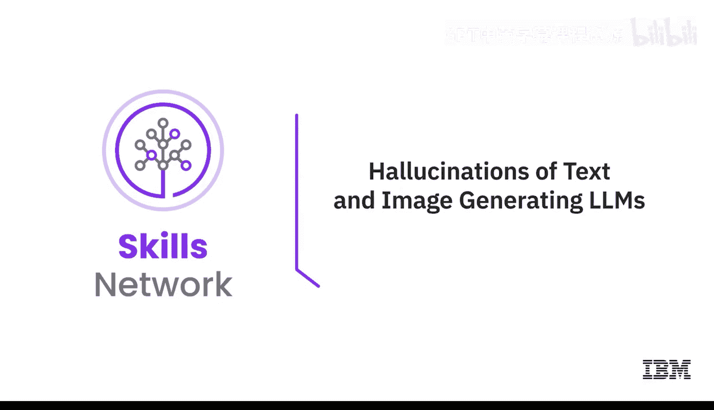

在本节课中，我们将要学习大语言模型在生成文本和图像时出现的“幻觉”现象。我们将解释什么是幻觉、它为何会发生、可能带来的负面影响，以及如何通过多种技术来降低幻觉风险。

---

### 什么是幻觉？

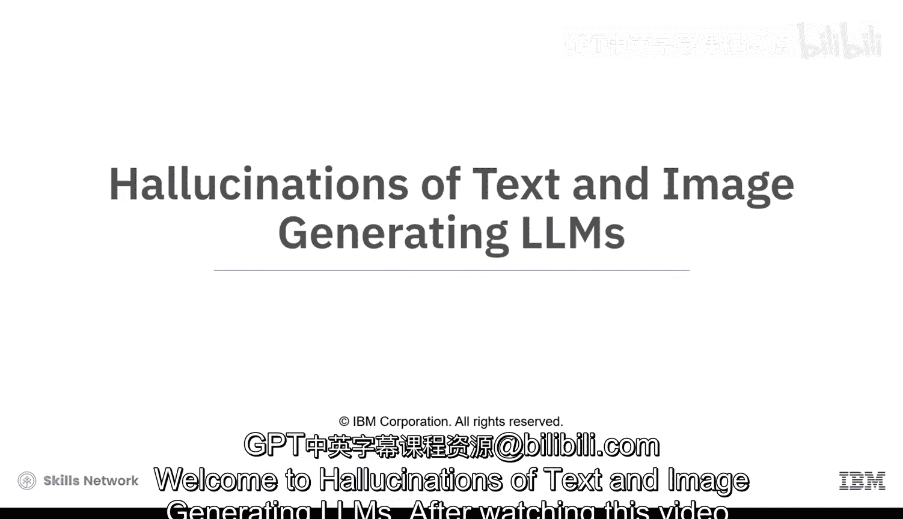

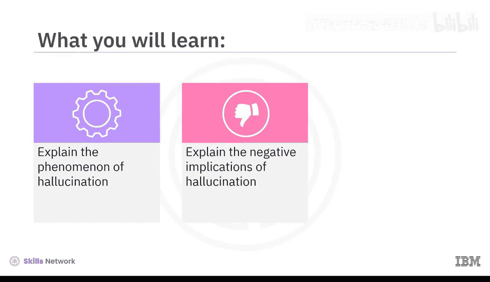

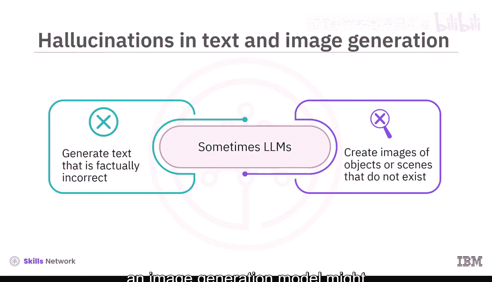

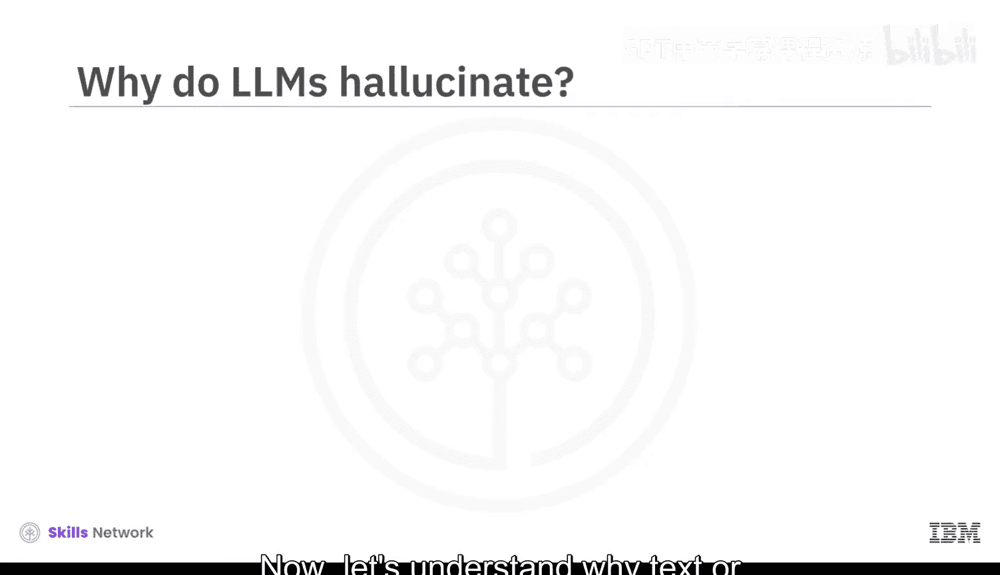

幻觉是指生成式AI模型产生缺乏事实依据的内容。有时，大语言模型会生成事实不准确或缺乏连贯性的文本。例如，一个语言模型可能生成包含捏造信息的新闻文章，或创作出用词毫无意义的诗歌。在图像生成中，模型可能创造出包含不存在物体或场景的图片，例如，一只长着翅膀的猫，或漂浮在空中的山脉。

上一节我们介绍了幻觉的基本概念，本节中我们来看看导致幻觉的主要原因。

---

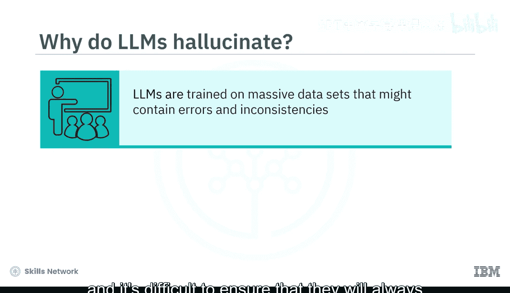

### 幻觉产生的原因

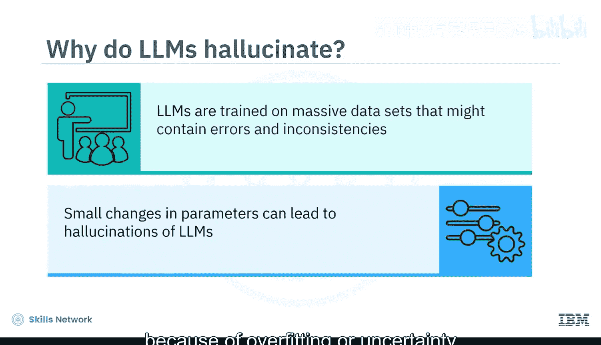

大语言模型在包含错误和不一致信息的海量文本和图像数据集上进行训练。由于大语言模型的训练目标是最大化生成内容的似然概率，它们更倾向于生成与训练数据相似的内容，即使这些数据本身并不准确或不真实。此外，大语言模型是参数复杂的系统，很难保证它们总能生成准确、真实的内容。

这些参数的微小变化，也可能因为**过拟合**或对内容正确性的**不确定性**而导致幻觉。让我们详细了解一下：

*   **过拟合**：当一个模型过于精通从训练数据中学习，却难以将知识应用于新数据时，就会发生过拟合。这可能导致模型生成训练数据集中不存在的新内容。
*   **优化目标**：生成式AI模型的训练目标通常是优化其生成的内容。这可能导致模型产生在统计上看似合理、但事实上并不正确的内容。

理解了幻觉的成因后，接下来我们探讨它可能带来的问题。

---

### 幻觉的负面影响

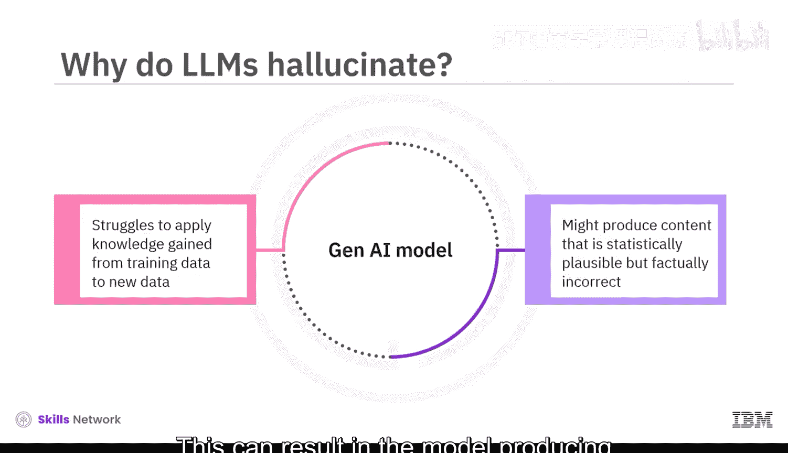

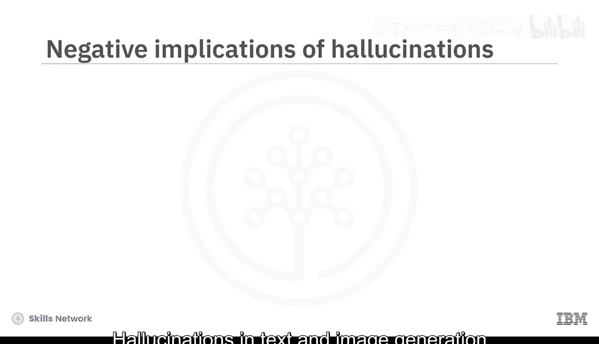

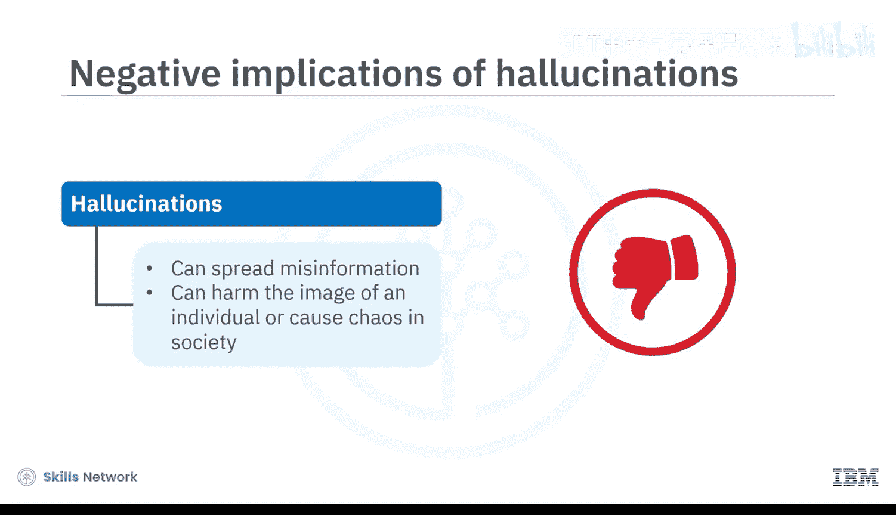

幻觉在文本和图像生成中可能产生严重的负面影响。

以下是其主要危害：
*   **传播错误信息**：幻觉可用于制造有害和冒犯性内容。
*   **损害信任**：幻觉使得人们难以信任生成式AI模型的输出，从而限制了其在现实应用中的有效性。
*   **危害个人与社会**：幻觉可能导致假新闻文章或图像的创建，这些内容可用于欺凌、骚扰他人或传播宣传，从而损害个人形象或引发社会混乱。

既然幻觉有诸多危害，那么有哪些方法可以应对呢？

---

### 降低幻觉风险的技术

目前没有单一方案能完全解决文本和图像生成中的幻觉问题。然而，通过结合不同方法，可以显著降低幻觉风险，并提高生成式AI模型的可靠性。

以下是几种主要技术：
*   **使用精选数据集训练**：例如，艾伦人工智能研究所开发的常识开放可信答案数据集，用于训练模型进行常识推理，防止生成事实不准确的陈述。
*   **开发新的训练方法**：例如，谷歌AI的研究人员开创了一种名为**对比学习**的新训练方法，可用于指导大语言模型生成更准确、连贯的输出。
*   **采用后处理技术**：例如，Facebook AI研究团队引入了一种名为**Fact-Check Net**的后处理方法，用于检测生成文本中的不准确之处。
*   **精心设计提示词**：提示词工程是构建有效提示词的过程，这些提示词作为生成式AI模型的输入。精确构建提示词可以降低模型产生幻觉输出的可能性。
*   **调控输出多样性**：**温度采样**是一种用于调控生成式AI模型输出多样性的方法。公式表示为 `P(w|context) ∝ exp(logit(w)/T)`，其中 `T` 是温度参数。
    *   当温度 `T` 调高时，模型更可能产生多样化的输出，但这也增加了生成幻觉信息的风险。
    *   反之，降低温度 `T` 会减少幻觉的可能性，但会限制输出的多样性。
*   **组合多个模型的输出**：集成生成是一种技术，它将多个生成式AI模型的输出组合起来产生最终结果。这有助于降低幻觉风险，因为最终输出包含所有模型幻觉的可能性较低。

---

### 总结

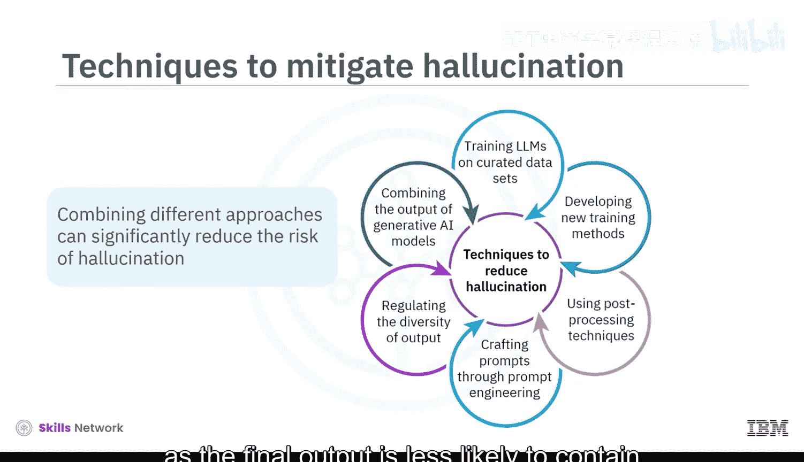

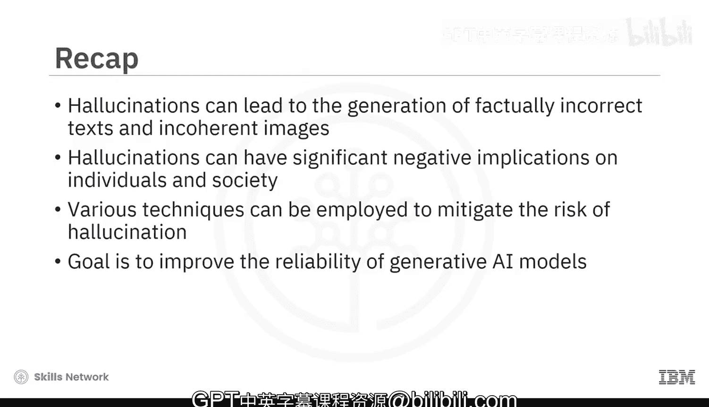

本节课中，我们一起学习了大语言模型在文本和图像生成中的幻觉现象。幻觉发生在生成式AI模型产生缺乏依据的内容时，可能导致生成事实错误或不连贯的文本和图像。这些幻觉具有重大影响，包括传播错误信息以及对个人和社会造成潜在伤害。为了减轻这些负面影响，业界采用了多种技术，包括使用精选数据集训练、开发新的训练方法、应用后处理技术、进行提示词工程以及调控输出多样性。这些技术的目标是提高生成式AI模型的可靠性，降低幻觉风险，从而增强其在现实世界应用中的实用价值。