# 047：代码生成大语言模型的幻觉现象 🧠

在本节课中，我们将要学习代码生成大语言模型（LLM）中的一个关键风险——幻觉现象。我们将了解其定义、产生原因、对开发者和用户的潜在影响，以及如何采取措施来预防其发生。

## 概述

代码生成大语言模型因其在速度、自动化、调试等方面的优势，越来越受到开发者的欢迎。然而，我们也必须关注与之相关的潜在挑战和风险。本节视频将重点探讨一个关键风险：代码生成大语言模型的幻觉现象。

## 什么是代码生成幻觉？

在代码生成LLM中，幻觉指的是模型生成的代码存在**错误、无意义或与给定提示不相关**的现象。

上一节我们介绍了幻觉的定义，本节中我们来看看它为何会发生。

## 幻觉产生的原因

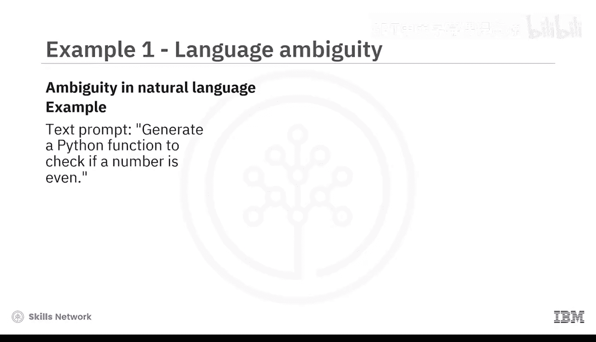

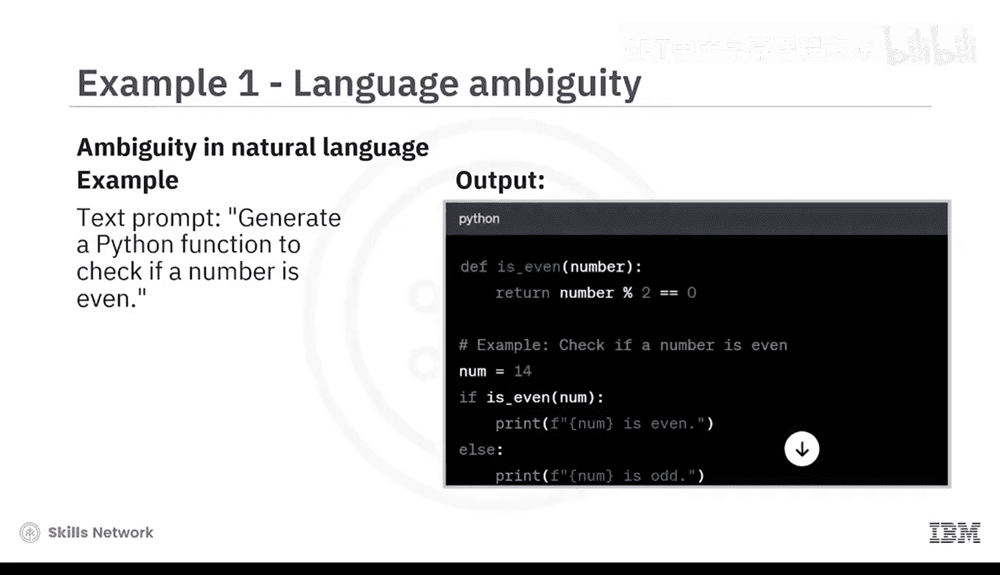

以下是导致代码生成幻觉的三个主要原因：

**1. 自然语言的模糊性**
当用于创建代码的提示语有时含糊不清时，LLM可能会被模糊的语言所迷惑，从而产生错误的代码。

例如，通过ChatGPT（一个基于GPT的工具）生成简单的Python代码。当你输入文本提示“生成一个Python函数来检查数字是否为偶数”时，ChatGPT会生成相应的Python代码。在Python编辑器中测试这段代码，你会发现对于整数输入，代码执行正确。但如果你输入数字`12.2`，理想情况下LLM应该生成一个异常，然而它却将`12.2`归类为奇数。这是因为LLM**幻觉**地认为输入只会是整数。

```python
# 幻觉示例：函数错误地认为输入总是整数
def is_even(number):
    return number % 2 == 0

print(is_even(12.2))  # 输出：False (错误地将12.2判断为奇数)
```

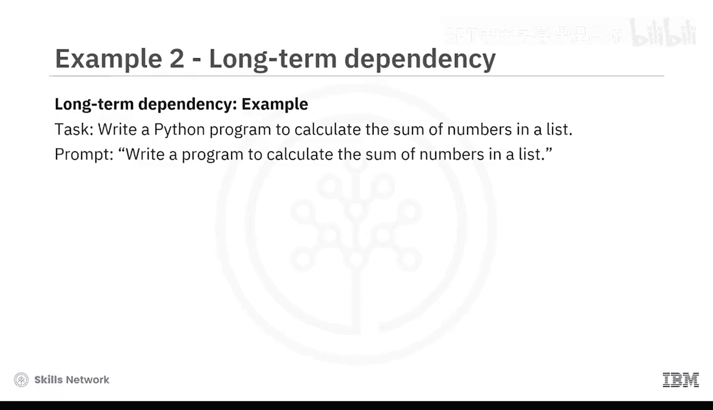

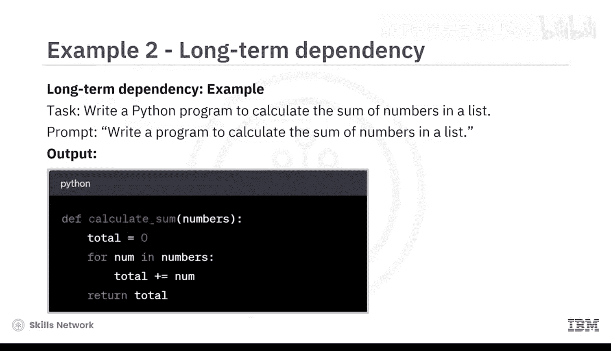

要生成正确的代码，必须提供清晰的提示，指定编程语言并提供其他相关的要求和约束。

**2. 长程依赖问题**
LLM可以处理短期上下文，但在处理长程依赖时可能遇到困难。因此，在长时间的代码生成活动中，模型有可能丢失重要信息，从而导致幻觉。

例如，任务是“编写一个Python程序来计算列表中数字的总和”。对于简短的列表，生成的代码是正确的。然而，如果用一个非常长的数字列表调用该函数，LLM可能无法跟踪总和，导致函数返回错误的结果，从而引发代码幻觉。

**3. 编程语言的复杂性**
编程语言具有复杂的语法和语义，LLM可能会误读某些语言结构，从而产生幻觉代码。

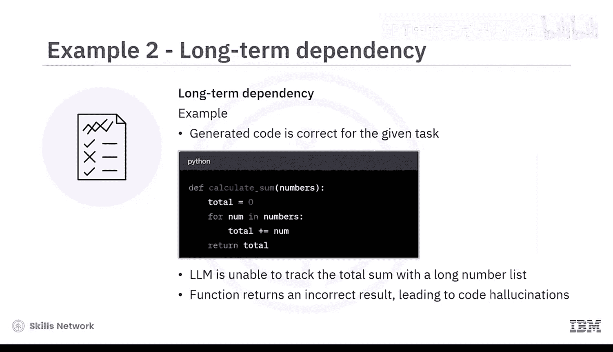

例如，假设任务是生成一个可以打开文件并读取内容的函数。生成的代码可能如下所示：

```python
# 幻觉示例：错误地以写入模式打开文件
def read_file(filename):
    with open(filename, 'w') as file:  # 错误：应为 'r' 读取模式
        content = file.read()
    return content
```

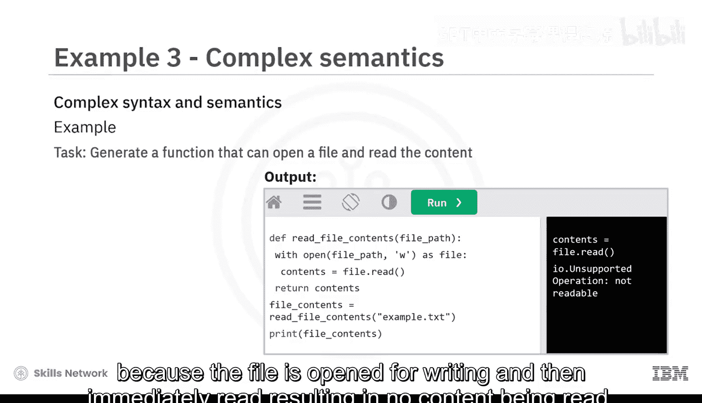

这个函数乍看之下正确，但无法正常工作。因为LLM没有正确理解文件处理。在这个例子中，模型错误地生成了以写入模式`‘w’`打开文件的代码，而不是读取模式`‘r’`，这导致返回一个空字符串，因为文件是为写入而打开的，然后立即读取，导致没有内容被读取。

这是一个假设性示例，展示了代码幻觉如何生成产生错误输出的代码。LLM生成的代码可能看起来能运行，但存在诸如不现实的转换方法、缺乏错误处理和上下文理解有限等问题。

了解了幻觉产生的原因后，接下来我们看看它对开发者有何影响。

## 幻觉对开发者的影响

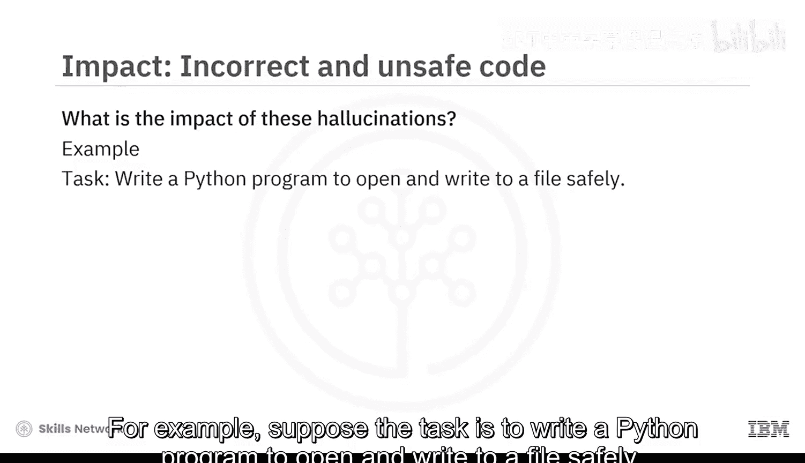

当代码生成LLM开始产生幻觉时，会带来多方面的影响：

**1. 生成错误且不安全的代码**
幻觉可能导致生成不正确和不安全的代码。这会带来风险，因为它可能在软件中引入错误或漏洞。

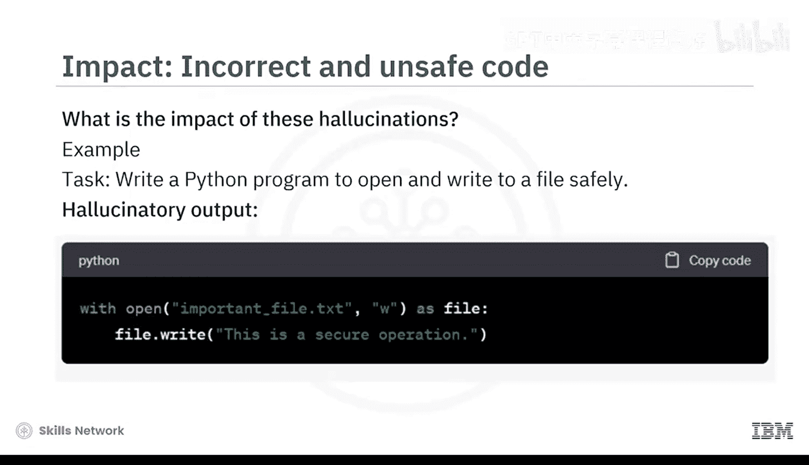

例如，任务是“编写一个安全的Python程序来打开文件并写入”。幻觉产生的不正确且不安全的输出可能如下：生成的代码暗示打开和写入文件是一个安全的操作，这本身就是一种幻觉。这段代码可能导致不正确和不安全的文件操作，因为它没有遵循处理错误的最佳实践，可能导致数据丢失或安全漏洞。

**2. 引发法律与伦理问题**
如果幻觉代码导致负面结果，可能会引发关于开发者和AI模型创建者责任的法律和伦理问题。

设想一个场景：AI模型为医疗设备幻觉生成了代码。结果是设备误解了患者数据，导致治疗错误。可能的法律和伦理问题是：谁对由幻觉代码引起的医疗错误负责？是部署AI模型的开发者，还是AI模型的创建者本身？

**3. 延续训练数据中的偏见**
受带有偏见的训练数据影响的幻觉，另一个可能后果是生成的代码可能延续现有的偏见，导致软件开发中的歧视性做法。

想象一下：一个AI模型为简历筛选工具幻觉生成了代码。结果是该工具不成比例地拒绝了女性候选人的简历。后果是生成的代码延续了训练数据中的性别偏见，通过不公平地使女性求职者处于不利地位，导致了软件开发中的歧视性做法。

既然我们了解了幻觉的影响，那么如何应对这些风险呢？

## 如何应对与预防幻觉风险

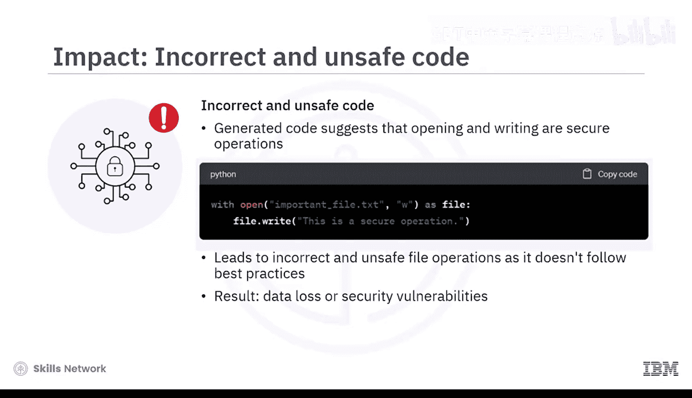

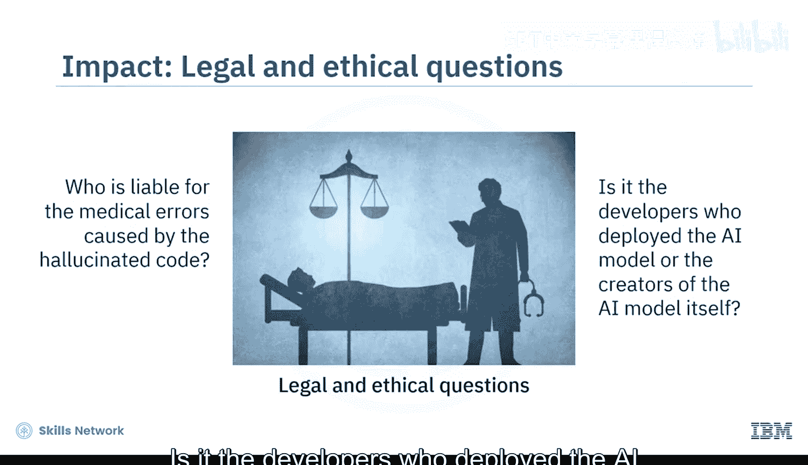


我们可以通过多种措施来应对这些风险：

**1. 提供清晰的文档**
开发者可以向用户提供关于其模型局限性的清晰文档，包括幻觉风险，使用户能够做出明智的决策。

**2. 优化提示技巧**
应努力使用提示技巧，帮助LLM生成与给定任务相关的代码。

**3. 减少偏见与遵循伦理**
最小化训练数据中的偏见，并确保生成的代码符合伦理原则至关重要。

**4. 建立强大的错误处理机制**
LLM应具备强大的错误处理机制，以检测和标记输出中潜在的幻觉。

**5. 加强开发者间的协作**
最后，LLM开发者和软件开发者之间的紧密合作有助于在现实应用中识别和纠正幻觉。

## 总结

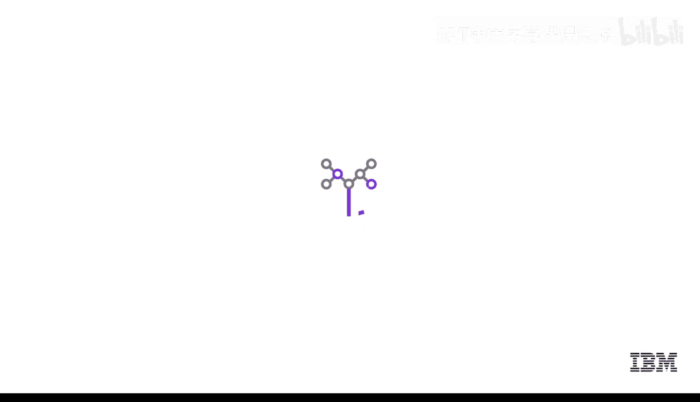

本节课中我们一起学习了代码生成LLM有时会产生幻觉，即生成与预期输出不符的事实错误响应。我们了解到，这些幻觉的原因可能是自然语言的模糊性、长程依赖问题和复杂的语义。最后，我们学习了如何通过提供文档、使用无偏见的训练数据、建立强大的错误处理系统以及加强LLM与软件开发者之间的合作来最小化这些幻觉的发生。