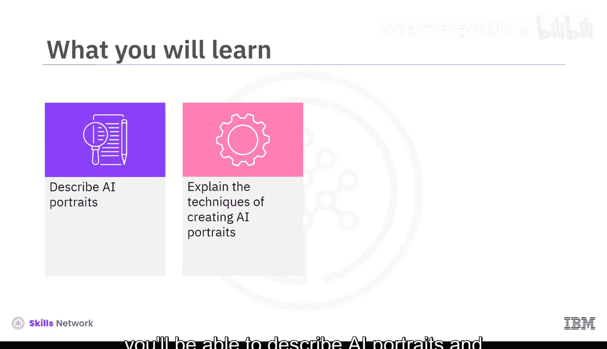
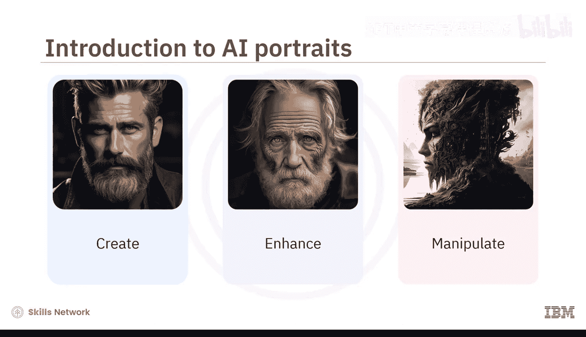
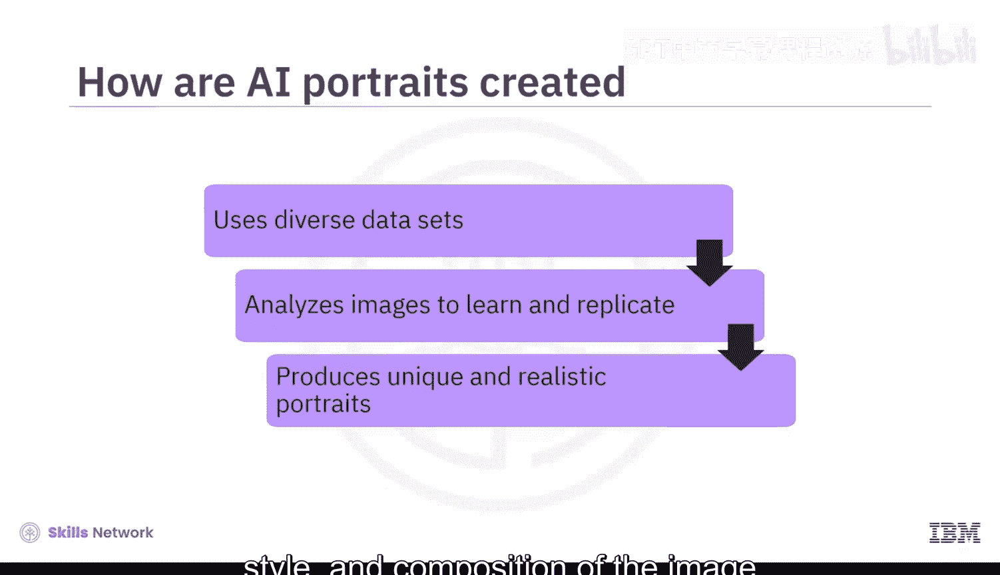
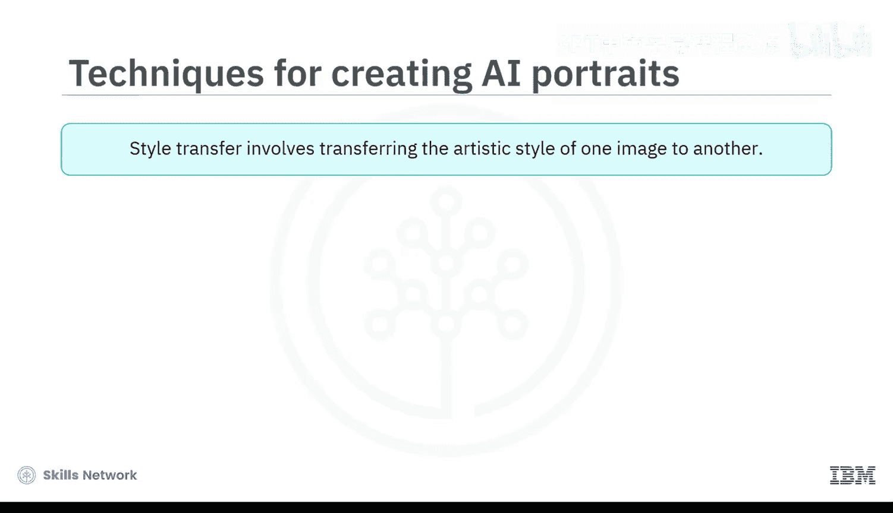
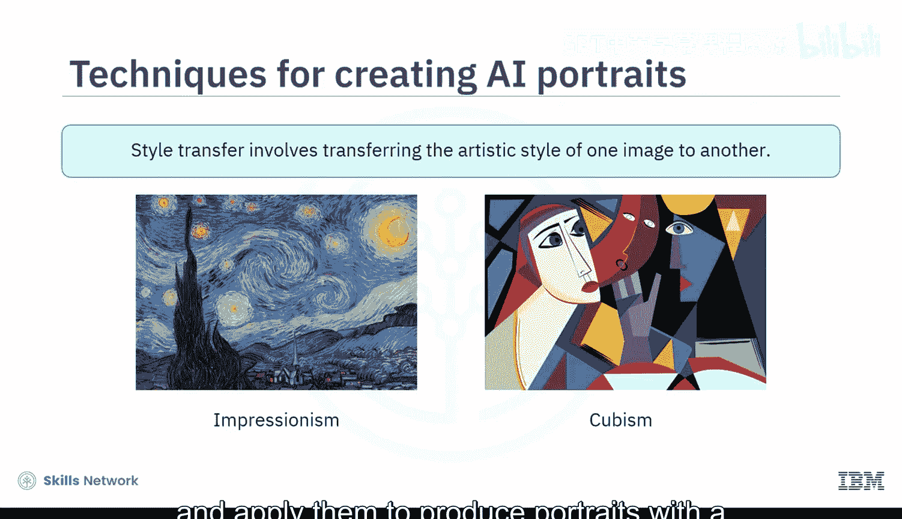
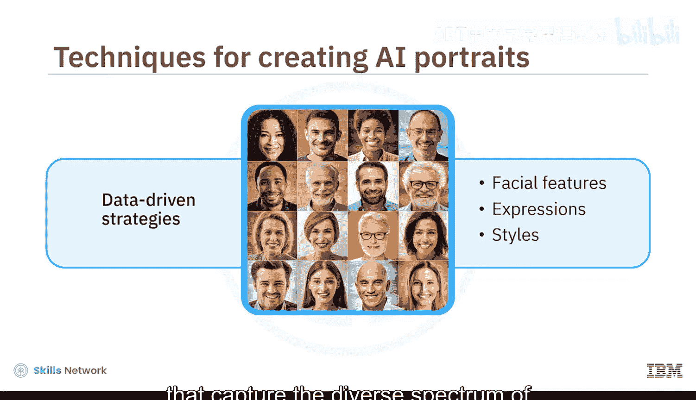
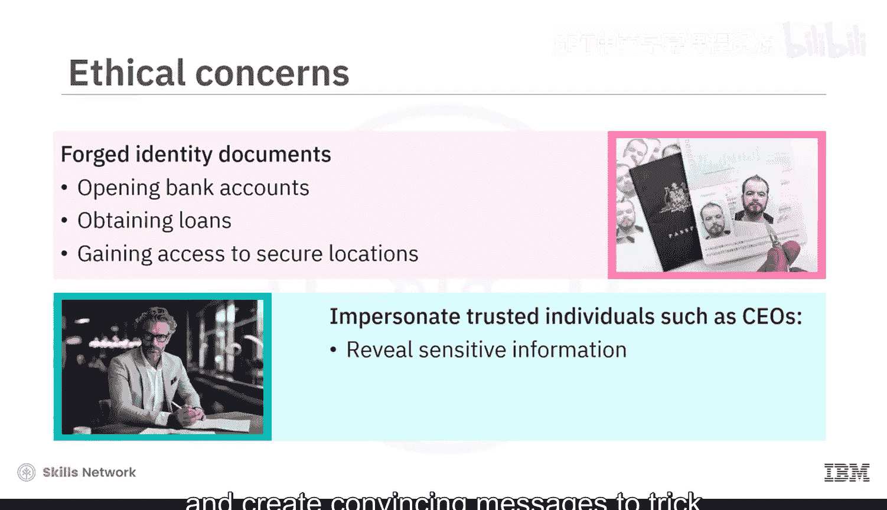
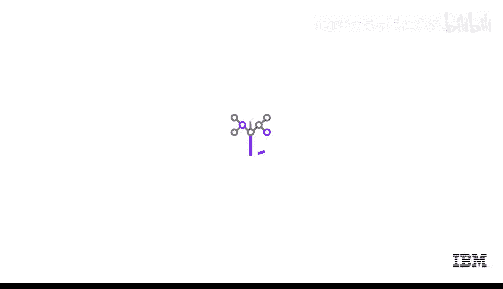

# 048：AI肖像与深度伪造 🎨

在本节课中，我们将学习生成式AI在艺术领域的一个具体应用：AI肖像。我们将了解AI肖像的创建技术，并探讨其衍生出的“深度伪造”技术及其潜在的滥用风险。

## 概述

生成式AI已在包括艺术在内的多个领域取得了显著进展。其中一个令人兴奋的进展是，生成式AI模型能够利用深度学习算法生成逼真的个人肖像。这些模型可以通过多种方式创建、增强或操控肖像，例如生成不存在的人的完整肖像、在照片中人为地老化或年轻化一个人的面容，以及应用著名画家的艺术风格来创造独特的效果。

## AI肖像的生成原理

AI肖像由机器学习算法生成，这些算法使用经过艺术化策划的多样化图像数据集。算法通过分析这些图像来学习并复制人类的艺术技巧，识别面部特征、颜色、纹理和笔触等关键元素。掌握了这些知识后，生成式AI模型便能创造出独特且逼真的肖像，允许用户定制生成图像的情绪、风格和构图，以匹配他们的偏好。

以下是创建逼真AI肖像的几种关键技术。

### 生成对抗网络

**生成对抗网络** 由两个组件构成：一个生成器负责创建虚假图像，一个判别器则试图区分真实图像和人工生成的图像。在整个训练过程中，判别器会提升其检测伪造照片的能力，而生成器则会精进其制作逼真肖像的技巧。因此，生成器和判别器共同作用，产生的AI肖像看起来与传统手绘或拍摄的肖像难以区分。

**核心公式/概念**：
- **生成器 (Generator)**: 学习数据分布，生成新数据。
- **判别器 (Discriminator)**: 判断输入数据是来自真实数据集还是生成器。

### 风格迁移

**风格迁移** 是另一种常用于制作AI肖像的技术。该方法涉及将一幅图像的艺术风格转移到另一幅图像上，从而创造出独特且视觉上引人入胜的肖像。艺术家可以利用这项技术尝试从印象派到立体主义等多种风格，并将其应用于肖像创作，实现古典艺术与现代技术的融合。

### 数据驱动策略

数据驱动策略对于创建AI肖像也很有帮助。通过分析大量的人脸数据集，生成模型能够学习到广泛的面部特征、表情和风格。这些数据集在指导模型创作肖像方面起着至关重要的作用，使其能够捕捉人类外貌和情感的多样性，从而超越传统艺术方法的限制。

## AI肖像的潜力与伦理挑战

AI肖像提供了令人兴奋的可能性，例如通过纪念个人及其故事来保护我们的文化遗产，重新连接我们的历史，以向人类遗产的众多方面致敬。

然而，它也引发了伦理问题，包括滥用和欺骗。

### 深度伪造及其滥用风险

生成式AI可能被滥用来创建“深度伪造”，这可能带来严重后果。深度伪造是指使用生成式AI模型 manipulated 的视频、图像或音频记录，使其看起来像是真实的。深度伪造可以非常具有说服力，并可能被用于各种不良目的。

以下是深度伪造可能被滥用的几种方式：

1.  **制造虚假新闻和宣传，传播虚假信息。**
2.  **骚扰或勒索他人。**
3.  **实施欺诈。** 深度伪造可用于创建伪造的身份文件或照片，用于欺诈目的，例如开设银行账户、获取贷款或进入安全区域。这可能导致金融欺诈和其他安全漏洞。
4.  **网络犯罪。** 网络犯罪分子可以使用深度伪造视频冒充可信的个人（如组织CEO），并创建令人信服的信息来诱骗员工泄露敏感信息、转移资金或下载恶意文件。

### AI肖像的其他挑战

除了深度伪造，AI辅助肖像还存在其他挑战：

*   **缺乏创作控制**：由于模型产生的结果基于数据集，因此很难创造出明显偏离机器学习算法所建立模式的作品。因此，在某些情况下，输出结果可能与艺术家的创作愿景不符。
*   **捕捉灵魂本质的困难**：虽然生成式AI模型可以产生视觉上令人惊叹的图像，但捕捉拍摄对象的灵魂本质仍然是一项持续的努力。
*   **偏见问题**：由于模型是通过数据集训练的，确保AI生成的肖像能够代表多样化的个体，并避免在性别、种族和其他因素上延续偏见，是一个至关重要的改进领域。

## 总结

本节课中，我们一起学习了AI肖像的创建与应用。我们了解到，AI肖像是使用生成式AI模型创建的，这些模型在大量精心策划的图像数据集上进行了训练。这些模型可以从零开始生成逼真的个人肖像，也可以通过增强或操控现有照片来实现。

AI肖像具有保护文化遗产和创造新艺术可能性的潜力。然而，其衍生的深度伪造技术也引发了伦理担忧，例如潜在的滥用和欺骗风险。因此，制定伦理准则和开发检测深度伪造的新技术至关重要。