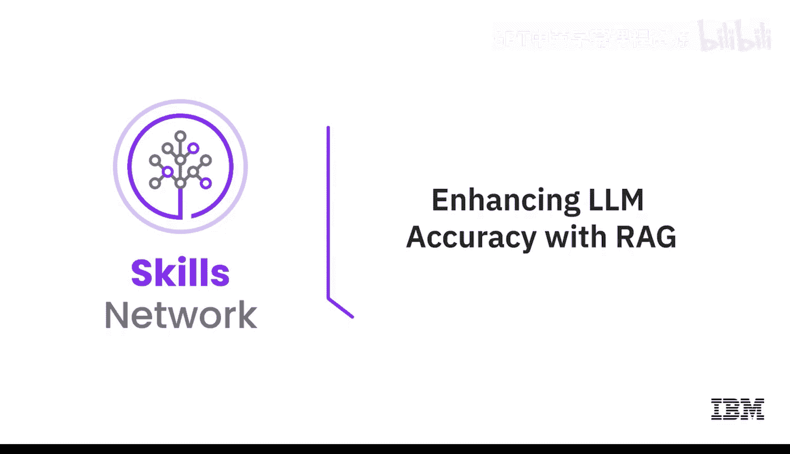
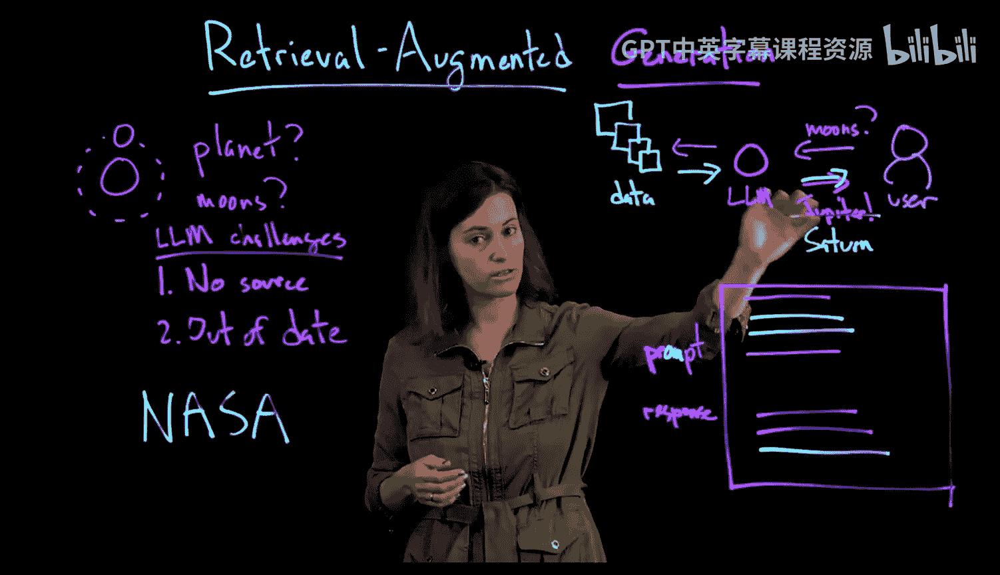

# 049：通过RAG提升大语言模型准确性 🎯

在本节课中，我们将学习一种名为“检索增强生成”的框架，它能帮助大语言模型提供更准确、更及时的回答。

大语言模型无处不在。它们在某些方面表现惊人，但在其他方面也会出现有趣的错误。我是Marina Donelevsky，IBM研究院的高级研究科学家。我想介绍一个框架，它能让大语言模型变得更准确、更与时俱进，这个框架就是检索增强生成，简称RAG。

## 理解“生成”部分 🤖

首先，让我们谈谈“生成”部分。这里的“生成”指的是大语言模型根据用户的查询生成文本。用户的查询通常被称为“提示词”。

这些模型有时会表现出一些不理想的行为。我想用一个故事来说明这一点。我的孩子们最近问我：“太阳系中哪颗行星的卫星最多？”我的回答是：“哦，你们问这个问题真是太好了，我像你们这么大的时候可喜欢太空了。当然，那是大约30年前了，但我知道答案。我读过一篇文章，文章说是木星，有88颗卫星。这就是答案。”

实际上，我的回答有几个问题。首先，我没有提供任何来源来支持我的说法。尽管我自信地说我读过文章、知道答案，但我没有引用来源，只是凭记忆给出了答案。其次，我其实很久没有关注这方面的信息了，所以我的答案已经过时了。

这里我们遇到了两个问题：一是没有来源，二是信息过时。事实上，这两个问题在与大语言模型交互时也经常被视为棘手的问题。

## 大语言模型的挑战 ⚠️

那么，如果我当时停顿一下，先去NASA这样的权威来源查找答案，情况会怎样呢？那样我就能说：“答案是土星，有146颗卫星。实际上，这个数字一直在变化，因为科学家们不断发现新的卫星。”这样，我就把我的答案建立在更可信的基础上，没有“幻觉”或编造答案。顺便说一句，我也没有泄露关于我痴迷太空是多久以前这样的个人信息。

## 引入“检索增强”部分 🔍

那么，这和大语言模型有什么关系呢？一个大语言模型会如何回答这个问题？假设有一个用户问了关于卫星数量的问题。一个大语言模型可能会自信地说：“根据我训练时学到的参数知识，答案是木星。”这个答案是错误的，但模型自己并不知道，它对自己的回答非常自信。

现在，当我们加入“检索增强”部分时，这意味着什么？这意味着，模型不再仅仅依赖其自身知道的知识，而是增加了一个内容存储库。这个存储库可以是开放的，比如互联网；也可以是封闭的，比如某个文档集、政策集等。关键在于，现在语言模型会先去与内容存储库“对话”，请求检索与用户查询相关的信息。然后，基于这个检索增强的答案，我们知道答案不再是木星，而是土星。

## RAG框架的工作流程 ⚙️

这具体是如何运作的呢？
首先，用户向大语言模型提出他们的问题。
在原始的纯生成模型中，生成模型会说：“好的，我知道答案，这是我的回答。”
但在RAG框架中，生成模型实际上收到了一条指令：“不，先别急。先去检索相关内容。”模型将检索到的内容与用户的问题结合起来，然后才生成答案。因此，现在的提示词包含三个部分：
1.  指令：要求关注检索到的内容。
2.  用户的问题。
3.  结合以上两者，给出回应。

实际上，现在你还可以为你给出的答案提供证据。

## RAG如何解决挑战 ✅

现在，希望你能看到RAG如何帮助解决我之前提到的两个大语言模型挑战。
首先是信息过时问题。现在，当有新信息出现时，你不需要重新训练整个模型。你只需要用新信息、更新信息来增强你的数据存储库。这样，下次用户再来问同样的问题时，我们就能准备好，直接检索最新的信息。
第二个是来源问题。现在，大语言模型被指示在给出回应前，要关注原始数据源。实际上，它现在能够提供证据。这使得它不太可能产生“幻觉”或泄露数据，因为它不太可能仅仅依赖训练中学到的信息。它还允许我们让模型具备一种非常积极的行为：知道何时说“我不知道”。如果用户的问题无法基于你的数据存储库可靠地回答，模型应该说“我不知道”，而不是编造一个看似可信但可能误导用户的答案。

## 潜在的负面影响与未来方向 🔮

不过，这也可能带来负面影响。如果检索器的性能不够好，无法为大语言模型提供最优质、最相关的背景信息，那么本可回答的用户查询可能就得不到答案。这正是为什么包括我们IBM在内的许多人，正在从两个方面努力解决这个问题：一方面改进检索器，为语言模型提供最高质量的背景数据；另一方面改进生成部分，使得语言模型在生成最终答案时，能为用户提供最丰富、最好的回应。

## 总结 📝

本节课中，我们一起学习了检索增强生成框架。我们了解到，纯生成的大语言模型可能存在信息过时和缺乏来源的问题。RAG框架通过引入一个外部内容存储库和检索步骤，让模型在回答前先查找相关信息，从而显著提升了回答的准确性和时效性，并能够提供证据支持。同时，我们也认识到，检索器的质量对于RAG的效果至关重要。通过结合更优的检索和生成技术，我们可以构建出更可靠、更强大的AI助手。

感谢你学习更多关于RAG的知识。