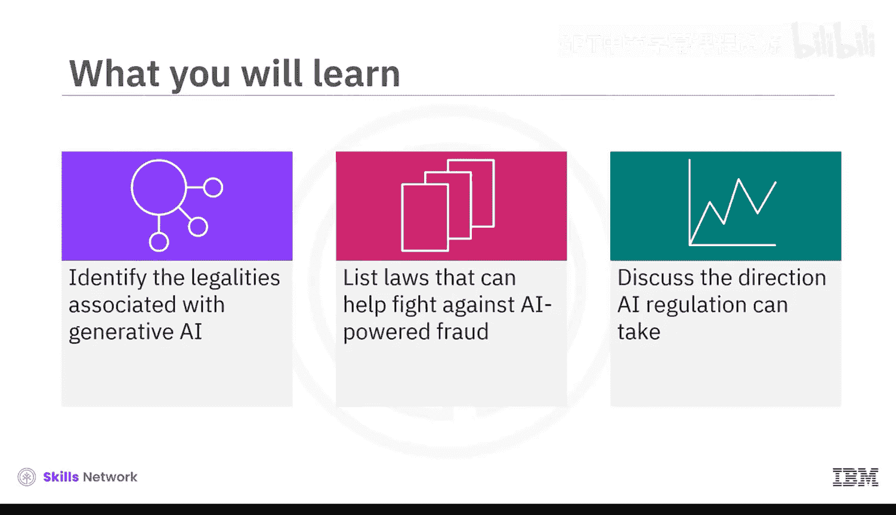
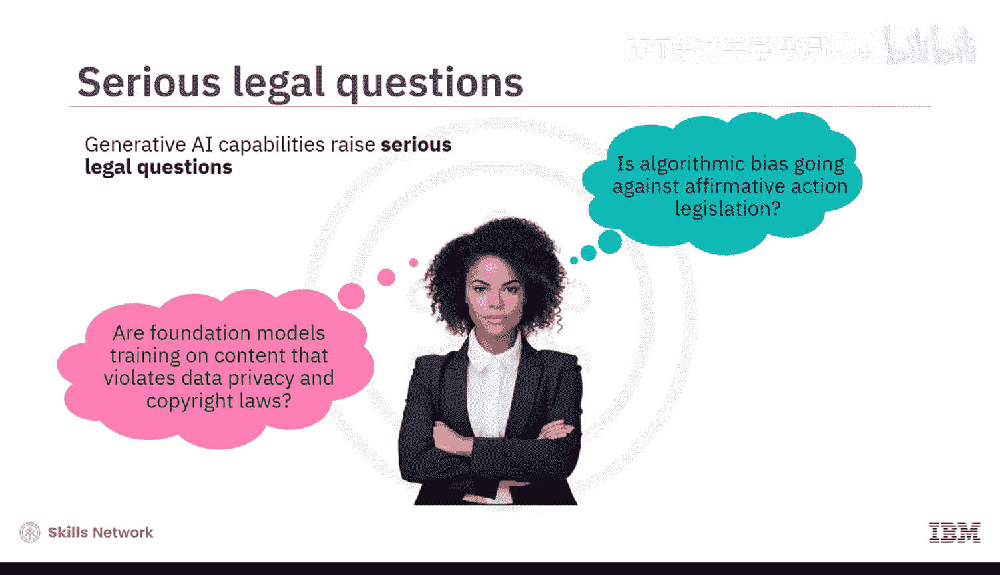
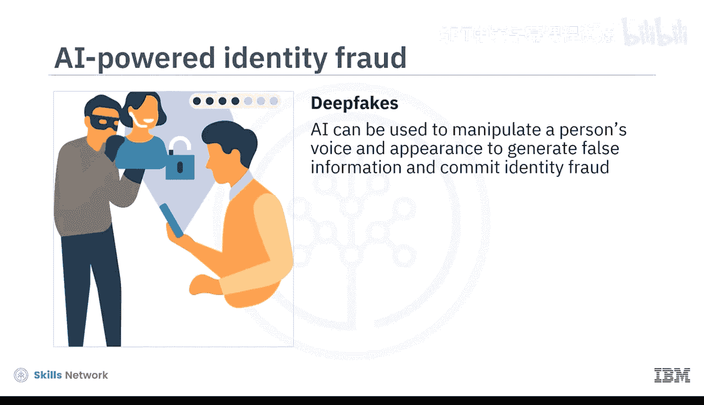
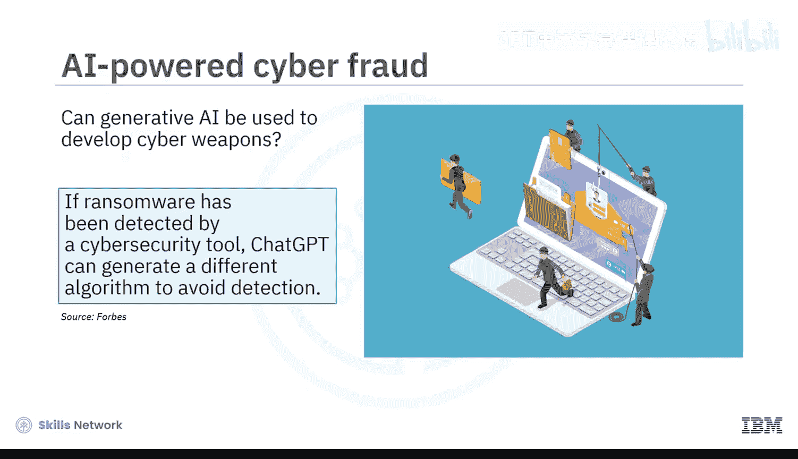
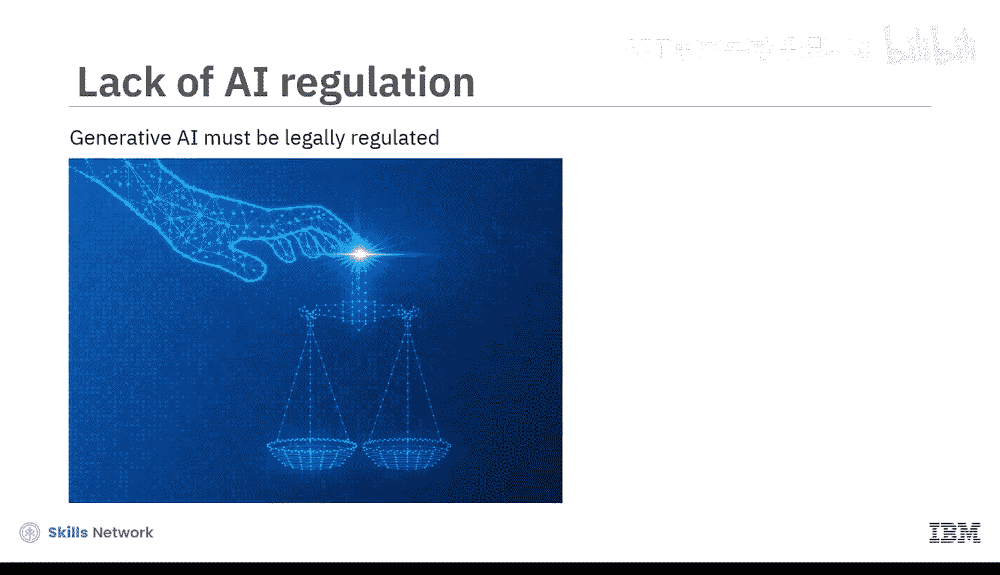
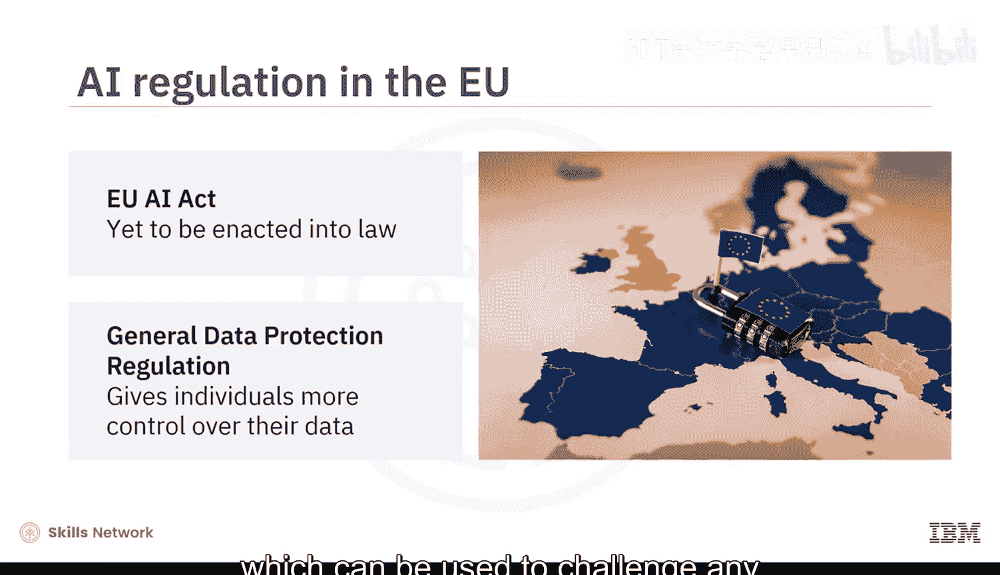
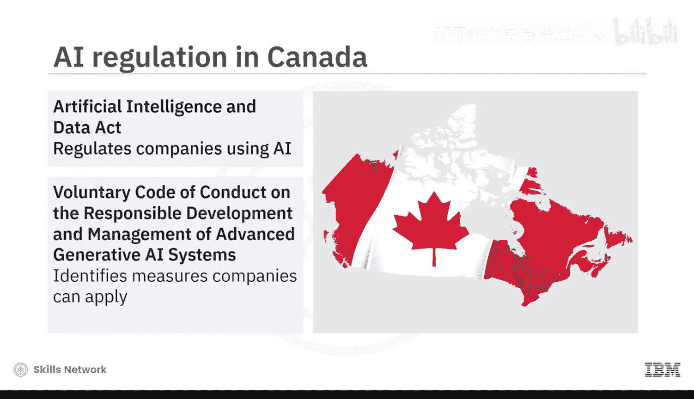
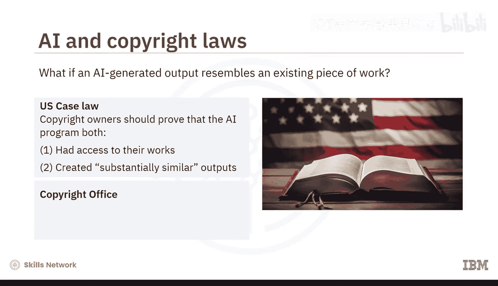
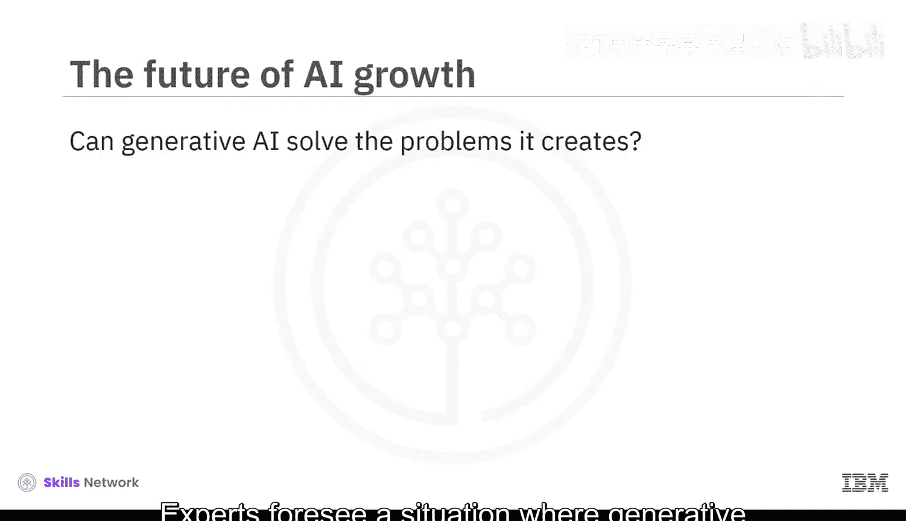
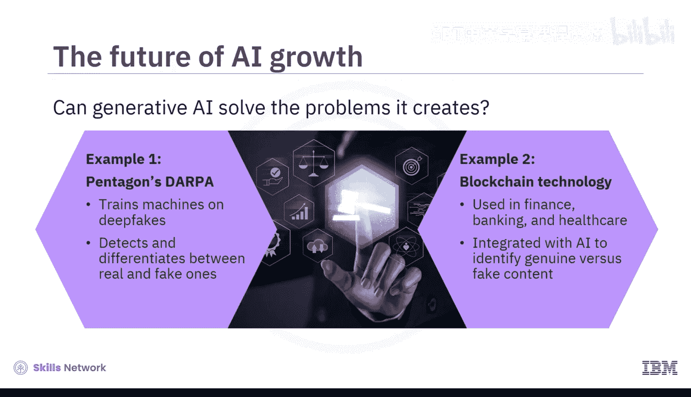

# 050：生成式AI的法律问题与影响 🧑⚖️

在本节课中，我们将要学习生成式AI技术所引发的一系列法律问题与潜在影响。我们将探讨相关的法律挑战、各国现有的监管措施，以及如何在创新与规范之间取得平衡。

观看本视频后，你将能够识别与生成式AI相关的法律问题，列举有助于打击AI欺诈的法律，并讨论AI监管可能的发展方向。

## 生成式AI带来的法律挑战

上一节我们介绍了生成式AI的能力，本节中我们来看看其引发的严峻法律问题。即使在其最佳状态下，生成式AI的能力也引发了一些严重的法律疑问。

例如，基础模型在训练时可能使用了违反数据隐私和版权法的内容。算法偏见可能违反平权行动立法。此外，由AI生成的文本、视频、音乐和图像的版权归属问题也悬而未决。

更令人不安的是，深度伪造技术的出现向我们表明，AI可用于操纵一个人的声音和外观，以生成虚假信息并实施身份欺诈。研究表明，AI驱动的欺诈已成为所有身份欺诈的首要原因。

生成式AI还存在被用于开发网络武器的额外风险。根据《福布斯》报道，网络安全工具检测到的勒索软件中，ChatGPT可以生成不同的算法以避免检测。

因此，必须对基础模型所能完成的许多任务进行法律监管，以防范身份欺诈、虚假信息、版权侵权、数据隐私侵犯、网络战争和歧视性行为。

## 全球监管现状与法律应对

这引出了一个关键问题：世界各国政府正在采取哪些措施来监管基础模型和生成式AI的使用？

以下是全球范围内一些重要的法律与监管举措：

*   **欧盟**：世界上第一部AI立法是欧盟的《人工智能法案》，但尚未正式颁布为法律。然而，欧盟的《通用数据保护条例》（GDPR）赋予个人对其数据的更多控制权，可用于挑战任何未经授权的私人数据使用。
*   **加拿大**：《人工智能与数据法案》有助于规范使用AI的公司。此外，加拿大《高级生成式AI系统负责任开发和管理自愿行为准则》明确了公司可以采取的措施。
*   **美国**：在AI生成内容与现有作品相似时，美国判例法规定，如果AI程序同时满足以下两个条件，版权所有者可能能够证明其输出侵犯了版权：
    1.  接触过他们的作品。
    2.  创作了实质性相似的输出。
    然而，当一位美国公民试图为一件由AI程序自主创作的视觉艺术品申请版权时，美国版权局拒绝了他的申请，称“人类作者身份”是有效版权主张的重要组成部分。
*   **深度伪造的困境**：深度伪造行为不道德，但并非总是违法。虽然可以利用网络跟踪法的条款，但追溯深度伪造的源头可能很困难。此外，受害者必须证明深度伪造的创作者意图造成伤害。因此，美国国防部正与其下属的国防高级研究计划局（DARPA）合作开发能够检测深度伪造视频的技术。
*   **英格兰和威尔士**：没有直接管辖AI的立法。然而，《在线危害法案》寻求将分享深度伪造色情内容定为刑事犯罪。鼓励公民利用现有的诽谤、数据保护、隐私和骚扰相关法律来应对AI引发的犯罪。
*   **印度**：电子和信息技术部负责监管AI。虽然没有专门针对深度伪造的立法，但恶意深度伪造的受害者可以利用现有法律条款提出投诉。根据《信息技术法案》第66E条，未经同意在媒体上捕获、发布或传输他人图像的行为将受到惩罚。《数字个人数据保护法》也保护可识别个人身份的敏感个人数据免遭未经授权的传播。

## 监管的挑战与未来展望

如果你想知道为什么政府没有采取更多措施来监管AI，那么有两个可能的答案。

首先，生成式AI领域发展极其迅速，难以快速、确定地量化和界定该技术如何被用于犯罪，以及确定谁应对犯罪行为负责。

其次，社会必须在生成式AI创新与生成式AI监管之间找到平衡。过多的监管会增加商业成本，并阻碍公民享受诸如职业技能提升、服务效率提高、产品定制化和创作便利等益处。

专家们预见，生成式AI或许能解决它自己制造的问题。以下是两个可以考虑的例子：

1.  美国国防部高级研究计划局（DARPA）用深度伪造内容训练机器，使其能够检测并区分真实和伪造的内容。
2.  在金融、银行和医疗保健行业广泛使用的区块链技术，可以与AI结合，以识别真实内容与伪造内容。

AI公司、社交媒体公司和科技巨头等组织应与政府机构和公民团体密切对话，为其国家制定深思熟虑且具有前瞻性的AI立法。

## 总结

本节课中我们一起学习了生成式AI的法律问题与影响。我们探讨了基础模型可能被用于实施身份欺诈、传播虚假信息、侵犯版权、违反数据隐私、发动网络战争以及加剧歧视性做法。由于这是一个快速发展的领域，目前直接管辖生成式AI使用的法律很少。政府和行业必须在生成式AI的创新与监管之间取得平衡。