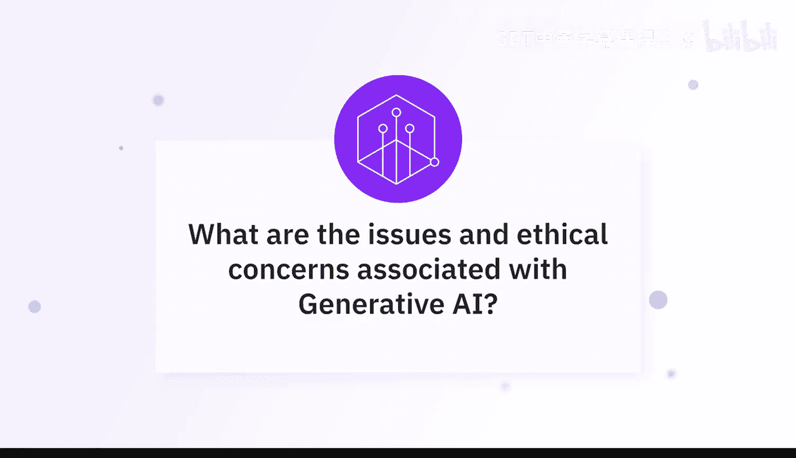

# 051：生成式AI的问题与伦理关切

在本节课中，我们将聆听AI专家们关于生成式AI所引发的问题与伦理关切的见解。我们将探讨偏见、隐私、错误信息等核心挑战，并了解如何负责任地使用这项技术。

## 概述

生成式AI是一项强大的技术，但伴随其巨大潜力而来的是诸多伦理问题和潜在风险。专家们强调，我们必须密切关注这项技术的发展与应用。

## 核心伦理关切与问题

以下是专家们指出的与生成式AI相关的主要问题和伦理关切。

### 1. 偏见与公平性

上一节我们概述了生成式AI的伦理挑战，本节中我们首先来看看偏见与公平性问题。如果模型在带有偏见或片面的数据上训练，其生成的回应也可能会带有偏见。

**核心概念**：`偏见输出 = 模型(偏见训练数据)`

专家分享了一个具体案例：当询问关于一位医生的问题时，ChatGPT的回应默认假设医生是男性且富有。这揭示了模型可能内嵌的社会偏见。用户可以通过精心设计提示词来尝试减少这种偏见。

### 2. 事实准确性与“幻觉”

生成式AI，尤其是大语言模型，生成的答案通常非常肯定、清晰且文笔流畅，这容易让人误以为它们总是正确的。然而，模型有时会完全虚构答案，甚至编造不存在的引用来源。

**核心概念**：`AI幻觉：模型生成看似合理但事实上错误或虚构的内容。`

因此，在处理基于事实信息的任务时，例如验证药物副作用，使用者必须对AI提供的信息进行核实和验证。

### 3. 隐私与安全

将信息提供给生成式AI模型可能存在数据泄露的风险。如果向模型输入敏感信息，这些数据可能会被模型记忆并在后续回应中泄露，引发隐私和安全问题。

### 4. 错误信息与滥用

生成式AI是一把双刃剑。它让每个人都能轻松创建图像、视频、文本等内容，能力空前。然而，恶意行为者同样可以利用它来制造错误信息，伤害个人、公司或政府。我们必须保持警惕，因为现在伪造一张图片可能只需要几秒钟和一个合适的提示词，而不再需要专业的Photoshop技能。

### 5. 抄袭与原创性

使用AI辅助写作时，存在抄袭的潜在风险。专家建议可以采取两种做法：一是使用抄袭检测工具进行检查；二是在提示词中要求模型使用不同长度的句子，使文本听起来更自然、更像人类所写。

## 负责任地使用生成式AI

面对上述问题，我们应如何负责任地使用生成式AI呢？专家们给出了以下指导原则。

### 伦理使用指南

以下是关于如何符合伦理地使用生成式AI的一些建议。

*   **保持开放与诚实**：如果使用大语言模型辅助写作，当被问及时，应该公开、诚实地说明。AI是帮助克服写作障碍的工具，而非替代原创思想。
*   **验证关键信息**：对于事实性内容，务必进行交叉验证，尤其是用于重要决策时。
*   **审慎设计提示词**：通过改进提示词，可以引导模型减少偏见、增加多样性。
*   **关注创造而非替代**：关于工作被取代的担忧固然存在，但更应关注如何利用这些模型创造新的、更具创造性的工作岗位，以及如何让它们更有效地辅助人类工作。

## 总结

本节课中，我们一起学习了专家们对生成式AI伦理问题的深刻见解。我们探讨了**偏见与公平性**、**事实准确性**、**隐私安全**、**错误信息滥用**以及**抄袭风险**等核心挑战。关键在于，我们必须以负责任的态度使用这项技术，保持警惕，对其输出进行验证，并推动建立相应的标准与监督机制，以确保生成式AI的安全与发展造福社会。