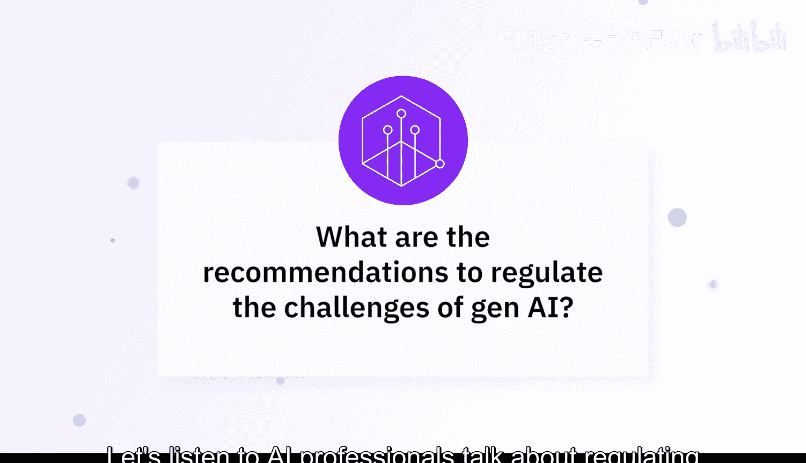
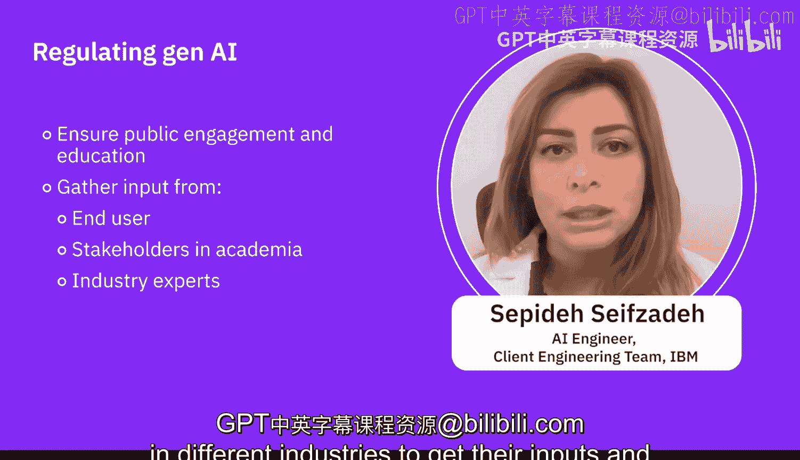

# 053：生成式AI监管挑战 🧑⚖️

在本节课中，我们将聆听AI专业人士探讨如何监管生成式AI带来的挑战。我们将了解监管的必要性、核心原则以及具体的解决方案，以平衡技术创新与社会责任。

## 概述

生成式AI的快速发展带来了机遇，也带来了偏见、错误信息、隐私侵犯等风险。有效的监管可以为AI的伦理使用、问责制和透明度设定明确的指导方针与标准，从而帮助减轻这些风险。

## 监管的核心原则与挑战

上一节我们概述了监管的目标，本节中我们来看看监管需要遵循的核心原则以及面临的平衡挑战。

监管需要在创新与问责之间取得微妙的平衡，既要确保创造力，又要维护标准。立法者必须为不断发展的AI领域制定适应性强的法规。伦理准则和透明度至关重要，明确的标准和透明的决策过程有助于建立信任，并防范滥用。

以下是监管需要关注的几个关键领域：
*   **伦理实践**：立法者必须优先制定框架，以强制执行AI伦理实践。
*   **隐私保护**：这一点至关重要。对数据使用和用户同意的严格规定，有助于建立强大的隐私保护措施，保障个人权利。
*   **合规审计**：定期审计对于确保合规性必不可少。

## 具体监管措施与解决方案

了解了核心原则后，我们来看看专家们提出的具体监管措施和解决方案。

首先，需要公司政策，并由政府强制执行。同时，监管应更侧重于创造就业，而非仅仅自动化岗位。这意味着在培训和技能提升过程中，应更多地包含创造性工作和创造性技能，而不仅仅是培养测试工程师等可能被自动化的岗位。

具体而言，AI监管可以通过建立伦理指南、标准和法律框架，在应对生成式AI挑战方面发挥关键作用，尤其是在内容生成、深度伪造和个性化推荐等敏感领域。

数据隐私和安全也非常重要。通过实施更强有力的数据隐私和安全法规，可以避免个人数据集的滥用。

以下是几项具体的步骤和解决方案：
*   **数据匿名化**：对数据进行处理以保护个人身份。
*   **内容审核机制**：建立内容验证、检测和下架机制，并对恶意创建有害内容的行为进行处罚。
*   **数据保护与保障**：实施严格的数据保护措施。

## 实施路径：测试平台与公众参与

除了具体的法规，实施路径同样重要。本节我们将探讨如何安全地部署AI并凝聚社会共识。

其中一个解决方案是，在将生成式AI模型投入市场前，建立一个沙盒测试平台。必须在受控条件和环境中对其进行测试，以最小化其给最终用户和社会带来的潜在风险。这也使监管机构能够在技术实际应用前，观察和评估其影响。

公众参与和教育同样至关重要。我们必须让最终用户、学术界、不同行业的利益相关者参与进来，听取他们的意见，并就AI监管建立共识。

## 总结

本节课中，我们一起学习了专家们对生成式AI监管的见解。有效的监管需要平衡创新与责任，涵盖伦理准则、隐私保护、合规审计等方面。具体的措施包括数据匿名化、内容审核、建立测试沙盒以及促进公众参与。通过制定明确、灵活且执行有力的框架，我们可以引导生成式AI技术朝着负责任、可信赖且造福社会的方向发展。