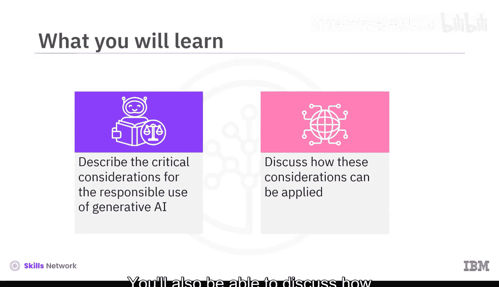
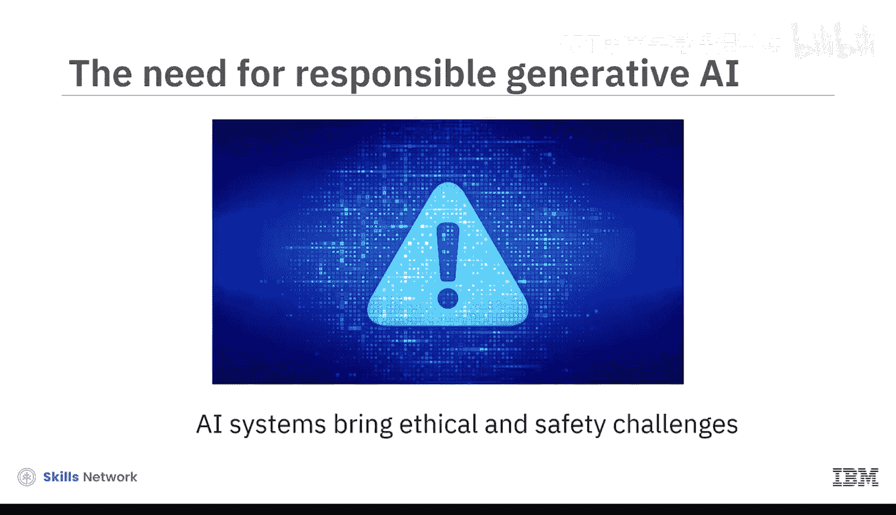
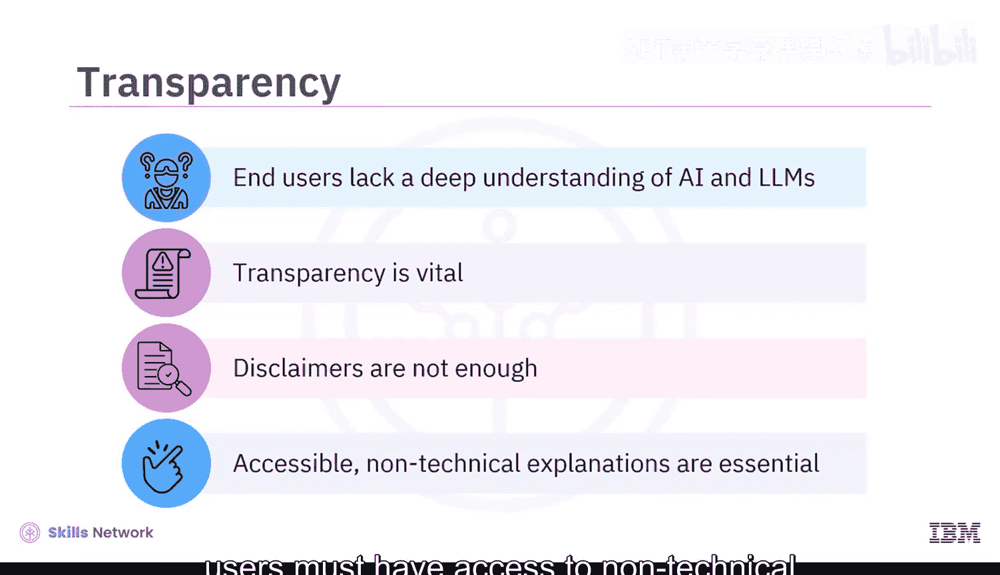
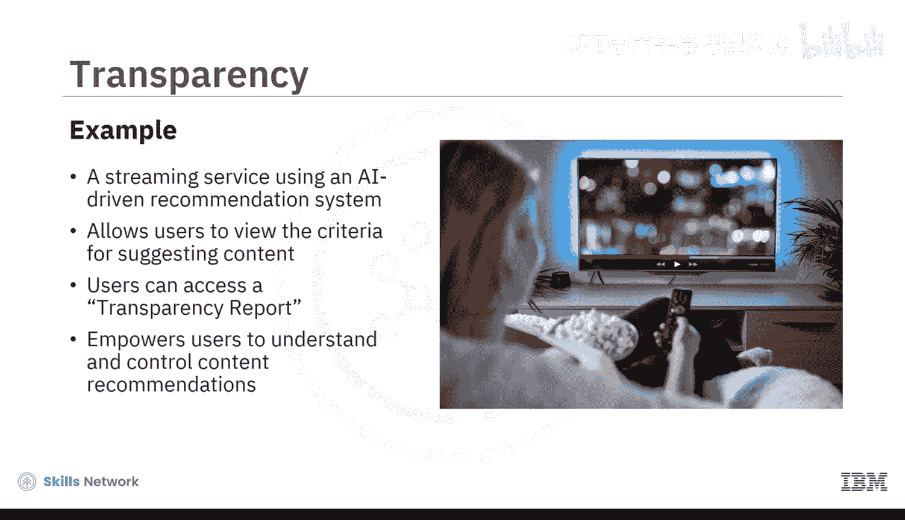
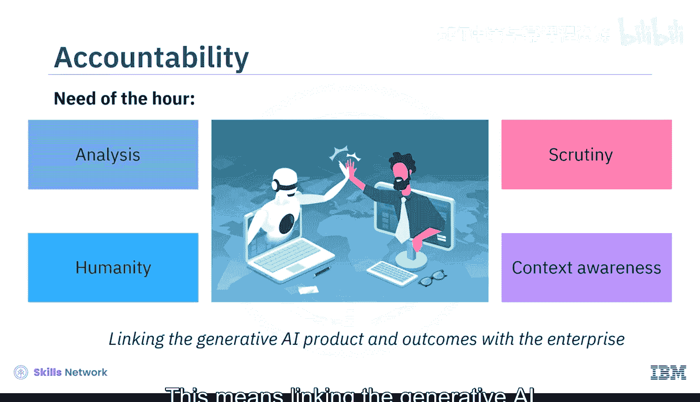
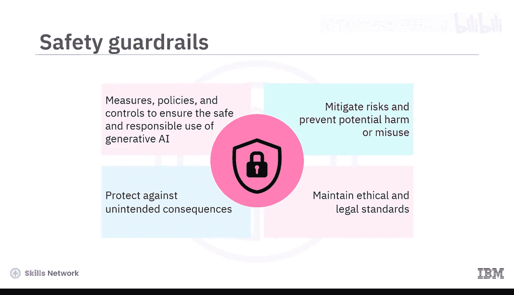
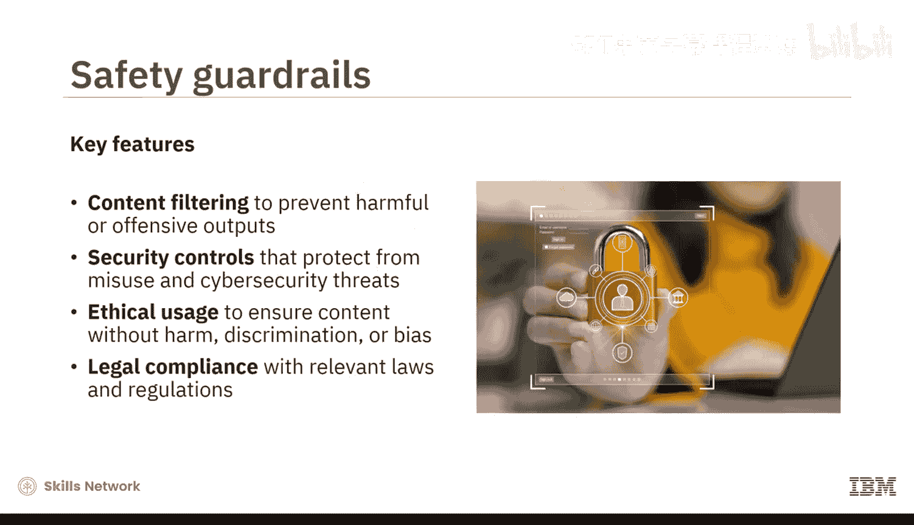
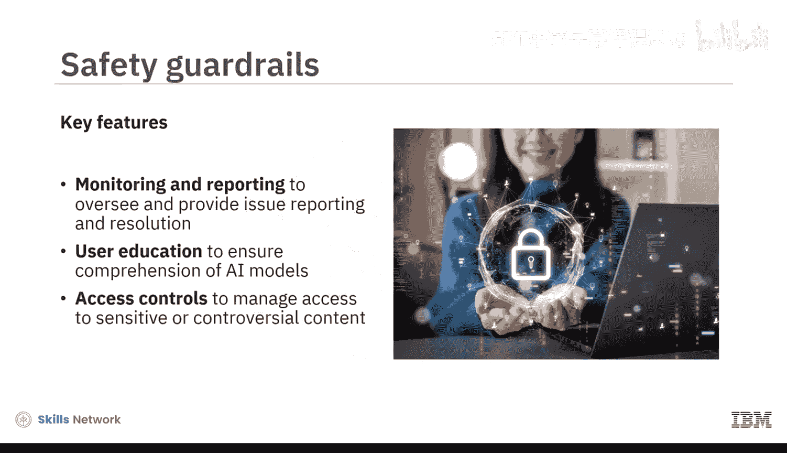
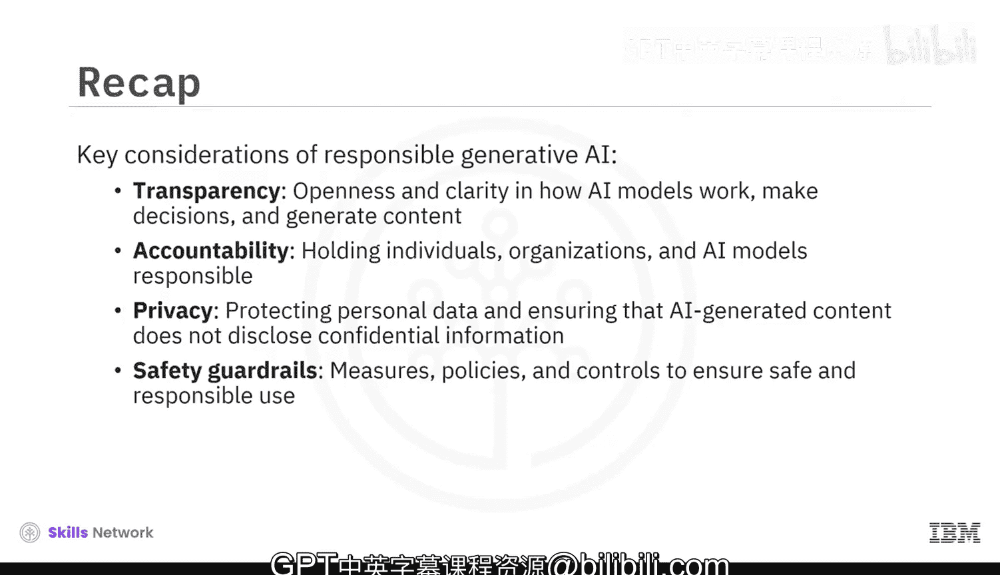

# 054：负责任生成式AI的考量因素 🧭

在本节课中，我们将学习如何负责任地使用生成式AI。我们将探讨四个关键的考量因素，以确保这项强大的技术能够安全、公平地造福社会。

随着生成式AI技术被数十亿人用于改善生活，AI系统能力日益增强。它们能为社会带来巨大利益，但也带来了伦理和安全挑战。确保生成式AI负责任地运行，对于发挥其潜力、同时最小化风险并确保全人类受益至关重要。

我们如何确保生成式AI被负责任地使用？通过实施四个至关重要的考量因素：**透明度**、**问责制**、**隐私**和**安全护栏**。

接下来，让我们逐一深入了解。

## 透明度 🔍

上一节我们介绍了负责任AI的总体框架，本节中我们首先来看看透明度。生成式AI的透明度，指的是AI模型如何工作、做出决策和生成内容的开放性和清晰度。它允许用户理解和信任这项技术。

用户通常对AI和大型语言模型缺乏深入了解。因此，仅通过关于生成式AI模型可能存在不准确性的免责声明，是无法实现透明度的。为确保透明度和伦理决策，用户必须能够获得关于生成式AI局限性、能力和风险的非技术性解释。

以下是透明度的一个应用示例：
*   **场景**：一个流媒体服务使用AI驱动的推荐系统。
*   **透明实践**：该系统允许用户查看推荐标准。用户可以访问一份透明度报告，该报告解释了推荐是如何生成的，包括用户历史、内容相关性和多样性等因素。
*   **效果**：这种透明度使用户能够更好地理解和控制他们的内容推荐。

## 问责制 ⚖️

了解了透明度的重要性后，我们来看看问责制。生成式AI中的问责制，意味着要求个人、组织和AI模型对其AI驱动的行为和决策所产生的伦理及法律后果负责。

随着生成式AI越来越擅长模仿人类创造力，我们必须仔细考虑这其中人的因素。因为与人类不同，AI模型不具备自主性或意图，它无法在任何有意义的层面上被追究责任。每个人都会以某种方式受到生成式AI的影响，从外包劳动力到裁员、职业角色变化，甚至潜在的法律问题。由于我们无法预知大规模采用生成式AI可能带来的后果，我们需要将分析、审查、情境意识和人性置于所有AI努力的核心。这意味着将生成式AI产品及其结果与其创造者——企业——联系起来。

以下是一个说明问责制在负责任生成式AI中作用的例子：
*   **场景**：一家新闻机构使用内容生成AI工具来撰写文章。
*   **问题**：如果该生成式AI工具生成了一篇事实错误或带有偏见的文章，并且文章被印刷出版，谁应该为这个错误负责？
*   **问责原则**：在这个例子中，新闻机构使用AI工具并不能免除其责任。该机构仍需对其发布的文章质量和完整性负责。

## 隐私 🔒

在讨论了确保AI行为可追溯的问责制之后，保护用户数据的重要性便凸显出来。生成式AI中的隐私涉及保护个人数据，并确保AI生成的内容不会泄露敏感或机密信息。

如果在训练过程中没有使用隐私保护算法，生成式AI模型就容易面临隐私风险。生成式AI可能会无意中生成侵犯个人隐私的内容，因为它从通常包含敏感数据的大型数据库中学习，且未经明确同意。大型语言模型尤其面临风险，因为它们可能记忆并关联敏感数据，导致隐私泄露。生成式AI应用的普及引发了隐私担忧，因为有时其回复会无意中包含敏感数据。此外，将未经审查的生成式AI应用集成到业务系统中可能导致合规违规。

以下是一个关于隐私风险的示例：
*   **场景**：一个AI驱动的聊天机器人用于客户支持。
*   **风险**：在回复咨询时，它偶尔会生成无意中泄露客户个人信息的回复，例如联系方式或购买历史。
*   **隐私考量**：隐私泄露是一个需要关注的问题，聊天机器人的回复应当保护客户数据。

## 安全护栏 🛡️

最后，在保护隐私的基础上，我们需要建立更广泛的防护措施。生成式AI中的安全护栏，是指为确保生成式AI模型的安全和负责任使用而制定的措施、政策和控制手段。这些护栏旨在降低风险，防止潜在的危害或滥用，帮助维护伦理和法律标准，并防范意外后果。

以下是安全护栏在生成式AI中的一些关键方面：
*   **内容过滤**：实施过滤器以防止生成有害或冒犯性的输出。
*   **安全控制**：保护生成式AI模型免遭滥用和潜在的网络安全威胁。
*   **伦理使用**：确保AI生成的内容不会造成伤害、歧视或偏见。
*   **法律合规**：遵守相关法律法规，包括数据保护和知识产权法。
*   **监控与报告**：持续监督AI模型行为，并提供问题报告和解决机制。
*   **用户教育**：确保用户理解AI模型的能力、局限性以及他们自身的责任。
*   **使用访问控制**：管理对AI模型的访问权限，特别是在可能生成敏感或有争议内容的场景中，以控制使用和潜在风险。

## 总结 📝

本节课中，我们一起学习了负责任使用生成式AI的关键考量。随着生成式AI在改善我们生活中的作用日益增强，我们必须考虑如何负责任地使用它。为此，有四个关键的考量因素：

1.  **透明度**：指AI模型如何工作、做出决策和生成内容的开放性和清晰度。
2.  **问责制**：意味着要求个人、组织和AI模型对其AI驱动的行为和决策所产生的伦理及法律后果负责。
3.  **隐私**：涉及保护个人数据，并确保AI生成的内容不会泄露敏感或机密信息。
4.  **安全护栏**：指为确保生成式AI模型的安全和负责任使用而制定的措施、政策和控制手段。

通过理解和应用这些考量因素，我们可以更好地引导生成式AI技术的发展，使其在创新的同时，也能保障安全、公平和尊重。