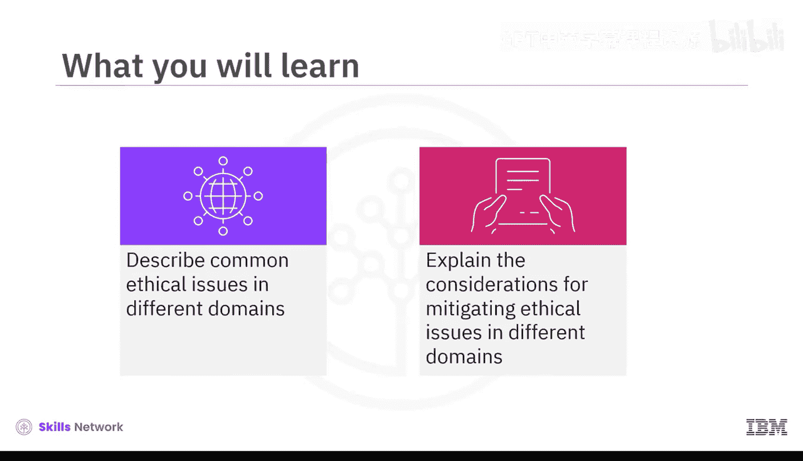
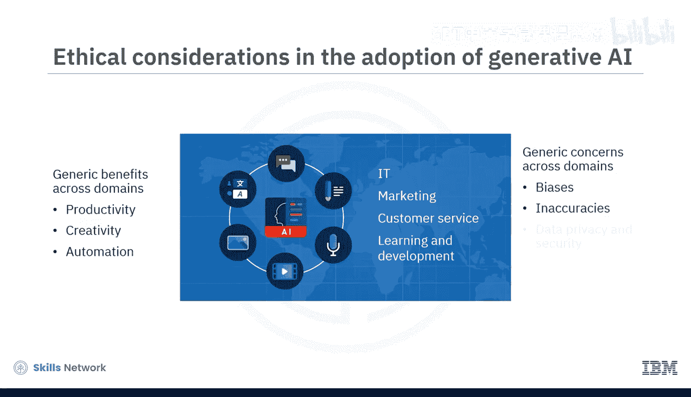
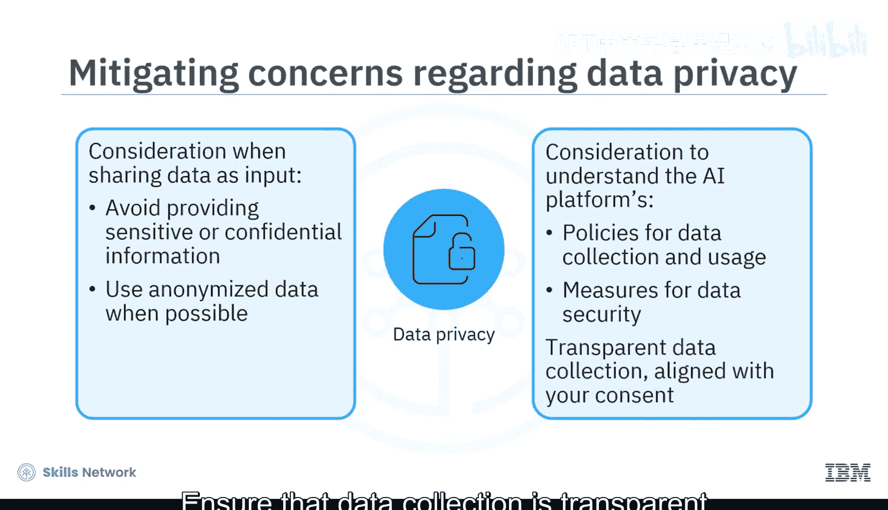
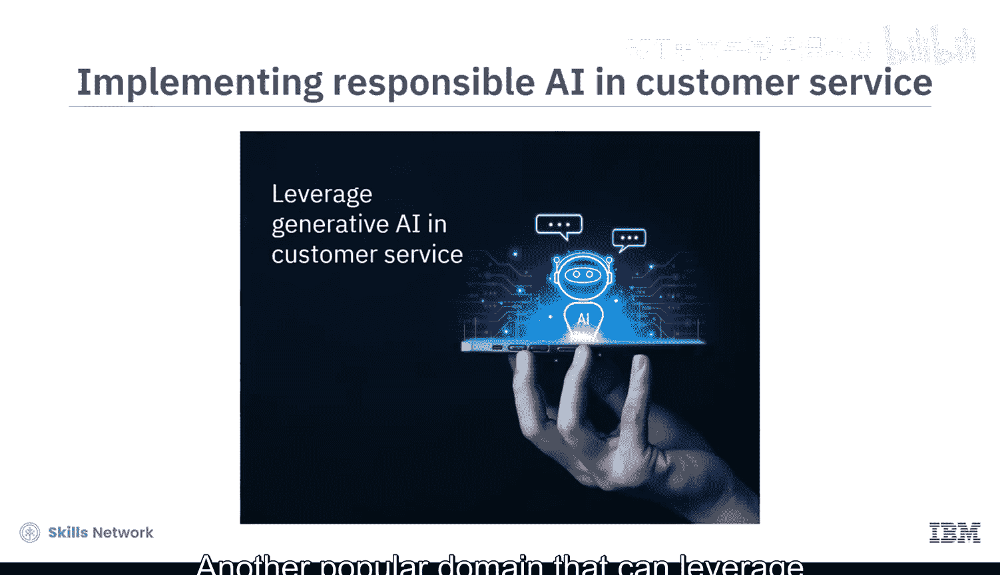
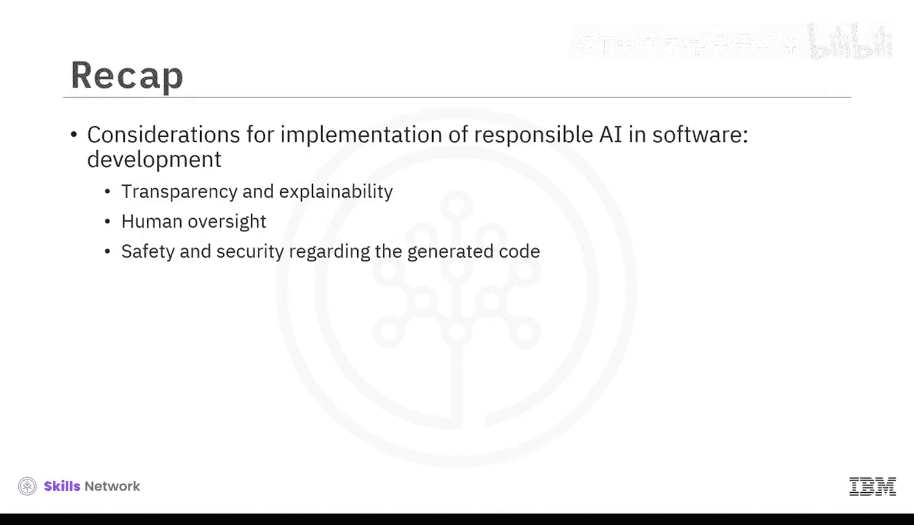

# 055：跨领域实施负责任生成式AI 🧭

在本节课中，我们将学习如何在不同的专业领域中负责任地实施生成式AI。我们将探讨各领域常见的伦理问题，并解释缓解这些问题的关键考量。

生成式AI为IT、市场营销、客户服务、学习与发展等不同领域的专业人士创造了新的机遇。采用生成式AI的组织能够提升生产力、创造力和任务自动化水平。

然而，人们也对其存在的偏见、不准确性、数据隐私、安全和版权侵权等问题表示担忧。任何利用生成式AI的组织或专业人士都必须考虑其伦理影响，并负责应对使用过程中伴随的疑虑。

接下来，让我们探讨几个广泛使用生成式AI的领域中的伦理影响。

## 内容创作领域的伦理考量 📝

生成式AI一个潜在且广泛的应用是内容创作。市场营销、人力资源、学习与发展、文档编写和娱乐等不同领域和行业的专业人士都使用生成式AI进行内容创作。

围绕使用生成式AI进行内容创作的主要伦理关切包括内容准确性、真实性、版权侵权和数据安全。

**内容准确性**
生成式AI可能产生不准确、不一致或“幻觉”的内容。为了缓解对内容准确性的担忧，专业人士必须验证和确认他们使用生成式AI系统生成的内容，并纠正任何错误或不一致之处。许多生成式工具（包括ChatGPT）都鼓励用户审查生成的信息。

**内容真实性**
生成式AI生成的内容可能是抄袭的，且没有明确的引用。此外，AI工具可能引用虚假或不存在的来源。存在专业人士使用具有欺骗性的AI生成内容的风险，这可能损害其工作可信度或组织声誉。例如，律师可能无意中根据通过生成式AI工具进行的研究引用了虚假案例。为了缓解对内容真实性的担忧，可以考虑在实施前加入人工审查步骤，以评估和验证AI生成的内容。也可以考虑使用其他AI或第三方工具或系统来验证生成式AI所产生内容的真实性。

**版权侵权**
AI开发组织可能使用其他组织的受版权保护的材料来训练AI模型。例如，Getty Images就起诉Stability AI使用其图片库来训练其AI图像生成模型。如果AI模型是在受版权保护的材料上训练的，那么生成的内容就有可能复制受版权保护的作品。因此，使用生成式AI的专业人士应确保生成的文本、图像、视频或任何其他资产的原创性。如果生成式AI工具基于特定来源生成内容，请考虑根据原始创作者的条款和条件提供适当的归属。专业人士还必须确保输入到AI工具的数据（即输入内容）不是受版权保护的材料，未经许可使用受版权材料作为输入可能导致法律问题。

**数据安全与所有权**
明确输入内容和生成内容的所有权和权利至关重要。一些AI工具和服务将内容的所有权和法律责任分配给用户，正如OpenAI的使用条款所示。然而，其他工具可能主张所有权或对内容使用施加特定条款。由于AI工具倾向于存储或使用您作为提示输入的数据，因此必须注意与其使用相关的数据隐私问题。组织或专业人士应避免向生成式AI工具提供任何敏感或机密信息作为输入，尽可能使用匿名化数据以降低个人身份被识别的风险。另一个重要的考虑因素是理解AI平台关于数据保留、使用和共享的政策。了解生成式AI平台如何收集和利用您的数据，询问平台的数据安全措施，确保数据收集是透明的且符合您的同意。

## 客户服务领域的伦理考量 🤖

另一个可以利用生成式AI的流行领域是客户服务。让我们试着理解确保客户服务中负责任AI的伦理考量。

以下是实施负责任AI的关键考虑因素：
*   **透明度**：当客户与生成式AI聊天机器人而非人类互动时，需明确告知客户。透明度有助于建立信任并管理客户期望。
*   **持续监控**：持续监控生成式AI系统的性能及其对客户互动的影响。
*   **数据保护**：保护客户数据并确保遵守相关的隐私法规至关重要。
*   **客户控制权**：赋予客户控制权至关重要，允许他们轻松切换到人工协助、寻求澄清或升级问题。

## 软件开发领域的伦理考量 💻

现在，让我们探讨开发人员或软件工程师在工作中使用生成式AI时必须评估的一些考虑因素和影响。

**代码透明度与可解释性**
首先，确保生成式AI生成的代码是透明且可理解的。相应地，在代码中包含内联注释，并加入人工审查和理解生成代码的步骤。

**代码安全性与安全性**
关于生成代码的安全性和保障性，实施严格的测试和验证程序非常重要。验证生成的代码不会引入可能危害用户或系统的漏洞、错误或安全风险。

## 组织层面的最佳实践 🏢

虽然生成式AI在不同领域和行业展现出强大的应用能力，但它也带来了许多伦理挑战。因此，组织应采取相关的最佳实践和考量，以合乎伦理的方式利用生成式AI的力量。

以下是组织可以采取的措施：
*   **员工培训**：对员工进行关于生成式AI伦理影响、潜在风险和局限性的培训至关重要。
*   **使用定制模型**：组织可以考虑使用自己单独训练的AI模型，以避免偏见和幻觉，并确保组织和消费者数据的保护。
*   **遵守法律法规**：遵守有关数据保护、隐私和AI使用的相关法律至关重要。
*   **制定使用指南**：应教育员工有关使用AI工具和AI生成内容的指南。

## 总结 📋

本节课中，我们一起学习了关于在不同领域使用生成式AI的常见伦理关切。

围绕使用生成式AI进行内容创作的主要伦理关切包括内容真实性、版权侵权和数据安全。组织和专业人士应考虑相关的缓解措施来解决这些问题。

为了在客户服务中实施负责任AI，组织应考虑关于透明度、监控和赋予客户控制权等方面的考量。

为了在软件开发中实施负责任AI，应考虑关于生成代码的透明度与可解释性、人工审查以及安全性与保障性等方面的考量。