生成式AI基础：5：主要参与者的AI伦理视角 👁️🗨️

在本节课中，我们将学习IBM、Google、OpenAI和微软等主要科技公司为负责任地开发AI所建立的公开伦理标准与原则。我们还将评估和比较这些公司为积极实践其AI原则所采取的具体策略和工具。

随着生成式AI模型日益融入商业与社会的各个方面，伦理考量变得至关重要。公开的伦理标准提供了一个透明的框架，用以指导这些模型的开发、部署和使用，确保实践是负责任且公平的。接下来，我们看看IBM、Google、OpenAI和微软是如何制定一系列原则来促进生成式AI的负责任与伦理发展的。

---

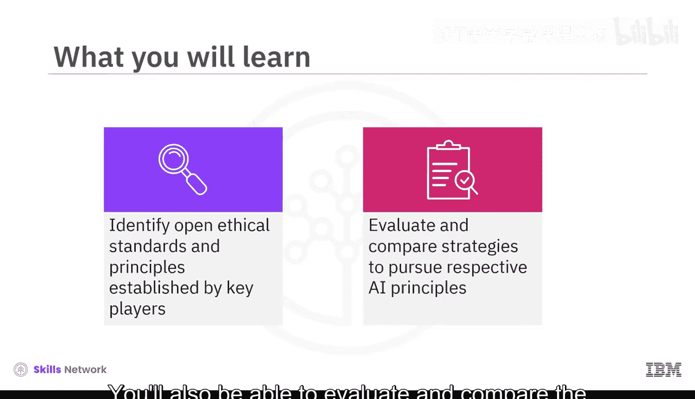

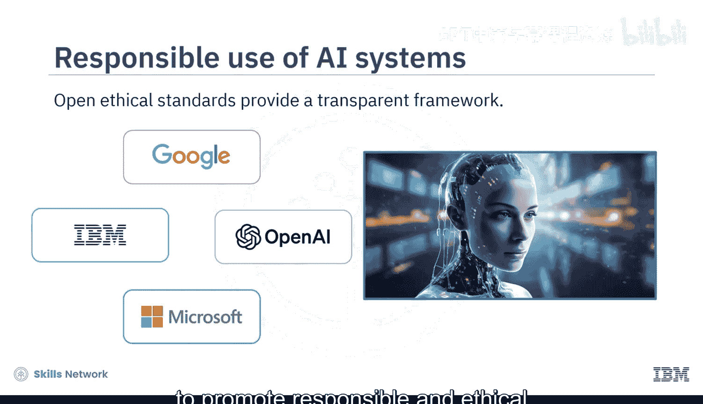

### IBM的AI伦理原则与实践

IBM为AI技术的负责任使用制定了以下指导方针：

*   **可解释性**：AI系统必须能够清晰解释其算法推荐背后的影响因素，这些因素需与不同目标的不同利益相关者相关。
*   **公平性**：这意味着AI系统应以公平的方式对待每个人或每个群体。当以正确方式校准时，AI可以帮助人类做出更公平的选择，对抗人类偏见并促进包容性。
*   **鲁棒性**：必须积极保护AI驱动的系统免受对抗性攻击，以最小化安全风险并增强对系统结果的信心。
*   **透明度**：为增强信任，用户必须能够了解服务如何运作、其功能，并理解其优势与局限性。
*   **隐私**：AI系统必须优先考虑并保护消费者的隐私和数据权利，并向用户明确保证其数据将如何被使用和保护。

为了实践这些原则，IBM为客户提供了负责任、透明和符合伦理的AI工作流产品与服务。

上一节我们了解了IBM的伦理原则，本节中我们来看看其具体的实践工具。

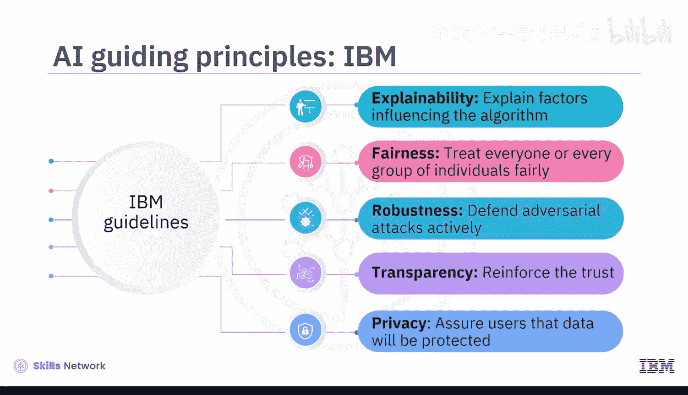

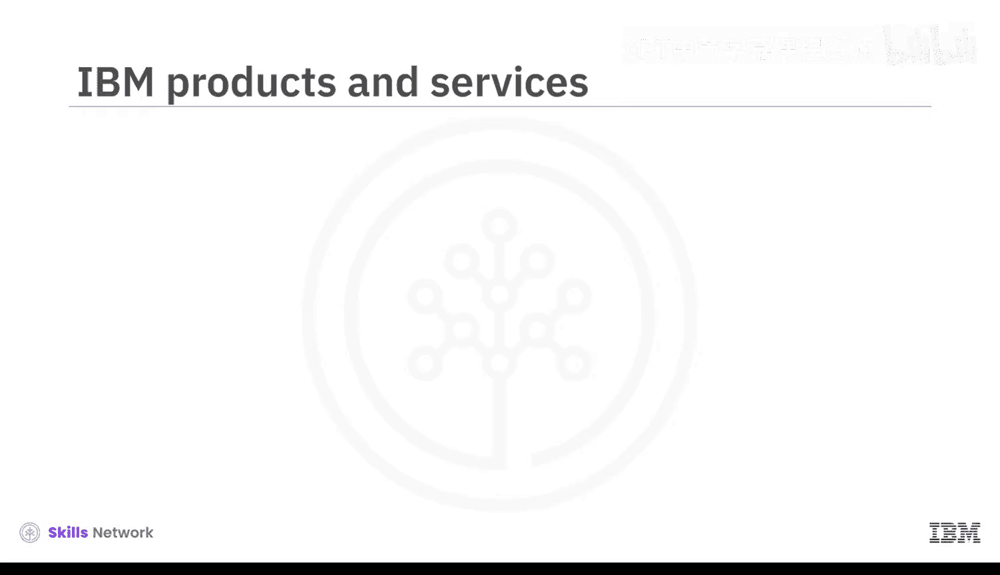

以下是IBM为实现其AI伦理原则而开发的关键工具：

*   **IBM Watson Governance**：这是一个具有成本效益的平台，旨在增强组织在AI活动中的风险缓解能力、法规遵从性和伦理管理能力，即使对于使用第三方工具开发的模型也适用。
*   **IBM Watson Studio**：该平台支持使用笔记本和无代码工具开发先进的机器学习模型，促进了AI在业务运营中的融合。

---

### Google的AI伦理原则与实践

Google的指导原则涵盖以下方面：

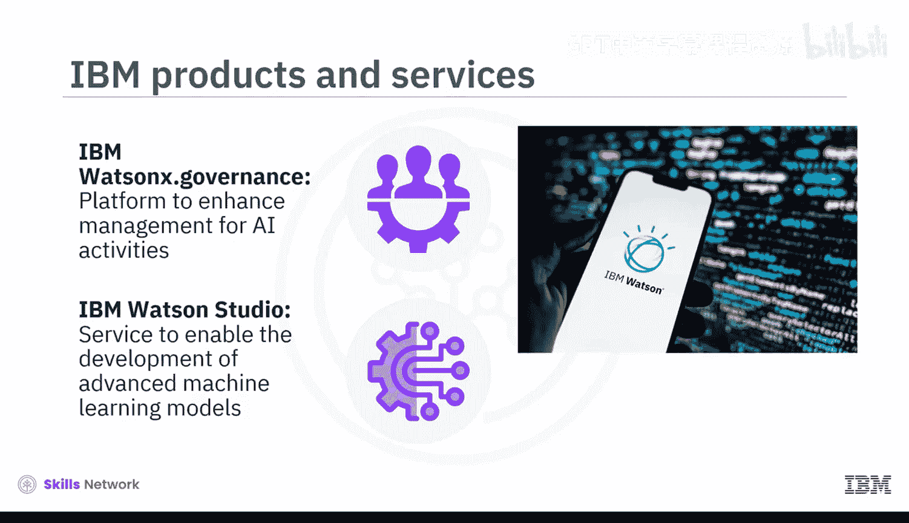

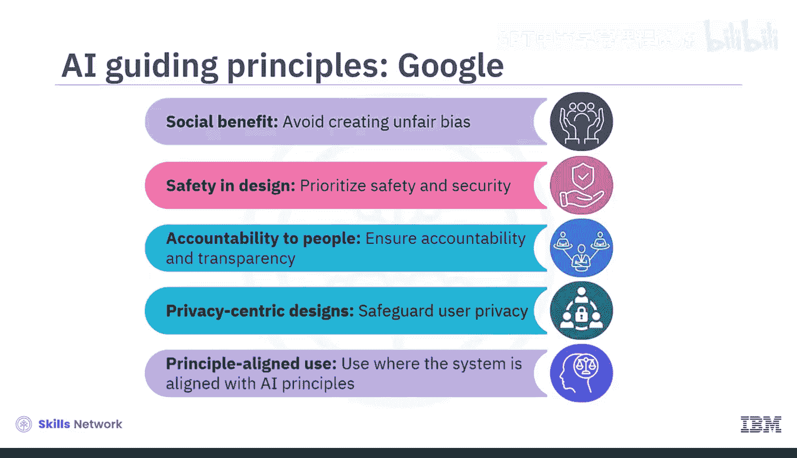

*   **社会效益**：AI必须为社会福祉做出贡献，并避免制造或强化不公平的偏见。
*   **安全设计**：AI系统应优先考虑安全与保障，避免造成伤害。
*   **对人负责**：AI系统应对人负责，其设计应允许透明度和监督。
*   **隐私中心设计**：AI系统必须保护用户隐私，避免模型进行有害或不公平的数据实践。
*   **符合原则的使用**：AI技术应仅用于符合这些原则的用途。

现在，让我们探索Google如何积极追求其AI原则中概述的目标。

Google开发了多种工具，以帮助开发者和用户识别并解决生成式AI模型中的问题。

以下是Google为实现其AI伦理目标而采取的具体策略和工具：

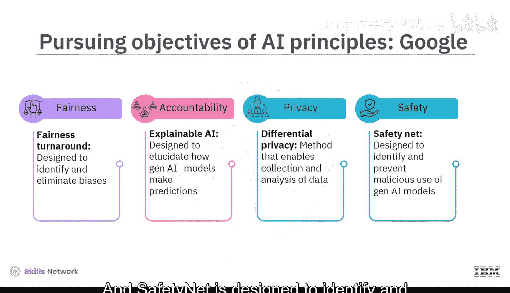

*   **Fairness Turnaround**：旨在帮助开发者识别并消除这些模型中的偏见。
*   **Explainable AI**：旨在阐明生成式AI模型如何进行预测。
*   **Differential Privacy**：是一种能够在收集和分析数据时不损害个体用户隐私的方法。
*   **Safety Net**：旨在识别并防止生成式AI模型的恶意使用。

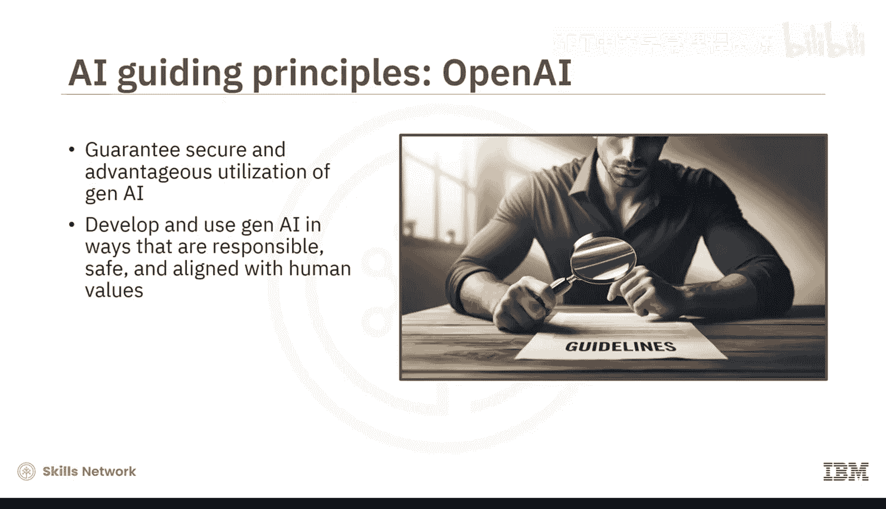

---

### OpenAI的安全指导方针

OpenAI的安全指导方针构成了一套原则与实践框架，旨在确保生成式AI技术的安全与有益使用。这些指导方针基于公司的信念，即生成式AI具有造福社会的巨大潜力，但必须以负责任、安全且符合人类价值观的方式进行开发和使用。

这些指导方针涵盖了广泛的主题。

以下是OpenAI安全指导方针的核心组成部分：

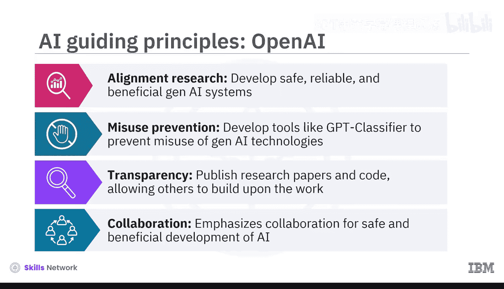

*   **对齐研究**：OpenAI致力于使生成式AI与人类价值观对齐。公司大力投资于研究，以开发安全、可靠且有益的生成式AI系统。
*   **防止滥用**：OpenAI积极致力于防止生成式AI技术的滥用，通过开发能够检测和防止恶意AI系统创建的工具来实现。公司开发了一个名为“GPT分类器”的工具，可用于检测由AI系统生成的文本。
*   **透明度**：OpenAI致力于研发的透明度。他们公开发布研究论文和代码，允许他人审查并在此基础上进行工作。这确保了研究的伦理性和透明性。
*   **协作**：OpenAI强调通过协作来实现AI的安全与有益发展。公司积极与其他研究人员、政策制定者和组织进行合作。OpenAI是“AI合作伙伴关系”的成员，这是一个共同致力于促进AI安全与有益发展的公司和组织团体。

---

### 微软的AI伦理原则与实践

微软多年来一直处于AI发展的前沿，并致力于以符合伦理和负责任的方式使用AI。我们来看看微软是如何积极追求其指导原则中概述的目标的。

微软的指导原则强调AI应以公平、可靠、安全、包容、透明和负责任的方式设计与使用。

以下是微软为实现这些原则而开发的具体工具和方法：

*   **公平性**：微软开发了一个名为“公平性检查清单”的工具，可以帮助开发者识别其AI模型中潜在的偏见来源。
*   **可靠性与安全性**：“安全分析”是一个工具，可以帮助开发者识别并缓解其AI模型中潜在的安全风险。
*   **隐私与安全**：一种称为“差分隐私”的技术可用于在不损害用户隐私的情况下收集和分析数据。
*   **包容性**：开发了“包容性设计工具包”，以帮助开发者设计对残障人士也可访问的AI系统。
*   **透明度**：微软公开发布其AI伦理原则和AI偏见缓解工具包。
*   **问责制**：开发了“可解释AI”工具，以帮助用户理解AI模型如何进行预测。

---

### 总结

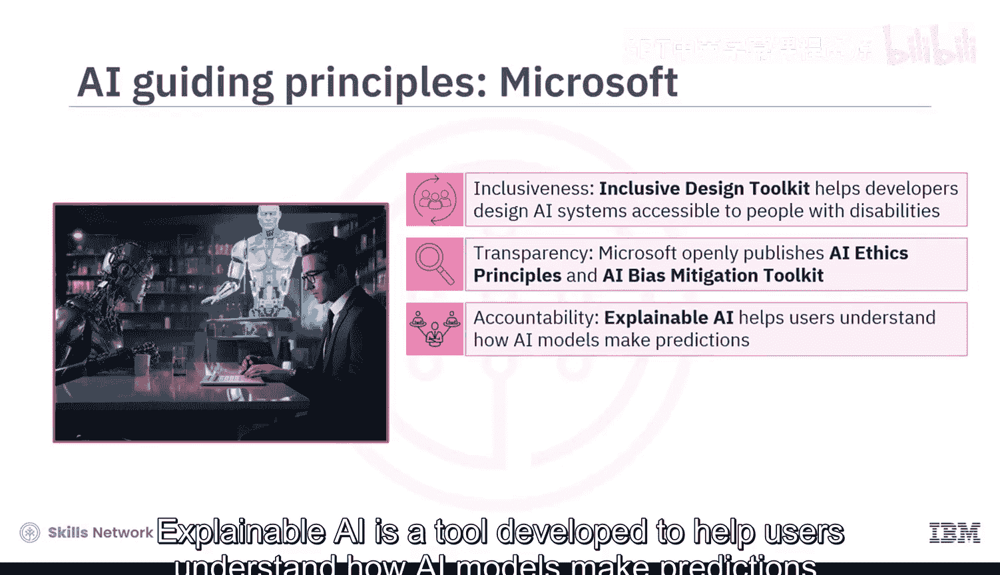

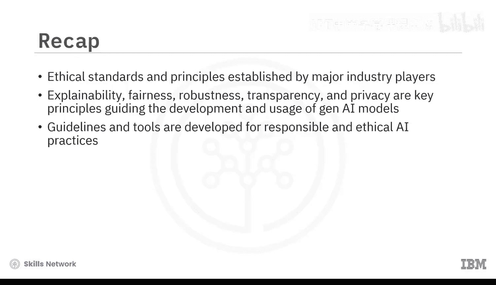

本节课中，我们一起学习了IBM、Google、OpenAI和微软等主要行业参与者为负责任AI发展所建立的伦理标准与原则。我们探讨了包括可解释性、公平性、鲁棒性、透明度和隐私在内的关键原则，并讨论了每家公司为在生成式AI模型的开发与使用中积极实施这些原则所采取的策略和工具。本课强调了随着生成式AI日益融入商业与社会的各个方面，伦理考量的重要性正在不断增加。IBM、Google、OpenAI和微软都制定了具体的指导方针和工具，展示了他们对负责任和符合伦理的AI实践的承诺。