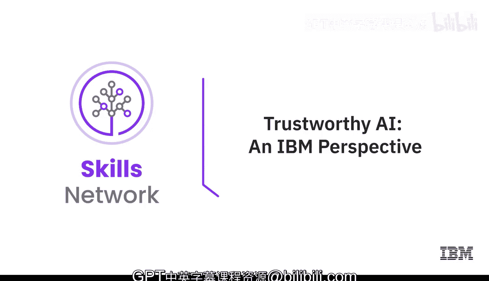

# 057：IBM视角 🛡️

在本节课中，我们将探讨生成式人工智能中的“可信AI”这一核心概念。我们将了解为什么信任是AI应用的基础，分析生成式AI带来的新风险，并学习如何通过治理、透明度和公平性等原则来构建可信赖的AI系统。

---

## 课程概述

大家好，欢迎来到AI学院。我是Kate Soule，在MIT-IBM沃森AI实验室担任业务战略高级经理。这位是我的同事，杰出研究科学家Kush Varshney。Kush是一位专注于可信AI的研究员。

我们一致认为，对于AI而言，信任是最重要的事情。如果无法信任这些拥有数十亿参数的庞大模型，企业就无法真正获得AI带来的益处。Kush在这一领域成就卓著，发表了数百篇论文，其算法在全球实验室中应用，并且是备受追捧的演讲者。

为了了解Kush在可信AI方面的工作，我尝试询问了一些消费级聊天机器人。得到的回复有些是正确的，有些则完全是虚构的。例如，它正确提到了Kush出版过一本关于可信机器学习的书，但却错误地声称Kush是“Mach learning for Good Social Foundation”的联合创始人（实际是IBM Science for Social Good的创始人），甚至错误地陈述了Kush的教育背景。

这种现象被称为“幻觉”，即AI系统会编造信息或建立不正确的关联。当前，企业都面临着快速落地生成式AI的压力，但当他们听说AI会产生幻觉、欺凌、情感操控等有毒行为，或存在版权侵权、泄露个人隐私信息等风险时，会感到担忧、紧张甚至恐惧。

我们必须认识到，AI不是一场竞赛，而是一段旅程。任何希望进入企业应用的AI，都必须贯穿信任和透明的原则。我们需要放慢脚步，建立治理结构，设置保障措施和防护栏，确保做正确的事。

---

## 生成式AI与传统机器学习的风险对比

上一节我们介绍了AI幻觉等风险，本节我们来具体看看生成式AI与传统机器学习在风险上的异同。

生成式AI和预测性机器学习如同一枚硬币的两面，许多技术非常相似，但也存在差异。幻觉、隐私信息泄露、欺凌等都是前所未有的新风险。当然，许多传统风险依然存在。

主要的差异在于解决方案。我们无法完全套用以前的技术来处理这些新问题，一个核心原因在于如今处理的数据集规模极其庞大。

当数据量如此巨大时，我们虽然可以实施数据治理技术，确保不抓取某些网站或进行某些过滤，但其规模已超出任何个人甚至团队逐条审阅所有内容的能力范围。这正是挑战所在。

---

## 可信AI的多维度定义

当我们谈论信任时，客户通常会立刻想到准确性，即模型在特定用例中的质量和可靠性。但这仅仅是起点。

**信任**的定义更为广泛：
*   **性能与准确性**：这是基础，没有良好的性能，其他都无从谈起。
*   **可靠性与鲁棒性**：系统是否稳定可靠。
*   **公平性**：系统是否对不同群体一视同仁。
*   **可解释性**：人类能否理解模型的运作方式。
*   **过程透明度**：我们能否理解系统从构建到部署的整个流程。
*   **价值对齐**：能否确保AI系统为我们的利益服务，而非其他目的。

对AI（包括生成式AI）一个合理的批评是，它有时像一个“黑箱”。接下来，我们将深入探讨透明度这一维度。

---

## 透明度：打开AI黑箱

透明度要求我们能够洞察AI系统的内部运作。一个恰当的比喻是开放式厨房餐厅：你可以看到所有食材、厨师的烹饪过程，这让你对食品质量充满信心。AI系统也是如此。

**透明度**意味着我们需要了解：
*   数据来源
*   执行了哪些处理步骤
*   进行了何种测试
*   完成了哪些审计

所有这些信息共同构成了我们对系统运作的理解。它帮助我们建立信心，确保其中发生的是“正确的事”。

---

## 公平性与偏见放大

Kush对公平性这一话题充满热情。在传统机器学习中，我们关注招聘、贷款等算法的公平性。而在生成式AI世界，我们最关心的是**刻板印象和其他毒性内容**。

当系统以有害方式运行时，社会中最脆弱的成员受害最深。生成式AI和机器学习在这一点上本质相同：**如果它们基于有偏见的数据进行训练，就会产生有偏见的输出**。

生成式AI的训练数据是人类创造的数据，而人类存在意识和无意识的偏见，其创造的数据会反映这些偏见。算法则会**放大**这些社会性和认知性偏见。

---

## 构建可信AI的实践路径：治理

面对所有这些风险和考量，企业如何才能以安全、负责任且合乎伦理的方式采用生成式AI？答案的核心是**治理**。

AI治理必须贯穿始终：
1.  **明确意图**：定义系统的预期用途。
2.  **数据溯源**：明确数据来源。
3.  **处理与检查**：在数据处理过程中嵌入各种制衡与检查机制。
4.  **测试与部署**：进行充分测试。
5.  **持续监控**：部署后持续监控系统性能，并在其超出防护栏时及时干预。

当风险很高时，我们不仅需要信任，更需要能够**验证和确认**这种信任。信任本身不是目的。

---

## 课程总结

本节课我们一起学习了可信AI的核心要义。我们认识到信任是AI应用的基石，探讨了生成式AI带来的新风险（如幻觉、隐私泄露），并深入了解了构建可信AI的多个维度，包括性能、公平性、透明度以及至关重要的全流程治理。

关键点在于，采用生成式AI不能只求速度，而应将其视为一段需要谨慎规划、贯穿信任原则的旅程。通过实施强有力的治理框架，企业可以更安全、更负责任地利用生成式AI的潜力。

感谢观看本期AI学院。请继续关注后续课程，我们将深入探讨更多AI商业应用中的重要话题。