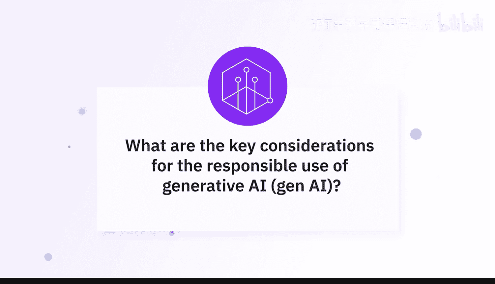
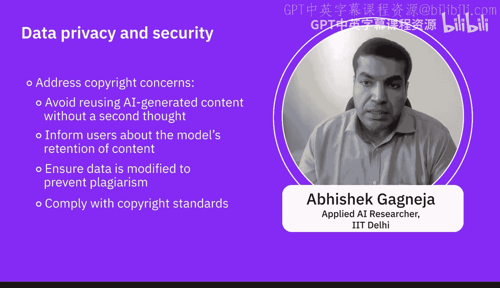

# 059：负责任使用生成式AI的关键考量 🔑

在本节课中，我们将学习AI专家们关于如何负责任地使用生成式AI的核心见解。我们将探讨确保AI系统合乎道德、公平、安全且尊重隐私的关键措施。

## 实施防护栏与伦理准则

上一节我们介绍了生成式AI的基本概念，本节中我们来看看如何确保其输出是负责任且合乎道德的。专家指出，当前最重要的一项措施是实施“防护栏”。

**防护栏** 的核心思想是：绝不让生成式AI在未经审查的情况下对外响应或发送信息。具体流程是，在AI生成内容后，通过一套检查机制来评估其质量。

以下是防护栏需要检查的关键方面：
*   检查内容是否符合公司准则。
*   识别内容中是否包含脏话或仇恨言论。
*   判断内容是否合法、合乎道德。

如果防护栏检测到问题内容，系统应直接终止并取消该次输出交易。

除了技术上的防护栏，在开发、部署和使用生成式AI技术时，遵循伦理准则与原则同样至关重要。

以下是负责任使用生成式AI的核心伦理原则：
*   **公平性**：确保AI系统不加剧或放大社会偏见。
*   **透明度**：公开模型的开发全生命周期，并清晰解释其行为、局限性和潜在偏见。
*   **问责制**：明确责任归属，确保决策可追溯。
*   **隐私保护**：尊重并保护个人数据与隐私。
*   **人权尊重**：确保技术应用不侵犯基本人权。

## 确保透明度与公平性

在理解了伦理原则后，我们需要重点关注如何实现透明度和公平性。模型提供者有责任清晰、详尽地说明在创建模型时所做的考量。

例如，开发者应将公平性、问责制和透明度融入AI系统的整个生命周期。这有助于我们理解AI的决策过程，从而建立对技术的信任。因为我们知道输出是如何生成的，我们才能做出调整以减少偏见。

以下是模型提供者必须明确披露的信息：
*   如果模型容易产生“幻觉”（即编造事实），必须报告此缺陷。
*   如果模型主要基于特定人群或观点进行训练，必须说明训练数据的局限性。
*   需要告知用户模型是否会保留输入信息，以及输出内容是否可能引发抄袭检查。

## 保护数据隐私与安全

上一节我们讨论了模型的透明度，本节中我们来看看数据隐私与安全这一同等重要的议题。专家强调，必须在整个AI生命周期中保障数据隐私与安全，防止任何个人信息的滥用。

我们可以部署多种技术来保护敏感信息。

以下是保护数据隐私与安全的常用技术：
*   **数据匿名化**：移除或加密数据中的个人标识信息。
*   **加密技术**：对存储和传输中的数据进行加密。
*   **访问控制**：严格限制对数据和系统的访问权限。
*   **安全审计**：定期进行安全检查，发现并修复漏洞。

我们的目标是保护训练数据所涉及个体的隐私。因此，需要实施强大的数据匿名化技术以及安全的数据存储与实践，以防止未经授权的访问和滥用。

## 遵守法规与保持人类监督

在关注技术安全的同时，我们也必须遵守外部法规并保持人类的最终控制权。遵守政府相关法律法规是基本要求。

此外，在关键领域保持人类对AI生成内容的监督至关重要，以确保其准确性和适当性。

以下是尤其需要人类监督的敏感领域：
*   **医疗健康**：诊断建议、治疗方案等。
*   **金融服务**：投资建议、信用评估等。
*   **法律服务**：合同生成、法律意见等。

除了监督，我们还应鼓励负责任的创新，持续评估AI技术的社会影响。这意味着需要与各利益相关方进行互动。

以下是需要纳入考量的关键利益相关方：
*   伦理学家
*   政策制定者
*   公众

通过与各方互动，我们可以共同解决问题，并纳入多元化的视角。例如，当前非常相关的版权问题就需要被重视：用户直接使用ChatGPT等模型生成的内容可能引发版权纠纷，因此必须明确告知用户相关的风险和责任。

本节课中我们一起学习了负责任使用生成式AI的多项关键考量。我们从实施技术“防护栏”和遵循伦理准则开始，探讨了确保透明度、公平性的方法，深入了解了保护数据隐私与安全的技术手段，最后强调了遵守法规、保持人类监督以及进行负责任创新的重要性。这些措施共同构成了开发生成式AI系统时不可或缺的责任框架。